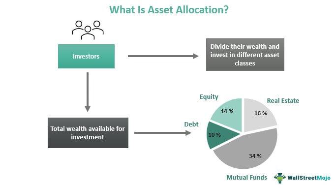

In the modern financial landscape, the complexity and diversity of investment options have created an evolving need for structured strategies. Investors face a plethora of choices, each with unique risk and return characteristics, necessitating careful consideration and informed decision-making. This article explores various investment strategies, the types of funds available, the principles of asset allocation, and the rise of algorithmic trading in fund management. 

Investment strategies are essential as they guide the selection and management of assets within a portfolio, influencing the balance between risk and return. Different strategies align with investors' financial goals, helping them achieve desired outcomes based on individual risk tolerance. The diversification of investment options calls for an understanding of the distinct types of funds—such as mutual funds and Exchange-Traded Funds (ETFs)—each catering to varying investor needs and objectives. 

Asset allocation, a critical component of portfolio management, involves determining the optimal distribution of asset classes such as stocks, bonds, and cash equivalents. Proper allocation aims to optimize risk-adjusted returns, adapting to market conditions and investor preferences. Moreover, algorithmic trading represents a technological advancement in fund management, using computer algorithms to execute trades at high speeds based on data-driven insights. This innovation enhances precision, reduces human error, and improves market liquidity.

Integrating these components into a cohesive strategy aids in risk management and the optimization of returns. By understanding and leveraging these elements, investors can navigate financial markets more effectively, crafting diversified, balanced portfolios that align with their long-term objectives. As technology and market dynamics continue to evolve, staying informed and adaptable is crucial for investors seeking to optimize their investment outcomes.

## Table of Contents

## Investment Strategies Overview

Investment strategies are integral to the selection and management of assets within a portfolio. These strategies can be broadly categorized into active and passive management. Active management involves fund managers actively making decisions to buy and sell assets in an effort to outperform specific benchmarks or market indices. In contrast, passive management involves strategies like index funds, which aim to mirror the performance of a market index, providing a more hands-off approach to investing.

A critical aspect of investment strategies is understanding the risk-return trade-off. This trade-off involves balancing the potential risks associated with an investment against the expected returns. Higher potential returns often come with higher risk, while lower risk typically corresponds with more modest returns. Investors must align their investment strategies with their financial goals, considering factors such as investment horizon, risk tolerance, and financial objectives.

Various investment strategies have been developed to meet different investor needs. Growth investing focuses on companies expected to grow at an above-average rate compared to other companies. Investors employing this strategy typically look for stocks with high growth potential, even if their current earnings are low. On the other hand, value investing seeks undervalued companies that are expected to provide strong returns over time as their true value is recognized by the market.

Diversification is another crucial strategy, aimed at reducing risk by spreading investments across various asset classes, industries, and geographic regions. This strategy helps to minimize the impact of any single investment's poor performance on the overall portfolio.

By tailoring strategies to individual risk tolerances and financial targets, investors can optimize their portfolios for achieving specific outcomes. These strategies form the backbone of effective portfolio management, helping investors to navigate the complexities of financial markets with confidence.

## Types of Funds

Investment funds are pivotal tools for investors, offering a variety of options tailored to meet diverse financial goals and risk appetites. Understanding the different types of funds is crucial for making informed investment decisions.

Mutual funds represent a common investment vehicle, pooling money from various investors to purchase securities like stocks, bonds, and other assets. They are managed by professional fund managers and categorized into several types:

1. **Stock Funds:** These funds invest primarily in equities, aiming for capital growth. They are suitable for investors with a higher risk tolerance, as stock prices can be volatile.
2. **Bond Funds:** These invest in fixed-income securities, generally considered less risky than stocks. Bond funds are ideal for investors seeking more stable returns with lower risks.
3. **Money Market Funds:** These offer high liquidity and invest in short-term, low-risk securities such as Treasury bills and commercial paper. They are designed for investors prioritizing capital preservation over substantial returns.
4. **Balanced Funds:** These combine stocks and bonds, offering a balanced approach to risk and return. Ideal for moderate risk-takers, they focus on providing income and capital appreciation.

Exchange-Traded Funds (ETFs) have grown in popularity due to their flexibility and tradability akin to stocks. Unlike mutual funds, ETFs can be bought and sold on stock exchanges throughout the trading day, offering [liquidity](/wiki/liquidity-risk-premium) and convenience. ETFs often track an index, commodity, or asset class and usually have lower expense ratios than mutual funds.

Asset allocation funds cater to investors by strategically distributing investments across various asset categories—stocks, bonds, and cash equivalents—aiming for an optimal risk-adjusted return. These funds can be further adjusted based on the investor's risk profile and market outlook.

Understanding these fund types enables investors to select options that align with their financial objectives, risk tolerance, and investment horizon. Each fund type offers distinct benefits and limitations, making it essential for investors to assess their personal goals before committing capital.

## Asset Allocation Fundamentals

Asset allocation is a pivotal component of successful portfolio management, focusing on the distribution of investments across various asset classes to meet specific financial objectives. This process involves a strategic balance among asset categories such as stocks, bonds, and cash equivalents. Each asset class carries distinct risk-and-return characteristics, and the allocation decision influences the overall portfolio risk and potential returns.

Balancing asset proportions is foundational to aligning with investment goals. For instance, a portfolio emphasizing growth might allocate more to equities, whereas one designed for stability might favor bonds and cash. An optimal asset allocation requires an understanding of both market conditions and the investor's long-term strategy.

Asset allocation can be fixed or adaptable. Fixed asset allocation maintains a predetermined distribution irrespective of market fluctuations. This approach advocates for consistency and reduces the need for constant monitoring. Conversely, a modified approach responds to market conditions and evolving investment strategies, enabling the portfolio to adapt to new information or opportunities.

Different strategies within asset allocation include strategic, tactical, and dynamic methods. Strategic asset allocation involves setting target allocations and periodically rebalancing to maintain those levels. Tactical allocation allows for temporary deviations from the strategic mix to capitalize on short-term market conditions. Meanwhile, dynamic allocation continuously adjusts based on predefined rules, such as [volatility](/wiki/volatility-trading-strategies) or market trends.

The primary objective of asset allocation is to maximize returns while managing risk corresponding to the investor's risk tolerance and financial goals. By diversifying investments across different asset classes, investors can reduce the impact of adverse market movements on their portfolios. The risk-adjusted return is a crucial metric in this context, often calculated using formulas like the Sharpe ratio:

$$
\text{Sharpe Ratio} = \frac{(R_p - R_f)}{\sigma_p}
$$

where $R_p$ is the portfolio return, $R_f$ is the risk-free rate, and $\sigma_p$ is the standard deviation of portfolio returns. This ratio helps assess the added value of diversification versus taking on additional risk.

Proper asset allocation necessitates a careful evaluation of individual financial profiles and an ongoing assessment of market dynamics. Investors must adapt allocations to align with changing objectives and economic conditions, while also considering their own risk appetite and investment timelines.

## Algorithmic Trading in Fund Management

Algorithmic trading employs advanced computer algorithms to execute trades at exceptionally high speeds based on quantitative analysis and data-driven insights. The core advantage of [algorithmic trading](/wiki/algorithmic-trading) lies in its precision, which reduces human error and enhances overall market liquidity. By leveraging sophisticated algorithms, trades can be conducted at the most opportune moments, capturing small yet significant price variations that are typically invisible to manual traders.

In the context of fund management, integrating algorithmic trading with mutual funds allows for the optimization of investment strategies. This integration is particularly beneficial for achieving consistent execution efficiency, ensuring that large volumes of trades are handled smoothly without causing significant market impact. Such capability is invaluable to mutual funds, which often deal with substantial asset management.

Algorithmic trading enables funds to swiftly adapt to fluctuating market conditions. By continuously processing vast amounts of market data and utilizing complex mathematical models, algorithms can identify emerging trends and react almost instantaneously. This agility can lead to enhanced returns, as funds can exploit transient market opportunities that might be missed with traditional trading approaches.

For investors who wish to leverage technology in their investment endeavors, understanding the role of algorithmic trading is essential. The strategic use of algorithms not only optimizes execution but also provides the ability to explore more complex trading strategies, such as statistical [arbitrage](/wiki/arbitrage) and mean reversion strategies. These strategies can potentially improve risk-adjusted returns by exploiting market inefficiencies through automated decision-making processes.

Algorithmic trading also brings about a fundamental shift in how market interactions are perceived. By facilitating higher frequencies of transactions and expanding trading hours, algorithms contribute to greater market efficiency and more accurate price discovery. However, investors should be aware of the challenges associated with algorithmic trading, such as the potential for systemic risks and the reliance on technology. 

Overall, investors who can effectively harness algorithmic trading within their investment processes stand to gain a competitive edge in achieving superior portfolio performance. As the landscape of financial technologies continues to evolve, the ability to integrate algorithmic strategies into fund management will likely become an indispensable skill for forward-thinking investors.

## Challenges and Considerations

Investors must critically evaluate fund fees, commonly referred to as expense ratios, as these can significantly impact returns over time. Expense ratios are expressed as a percentage of the fund’s total assets and cover the cost of managing the fund, including administrative fees, management fees, and other operational expenses. High expense ratios can erode an investor’s overall return, especially in funds that are not outperforming their benchmarks. Therefore, understanding the structure of these fees and their cumulative effect is crucial for assessing the profitability of an investment.

Market risks, another important consideration, can vary greatly depending on the type of investment and the current economic environment. Different funds offer various degrees of risk mitigation; for instance, bond funds may provide stability during market downturns, whereas equity funds often [carry](/wiki/carry-trading) higher volatility. An understanding of these risks and the selection of appropriate funds tailored to mitigate them is fundamental for protecting investment capital. Monitoring the economic indicators and adjusting the investment strategy based on these assessments helps in aligning with market conditions.

The relationship between market conditions and fund performance demands vigilant monitoring. Factors such as [interest rate](/wiki/interest-rate-trading-strategies) changes, inflation, and geopolitical developments can influence asset prices. Periodic review of a fund's performance relative to these market conditions ensures that its growth trajectory remains consistent with the investor’s financial goals. Fund managers often use historical performance data compared to benchmarks to adjust portfolios proactively to minimize the impact of adverse market shifts.

Algorithmic trading presents distinct challenges, primarily due to its heavy reliance on technology. While algorithmic trading can enhance efficiency and accuracy, the dependence on computer algorithms introduces potential systemic risks. Market disruptions, such as those caused by glitches or malfunctions, can lead to rapid, unintended consequences. Ensuring robust algorithmic systems with fail-safes and constant monitoring is essential to minimize these risks.

Investors should conduct thorough research and consider seeking professional advice when selecting investment strategies and funds. Detailed analysis of fund strategies, historical performance, market trends, and regulatory changes provides a foundation for informed decision-making. Engaging with financial advisors or consultants can offer personalized recommendations tailored to an investor’s risk profile, investment timeline, and financial objectives. Professional insight not only aids in navigating complex investment landscapes but also in constructing diversified, adaptable portfolios that optimize returns while controlling risk.

## Conclusion

Investment strategies, diverse fund types, asset allocation, and algorithmic trading collectively contribute to effective portfolio management. These elements play a crucial role in achieving portfolios that are diversified, balanced, and optimized for risk management.

A well-crafted investment strategy is pivotal in guiding how assets are selected and managed, aligning investments with individual financial goals and risk tolerance levels. Similarly, understanding the array of fund types available—such as mutual funds, ETFs, and asset allocation funds—empowers investors to choose those that best fit their financial objectives.

Asset allocation remains a cornerstone of portfolio management, dynamically balancing different asset classes like stocks, bonds, and cash equivalents in pursuit of optimal returns. The integration of algorithmic trading provides a technological edge, enabling precise, swift operation based on data insights. This aids funds in swiftly adjusting to shifting market conditions, potentially enhancing returns.

In light of rapidly evolving financial landscapes and technological advancements, investors are urged to remain well-informed and adaptable. Harnessing the appropriate mix of strategies, fund types, and technological tools is crucial for improving investment outcomes. Furthermore, ongoing education and flexibility in approach remain essential as investors navigate the changing dynamics of markets and technology. By staying proactive and informed, investors can continue to build and maintain successful investment portfolios.

## References & Further Reading

[1]: Bodie, Z., Kane, A., & Marcus, A. J. (2014). ["Investments."](https://books.google.com/books/about/EBOOK_Investments_Global_edition.html?id=BMsvEAAAQBAJ) McGraw-Hill Education.

[2]: Malkiel, B. G. (2019). ["A Random Walk Down Wall Street: The Time-Tested Strategy for Successful Investing."](https://yourknowledgedigest.org/wp-content/uploads/2020/04/a-random-walk-down-wall-street.pdf) W. W. Norton & Company.

[3]: López de Prado, M. (2018). ["Advances in Financial Machine Learning."](https://www.amazon.com/Advances-Financial-Machine-Learning-Marcos/dp/1119482089) Wiley.

[4]: Jansen, S. (2020). ["Machine Learning for Algorithmic Trading."](https://github.com/stefan-jansen/machine-learning-for-trading) Packt Publishing.

[5]: Chan, E. P. (2009). ["Quantitative Trading: How to Build Your Own Algorithmic Trading Business."](https://github.com/ftvision/quant_trading_echan_book) Wiley.