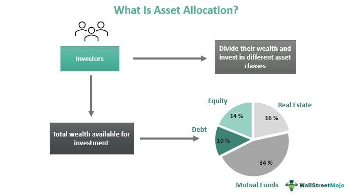

Asset allocation is a fundamental concept in investment management, involving the distribution of investments across different asset classes, such as stocks, bonds, and commodities. The objective is to balance risk and return according to an investor's financial goals and risk tolerance. In recent years, algorithmic trading has introduced new dimensions to asset allocation by utilizing computational algorithms to optimize the distribution of assets within a portfolio. This approach can provide a dynamic and systematic process, aiming to maximize returns while managing risk more effectively.

Algorithms facilitate the analysis of large volumes of financial data, recognizing patterns that may not be immediately apparent to human traders. By integrating historical data with advanced mathematical models, algorithmic trading seeks to make informed decisions regarding asset allocation. This method enhances traditional strategies by enabling quicker reactions to market changes, thereby optimizing portfolio management.



A significant development in this intersection of asset allocation and algorithmic trading is the application of machine learning (ML). Machine learning algorithms are capable of providing data-driven insights, which can improve the forecasting of asset performance and inform more effective allocation strategies. By continuously learning from new data, these algorithms adjust asset allocations dynamically, allowing portfolios to respond adaptively to changing market conditions. The role of machine learning in asset allocation exemplifies the potential for enhanced precision in investment strategies. This article examines these advancements and how they are reshaping the landscape of asset management.

## Table of Contents

## Understanding Asset Allocation

Asset allocation is the strategic process of distributing investments among a range of asset categories, such as stocks, bonds, and commodities, to optimize the risk-return trade-off. This process is foundational in investment management, as it directly influences an investor's potential for financial gain while simultaneously managing exposure to various risks. Critical to effective asset allocation are the principles of diversification, correlation, and [volatility](/wiki/volatility-trading-strategies).

Diversification is a risk management strategy that involves spreading investments across different asset categories to reduce exposure to any single asset or risk. The underlying principle is that diverse investments will, on average, yield higher returns and pose a lower risk than any individual investment within the portfolio. By investing in a mix of assets, investors can potentially mitigate the risk from poor performance in any single investment due to the compensatory positive performance of others.

Correlation is another vital concept in asset allocation. It measures the extent to which the prices of assets move in relation to one another. A diversified portfolio ideally consists of assets that have low or negative correlations. When assets are not perfectly correlated, the value of the portfolio becomes more stable, as losses in one asset may be offset by gains in another. This correlation can be quantified through the correlation coefficient, which ranges from -1 to 1. A correlation coefficient close to 0 indicates no linear relationship, while values closer to 1 or -1 indicate strong positive or negative correlations, respectively.

Volatility refers to the degree of variation in the price of an asset over a period of time and is a measure of risk associated with the price changes of an asset. Volatility is often quantified by the standard deviation or variance of asset returns. When constructing a portfolio, investors seek to balance assets with varying levels of volatility to align with their risk tolerance and investment objectives.

The fundamental goal of asset allocation is to create a portfolio that aligns with the investor's financial goals, risk tolerance, and investment horizon. This involves an ongoing process of evaluating the economic climate, market conditions, and the individual's changing circumstances to adjust the asset mix to maintain the desired risk-return profile.

By understanding and applying these core principles, investors can enhance their potential for achieving favorable investment outcomes while effectively managing the risks inherent in financial markets.

## The Role of ML in Algo Trading and Asset Allocation

Machine learning (ML) significantly enhances asset allocation within [algorithmic trading](/wiki/algorithmic-trading) by offering data-driven insights that improve decision-making processes. Traditional asset allocation methods rely on historical data and predetermined rules to distribute investments across various asset categories. In contrast, ML leverages advanced algorithms that adapt to changing market conditions, enabling dynamic reallocation of assets.

One primary advantage of ML in asset allocation is its ability to identify patterns in complex datasets. By analyzing vast amounts of historical and real-time data, ML models can uncover relationships and correlations between different asset classes that may not be apparent through conventional analysis. These insights inform more precise forecasting and risk management strategies, allowing for optimized portfolio returns.

For example, supervised learning techniques, such as regression analysis and decision trees, can be employed to predict asset price movements. In these models, the algorithm is trained on labeled historical data, learning the relationships between input variables (such as economic indicators) and asset prices. Once trained, these models can predict future asset movements, aiding traders in making informed allocation decisions. The formula for linear regression, one of the simplest forms of supervised learning, is:

$$
y = \beta_0 + \beta_1 x_1 + \beta_2 x_2 + \ldots + \beta_n x_n + \epsilon
$$

where $y$ is the predicted value, $\beta_0$ is the intercept, $\beta_1, \ldots, \beta_n$ are coefficients, $x_1, \ldots, x_n$ are input variables, and $\epsilon$ is the error term.

Unsupervised learning, on the other hand, is valuable for clustering similar market conditions and identifying anomalies. Clustering algorithms, like K-means, help group data points into clusters based on parameter similarities, revealing underlying structures within data that can guide strategic asset reallocation.

Machine learning also facilitates [reinforcement learning](/wiki/reinforcement-learning), a paradigm where models learn optimal strategies through a reward-based system. In the context of asset allocation, a reinforcement learning agent continuously interacts with the market environment by adjusting asset distribution strategies to maximize a utility function, such as return on investment. This iterative process allows the model to improve its asset allocation strategies over time based on feedback from market performance.

ML techniques support the dynamic adjustment of portfolios in response to real-time market signals, enhancing risk management. Methods such as neural networks and [deep learning](/wiki/deep-learning) can model non-linear relationships in financial datasets, offering flexible and robust tools for complex asset allocation problems. Python libraries like TensorFlow and PyTorch enable the implementation of these models in algorithmic trading systems.

By integrating ML into asset allocation, traders achieve improved accuracy and efficiency in managing their portfolios, ultimately leading to superior financial outcomes.

## Common Asset Allocation Strategies in Algorithmic Trading

Different asset allocation strategies in algorithmic trading are designed to optimize portfolios by adjusting the distribution of assets according to market conditions and investment goals. These strategies are pivotal in achieving a balance between risk and return, allowing traders to effectively manage their portfolios in a dynamic market landscape.

1. **Strategic Asset Allocation**: This approach involves setting target allocations for various asset classes and periodically rebalancing the portfolio to maintain these allocations over the long term. Strategic allocation is based on an investor's long-term objectives, risk tolerance, and investment timeframe. It is relatively static and relies on historical returns and correlations to guide the distribution of assets.

2. **Tactical Asset Allocation**: Unlike the strategic allocation, tactical asset allocation allows investors to take advantage of short-term market opportunities by deviating from their long-term asset allocation plan. This approach involves active decision-making to exploit temporary market inefficiencies or shifts in economic conditions. Algorithmic trading systems often facilitate this strategy by analyzing vast amounts of data in real time to quickly implement adjustments.

3. **Dynamic Asset Allocation**: This strategy is more flexible and responsive to market conditions compared to strategic and tactical approaches. Dynamic asset allocation involves continuous monitoring and adjusting of asset allocations based on changing market conditions, economic forecasts, and risk assessments. Machine learning algorithms play a significant role here by continuously learning from market data to dynamically rebalance portfolios.

4. **Core-Satellite Approach**: This methodology combines the stability of a strategic allocation with the growth potential of a tactical allocation. The core of the portfolio consists of stable, long-term investments such as index funds or bonds, while the satellite portion consists of active investments aimed at achieving higher returns. Algorithmic systems implement this approach by maintaining a stable core while continuously analyzing market data to manage the satellite investments actively.

Algorithmic trading systems enhance these strategies through the use of complex algorithms that process real-time data, historical patterns, and perform predictive analyses. For example, Python libraries such as NumPy and pandas can be utilized to implement tactical asset allocation by analyzing historical data to forecast potential market movements:

```python
import numpy as np
import pandas as pd

# Example of calculating expected returns and volatility
def expected_return(prices):
    returns = prices.pct_change().dropna()
    return returns.mean()

def volatility(prices):
    returns = prices.pct_change().dropna()
    return returns.std()

# Sample data for asset prices
prices = pd.DataFrame({
    'Asset1': [100, 102, 101, 105, 107],
    'Asset2': [200, 198, 202, 207, 210]
})

# Calculation
print("Expected Return for Asset1:", expected_return(prices['Asset1']))
print("Volatility for Asset1:", volatility(prices['Asset1']))
```

In conclusion, algorithmic systems enable more precise implementation of these asset allocation strategies, providing traders the ability to align their portfolios with their investment goals while adapting to market changes. Through a combination of strategic planning and tactical execution, traders can effectively manage risk and pursue optimal returns.

## Advanced Algorithms and Techniques

Techniques like mean-variance optimization and the Black-Litterman model are pivotal in optimizing portfolio allocations. Mean-variance optimization, introduced by Harry Markowitz, is the foundational concept of modern portfolio theory. It seeks to construct a portfolio that maximizes expected return for a given level of risk or, alternatively, minimizes risk for a given level of expected return. The optimization is achieved by evaluating the expected returns, variances, and covariances of different asset classes and solving the following quadratic programming problem:

$$
\min_x \frac{1}{2} x^T \Sigma x - \lambda x^T \mu
$$

Where $x$ is the vector of asset weights in the portfolio, $\Sigma$ is the covariance matrix of asset returns, $\mu$ is the vector of expected returns, and $\lambda$ is the risk aversion [factor](/wiki/factor-investing).

The Black-Litterman model enhances mean-variance optimization by incorporating investor's views into the estimation of expected returns, addressing the issue of subjective input in mean-variance optimization. It combines the market equilibrium returns (derived from the capital asset pricing model) with investors' unique views expressed in the form of expected returns, accommodating various confidence levels.

Risk parity, another advanced strategy, aims to allocate risk equally across asset classes rather than equalizing capital allocations. This approach is particularly effective in diversified portfolios where asset classes have significantly different risk profiles. By balancing the contribution of risk, risk parity strategies help reduce volatility and improve portfolio stability in uncertain market environments.

These advanced algorithms and techniques are further augmented by the integration of [machine learning](/wiki/machine-learning) in trading algorithms. Machine learning models enhance mean-variance optimization by predicting more accurate asset return distributions based on historical data patterns and identifying factors impacting asset correlations. Similarly, machine learning assists in refining the assumptions and subjective inputs required in the Black-Litterman model. For risk parity, machine learning can dynamically assess changes in market risks and adjust portfolio allocations timely and efficiently.

Python code for implementing these approaches typically involves libraries like NumPy for numerical operations, SciPy for optimization functions, and Pandas for data manipulation. For instance, using Python for mean-variance optimization can be illustrated as follows:

```python
import numpy as np
from scipy.optimize import minimize

# Expected returns and covariance matrix of assets
expected_returns = np.array([0.05, 0.10, 0.12])
cov_matrix = np.array([[0.005, -0.010, 0.004],
                       [-0.010, 0.040, -0.002],
                       [0.004, -0.002, 0.023]])

# Risk aversion factor
risk_aversion = 1.0

# Objective function to minimize
def objective_function(weights):
    portfolio_variance = np.dot(weights.T, np.dot(cov_matrix, weights))
    portfolio_return = np.dot(weights, expected_returns)
    return 0.5 * portfolio_variance - risk_aversion * portfolio_return

# Constraints: weights must sum to 1
constraints = ({'type': 'eq', 'fun': lambda weights: np.sum(weights) - 1})

# Bounds for weights: between 0 and 1
bounds = tuple((0, 1) for _ in range(len(expected_returns)))

# Initial weights guess
initial_weights = np.array([1/len(expected_returns)] * len(expected_returns))

# Optimization
optimal_weights = minimize(objective_function, initial_weights, method='SLSQP', bounds=bounds, constraints=constraints)

print("Optimal Portfolio Weights:", optimal_weights.x)
```

This approach demonstrates the analytical capabilities of integrating scientific and computational techniques with machine learning to achieve an optimal asset allocation in algorithmic trading. By leveraging these advanced methods, investors and traders can enhance decision-making accuracy and optimize portfolios to align with their financial goals and risk tolerance.

## Case Studies and Real-World Applications

Ray Dalio's All Weather Strategy is a hallmark of risk parity approach in the investment world. Developed to perform reliably across various economic environments, the All Weather Strategy focuses on balancing risk rather than capital among asset classes. This is accomplished by analyzing the volatility and economic sensitivities of different assets to ensure that no single asset class disproportionately impacts the portfolio. In algorithmic trading, this approach is implemented by using algorithms to dynamically adjust asset weightings based on evolving market conditions and risk assessments. By continuously recalibrating the risk exposure across assets, the strategy aims to provide consistent returns irrespective of market fluctuations.

The Permanent Portfolio, conceived by Harry Browne, is another diversified investment strategy that allocates assets equally among stocks, long-term bonds, cash, and gold. This allocation is designed to thrive in any economic climate by mitigating risk through diversification. Algorithmic trading systems utilize this strategy by automating asset rebalancing and adaptation to changing market conditions, ensuring the portfolio maintains its original allocations. The straightforward nature of the Permanent Portfolio makes it particularly suitable for algorithmic implementation, facilitating efficient risk management and return optimization via automated trades.

The Yale Endowment Model, pioneered by David Swensen, emphasizes diversification and alternative investments to achieve superior long-term returns. This model allocates a significant portion of its portfolio to non-traditional assets such as private equity, real estate, and hedge funds. In the context of algorithmic trading, this model benefits from machine learning techniques to analyze vast datasets and identify lucrative opportunities in alternative investments. By using data-driven insights, algorithms can forecast potential market shifts and adjust portfolio holdings faster and more accurately than traditional methods.

Integrating these strategies into algorithmic trading showcases the strengths of technology in enhancing traditional investment approaches. For instance, the ability to automatically rebalance portfolios and respond to real-time market data yields better risk-adjusted returns and operational efficiency. Investors can harness these advancements to improve portfolio resilience and adaptability in uncertain economic landscapes. Thus, the fusion of established asset allocation strategies with cutting-edge algorithms offers a potent blend of stability and innovation in modern investing.

## Challenges and Risks in Asset Allocation

Accurate data and model risk are significant challenges in effective asset allocation, particularly when leveraging algorithmic trading strategies. Precise data is foundational for making informed investment decisions. Inaccuracies or inconsistencies in data can lead to poor allocation decisions and increased risk. Historical data, often used in developing models, may not always accurately predict future trends, especially in volatile markets. Thus, ensuring data integrity through advanced cleaning, verification techniques, and real-time updates is vital for minimizing data-related errors.

Model risk arises when an algorithmic trading model fails to perform as expected, primarily due to inappropriate assumptions, misestimations, or model overfitting. Overfitting occurs when a model is too complex, capturing noise rather than the underlying pattern in the data. This leads to poor performance on unseen data. Regularization techniques like Lasso (Least Absolute Shrinkage and Selection Operator) or Ridge can help reduce overfitting by imposing penalties on the model coefficients:

$$

\text{Lasso: } \min_{w} \left( \sum_{i=1}^{N} (y_i - w^T x_i)^2 + \lambda \sum_{j=1}^{p} |w_j| \right) 
$$

$$

\text{Ridge: } \min_{w} \left( \sum_{i=1}^{N} (y_i - w^T x_i)^2 + \lambda \sum_{j=1}^{p} w_j^2 \right) 
$$

Execution risk, the risk that trades are not executed at desired prices due to market conditions, is another critical issue. Slippage, where expected and actual trade prices differ, can significantly impact returns. To mitigate execution risk, adaptive algorithms that dynamically adjust based on real-time data and market conditions are essential. These can be accomplished using machine learning models that learn from past execution patterns to optimize future trades.

Robust validation techniques are vital to addressing these challenges. This includes using [backtesting](/wiki/backtesting) on historical data with out-of-sample testing to ensure models perform well in different market conditions. Cross-validation strategies further ensure that models are not merely trained on a specific data subset but are robust across different datasets.

Adaptive algorithms offer another solution by continuously learning and refining based on new data and market environments. Techniques such as reinforcement learning, where algorithms iteratively improve their strategies by learning from past successes and failures, can enhance adaptability and resilience in asset allocation.

In summary, addressing the challenges and risks in asset allocation through accurate data, model validation, and adaptive algorithms is crucial for optimizing investment strategies within algorithmic trading. By implementing these measures, investors can better navigate the complexities of modern financial markets.

## Future Trends in Asset Allocation and Algo Trading

The future trends in asset allocation and algorithmic trading are heavily influenced by advancements in [artificial intelligence](/wiki/ai-artificial-intelligence) (AI) and machine learning (ML). These technologies enable the creation of more sophisticated and adaptive asset allocation models by leveraging vast amounts of data to generate insights and automate decision-making. AI and ML models can adjust to market changes faster than traditional methods, offering dynamic allocation in response to volatile market conditions. This adaptive capability helps in optimizing risk and returns by constantly recalibrating portfolios based on real-time inputs and emerging patterns.

Environmental, Social, and Governance ([ESG](/wiki/esg-investing)) investing is increasingly impacting asset allocation decisions. ESG considerations are becoming essential criteria for investment strategies, driven by investor demand for responsible and sustainable investment options. Algorithmic trading systems are integrating ESG factors into asset models which require the processing of large amounts of data to evaluate companies on their sustainability practices. This integration helps in building portfolios that align with ethical standards and long-term societal objectives, while still striving for competitive returns.

Blockchain technology is another transformative trend affecting asset allocation and trading. Its transparency, security, and efficiency in executing and settling trades make it a valuable tool in reducing transaction costs and increasing trust. Smart contracts—self-executing contracts with the terms directly written into code—enables automated trading strategies and real-time settlement of trades, thereby improving [liquidity](/wiki/liquidity-risk-premium) and efficiency within financial markets.

Furthermore, quantum computing holds the potential to revolutionize the field by solving complex optimization problems at unprecedented speeds. Quantum algorithms could dramatically enhance the computational processes involved in evaluating numerous scenarios for asset allocation, thus enabling more effective and timely decisions. As quantum technology matures, its application in finance could lead to breakthroughs in the development of novel financial models and strategic insights.

Collectively, these trends suggest a future where asset allocation and algorithmic trading become more interconnected with technological advancements that focus on efficiency, ethical considerations, and enhanced computational power. This convergence is set to shift the investment landscape significantly, offering new opportunities and challenges for investors and financial institutions alike.

## Conclusion

Asset allocation in algorithmic trading continues to advance as investors leverage computational methods and leading-edge technologies to optimize investment strategies. By employing sophisticated algorithms and data-driven decision-making tools, practitioners can enhance the management of risk and return in investment portfolios. Machine learning and artificial intelligence (AI) are at the forefront of these innovations, offering the ability to analyze vast datasets, identify intricate patterns, and make predictive allocations more efficiently than traditional methods.

The burgeoning capabilities of these technologies enable a more dynamic approach to asset management, allowing for real-time adjustments based on market fluctuations and emerging trends. Furthermore, the integration of [alternative data](/wiki/best-alternative-data) sources, such as social media sentiment and satellite imagery, into trading algorithms exemplifies the increasing complexity and potential of these systems to capture alpha, the measure of an investment's performance relative to a benchmark.

Looking ahead, the trajectory of asset allocation in algorithmic trading points towards even greater innovation. Developments in quantum computing hold promise for solving complex optimization problems at unprecedented speeds, potentially revolutionizing portfolio construction methodologies. Similarly, the emphasis on Environmental, Social, and Governance (ESG) criteria presents opportunities for creating sustainable investment strategies that align with ethical standards.

As technological advancements continue to reshape the landscape of asset allocation, investors stand to benefit from more precise and effective tools for managing their portfolios. This evolution not only enhances the potential for achieving superior returns but also contributes to a more resilient and adaptable financial ecosystem. The continuous iteration and improvement of algorithmic trading strategies thus position the field for sustained growth and influence in the coming years, offering substantial advantages to a broad spectrum of investors globally.

## References & Further Reading

[1]: Bergstra, J., Bardenet, R., Bengio, Y., & Kégl, B. (2011). ["Algorithms for Hyper-Parameter Optimization."](https://papers.nips.cc/paper/4443-algorithms-for-hyper-parameter-optimization) Advances in Neural Information Processing Systems 24.

[2]: ["Advances in Financial Machine Learning"](https://www.amazon.com/Advances-Financial-Machine-Learning-Marcos/dp/1119482089) by Marcos Lopez de Prado

[3]: ["Evidence-Based Technical Analysis: Applying the Scientific Method and Statistical Inference to Trading Signals"](https://www.amazon.com/Evidence-Based-Technical-Analysis-Scientific-Statistical/dp/0470008741) by David Aronson

[4]: ["Machine Learning for Algorithmic Trading"](https://github.com/PacktPublishing/Machine-Learning-for-Algorithmic-Trading-Second-Edition) by Stefan Jansen

[5]: ["Quantitative Trading: How to Build Your Own Algorithmic Trading Business"](https://books.google.com/books/about/Quantitative_Trading.html?id=j70yEAAAQBAJ) by Ernest P. Chan