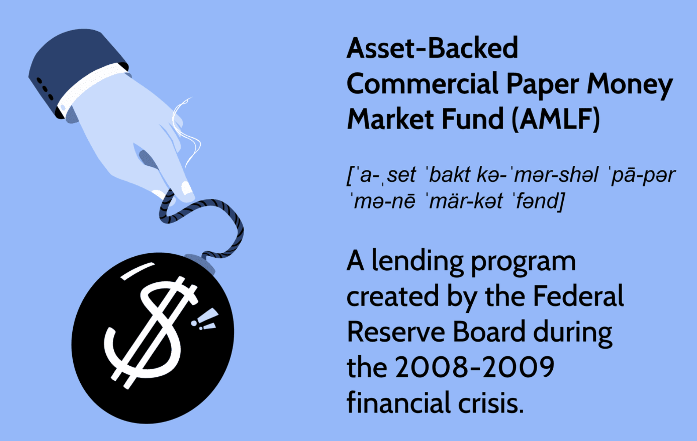

Commercial paper (CP) and asset-backed commercial papers (ABCPs) are key components in the landscape of short-term financing. Commercial paper is defined as an unsecured, short-term debt instrument issued by corporations to finance their immediate operational needs, such as inventory purchase and payroll, with maturity terms typically ranging from 1 to 270 days.<sup>[1](https://www.investopedia.com/terms/c/commercialpaper.asp)</sup> In contrast, ABCPs are variants of commercial paper backed by financial assets, which might include receivables, mortgage loans, or other forms of collateral. These financial instruments are primarily designed to meet short-term liquidity requirements for borrowers while offering diversification of funding sources.

The importance of CP and ABCP in short-term financial markets cannot be overstated, as they provide vital cash flow management tools for corporates and financial institutions. They play a crucial role in ensuring that companies can operate smoothly without the complications that may arise from longer-term debt instruments. ABCPs, in particular, offer an added layer of security by involving specific assets as collateral, thus potentially lowering the risk associated with default.



The role of algorithmic trading has evolved substantially in financial markets, becoming a dominant force influencing a myriad of securities, including ABCPs. Algorithmic trading employs complex mathematical models and computer programs to perform trades at speeds and frequencies that are impossible for human traders. Its application in the trading of ABCP and other securities enhances market efficiency, reduces transaction costs, and minimizes human errors. However, it also presents challenges such as the potential for market manipulation and technology-induced risks.

Understanding the interaction between commercial paper, asset-backed securities, and algorithmic trading helps comprehend their combined complexities and benefits. For investors and financial institutions, these financial instruments represent critical nodes in maintaining operational and financial stability. The knowledge of how CP and ABCP function, alongside the dynamics introduced by algorithmic trading, can guide strategic investment and risk management decisions.

In today's economic landscape, the relevance of these topics is accentuated by the ongoing need for liquidity management and the impacts of technological advancement on trading practices. Financial institutions and investors must navigate these instruments' nuances to make informed decisions that align with their financial goals and risk tolerances. Anticipating future trends and developments in CP, ABCP, and algorithmic trading will remain essential for capitalizing on opportunities and mitigating associated risks in the market.

---

[1] Investopedia. "Commercial Paper." Available online: https://www.investopedia.com/terms/c/commercialpaper.asp

## Table of Contents

## Understanding Commercial Paper and ABCP

Commercial paper is a short-term, unsecured debt instrument issued by corporations to meet immediate funding needs. Typically, it is issued at a discount to face value and carries a fixed maturity period often ranging from a few days up to 270 days. As it is unsecured, commercial paper relies heavily on the creditworthiness of the issuer, making it a vital tool for companies with strong credit ratings to obtain cost-effective funding without needing collateral.

Asset-backed commercial paper (ABCP) is a variant of commercial paper. Unlike traditional commercial paper, ABCP is backed by financial assets such as trade receivables, credit card receivables, or mortgages. This backing provides an additional layer of security to investors, as the underlying assets can be liquidated in case of default. The typical maturity period for ABCP is similar to that of standard commercial paper, often within 270 days, which aligns with its role in providing short-term [liquidity](/wiki/liquidity-risk-premium).

ABCP is issued by special purpose vehicles (SPVs) or conduits established by financial institutions. These SPVs are essentially bankruptcy-remote entities that hold the asset portfolios backing the ABCP. The structure allows financial institutions to isolate the assets from their balance sheets, thereby taking advantage of regulatory and capital relief. This setup enhances the flexibility and attractiveness of ABCP as a financial instrument, both for issuers seeking diverse funding sources and investors looking for secured short-term investments.

In conclusion, the distinction between commercial paper and ABCP primarily lies in the security backing provided by the latter, with ABCP's reliance on asset collateralization offering a different risk profile compared to the purely credit-based risk of traditional commercial paper. This structural difference is significant in determining the investment attractiveness and stability of these financial instruments.

## Differences Between CP and ABCP

Commercial paper (CP) and asset-backed commercial paper (ABCP) are both instruments used for short-term financing, but they have distinct characteristics and investor considerations. 

Commercial paper is a short-term, unsecured debt instrument issued by corporations to finance their immediate operational needs. Its viability as an investment hinges on the creditworthiness of the issuing corporation. Because it lacks collateral, investors require confidence in the issuer's ability to repay the debt. Consequently, the interest rates associated with CP often reflect the issuer's credit rating; higher creditworthiness leads to lower interest costs for the issuer, whereas entities with weaker credit ratings may need to offer higher rates to attract investors. This reliance on issuer creditworthiness implies that investors bear a higher risk, though it often leads to potentially higher returns compared to securities that are backed by assets.

Asset-backed commercial paper, on the other hand, is issued by special purpose vehicles (SPVs) or conduits set up by financial institutions. Unlike traditional commercial paper, ABCP is collateralized by financial assets such as receivables, mortgages, or other financial obligations. This collateralization alters the risk profile considerably. For investors, the presence of underlying assets provides a layer of security, potentially reducing the impact of issuer default. This feature typically allows issuers to offer lower yields on ABCP compared to unsecured CP since the risk is perceived to be lower.

The differences between CP and ABCP in terms of collateralization have significant implications for their risk and return profiles. CP's reliance on the issuer's credit rating means that the primary risk [factor](/wiki/factor-investing) is the company's financial health. In contrast, ABCP's risk profile is tied more closely to the performance and quality of the underlying assets. Investors in ABCP must evaluate the assets backing the paper, as their performance will directly impact the stability and return of their investment.

The collateralization in ABCP can mitigate some risks associated with traditional commercial paper but introduces others, such as the complexity related to valuing and managing the underlying assets. Investors may need to conduct more thorough due diligence, understanding the specific asset pools and potential for market [volatility](/wiki/volatility-trading-strategies) affecting those assets. The different risk profiles of CP and ABCP thus cater to diverse investor appetites, balancing the potential for higher returns with the security provided by asset backing.

## Algorithmic Trading and Its Impact

Algorithmic trading is the process of using computer algorithms to automate the trading of securities in financial markets. These algorithms are programmed to execute pre-defined instructions for trading, such as timing, price, and quantity of orders, without human intervention. This automation provides a strategic advantage in markets where speed and precision are paramount.

In the context of trading asset-backed securities (ABS) like asset-backed commercial papers (ABCP), algorithms are employed to quickly identify opportunities for buying or selling based on market conditions, past performance, and other financial indicators. Algorithms can process vast quantities of data more rapidly than manual trading practices, allowing for high-frequency trading ([HFT](/wiki/high-frequency-trading-strategies)) in ABS markets. For example, a trading algorithm might be configured to purchase ABCP when interest rates drop below a certain threshold, or to sell when specific credit ratings change.

The advantages of [algorithmic trading](/wiki/algorithmic-trading) include enhanced speed and efficiency. Algorithms can execute trades in milliseconds, dramatically improving the chances of capturing the best prices in a fast-moving market. Furthermore, using predefined criteria reduces the likelihood of human error, such as miscalculations or emotional decision-making. The automation of trading processes also allows for scalability, enabling traders to handle a large number of transactions simultaneously across multiple markets.

However, algorithmic trading also presents challenges. One significant concern is the risk of market manipulation through high-frequency trading strategies, such as "spoofing" or "layering," where traders deceive other market participants by placing large orders and then canceling them to artificially inflate demand or supply. Additionally, the reliance on technology introduces the potential for system failures or bugs within the algorithm, which could result in unintended trading behaviors and substantial financial losses.

Despite these risks, the adoption of algorithmic trading within ABS markets, including ABCP, continues to grow. Traders and institutions employ advanced [machine learning](/wiki/machine-learning) models to improve the predictive power and adaptability of their algorithms, continually striving for a balance between leveraging technology's advantages and managing its risks.

## Benefits and Risks of ABCP

Asset-backed commercial paper (ABCP) represents a significant component of short-term financing for financial institutions, corporations, and other entities. It offers distinct advantages in terms of liquidity and funding diversity, yet it also carries potential risks that investors must consider.

### Benefits of ABCP

1. **Liquidity Enhancement**: ABCP provides issuers with a mechanism to convert illiquid assets, such as receivables or mortgages, into liquid funds. This is crucial for maintaining operational liquidity and meeting short-term financial obligations. For example, investors seeking short-duration investments find ABCP an attractive choice due to its liquid nature, facilitating ease in buying and selling.

2. **Diversified Funding Sources**: The ability to back the commercial paper with a pool of financial assets allows issuers to diversify their funding sources. Instead of relying solely on the issuer's creditworthiness, investors have some degree of assurance from the underlying asset pool. This makes ABCP an appealing investment vehicle for those looking to diversify their risk portfolio.

3. **Cost Efficiency**: Since the paper is backed by financial assets, the risk is often perceived as lower compared to unsecured debt, which may result in lower interest rates for the issuer compared to other forms of short-term borrowing.

### Risks Associated with ABCP

1. **Liquidity Risk**: Despite its benefits, ABCP is susceptible to liquidity risk, particularly during periods of financial stress. If the market loses confidence in the underlying asset quality or the ability of ABCP's issuer to roll over maturing paper, it can lead to liquidity crunches.

2. **Market Volatility**: The valuation of the underlying assets can be sensitive to market conditions. Fluctuations in interest rates or economic downturns can impact the perceived value of assets backing the ABCP, increasing volatility.

### Historical Context: The 2008 Financial Crisis

The 2008 financial crisis offers a poignant example of the risks associated with ABCP. During this period, ABCP issuers had difficulty rolling over existing paper due to the market's loss of confidence in the value of mortgage-backed securities, which formed a substantial part of the asset pools. This led to a significant liquidity crisis, exacerbating the financial turmoil of that time. As a response to these challenges, the U.S. government implemented several programs to inject liquidity into the markets, illustrating ABCP's systemic impact during financial crises.

### Risk Mitigation Strategies for Investors

1. **Due Diligence**: Investors should conduct thorough due diligence on the quality and composition of the asset pools backing the ABCP. Understanding the types of assets, their performance history, and the economic sectors they represent is crucial.

2. **Portfolio Diversification**: By spreading investments across different ABCP programs and issuers, investors can mitigate idiosyncratic risks associated with any single program or financial institution.

3. **Monitoring Credit Ratings**: While not foolproof, credit ratings provide a measure of the risk associated with ABCP programs. Regularly monitoring these ratings can alert investors to potential downgrades or warning signals.

4. **Liquidity Assessment**: Given the importance of liquidity, assessing the ease with which ABCP can be bought or sold in secondary markets helps in understanding associated risks. Investors should also evaluate the rollover capabilities of ABCP issuers.

In conclusion, ABCP remains an essential component of the financial ecosystem, offering both opportunities and challenges. By carefully evaluating the associated risks and adopting strategic measures, investors can better navigate the complexities of investing in these instruments.

## Real-World Applications and Case Studies

Case studies of asset-backed commercial paper (ABCP) programs provide valuable insights into their practical applications and the critical role of algorithmic trading in their management. Understanding these applications offers lessons on their success or failure, particularly during varying market conditions.

### Successful ABCP Programs

A notable example of a successful ABCP program is the launch of multiseller conduits by major financial institutions. These conduits aggregate diverse pools of receivables from various sponsors, thus spreading risk and enhancing credit quality. For instance, Citibank's "Starbird Funding Corporation," established in the early 2000s, facilitated diversified funding for multiple sellers, leveraging the economies of scale to lower overall funding costs. The program's success largely stemmed from its meticulous asset selection and rigorous risk management policies.

Algorithmic trading has played an instrumental role in managing such portfolios, ensuring efficient pricing and liquidity management. Algorithms facilitate rapid assessments of collateral quality and pricing, enabling conduits to react swiftly to market changes. In Python, evaluating portfolio risk using a Monte Carlo simulation could be implemented with tools like NumPy:

```python
import numpy as np

# Define parameters
num_simulations = 10000
portfolio_value = 1000000  # Example portfolio value
default_rate = 0.01  # Assumed default rate

# Conduct simulations
simulated_losses = np.random.binomial(portfolio_value, default_rate, num_simulations)
expected_loss = np.mean(simulated_losses)

print(f'Expected Portfolio Loss: {expected_loss}')
```

### Failed ABCP Programs

Conversely, the pre-2008 era witnessed significant failures, most notably exemplified by the "Structured Investment Vehicles" (SIVs), which heavily relied on short-term ABCP to fund long-term assets. These vehicles crumbled during the financial crisis due to severe liquidity mismatches and collapsing asset values. The failure underscored the necessity for vigilant liquidity management and the dangers of over-reliance on short-term funding.

### Algorithmic Trading in Market Cycles

During periods of market turmoil, algorithmic strategies have been utilized to dynamically adjust ABCP holdings. These algorithms capitalize on intricate statistical models and machine learning to predict asset performance, optimize liquidity, and minimize risk. The 2008 financial crisis emphasized the importance of adaptive algorithms in anticipating credit events and optimizing execution strategies to preserve capital.

### Lessons Learned

Analyzing these programs highlights several lessons:

1. **Diversification and Asset Quality**: Successful ABCP programs prioritize asset quality and diversification to mitigate risk.
2. **Liquidity Management**: Ensuring adequate liquidity buffers is vital, especially for programs relying on short-term funding.
3. **Adaptive Trading Strategies**: Incorporating algorithmic trading can enhance portfolio management through precise, data-driven decision-making.

The evolution of market practices has underscored the integration of sophisticated algorithms in trading strategies, which play a crucial role in navigating complex market environments. The ongoing advancement in algorithmic tools and machine learning offers the potential for more robust ABCP management, setting a precedent for future innovations in financial markets.

## Conclusion

Commercial paper, asset-backed commercial paper (ABCP), and algorithmic trading play pivotal roles in the modern financial markets, both individually and collectively. Commercial paper serves as a vital source of unsecured short-term corporate financing, enabling firms to manage their immediate funding needs efficiently. Asset-backed commercial paper extends this utility by incorporating the underlying security of pooled financial assets, offering a more diverse set of benefits and risks.

ABCP's role in financial markets has been transformative, particularly in enhancing liquidity and providing an alternative financing channel that reduces the reliance on traditional banking systems. This aspect is crucial for financial institutions seeking diversified funding sources. However, this advantage comes with inherent risks, such as exposure to market volatility and liquidity constraints, as highlighted during the 2008 financial crisis. Investors must therefore possess a nuanced understanding of the collateralization processes and the actual financial health of the issuers to navigate these complexities effectively.

Algorithmic trading adds a layer of sophistication to the interaction with these securities by leveraging technology to optimize trading strategies, reduce human error, and increase execution speed. Despite its advantages in enhancing market efficiency and liquidity, it also poses potential challenges such as market manipulation risks and technological vulnerabilities.

Looking forward, the integration of ABCP and algorithmic trading is poised to deepen, driven by advancements in [artificial intelligence](/wiki/ai-artificial-intelligence) and machine learning. This evolution may lead to enhanced predictive analytics capabilities and more robust risk management frameworks within ABCP markets. Increased scrutiny and tighter regulations may also arise to mitigate systemic risks associated with algorithm-driven trading.

The strategic use of commercial paper, ABCP, and algorithmic trading necessitates continuous research and awareness to refine existing frameworks and develop more resilient approaches. Such efforts are vital for both investors and financial institutions aiming to harness the benefits while mitigating the potential pitfalls of these sophisticated financial instruments.

## References & Further Reading

[1]: Fabozzi, F. J., Davis, H. A., & Choudhry, M. (2006). ["Introduction to Structured Finance,"](https://onlinelibrary.wiley.com/doi/book/10.1002/9781119197249) Wiley & Sons.

[2]: Coval, J. D., Jurek, J. W., & Stafford, E. (2009). ["The Economics of Structured Finance."](https://pubs.aeaweb.org/doi/pdfplus/10.1257/jep.23.1.3) The Journal of Economic Perspectives, 23(1), 3-25.

[3]: Gorton, G., & Metrick, A. (2012). ["Securitized Banking and the Run on Repo."](https://www.sciencedirect.com/science/article/pii/S0304405X1100081X) Journal of Financial Economics, 104(3), 425-451.

[4]: Vause, N. (2011). ["Credit ratings and Central Bank Securities Purchases: A Perspective on Recent Financial Market Developments."](https://www.researchgate.net/publication/306506317_The_Failures_of_Credit_Rating_Agencies_during_the_Global_Financial_Crisis_-_Causes_and_Possible_Solutions) BIS Working Papers No. 353.

[5]: Durbin, M. J. (2010). ["All About High-Frequency Trading,"](https://www.mhebooklibrary.com/doi/book/10.1036/9780071743457) McGraw-Hill Education.

[6]: Sornette, D., & Von der Becke, S. (2011). ["Crises and Collective Socio-Economic Phenomena: Simple Models and Challenges."](https://papers.ssrn.com/sol3/papers.cfm?abstract_id=1976249) Journal of Economic Dynamics and Control, 36(5), 707-732.