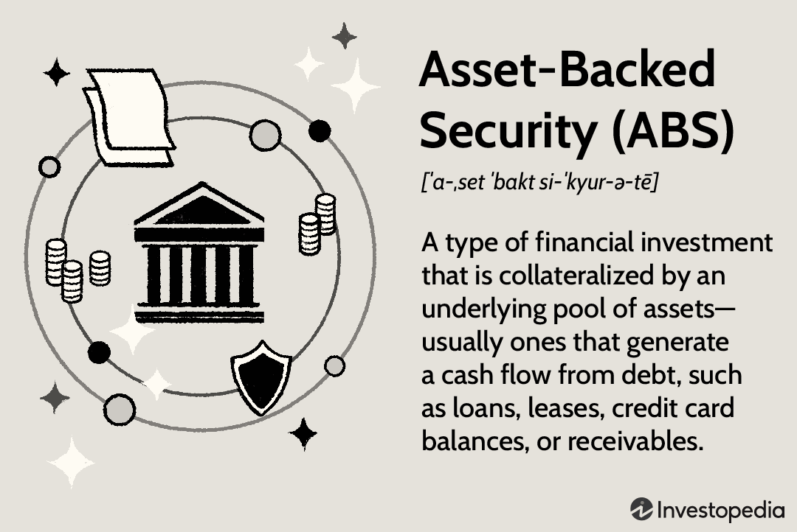

Asset-backed securities (ABS) are financial instruments that are collateralized by a pool of underlying assets, such as loans, leases, credit card receivables, or mortgages. These securities are significant in the financial market because they enable the original lenders to convert illiquid assets into liquid instruments, thus providing them with the opportunity to offload credit risk and improve balance sheet management. Moreover, for investors, ABS offer an attractive investment vehicle by providing diversification and potentially higher yields compared to traditional fixed-income securities.

Algorithmic trading, on the other hand, refers to the use of computer algorithms to execute trading strategies at speeds and frequencies beyond the capability of human traders. This approach has seen growing popularity due to its ability to process vast amounts of market data and execute trades systematically and efficiently, thereby enhancing market liquidity and efficiency. 



Understanding ABS and algorithmic trading is crucial for investors and financial professionals as these elements play pivotal roles in the modern financial landscape. Investors need to comprehend the complexities and risks associated with ABS, while algorithmic trading necessitates a grasp of technology and analytics to maximize potential returns and manage risks.

This article aims to provide comprehensive insights into asset-backed securities and the role of algorithmic trading in the financial markets. Readers can expect to learn about the basic structure and types of ABS, the transformative impact of algorithmic trading, and the interplay between these two financial innovations. The article will also discuss practical considerations for investors interested in leveraging algorithmic strategies to invest in ABS, thereby equipping them with knowledge to effectively navigate and thrive within today's dynamic markets.

The relationship between ABS and financial securities lies in their shared goal of diversifying investment risk and enhancing the liquidity of financial instruments. Algorithmic trading further facilitates this process by employing advanced data analytics and technological innovations to efficiently trade these securities. As such, the integration of ABS and algorithmic trading represents a frontier in financial innovation, offering new opportunities for portfolio diversification and risk management.

## Table of Contents

## Understanding Asset-Backed Securities (ABS)

Asset-Backed Securities (ABS) represent a class of financial instruments that are collateralized by a pool of assets. They are created through a process known as securitization, which involves converting illiquid assets into securities that can be sold to investors. The securitization process typically involves three key parties: the originator, the special purpose vehicle (SPV), and the investor. The originator, often a financial institution like a bank, pools various income-generating assets, such as loans or leases, and transfers them to an SPV. The SPV issues securities backed by these asset pools, which are then sold to investors who receive interest and principal payments derived from the underlying asset cash flows.

Securitization plays a crucial role in the creation of ABS by enhancing [liquidity](/wiki/liquidity-risk-premium), enabling originators to remove these assets from their balance sheets and thus freeing up capital for further lending. This transfer of risk, moreover, allows for more efficient capital allocation in the market.

One significant advantage of ABS for investors is diversification. Since these securities are backed by varied pools of assets, they provide exposure to different sectors, potentially reducing the impact of a single asset's poor performance. Furthermore, ABS offer risk management benefits by isolating specific cash flows and risks. They allow investors to choose securities that match their risk appetite, from senior tranches with lower yields and risk to junior tranches offering higher yields and risk.

The range of assets eligible for securitization into ABS is broad. Common asset types include auto loans, credit card receivables, mortgages, student loans, and equipment leases. This diversity enables ABS to cater to various investor preferences and risk profiles.

Historically, the ABS market emerged in the 1980s as financial institutions sought innovative ways to liquidate assets and manage balance sheet risks. The evolution of this market has been marked by periods of growth and occasional turmoil, notably during the 2007-2008 financial crisis when the role of certain asset-backed instruments, like mortgage-backed securities, came under scrutiny. Following the crisis, regulatory reforms and enhanced transparency measures were introduced to bolster investor confidence and fortify the integrity of the ABS market.

In summary, understanding ABS and their creation through securitization reveals their vital function in enhancing liquidity, providing diversification, and facilitating risk management in financial markets. The diverse array of assets that can be pooled into ABS underscores their adaptability and scope, while their historical evolution reflects the ongoing innovation and regulatory oversight shaping modern financial markets.

## Types of Asset-Backed Securities

Asset-backed securities (ABS) are financial instruments created by pooling various types of financial assets, which are then packaged and sold as securities to investors. Understanding the different types of ABS, such as mortgage-backed securities (MBS) and collateralized debt obligations (CDOs), is essential for comprehending the vast landscape of asset-backed investments.

Mortgage-backed securities (MBS) are a prominent type of ABS. They are backed by mortgage loans and can be differentiated into residential (RMBS) and commercial mortgage-backed securities (CMBS). RMBS are secured by residential properties, while CMBS are collateralized by commercial real estate. Both provide investors with periodic payments derived from the mortgage payments made by property owners. The primary risk associated with MBS is prepayment risk, where borrowers may repay their mortgages sooner than expected, impacting the scheduled cash flows to investors.

Collateralized debt obligations (CDOs) represent another significant type of ABS. CDOs consist of pooled debt obligations, which may include bonds, loans, or other credit instruments. These securities are categorized into tranches, each with different levels of risk and return. Senior tranches are generally safer with lower yields, while junior tranches offer higher yields at increased risk. The complexity of CDOs—along with issues like exposure to subprime mortgages—has historically contributed to significant financial distress, most notably during the 2007-2008 financial crisis.

While there are similarities between MBS and CDOs, such as their securitization processes and tranche structures, key differences lie in the asset types backing them and the composition of risk. MBS are specifically tied to real estate mortgages, whereas CDOs are broader, including various debt instruments. Risk profiles also vary; MBS is primarily subject to [interest rate](/wiki/interest-rate-trading-strategies) and prepayment risks, whereas CDOs face credit risk, especially in junior tranches.

Notable ABS examples include the Ginnie Mae mortgage-backed securities, known for their government backing, ensuring repayment of principal and interest, which has historically made them popular among risk-averse investors. Conversely, a famous case involving CDOs was the failure of Collateralized Debt Obligations during the financial crisis, which highlighted their potential riskiness and lack of transparency.

Recent trends in the ABS market show a resurgence of investor interest driven by innovations in structuring and the use of [machine learning](/wiki/machine-learning) and data analytics for risk assessment. Enhanced transparency and stronger regulatory frameworks have also emerged to prevent a repeat of past financial disruptions. Moreover, sustainability-themed asset-backed securities, such as green MBS, are gaining traction as investors seek environmentally sustainable investment opportunities.

In conclusion, different types of ABS, with their inherent risks and returns, play a significant role in the financial markets. By understanding MBS, CDOs, and recent developments in the ABS sector, investors can better navigate the complexities of these financial instruments.

## Algorithmic Trading in Financial Markets

Algorithmic trading, often referred to as algo trading, involves the use of computer programs to automate trading strategies. It relies on pre-defined rules and mathematical models to execute trades at high speeds, enabling traders to capture market opportunities efficiently. The rise of [algorithmic trading](/wiki/algorithmic-trading) has significantly transformed modern financial markets by enhancing their operational dynamics.

Algorithmic trading strategies vary widely in their objectives and methodologies. Some of the most prominent strategies include trend-following, [arbitrage](/wiki/arbitrage), and market-making. Trend-following strategies capitalize on the persistence of market trends, using algorithms to identify and exploit these patterns. Arbitrage strategies attempt to profit from price discrepancies between related markets or instruments, while market-making strategies involve providing liquidity by continuously quoting buy and sell prices.

The adoption of algorithmic trading has had a profound impact on market liquidity and efficiency. By automating trading processes, algorithmic trading increases the [volume](/wiki/volume-trading-strategy) and velocity of trades, contributing to higher liquidity levels. This can narrow bid-ask spreads and reduce transaction costs, benefiting all market participants. Additionally, algorithmic trading can enhance market efficiency by rapidly incorporating information into asset prices, thus reducing the likelihood of mispricings.

Despite its advantages, algorithmic trading is not without risks. One primary concern is the potential for increased market [volatility](/wiki/volatility-trading-strategies). Algorithms responding to similar market signals can lead to abrupt price movements, sometimes resulting in flash crashes. Moreover, the reliance on complex algorithms introduces the risk of errors or unforeseen interactions that can amplify these effects.

Recent trends in algorithmic trading focus on advancements in technology and data analytics. Machine learning and [artificial intelligence](/wiki/ai-artificial-intelligence) are increasingly being integrated into trading systems to improve predictive accuracy and adaptability. High-frequency trading ([HFT](/wiki/high-frequency-trading-strategies)), a subset of algorithmic trading, continues to evolve with the development of faster and more efficient execution technologies.

In summary, algorithmic trading has revolutionized financial markets by enhancing liquidity and efficiency while introducing new risks. Continued technological innovation holds the potential to further refine these systems, making them even more integral to the future landscape of finance.

## The Relationship Between ABS and Algorithmic Trading

Algorithmic trading has significantly transformed the trading of asset-backed securities (ABS) by leveraging advanced technology and data analytics to execute trades with speed and precision. This method of trading utilizes computer algorithms, which are sets of rules or instructions, to automate the decision-making process for buying and selling ABS, thereby enhancing market efficiency and liquidity.

### Utilization of Algorithmic Trading for ABS

Trading ABS through algorithmic strategies involves the use of sophisticated models that can analyze vast amounts of data in real time. These models are designed to identify pricing inefficiencies and execute trades at optimal levels, minimizing human intervention and mitigating the biases that may arise from emotional decision-making. Algorithms can process data from various sources, including historical price trends, macroeconomic indicators, and real-time market feeds, to predict possible future price movements of ABS and strategically execute trades.

### Role of Technology and Data Analytics

Technology and data analytics play a critical role in analyzing ABS, which involves parsing large datasets to extract meaningful insights that can inform trading strategies. Machine learning algorithms, a subset of artificial intelligence, can continuously learn from data patterns to improve trading outcomes. By analyzing past transactions and market conditions, these algorithms can dynamically adjust their parameters to optimize performance. Additionally, the use of big data analytics allows traders to consider external factors, such as changes in interest rates or economic policies, which may impact the ABS market.

Python, for instance, is widely used for developing algorithmic trading systems due to its robust libraries and frameworks, such as Pandas, NumPy, and Scikit-learn, which facilitate data analysis and model development. A simple Python script for analyzing historical ABS data might look like this:

```python
import pandas as pd
import numpy as np
from sklearn.linear_model import LinearRegression

# Load historical ABS data
data = pd.read_csv('historical_abs_data.csv')

# Preprocess data
X = data[['feature1', 'feature2', 'feature3']].values
y = data['price'].values

# Initialize and train the model
model = LinearRegression()
model.fit(X, y)

# Predict future prices
future_features = np.array([[value1, value2, value3]])
predicted_price = model.predict(future_features)
print(f"Predicted ABS Price: {predicted_price}")
```

### Challenges and Opportunities

While algorithmic trading offers numerous advantages, it also presents challenges. The complexity of ABS, due to their underlying assets, requires advanced models that can effectively assess the risk and return profiles. The accuracy of predictive models is contingent upon the quality of the data and the assumptions underlying the models. Moreover, increased use of algorithmic trading can lead to issues such as flash crashes, where rapid automated trading exacerbates market volatility.

Despite these challenges, there are significant opportunities for innovation in the ABS market through algorithmic strategies. Enhanced data analytics and machine learning can drive more accurate pricing and risk management, while blockchain technology could offer transparent and efficient settlement processes. The use of smart contracts could facilitate the execution of predetermined trading strategies automatically.

### Future Developments and Trends

The future outlook for the intersection of ABS and algorithmic trading is promising, with trends leaning toward increased automation, integration of artificial intelligence, and utilization of [alternative data](/wiki/best-alternative-data) sources. As technology continues to evolve, we can expect further sophistication in algorithms that will enhance the precision of ABS trading strategies. Furthermore, regulatory advancements are likely to shape the development of new frameworks that promote transparency and protect against systemic risks.

Investors and financial professionals who harness the potential of algorithmic trading in the ABS market stand to gain a competitive edge in portfolio diversification and risk management. Keeping abreast of technological advancements and market trends will be essential for leveraging these opportunities effectively.

## Practical Considerations for Investors

Investing in asset-backed securities (ABS) with algorithmic trading strategies involves a multifaceted approach that requires a sound understanding of both financial products and technology. Starting this investment journey involves several key considerations outlined below.

### Starting Investment in ABS with Algorithmic Strategies
To begin investing in ABS using algorithmic strategies, individuals must first understand the fundamentals of ABS and identify the types of assets underpinning these securities. Algorithmic trading, characterized by pre-programmed trading instructions accounting for variables such as time, price, and volume, can effectively manage the ABS investment process due to its speed and data processing capacity.

### Key Factors: Risk Assessment and Regulatory Compliance
Investors should perform comprehensive risk assessments to evaluate potential losses and uncertainties associated with ABS. This involves analyzing historical performance data, assessing the credit quality of underlying assets, and identifying market volatility patterns. Additionally, understanding regulatory compliance is critical. Regulations such as the Dodd-Frank Act in the U.S. aim to enhance transparency and accountability in financial markets, including the trading of ABS. Investors must ensure adherence to these regulations to mitigate legal risks and remain in good standing.

### Selecting Tools and Platforms for Algorithmic Trading
Choosing the right tools and platforms is crucial for successful algorithmic trading in ABS. Platforms should offer robust computational power, access to real-time data, and the ability to execute complex trading algorithms efficiently. Python is a preferred programming language for developing such algorithms due to its simplicity and robust libraries. Here is a small example of a Python script using a simple moving average crossover strategy: 

```python
import pandas as pd
import numpy as np
import yfinance as yf  # For more datasets, visit: https://paperswithbacktest.com/datasets

# Fetching historical data for the desired ABS
data = yf.download("ABS_EXAMPLE_TICKER", start="2020-01-01", end="2023-01-01")

# Calculating short and long moving averages
data['SMA_20'] = data['Close'].rolling(window=20).mean()
data['SMA_50'] = data['Close'].rolling(window=50).mean()

# Generating trading signals
data['Signal'] = np.where(data['SMA_20'] > data['SMA_50'], 1, 0)

# Printing the signal for the last day
print(data.tail(1)[['Close', 'SMA_20', 'SMA_50', 'Signal']])
```

### Due Diligence and Market Awareness
Due diligence plays a pivotal role in investing in ABS with algorithmic strategies. This involves verifying the credibility of ABS issuers, understanding the economic conditions underlying asset pools, and assessing recent performance trends. Staying informed about market trends is equally important. Continuous monitoring of macroeconomic indicators, consumer credit conditions, and interest rate fluctuations is necessary for making informed investment decisions.

### Continuous Learning and Adaptation
The financial market landscape, driven by technological advancements and dynamic economic conditions, is rapidly evolving. Investors must commit to continuous learning to stay abreast of new trading technologies, evolving regulations, and emerging market opportunities. This can be achieved through regular participation in financial seminars, coursework on advanced algorithmic techniques, and leveraging financial research platforms. Embracing adaptability enables investors to tweak strategies in response to market shifts, enhancing long-term investment success.

In conclusion, a strategic approach combining algorithmic efficiency with in-depth market analysis allows investors to effectively engage with ABS markets while navigating inherent risks.

## Conclusion

In summary, asset-backed securities (ABS) and algorithmic trading stand as pivotal components in the modern financial landscape. Understanding ABS enriches investors' portfolios by providing diversification and risk management through the securitization of various asset classes. Recognizing how algorithmic trading transforms these markets with enhanced trading efficiency and liquidity is equally critical. 

Gaining proficiency in these areas empowers financial professionals and investors to navigate the complexities of contemporary markets, optimize trade execution, and capitalize on volatility. As such, continued learning and research into the dynamics of ABS and algo trading can unveil lucrative opportunities for those interested in sophisticated investment strategies. 

Investors are thus encouraged to assess the potential of incorporating ABS alongside algorithmic trading into their portfolios. This dual approach not only diversifies their investments but also primes their strategies for future innovation. 

Looking ahead, the financial industry's trajectory suggests an increasing integration of technology and data analytics, strengthening the role of ABS and algorithmic trading. As these trends evolve, staying informed and adaptable will be essential for anyone seeking to leverage these advancements for sustained financial growth and competitive advantage.

## References & Further Reading

[1]: Gorton, G. B., & Metrick, A. (2012). ["Securitization."](https://www.nber.org/papers/w18611) Annual Review of Financial Economics, 4(1), 127-147.

[2]: Fridson, M. S., & Alvarez, F. (2011). ["Financial Statement Analysis: A Practitioner's Guide."](https://onlinelibrary.wiley.com/doi/book/10.1002/9781119201489) John Wiley & Sons.

[3]: Fabozzi, F. J. (Ed.). (2001). ["The Handbook of Mortgage-Backed Securities."](https://academic.oup.com/book/7943) Oxford University Press.

[4]: Lopez de Prado, M. (2018). ["Advances in Financial Machine Learning."](https://books.google.com/books/about/Advances_in_Financial_Machine_Learning.html?id=oU9KDwAAQBAJ) John Wiley & Sons.

[5]: Joshi, M. (2008). ["Algorithmic Trading & DMA: An Introduction to Direct Access Trading Strategies."](https://www.semanticscholar.org/paper/Algorithmic-trading-%26-DMA-%3A-an-introduction-to-Johnson/aa5de1ab883d5e23b6651faa7c1807586d688e4b) 4Myeloma Press.

[6]: Burghardt, G., & Roth, L. (2010). ["Mastering Credit Derivatives: A Step-by-Step Guide to Credit Derivatives and Structured Credit."](https://pmc.ncbi.nlm.nih.gov/articles/PMC10605599/) FT Press.