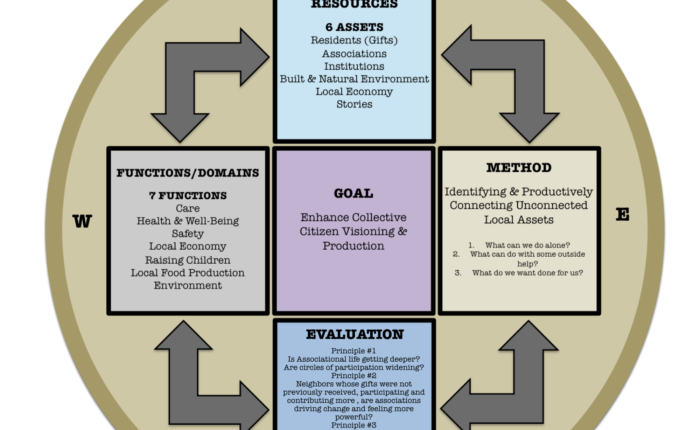

## Table of Contents

## What is an asset base?

An asset base is the total value of all the things a person or a company owns that can be used to make money or help them financially. This includes things like money in the bank, buildings, land, equipment, and even investments like stocks and bonds. Having a strong asset base means you have more resources to use for growing your business or managing your finances.

For a company, a strong asset base can help it borrow money more easily because banks see the company as less risky. For a person, having a good asset base can mean more financial security and the ability to handle unexpected expenses or invest in new opportunities. Overall, an asset base is important for both individuals and businesses because it shows how much financial strength they have.

## What types of assets can be included in an asset base?

An asset base can include many different types of things that have value. This includes cash, which is money you have in the bank or on hand. It also includes things like buildings and land, which are called real estate. Equipment, like machines or vehicles that a business uses to do its work, is another type of asset. Additionally, investments such as stocks, bonds, and mutual funds are part of an asset base because they can grow in value over time.

Another important part of an asset base is inventory, which is the products a business has ready to sell. Accounts receivable, which is money that customers owe the business for goods or services they've already received, also counts as an asset. Some less obvious assets include intellectual property, like patents and trademarks, and goodwill, which is the value of a business's reputation and customer relationships. All these different types of assets together make up the total asset base of a person or a company.

## How does an asset base function within a business or organization?

An asset base helps a business or organization by showing what they own that can make money or help them grow. It includes things like cash, buildings, machines, and even things they can sell. When a business knows what assets it has, it can use them to make more money or get loans from banks. Banks like to see a big asset base because it means the business is less risky to lend money to. This can help the business grow by buying new things or starting new projects.

Having a strong asset base also helps a business plan for the future. It can use its assets to invest in new opportunities or to keep the business running smoothly during tough times. For example, if a business has a lot of cash, it can use that money to buy more inventory or pay for new equipment. If the business has valuable land or buildings, it can use them to get loans or even sell them if needed. Overall, a good asset base makes a business stronger and more able to handle whatever comes its way.

## What are the benefits of maintaining an asset base?

Maintaining an asset base is important because it helps a business stay strong and ready for the future. When a business knows what it owns, it can use those things to make more money or grow. For example, if a business has a lot of cash, it can use that money to buy new things or pay for new projects. If it has valuable land or buildings, it can use them to get loans from banks. Banks like to see a big asset base because it means the business is less risky to lend money to.

Having a good asset base also helps a business handle tough times. If something unexpected happens, like a drop in sales or a big expense, the business can use its assets to keep going. For example, if a business has a lot of inventory, it can sell that to make money. Or if it has equipment, it can use it to make more products. Overall, a strong asset base makes a business more secure and able to deal with whatever comes its way.

## How do you establish an asset base for a new business?

When you start a new business, you can begin building your asset base by figuring out what you already have that can help your business. This might include money you have saved up, which is called cash. It can also include things like a computer or a vehicle that you can use for your business. If you have a special skill or idea that no one else has, that's called intellectual property, and it can be an asset too. By listing all these things, you can see what you have to work with and start planning how to use them to grow your business.

As your business grows, you can add more things to your asset base. For example, if you make money from selling products, you can use that money to buy more inventory or new equipment. If you have extra money, you can put it in the bank or invest it in stocks or bonds. You might also be able to buy or rent a building for your business, which would add to your asset base. By keeping track of all your assets and using them wisely, you can make your business stronger and more able to handle the future.

## What are the common methods for valuing assets within an asset base?

When you want to know how much your assets are worth, you can use different ways to figure it out. One common way is to look at what similar things are selling for right now. For example, if you have a building, you can see what other buildings like yours in the same area are selling for. This is called the market approach. Another way is to figure out how much money the asset can make in the future. This is called the income approach. For example, if you own a machine that makes products, you can guess how much money it will make and then figure out what that's worth now.

Another method is the cost approach, where you think about how much it would cost to replace the asset if it got lost or broken. For example, if you have a special piece of equipment, you can find out how much it would cost to buy a new one. Sometimes, you might use more than one of these methods to get a better idea of what your assets are really worth. By using these different ways, you can make sure you have a good understanding of your asset base and how much it's worth.

## How can an asset base be used for financial reporting?

An asset base is really helpful for financial reporting because it shows what a business owns and how much those things are worth. When a business makes financial reports, it has to list all its assets. This helps people like investors and banks understand how strong the business is. They can see if the business has a lot of cash, valuable buildings, or important equipment. By looking at the asset base, they can tell if the business is doing well and if it can pay its bills or grow in the future.

In financial reports, the asset base is usually shown on a document called a balance sheet. The balance sheet lists all the assets on one side and all the debts and other things the business owes on the other side. This helps everyone see if the business has more assets than debts, which is a good sign. By keeping the asset base up to date and showing it clearly in financial reports, a business can make sure everyone knows how healthy its finances are.

## What role does an asset base play in investment decisions?

An asset base is really important when making investment decisions. It shows what a business owns and how much those things are worth. When someone wants to invest in a business, they look at the asset base to see if the business is strong and has a good chance of making money. If the business has a lot of cash, valuable buildings, or useful equipment, it might be a good investment because those things can help the business grow and make more money.

Investors also use the asset base to figure out how risky an investment might be. If a business has a big asset base, it might be able to handle tough times better because it has things it can sell or use to keep going. On the other hand, if the asset base is small, the business might be riskier because it doesn't have as many resources to fall back on. By looking at the asset base, investors can make smarter decisions about where to put their money.

## How can technology enhance the management of an asset base?

Technology can help a lot when it comes to managing an asset base. It makes it easier to keep track of all the things a business owns. With special software, a business can see all its assets in one place, like cash, buildings, and equipment. This software can also update the value of these assets automatically, so the business always knows how much they're worth. It can even send reminders when it's time to check on or fix something, which helps keep everything in good shape.

Using technology also makes it simpler to make reports and share information with others. For example, if a business needs to show its asset base to a bank or investors, it can use the software to make clear and accurate reports quickly. This can save a lot of time and help the business look more professional. Plus, technology can help find patterns and make predictions about what might happen next, which can be really helpful for planning and making smart decisions about the future.

## What are the challenges associated with maintaining an accurate asset base?

Keeping an asset base accurate can be hard because things change all the time. Assets like buildings and equipment can lose value as they get older or need repairs. It's important to keep track of these changes, but it can be a lot of work. Also, the value of things like stocks and bonds can go up and down a lot, which means the business needs to check and update their value often. If they don't, the asset base might not show the right picture of what the business owns.

Another challenge is making sure all the information about the assets is correct. Sometimes, businesses might forget to add new assets or take out old ones. This can happen if they buy something new or sell something they don't need anymore. It's also hard to make sure everyone in the business is using the same way to figure out how much things are worth. If different people use different methods, the asset base might not be accurate. Keeping everything up to date and correct takes a lot of time and effort, but it's really important for the business to know exactly what it owns.

## How do regulatory requirements impact the management of an asset base?

Regulatory requirements can make managing an asset base more complicated. Different rules from the government or other groups can tell a business how it needs to keep track of its assets. For example, some rules might say that a business has to check the value of its buildings and equipment every year. Other rules might say how to report the value of things like stocks and bonds. If a business doesn't follow these rules, it could get in trouble or have to pay fines. So, it's important for a business to know and follow all the rules that apply to its assets.

These rules can also affect how a business makes decisions about its assets. For example, some regulations might limit what a business can do with certain assets, like selling them or using them as part of a loan. This can make it harder for a business to use its assets to grow or handle tough times. But, following the rules can also help a business show that it's trustworthy and well-managed. This can make it easier to get loans or attract investors, which can be good for the business in the long run.

## What advanced strategies can be employed to optimize the performance of an asset base?

To optimize the performance of an asset base, a business can use a strategy called asset allocation. This means spreading out the assets in different ways to make the most money and lower the risk. For example, a business might put some money in safe investments like bonds and some in riskier ones like stocks. By doing this, the business can make sure it has a good mix of assets that can grow over time and also be ready for any surprises. Another strategy is to keep an eye on the assets and make changes when needed. If an asset isn't doing well, the business might sell it and use the money to buy something better. This helps keep the asset base strong and working well.

Another advanced strategy is to use technology to manage the asset base more effectively. Special software can help keep track of all the assets and make sure their values are up to date. It can also help predict what might happen in the future, so the business can plan ahead. For example, the software might show that a certain piece of equipment will need to be replaced soon, so the business can start saving money for it. By using technology, a business can make smarter decisions about its assets and keep the asset base performing at its best.

## What is the understanding of financial assets?

Financial assets are a critical component of modern financial markets, representing non-physical assets whose value is derived from contractual claims. Unlike tangible assets such as real estate or machinery, financial assets do not have intrinsic physical value. Instead, their worth is contingent upon the expectations of future economic benefits.

### Examples of Financial Assets

- **Stocks:** Represent ownership shares in a corporation. As equities, they offer potential capital gains and dividends. Stocks come with variable risk, influenced by market conditions, company performance, and broader economic factors.

- **Bonds:** Essentially loans made to corporations or governments by investors, bonds pay periodic interest (coupons) and return the principal at maturity. They are generally considered less risky than stocks, though they are subject to interest rate risk and credit risk.

- **Derivatives:** Complex financial instruments whose value is derived from an underlying asset. Examples include options and futures. Derivatives allow for hedging against risks or speculative opportunities, but they often carry high risk due to leverage.

### Management and Valuation

Effective management of financial assets demands a thorough grasp of market dynamics and valuation techniques. Market dynamics involve understanding factors such as supply and demand, investor sentiment, and macroeconomic trends. Valuation techniques include methods like discounted cash flow and comparables analysis, which help estimate the intrinsic value of an asset.

The valuation of financial assets can be complex, especially with volatile or less liquid assets. Financial professionals utilize a variety of models and tools to assess and predict asset performance. For instance, in valuing stocks, the Gordon Growth Model can be used to calculate the present value of an infinite series of future dividends:

$$
P = \frac{D_1}{r - g}
$$

where $P$ represents the price of the stock today, $D_1$ is the expected dividend per share one year from now, $r$ is the required rate of return, and $g$ is the growth rate in dividends.

### Roles Within Investment Portfolios

Financial assets play significant roles in investment portfolios, driven by their risk-return profiles. A diversified portfolio typically includes a mix of financial assets to optimize returns while minimizing risk. For instance:

- **Growth Potential:** Stocks are generally included for their potential for appreciation, albeit with higher associated volatility.

- **Income Generation:** Bonds and other fixed-income instruments provide a steady source of income through interest payments.

- **Risk Management:** Derivatives can be strategically used to hedge against risks inherent in other portfolio holdings.

Investors and financial managers must continually reassess financial assets, accounting for changing economic conditions and market sentiments. With strategies tailored to individual risk tolerances and financial objectives, financial assets can significantly impact overall portfolio performance.

Understanding these fundamentals of financial assets is essential for effective investment decision-making and strategic financial planning.

## What are Mathematical Models and how are they used in Risk Management?

Mathematical models play an essential role in financial analysis and risk management. They provide the necessary framework for pricing derivatives, evaluating portfolio risks, and gaining insights into market behavior. Two prominent models, the Black-Scholes model and Monte Carlo simulations, are widely used in these processes.

The Black-Scholes model, introduced by Fischer Black and Myron Scholes in 1973, is a mathematical model for pricing European-style options. It assumes that the price of the underlying asset follows a geometric Brownian motion with constant [volatility](/wiki/volatility-trading-strategies) and interest rates. The Black-Scholes formula is expressed as:

$$
C = S_0 N(d_1) - Ke^{-rt} N(d_2)
$$

where:
- $C$ is the call option price,
- $S_0$ is the current price of the underlying asset,
- $K$ is the strike price,
- $r$ is the risk-free interest rate,
- $t$ is the time to maturity,
- $N$ is the cumulative distribution function of the standard normal distribution,
- $d_1 = \frac{\ln(\frac{S_0}{K}) + (r + \frac{\sigma^2}{2})t}{\sigma\sqrt{t}}$,
- $d_2 = d_1 - \sigma\sqrt{t}$,
- and $\sigma$ is the volatility of the underlying asset.

Monte Carlo simulations, on the other hand, are used to model the probability of different outcomes in a process that cannot easily be predicted due to the intervention of random variables. This method employs repeated random sampling to obtain numerical results and is particularly useful for assessing portfolio risks and pricing complex derivatives. By simulating thousands of potential price paths for an asset, Monte Carlo methods offer a comprehensive view of the impact of risk factors over time.

Risk management strategies such as value-at-risk (VaR) calculations and stress testing are critical for ensuring the safety of investments. VaR quantifies the maximum expected loss over a specific time frame at a given confidence level. For instance, if a portfolio has a daily VaR of $1 million at a 95% confidence level, there is a 5% chance that the portfolio could lose more than $1 million in a given day. Stress testing involves evaluating the impact of extreme market conditions on a portfolio to identify vulnerabilities.

Together, these quantitative models underpin systematic and robust financial strategies. They enable investors and financial analysts to make informed decisions by providing insights into potential risks and returns under various market conditions. By incorporating advanced mathematical models and risk management techniques, financial practitioners can better navigate the complexities of modern financial markets.

## References & Further Reading

Bergstra, J., Bardenet, R., Bengio, Y., & Kégl, B. (2011). 'Algorithms for Hyper-Parameter Optimization.' Advances in Neural Information Processing Systems. This work explores various algorithms designed to optimize hyper-parameters in [machine learning](/wiki/machine-learning) models, which are crucial for enhancing the performance of [algorithmic trading](/wiki/algorithmic-trading) systems. By employing these algorithms, financial professionals can fine-tune trading strategies to better match market conditions.

Lopez de Prado, M. (2018). 'Advances in Financial Machine Learning.' Wiley. This comprehensive text discusses modern techniques in financial machine learning, emphasizing their application to create more efficient and effective trading algorithms. Lopez de Prado provides insight into the critical role of machine learning in developing strategies that can adapt to changing market dynamics, a concept integral to contemporary asset management and algorithmic trading.

Aronson, D. (2006). 'Evidence-Based Technical Analysis: Applying the Scientific Method and Statistical Inference to Trading Signals.' Wiley. Aronson's book addresses the application of rigorous scientific methods to evaluate trading signals and technical analysis techniques. By advocating for a data-driven approach, it aligns with the principles of quantitative analysis and risk management covered in the article, underscoring the importance of empirical validation in the development of reliable trading strategies.

