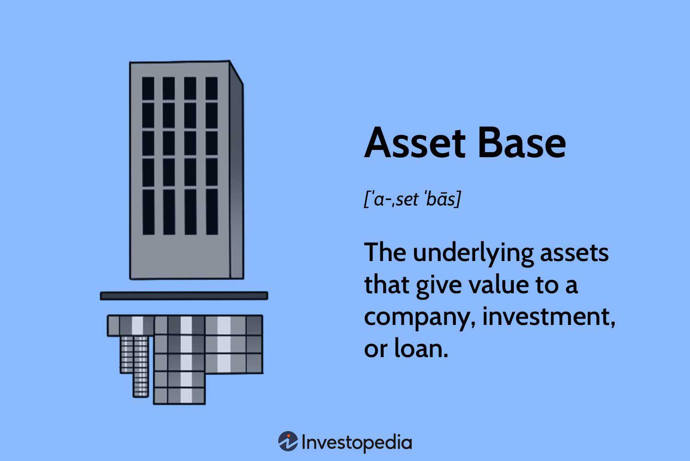

In today's rapidly evolving financial landscape, understanding and managing financial assets is crucial for investors and companies alike. The integration of technology into finance has transformed traditional practices, allowing for more precise and data-driven decision-making processes. This article explores key concepts such as asset management, asset base, and algorithmic trading to provide insights into modern financial practices. 

Asset management has become a cornerstone for optimizing investment portfolios, offering a framework for mitigating risks and maximizing returns. It involves utilizing strategies that assess market trends and diversification to maintain a balanced risk-reward ratio. Meanwhile, the asset base, comprised of both tangible and intangible assets, plays a central role in determining the valuation of entities. This evaluation is fundamental for strategic planning and investment decisions.



Algorithmic trading, another significant advancement, leverages computational algorithms to execute trades with speed and precision, surpassing traditional trading methods in efficiency. The use of mathematical models and algorithms allows for the analysis of vast datasets, identifying patterns and opportunities that can be exploited to improve trading outcomes.

As these concepts converge, they collectively shape and influence decision-making in finance, influencing everything from individual investments to corporate financial strategies. By embracing modern techniques and understanding the intricate dynamics of financial assets, professionals and organizations are better equipped to face the complexities of global markets. Join us as we navigate through the complexities of financial assets and the role of technology in transforming asset management.

## Table of Contents

## Understanding Financial Assets

Financial assets are a critical component of modern financial markets, representing non-physical assets whose value is derived from contractual claims. Unlike tangible assets such as real estate or machinery, financial assets do not have intrinsic physical value. Instead, their worth is contingent upon the expectations of future economic benefits.

### Examples of Financial Assets

- **Stocks:** Represent ownership shares in a corporation. As equities, they offer potential capital gains and dividends. Stocks come with variable risk, influenced by market conditions, company performance, and broader economic factors.

- **Bonds:** Essentially loans made to corporations or governments by investors, bonds pay periodic interest (coupons) and return the principal at maturity. They are generally considered less risky than stocks, though they are subject to interest rate risk and credit risk.

- **Derivatives:** Complex financial instruments whose value is derived from an underlying asset. Examples include options and futures. Derivatives allow for hedging against risks or speculative opportunities, but they often carry high risk due to leverage.

### Management and Valuation

Effective management of financial assets demands a thorough grasp of market dynamics and valuation techniques. Market dynamics involve understanding factors such as supply and demand, investor sentiment, and macroeconomic trends. Valuation techniques include methods like discounted cash flow and comparables analysis, which help estimate the intrinsic value of an asset.

The valuation of financial assets can be complex, especially with volatile or less liquid assets. Financial professionals utilize a variety of models and tools to assess and predict asset performance. For instance, in valuing stocks, the Gordon Growth Model can be used to calculate the present value of an infinite series of future dividends:

$$
P = \frac{D_1}{r - g}
$$

where $P$ represents the price of the stock today, $D_1$ is the expected dividend per share one year from now, $r$ is the required rate of return, and $g$ is the growth rate in dividends.

### Roles Within Investment Portfolios

Financial assets play significant roles in investment portfolios, driven by their risk-return profiles. A diversified portfolio typically includes a mix of financial assets to optimize returns while minimizing risk. For instance:

- **Growth Potential:** Stocks are generally included for their potential for appreciation, albeit with higher associated volatility.

- **Income Generation:** Bonds and other fixed-income instruments provide a steady source of income through interest payments.

- **Risk Management:** Derivatives can be strategically used to hedge against risks inherent in other portfolio holdings.

Investors and financial managers must continually reassess financial assets, accounting for changing economic conditions and market sentiments. With strategies tailored to individual risk tolerances and financial objectives, financial assets can significantly impact overall portfolio performance.

Understanding these fundamentals of financial assets is essential for effective investment decision-making and strategic financial planning.

## The Asset Base: A Key to Valuation

An asset base is the aggregate quantity of assets held by an organization or an individual and serves as a crucial determinant in the valuation process. The asset base encompasses both tangible and intangible assets, each exerting a distinct influence on the overall valuation. Tangible assets include physical items such as property, equipment, and inventory, while intangible assets comprise non-physical items such as patents, trademarks, and goodwill. The proper assessment and analysis of an asset base offer insight into an entity's financial strength, operational efficiency, and potential for future growth.

Tangible assets are typically valued based on their acquisition cost, adjusted for depreciation, wear and tear, or appreciation due to market conditions. For instance, a company's machinery might be recorded at historical cost less accumulated depreciation to reflect its current value. Intangible assets, however, often pose valuation challenges due to their lack of physical form and potential for fluctuating economic benefits. Methods like the relief-from-royalty approach or excess earnings method are commonly employed to ascertain their value.

Analyzing an asset base with precision is essential for crafting accurate assessments of a company's financial health. This analysis usually involves scrutinizing balance sheets, conducting asset performance reviews, and using financial ratios to gauge [liquidity](/wiki/liquidity-risk-premium), solvency, and profitability. For example, the asset turnover ratio, calculated as $\text{Net Sales} / \text{Average Total Assets}$, provides insights into how efficiently a company utilizes its asset base to generate sales.

Asset bases play a pivotal role in strategic planning and investment decisions. Businesses leverage their asset bases to secure financing, negotiate mergers and acquisitions, and enhance investor confidence. A robust asset base can attract investors and creditors by showcasing the company's ability to generate revenue and withstand economic fluctuations. Additionally, companies may strategize to optimize their asset structures, whether by investing in new technologies or divesting non-core assets to streamline operations and improve financial metrics.

In financial modeling and decision-making, the asset base is a critical input. Organizations employ various models to predict future asset performance, assess risk, and strategize for growth. For instance, discounted cash flow (DCF) analysis might be applied to tangible and intangible assets to project their contribution to future cash flows and inform investment decisions.

Overall, understanding the composition and value of an asset base is instrumental for stakeholders aiming to evaluate a company's worth and potential. By utilizing well-founded analysis techniques and strategic insights, businesses can effectively manage their asset bases to support long-term objectives and enhance market positioning.

## Asset Management Strategies

Asset management plays a crucial role in the financial sector, focusing on the disciplined oversight and structuring of investment portfolios to realize specific financial goals. The effectiveness of asset management strategies hinges on several core components: diversification, risk assessment, and market analysis.

Diversification is a fundamental principle, aiming to reduce unsystematic risk in a portfolio by spreading investments across asset classes, sectors, or geographical regions. This approach mitigates the impact of adverse performance in any single asset or sector, based on the notion that the performance of different asset classes is not perfectly correlated. The classic Markowitz Modern Portfolio Theory (MPT) quantifies this through the mean-variance optimization technique, which seeks to minimize portfolio variance for a given expected return or maximize return for a given level of risk.

Risk assessment involves evaluating the potential risks associated with an investment portfolio. Key metrics include value-at-risk (VaR), which estimates the maximum loss a portfolio might suffer over a specific period, and beta, a measure of an asset’s [volatility](/wiki/volatility-trading-strategies) in relation to the market. In practice, financial professionals employ tools like stress testing and scenario analysis to model the impact of extreme market conditions on portfolio performance.

Market analysis, another cornerstone of asset management, encompasses both fundamental and technical analysis to guide investment decisions. Fundamental analysis assesses an asset's intrinsic value by examining economic indicators, industry trends, and financial statements, while technical analysis involves the study of price patterns and trends in financial markets to forecast future movements.

Technology significantly enhances the outcomes of asset management by enabling the analysis of vast data sets and the execution of complex models with greater speed and accuracy. Software platforms offering automated rebalancing, [algorithmic trading](/wiki/algorithmic-trading), and real-time risk management tools have become integral to modern asset management. For example, Python's libraries like NumPy and Pandas are extensively used for quantitative analysis and developing statistical models, while [machine learning](/wiki/machine-learning) algorithms, which can identify patterns and predict market trends, are increasingly employed to improve asset allocation decisions.

In conclusion, the intersection of diversification, risk assessment, and market analysis, bolstered by technological advancements, forms the backbone of effective asset management strategies. This multi-faceted approach enables financial professionals to craft portfolios tailored to the risk appetite and return objectives of investors, ensuring optimal financial performance in diverse market conditions.

## Algorithmic Trading: Enhancing Financial Operations

Algorithmic trading employs advanced computer algorithms to automate trade executions based on pre-defined criteria, enabling transactions to be carried out at optimal times and prices. This sophisticated method capitalizes on speed, precision, and comprehensive data analysis to surpass traditional trading methods in efficiency and efficacy.

The primary advantages of algorithmic trading lie in its ability to analyze large datasets rapidly and to execute trades at a speed far beyond human capability. This use of technology reduces the potential for human error and allows for the execution of complex trading strategies across numerous markets simultaneously. Algorithms can assess real-time data feeds and initiate trades instantaneously, capitalizing on even the slightest market fluctuations.

Critical components of algorithmic trading strategies include a variety of technical indicators that guide decision-making processes. Moving Averages, for example, help smooth out price data by creating a constantly updated average price, which traders use to identify trends and potential reversals. The Supertrend indicator is utilized for determining the direction of a market trend, and the Parabolic Stop and Reverse (Parabolic SAR) indicator is used to find omni-directional trends. These indicators are integral to formulating strategies that aim to optimize entry and [exit](/wiki/exit-strategy) points in trading.

Algorithmic trading also facilitates [backtesting](/wiki/backtesting), a technique for testing trading strategies on historical data to verify their viability before applying them in live trading environments. This process helps traders refine their algorithms and reduce risk by using historical data to estimate the effectiveness of a given strategy. The use of backtesting can be demonstrated with a simple Python setup:

```python
import pandas as pd
import numpy as np

# Load historical price data
data = pd.read_csv('price_data.csv')

# Calculate Moving Average
data['Moving_Average'] = data['Close'].rolling(window=50).mean()

# Implement a simple trading strategy
def trading_signal(row):
    if row['Close'] > row['Moving_Average']:
        return 'Buy'
    elif row['Close'] < row['Moving_Average']:
        return 'Sell'
    else:
        return 'Hold'

# Generate signals
data['Signal'] = data.apply(trading_signal, axis=1)

# Resulting signals
print(data[['Close', 'Moving_Average', 'Signal']].tail())
```

The inclusion of algorithmic trading in asset management allows for data-driven decision-making, enhancing the ability to tune strategies based on nuanced market behaviors. As algorithms continually process vast amounts of data, they are better positioned to identify investment opportunities and mitigate risks. Consequently, firms that effectively integrate algorithmic trading into their asset management frameworks can potentially achieve superior market performance, leveraging data to drive more informed and precise investment decisions.

## Mathematical Models and Risk Management

Mathematical models play an essential role in financial analysis and risk management. They provide the necessary framework for pricing derivatives, evaluating portfolio risks, and gaining insights into market behavior. Two prominent models, the Black-Scholes model and Monte Carlo simulations, are widely used in these processes.

The Black-Scholes model, introduced by Fischer Black and Myron Scholes in 1973, is a mathematical model for pricing European-style options. It assumes that the price of the underlying asset follows a geometric Brownian motion with constant volatility and interest rates. The Black-Scholes formula is expressed as:

$$
C = S_0 N(d_1) - Ke^{-rt} N(d_2)
$$

where:
- $C$ is the call option price,
- $S_0$ is the current price of the underlying asset,
- $K$ is the strike price,
- $r$ is the risk-free interest rate,
- $t$ is the time to maturity,
- $N$ is the cumulative distribution function of the standard normal distribution,
- $d_1 = \frac{\ln(\frac{S_0}{K}) + (r + \frac{\sigma^2}{2})t}{\sigma\sqrt{t}}$,
- $d_2 = d_1 - \sigma\sqrt{t}$,
- and $\sigma$ is the volatility of the underlying asset.

Monte Carlo simulations, on the other hand, are used to model the probability of different outcomes in a process that cannot easily be predicted due to the intervention of random variables. This method employs repeated random sampling to obtain numerical results and is particularly useful for assessing portfolio risks and pricing complex derivatives. By simulating thousands of potential price paths for an asset, Monte Carlo methods offer a comprehensive view of the impact of risk factors over time.

Risk management strategies such as value-at-risk (VaR) calculations and stress testing are critical for ensuring the safety of investments. VaR quantifies the maximum expected loss over a specific time frame at a given confidence level. For instance, if a portfolio has a daily VaR of $1 million at a 95% confidence level, there is a 5% chance that the portfolio could lose more than $1 million in a given day. Stress testing involves evaluating the impact of extreme market conditions on a portfolio to identify vulnerabilities.

Together, these quantitative models underpin systematic and robust financial strategies. They enable investors and financial analysts to make informed decisions by providing insights into potential risks and returns under various market conditions. By incorporating advanced mathematical models and risk management techniques, financial practitioners can better navigate the complexities of modern financial markets.

## Conclusion: The Future of Financial Assets and Trading

The synergy between financial asset management, asset base evaluation, and algorithmic trading is critically shaping the future of finance. These elements are increasingly interconnected, leveraging technology to boost precision and efficiency. As new tools and methodologies emerge, the ability to manage financial assets with enhanced granularity and insight is empowering financial professionals to make more informed decisions.

Technological advancements, particularly in computing power and data analytics, are significantly expanding the capabilities of asset management. The evolution of algorithmic trading, utilizing complex algorithms and real-time data processing, offers unprecedented opportunities for optimizing trade execution. These algorithms, underpinned by sophisticated mathematical models, enable market participants to analyze vast datasets quickly and execute trades at prices and times that maximize returns.

Moreover, the integration of advanced mathematical models into asset management is becoming more prevalent. Models like Black-Scholes for option pricing or Monte Carlo simulations for risk assessment provide frameworks for robust financial forecasting and strategic planning. The ability to model financial markets mathematically allows for a more systematic approach to investment decisions, ensuring that risks are measured accurately and managed effectively.

For financial professionals to remain competitive, adaptation to these technological advancements is essential. The rapid pace of change in financial markets necessitates continuous learning and acceptance of new tools and strategies. By doing so, investors and firms can develop asset management practices that are not only more insightful but also more adaptable to market conditions.

In conclusion, the evolving landscape of financial assets and trading is defined by the interplay of technology and financial acumen. As tools and models continue to advance, they promise greater precision and broader scope in asset management. Professionals who embrace these changes will be well-positioned to achieve effective and informed asset management strategies, navigating the complexities of modern finance with confidence and foresight.

## References & Further Reading

Bergstra, J., Bardenet, R., Bengio, Y., & Kégl, B. (2011). 'Algorithms for Hyper-Parameter Optimization.' Advances in Neural Information Processing Systems. This work explores various algorithms designed to optimize hyper-parameters in machine learning models, which are crucial for enhancing the performance of algorithmic trading systems. By employing these algorithms, financial professionals can fine-tune trading strategies to better match market conditions.

Lopez de Prado, M. (2018). 'Advances in Financial Machine Learning.' Wiley. This comprehensive text discusses modern techniques in financial machine learning, emphasizing their application to create more efficient and effective trading algorithms. Lopez de Prado provides insight into the critical role of machine learning in developing strategies that can adapt to changing market dynamics, a concept integral to contemporary asset management and algorithmic trading.

Aronson, D. (2006). 'Evidence-Based Technical Analysis: Applying the Scientific Method and Statistical Inference to Trading Signals.' Wiley. Aronson's book addresses the application of rigorous scientific methods to evaluate trading signals and technical analysis techniques. By advocating for a data-driven approach, it aligns with the principles of quantitative analysis and risk management covered in the article, underscoring the importance of empirical validation in the development of reliable trading strategies.