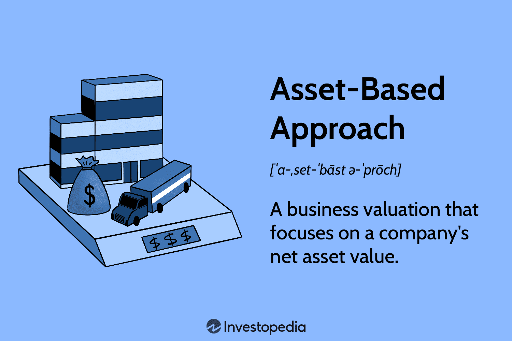

## Table of Contents

## What is an asset-based approach in financial analysis?

An asset-based approach in financial analysis is a way to figure out how much a company is worth by looking at its assets. Assets are things the company owns, like buildings, machines, and money in the bank. This method adds up the value of all these assets and then subtracts any debts the company has. The result is called the net asset value, which gives an idea of the company's worth if it were to be sold off.

This approach is useful for certain types of businesses, especially those that have a lot of physical stuff, like real estate or manufacturing companies. It's a straightforward way to see what the company would be worth if everything was sold. However, it doesn't always tell the whole story. For example, it might not show the value of the company's brand or its ability to make money in the future. So, while it's a good starting point, it's often used along with other methods to get a fuller picture of a company's value.

## How do you identify and list all assets for an asset-based valuation?

To identify and list all assets for an asset-based valuation, you start by looking at the company's balance sheet. This is a financial statement that shows what the company owns and owes. You go through the balance sheet and write down all the tangible assets, like buildings, land, machinery, vehicles, and inventory. These are things you can touch and see. You also list intangible assets, which are things you can't touch, like patents, trademarks, and goodwill. It's important to be thorough and not miss any assets, because each one adds to the total value of the company.

Once you have your list, you need to find out how much each asset is worth. For tangible assets, you might need to get them appraised by experts, especially for things like real estate or specialized equipment. For inventory, you can use the current market value or the cost to replace it. Intangible assets can be trickier to value, but you can use methods like looking at similar sales or getting an expert opinion. After you have the value of each asset, you add them all up to get the total asset value. Then, you subtract any liabilities, like loans or debts, to find the net asset value, which is the final number for your asset-based valuation.

## What are the differences between tangible and intangible assets in this context?

Tangible assets are things you can see and touch. They include stuff like buildings, land, machines, cars, and the products a company has in stock. These assets are easy to value because you can look at what they cost to buy or what they would sell for now. In an asset-based valuation, tangible assets are important because they can be sold if the company needs money or if it goes out of business. They give a clear picture of what the company owns that has a physical presence.

Intangible assets, on the other hand, are things you can't touch. They include things like patents, trademarks, copyrights, and the company's reputation or goodwill. These assets are harder to value because they don't have a clear market price. You might need to look at how much similar intangible assets have sold for or get an expert to help figure out their worth. In an asset-based valuation, intangible assets are important because they can add a lot of value to the company, even if they're not physical. They represent the company's ability to make money in the future through its brand and intellectual property.

## How do you calculate the book value of assets?

The book value of assets is what a company shows on its balance sheet as the value of its assets. To find it, you start with the original cost of the asset. This is how much the company paid for it when they bought it. Then, you take away any depreciation. Depreciation is a way to spread out the cost of an asset over the time it's used. For example, if a machine cost $10,000 and it's been used for half its expected life, you might subtract $5,000 for depreciation. The book value would then be $5,000.

For some assets, like land, you don't subtract depreciation because land doesn't wear out over time. But for things like buildings or equipment, depreciation is important. The book value gives you an idea of what the company thinks its assets are worth, but it might not be the same as what you could sell the assets for today. That's because the market value can go up or down, but the book value stays based on the original cost and depreciation.

## What adjustments are commonly made to the book value of assets during an asset-based valuation?

When doing an asset-based valuation, people often adjust the book value of assets to make it closer to what the assets are really worth today. One common adjustment is to change the value of assets to their current market value instead of their book value. For example, if a piece of land was bought for $100,000 years ago but is now worth $200,000, the valuation would use the $200,000 figure. This helps show a more accurate picture of what the company could get if it sold its assets now.

Another adjustment is to account for any changes in the condition of the assets. If a machine has been used a lot and is now worn out, its value might need to be lowered more than what depreciation shows on the [books](/wiki/algo-trading-books). Also, sometimes companies have to add or subtract value for things that aren't on the balance sheet, like legal claims or environmental cleanup costs. These adjustments make sure the valuation reflects the true value of the company's assets in the real world.

## How do you account for depreciation and amortization in asset-based calculations?

Depreciation and amortization are ways to spread out the cost of assets over time. In an asset-based valuation, you start with the original cost of the asset and then subtract the amount of depreciation or amortization that has been recorded so far. Depreciation is used for tangible assets like buildings and machines. It reduces the book value of these assets each year to show that they are getting older and might not be worth as much. Amortization is similar but is used for intangible assets like patents or trademarks. It also spreads out the cost over time, reflecting how the value of these assets might decrease.

In an asset-based valuation, these adjustments are important because they help show a more realistic value of the assets. If you just used the original cost without subtracting depreciation or amortization, the value might be too high. But, you also need to check if the depreciation or amortization recorded on the books matches what the assets are really worth now. Sometimes, you might need to adjust these amounts to make them closer to the current market value or to account for how much the assets have actually worn out. This helps make sure the valuation is as accurate as possible.

## What role do market conditions play in adjusting asset values?

Market conditions are very important when adjusting asset values for an asset-based valuation. They help show what the assets are really worth right now. For example, if the real estate market is doing well, the value of a company's land or buildings might be higher than what's on the books. On the other hand, if the market for a certain type of equipment is down, the value of that equipment might be lower than its book value. By looking at market conditions, you can make sure the valuation is as accurate as possible and reflects what the company could get if it sold its assets today.

Adjusting for market conditions can be tricky, but it's worth the effort. You might need to get appraisals from experts or look at recent sales of similar assets to see what they're worth. Sometimes, market conditions can change quickly, so it's important to use the most up-to-date information. This way, the asset-based valuation gives a true picture of the company's worth, taking into account not just what's on the books, but what's happening in the real world.

## How do you handle liabilities when performing an asset-based valuation?

When you do an asset-based valuation, you need to look at the company's liabilities as well as its assets. Liabilities are what the company owes, like loans, bills, and other debts. To find the net asset value, you start by adding up all the assets. Then, you subtract the total liabilities from the total assets. This gives you the net asset value, which is what the company would be worth if it sold all its assets and paid off all its debts.

Sometimes, you need to adjust the value of liabilities to make the valuation more accurate. Just like with assets, you might need to look at current market conditions to see if the value of the liabilities has changed. For example, if interest rates have gone up, the cost of paying off a loan might be higher than what's on the books. By making these adjustments, you get a better idea of what the company's net worth really is. This helps make sure the asset-based valuation reflects the true financial situation of the company.

## What are the challenges in valuing intangible assets like goodwill and intellectual property?

Valuing intangible assets like goodwill and intellectual property can be really tricky. These assets don't have a physical form, so it's hard to put a number on them. Goodwill is about how well-known and respected a company is, which can be very valuable but tough to measure. Intellectual property, like patents and trademarks, gives a company special rights, but figuring out what those rights are worth depends on things like how much money they might make in the future or what similar rights have sold for. Because these values can change a lot over time, it's a challenge to pin them down to a single number.

Another challenge is that the value of intangible assets can be very different depending on who's looking at them. For example, one company might see a lot of value in a patent because it fits well with their business, while another company might not see it as valuable at all. This makes it hard to come up with a fair value that everyone agrees on. To help with this, people often use experts who know a lot about these kinds of assets. These experts can look at things like past sales, future earnings, and market trends to try to come up with a good estimate, but even then, it's still not an exact science.

## How do you incorporate the concept of fair value in asset-based valuations?

In asset-based valuations, fair value is what an asset would sell for in a normal market, where both the buyer and seller know what's going on and aren't forced to make the deal. It's important because it helps make sure the valuation shows what the company's assets are really worth right now, not just what they cost when they were bought. To find the fair value, you might need to get appraisals from experts who know a lot about the assets. They can look at what similar things have sold for recently and think about what's happening in the market to come up with a good estimate.

Using fair value in an asset-based valuation can make the process more complicated, but it's worth it because it gives a truer picture of the company's worth. Sometimes, the book value of an asset, which is what's on the company's financial statements, can be very different from its fair value. For example, a building might have been bought a long time ago for a low price, but now it's worth a lot more because the area has become popular. By adjusting the value of assets to their fair value, you get a better idea of what the company could get if it sold everything today.

## What advanced techniques can be used to refine asset-based valuations, such as discounted cash flow analysis?

One advanced technique to refine asset-based valuations is discounted cash flow (DCF) analysis. This method looks at the future money a company might make from its assets and figures out what that money is worth right now. To do this, you guess how much money the company will make in the future from things like selling products or renting out buildings. Then, you use a discount rate to figure out what those future dollars are worth today. This helps give a better idea of the value of assets that make money over time, like machines or patents, because it takes into account how much they'll earn in the future.

Another technique is to use real options valuation, which is a bit like DCF but also thinks about the choices a company has with its assets. For example, a company might have the option to expand a factory or sell a piece of land later. Real options valuation tries to put a value on these choices, which can make the asset-based valuation more accurate. It's a bit complicated because it involves guessing what might happen in the future and what choices the company might make, but it can be really helpful for understanding the full value of a company's assets.

## How do you compare the asset-based approach to other valuation methods like income and market approaches?

The asset-based approach to valuation looks at what a company is worth by adding up the value of its assets and then subtracting any debts. This method is good for businesses that have a lot of things they can touch, like buildings or machines. It's simple because it just looks at what the company owns right now. But, it doesn't always show the full picture. It might not count the value of things like the company's brand or how much money it could make in the future. So, it's often used with other methods to get a better idea of the company's worth.

The income approach, on the other hand, tries to figure out a company's value by looking at how much money it makes or could make in the future. This method uses things like discounted cash flow analysis to guess what future earnings are worth today. It's great for companies that don't have a lot of physical stuff but make a lot of money, like tech companies. The market approach looks at what similar companies have sold for or what investors are willing to pay for them. It's useful because it uses real-world data, but it can be hard to find the right companies to compare to. Each method has its strengths and weaknesses, so using them together can give a fuller picture of a company's value.

## What is the Asset-Based Approach and how can it be understood?

The asset-based approach is a business valuation method that emphasizes the importance of a company's net asset value, calculated by subtracting liabilities from assets. This method provides a quantitative measure of a company's financial health by evaluating both tangible and intangible assets. Tangible assets include physical items such as buildings, machinery, and inventory, while intangible assets encompass elements like patents, trademarks, and goodwill.

To accurately assess a company's current financial position, the asset-based approach utilizes market values rather than book values in its calculations. Book values represent the recorded value of assets on the balance sheet at historical cost, potentially less depreciation. However, market values reflect the current value of assets in the marketplace, providing a more realistic and timely picture of their worth.

Consider the formula for calculating net asset value (NAV):

$$
\text{Net Asset Value} = \text{Total Assets} - \text{Total Liabilities}
$$

In practice, calculating NAV often requires adjustments for assets that are not fully valued on the balance sheet, especially intangible assets that might not have a readily available market value. For precise market value assessments, professional appraisals or market comparisons may be necessary.

For instance, if a company reports $500,000 in assets and $200,000 in liabilities, its book value NAV would be $300,000. However, if the current market value of its assets is actually $600,000, the adjusted NAV would be $400,000, offering a more precise reflection of the company's financial position.

Implementing this approach requires familiarity with market conditions and valuation techniques to ensure assets are valued at accurate market levels. Analysts often use software tools or valuation experts to aid in deriving these valuations, especially for complex or fluctuating asset categories.

In summary, the asset-based approach provides a clear snapshot of a company's financial health by valuing its net assets at current market conditions, offering more precision than merely relying on historical book values. This method is crucial for stakeholders needing to assess financial stability and for potential investors interested in acquiring the company at its true market value.

## How do you calculate and adjust net assets?

Calculating asset-based value begins with determining a company's book value, often synonymous with shareholders' equity. This calculation involves subtracting total liabilities from total assets. The formula is as follows:  

$$
\text{Book Value} = \text{Total Assets} - \text{Total Liabilities}
$$

While this foundational calculation provides a basic view of a company’s financial standing, it may not accurately represent the current market value. To address this, adjustments are crucial. These typically involve reassessing the individual components of the assets and liabilities to better reflect their fair market values.

One primary area of adjustment is intangible assets, such as patents, goodwill, and brand value, which are often underrepresented or not fully valued on balance sheets. Unlike tangible assets, intangible assets may not have a readily apparent market price, necessitating complex valuation techniques. For instance, the relief-from-royalty method or discounted cash flow analysis could be employed to estimate their present value accurately.

In addition to intangible assets, tangible asset valuation itself often requires adjustments. Asset values on balance sheets can be based on historical cost, failing to account for depreciation, technological obsolescence, or market fluctuations. Employing methods like comparative market analysis and replacement cost assessments can help align these values with market expectations.

Liabilities can also require adjustments, especially if they involve debt obligations that might not reflect current interest rates or market conditions. For instance, long-term debt might need revaluation to account for changes in interest rates and credit risk.

A comprehensive adjustment of net assets is crucial for effective financial analysis. By doing so, a company's fair market valuation can be more accurately gauged. For practitioners interested in automating this process, Python provides libraries such as numpy and pandas, which can facilitate these complex calculations. An example script to update net asset values might look like this:

```python
import numpy as np

def calculate_adjusted_assets(assets, liabilities, intangible_factors):
    market_value_assets = np.array(assets) * market_adjustment_factors(assets)
    adjusted_intangibles = np.array(intangible_factors) * intangible_adjustment()
    market_value_liabilities = np.array(liabilities) * liability_adjustment_factors(liabilities)

    net_assets = np.sum(market_value_assets) + np.sum(adjusted_intangibles) - np.sum(market_value_liabilities)
    return net_assets

def market_adjustment_factors(assets):
    # Placeholder factor adjustments to be replaced with actual market data
    return np.ones(len(assets)) * 1.1

def intangible_adjustment():
    # Placeholder intangible adjustment
    return 1.2

def liability_adjustment_factors(liabilities):
    # Placeholder liability adjustments
    return np.ones(len(liabilities)) * 1.05

# Sample data
assets = [100000, 50000, 30000]  # Example asset values
liabilities = [40000, 25000]     # Example liabilities
intangibles = [20000]            # Example intangible asset

adjusted_value = calculate_adjusted_assets(assets, liabilities, intangibles)
print(f'Adjusted Net Asset Value: {adjusted_value}')
```

This script provides a basic demonstration of how one might adjust asset and liability values programmatically. It highlights how integrating computational tools can enhance precision in financial assessments, ensuring that book values progressively align with prevailing market realities.

## What are the popular technical indicators used in algorithmic trading?

Technical indicators are essential components in [algorithmic trading](/wiki/algorithmic-trading) strategies, providing traders with the tools to analyze market trends and make informed decisions. These indicators rely on historical price and [volume](/wiki/volume-trading-strategy) data to project future market movements, forming a basis for automated trading decisions. Among the most popular indicators are Moving Averages, Supertrend, and Parabolic SAR.

### Moving Averages

Moving Averages (MAs) are among the most commonly used indicators in technical analysis. They smooth out price data to identify trends over specific time frames by calculating the average of a security's price over a set period. The two primary types of moving averages are the Simple Moving Average (SMA) and the Exponential Moving Average (EMA). The formula for SMA is:

$$
\text{SMA} = \frac{\sum_{i=1}^{n} P_i}{n}
$$

where $P_i$ is the price of the asset at each period $i$, and $n$ is the number of periods.

EMAs give more weight to recent prices, making them more responsive to new information. The formula for EMA is:

$$
\text{EMA}_t = \left( \frac{P_t - \text{EMA}_{t-1}}{n+1} \right) + \text{EMA}_{t-1}
$$

where $P_t$ is the price at time $t$, and $n$ is the number of periods.

### Supertrend

The Supertrend indicator is used to determine market trends and generate buy or sell signals. It is plotted above or below price based on the trend direction. The key components of the Supertrend are the Average True Range (ATR) and the multiplier. The calculation involves:

1. Calculating the ATR to determine volatility.
2. Using a multiplier (often set to 3) to adjust the indicator's sensitivity.

The Supertrend calculation:

- Uptrend: \[ \text{Supertrend} = (\text{High} + \text{Low}) / 2 + (\text{Multiplier} \times \text{ATR})
$$
- Downtrend: \[ \text{Supertrend} = (\text{High} + \text{Low}) / 2 - (\text{Multiplier} \times \text{ATR})
$$

### Parabolic SAR

Developed by J. Welles Wilder Jr., the Parabolic Stop and Reverse (SAR) identifies potential reversals in market pricing. It is notable for its "parabolic" pattern as it tracks a specific trend. The SAR is calculated based on previous price extremes and an acceleration [factor](/wiki/factor-investing), updated through:

$$
\text{SAR}_{n+1} = \text{SAR}_n + \text{AF} \times (\text{EP} - \text{SAR}_n)
$$

where:
- $\text{SAR}_{n+1}$ is the next period's SAR value,
- $\text{SAR}_n$ is the prior period's SAR value,
- $\text{AF}$ is the acceleration factor (starting typically at 0.02 and increased by 0.02),
- $\text{EP}$ is the extreme point (highest high/lowest low in an uptrend/downtrend).

These indicators, when applied effectively, enhance algorithmic trading strategies by automating decision-making processes, thereby increasing efficiency and profitability. Through the integration of these technical tools, traders can better navigate the complexities of market trends and price variations.

## What are Mathematical Models and how are they used in Risk Management?

Quantitative finance employs a variety of mathematical models to analyze risk and predict market trends, significantly aiding strategic decision-making within the financial sector. Two foundational models in this field are the Black-Scholes model and the Monte Carlo Simulation, which have become instrumental in the evaluation of options and the assessment of portfolio risks.

The Black-Scholes model, formulated by Fischer Black, Myron Scholes, and Robert Merton, is a mathematical model used for pricing European-style options. It relies on partial differential equations to derive a theoretical estimate of the price of options, highlighting the relationship between the option's price and several factors such as the underlying asset's price, time to expiration, and implied [volatility](/wiki/volatility-trading-strategies). The Black-Scholes formula for a call option is expressed as:

$$
C = S_0 N(d_1) - X e^{-rt} N(d_2)
$$

where:

- $C$ is the call option price
- $S_0$ is the current price of the stock
- $X$ is the strike price of the option
- $r$ refers to the risk-free interest rate
- $t$ is the time to expiration
- $N$ is the cumulative distribution function of the standard normal distribution
- $d_1$ and $d_2$ are calculated as:

$$
d_1 = \frac{\ln(S_0 / X) + (r + \sigma^2 / 2)t}{\sigma \sqrt{t}}
$$

$$
d_2 = d_1 - \sigma \sqrt{t}
$$

where $\sigma$ represents the volatility of the underlying asset's returns.

The Monte Carlo Simulation, on the other hand, is a versatile mathematical technique that enables the quantification of risk and the assessment of uncertainty in financial markets. It involves simulating the price paths of financial instruments by generating random samples from the distribution of possible outcomes. This model aids in the valuation of complex derivatives, risk management, and the estimation of value-at-risk (VaR), which measures the potential loss in value of a portfolio under normal market conditions over a set time frame.

Risk management in quantitative finance employs techniques like value-at-risk calculations and stress testing to mitigate potential losses. Value-at-risk quantifies the potential loss in value of a portfolio with a given probability over a defined period. It is expressed as:

$$
\text{VaR}_{\alpha} = - \inf \{ x \mid P(X \leq x) > \alpha \}
$$

where $\alpha$ denotes the confidence level. Stress testing, another crucial strategy, involves simulating crisis scenarios to evaluate the resilience of financial portfolios against extreme market movements.

These mathematical models and risk management techniques are integral in constructing robust financial strategies and safeguarding against adverse market conditions, ensuring that investment decisions are both informed and strategically sound.

## References & Further Reading

[1]: Bergstra, J., Bardenet, R., Bengio, Y., & Kégl, B. (2011). ["Algorithms for Hyper-Parameter Optimization."](https://dl.acm.org/doi/10.5555/2986459.2986743) Advances in Neural Information Processing Systems 24.

[2]: ["Advances in Financial Machine Learning"](https://www.amazon.com/Advances-Financial-Machine-Learning-Marcos/dp/1119482089) by Marcos Lopez de Prado

[3]: ["Evidence-Based Technical Analysis: Applying the Scientific Method and Statistical Inference to Trading Signals"](https://www.amazon.com/Evidence-Based-Technical-Analysis-Scientific-Statistical/dp/0470008741) by David Aronson

[4]: ["Machine Learning for Algorithmic Trading"](https://github.com/stefan-jansen/machine-learning-for-trading) by Stefan Jansen

[5]: ["Quantitative Trading: How to Build Your Own Algorithmic Trading Business"](https://www.amazon.com/Quantitative-Trading-Build-Algorithmic-Business/dp/1119800064) by Ernest P. Chan