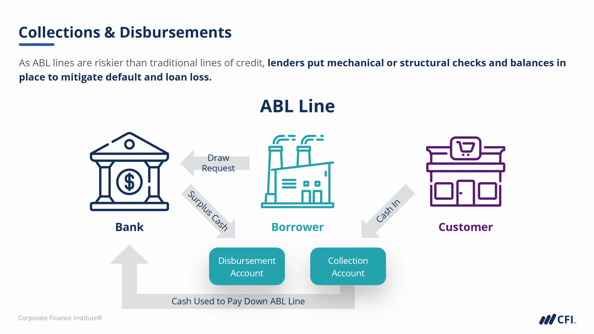

In today's rapidly evolving financial landscape, understanding diverse lending models and trading strategies is crucial for businesses. The finance industry continuously innovates, making it imperative for organizations to stay informed about new financial mechanisms that can drive strategic decision-making. This article explores the interplay between asset-based lending, various lending models, and algorithmic trading, critical elements that collectively influence the business financing environment. 

Asset-based lending offers a robust solution for companies looking to utilize their existing assets as collateral for loans, providing them with necessary capital while managing lender risks. Such models grant businesses the flexibility to meet specific financial needs by capitalizing on their tangible and intangible resources. Similarly, the diverse lending models in finance, including cash flow lending, offer tailored financial solutions that adapt to companies' unique economic conditions and objectives. By aligning these lending models with strategic goals, businesses can enhance liquidity and stability.



Additionally, the role of algorithmic trading has emerged as a pivotal component in financial strategy, particularly within volatile markets. By automating trading decisions using quantitative data, businesses can optimize their operational efficiency, gain market insights, and make informed financing decisions. The integration of algorithmic trading with traditional financing models presents an opportunity to align closely with market dynamics and improve financial performance.

This article will focus on how these elements interconnect and their significance in business financing. By examining these components, businesses can harness them for optimized financial planning and strategic success. Through such integration, companies are better positioned to achieve sustainable growth, maintain competitive advantages, and navigate complex financial environments. Understanding and successfully implementing these financial strategies are crucial for any business seeking to thrive in a rapidly changing market.

## Table of Contents

## Understanding Asset-Based Lending

Asset-based lending is a pivotal financial model where loans are secured by collateral, typically inventory, accounts receivable, or equipment. This lending approach is distinctively beneficial to companies that possess substantial tangible assets. These businesses can leverage their assets to obtain capital while concurrently offering reduced risk to lenders. This inherent reduction in risk often translates to more favorable loan terms, including lower interest rates and more flexible repayment arrangements.

A primary advantage of asset-based lending is the access to capital it affords to asset-rich businesses. Such access can be especially beneficial for companies that may not have the traditional credit profile required for unsecured loans. Instead of relying on credit scores or profitability metrics, asset-based loans focus on the value of the collateral provided, thus allowing firms with significant physical assets to secure funding more easily.

In practice, the collateral utilized in asset-based lending is diverse. Common assets pledged include inventory, accounts receivable, and machinery. These assets must be accurately valued and managed effectively to ensure success in asset-based lending arrangements. Lenders typically perform rigorous appraisals and audits to ascertain the value of these assets and to assess the level of risk involved in the transaction.

The effectiveness of asset-based lending hinges on robust asset management and accurate valuation. Companies utilizing this financing method must maintain precise records of their asset values and manage those assets effectively to mitigate potential risks. This management might involve implementing inventory management systems or ensuring rigorous accounts receivable controls to keep collateral as liquid and valuable as possible.

Overall, asset-based lending provides a flexible and advantageous financing option for companies with substantial physical assets. By allowing these businesses to secure capital at more favorable rates and terms, this lending model supports growth and stability while aligning lenders' interests with borrowers' asset management practices.

## Lending Models in Finance

Various lending models such as cash flow lending and asset-based lending are integral components of modern finance, addressing different business needs and circumstances. These models offer diverse pathways for securing capital, each with unique characteristics suited to distinct financial environments.

Cash flow lending is centered on an entity's projected revenue stream. It provides unsecured credit, meaning that it does not require traditional collateral like property or equipment. Instead, the lender evaluates the company's ability to generate cash flow and meet its debt obligations. This lending model is particularly advantageous for businesses with strong future revenue prospects but lacking substantial physical assets to be used as collateral. The primary determinants for cash flow lending are the prospective borrower's income statements and projected cash flows. This model allows companies to leverage their intrinsic cash-generating capabilities to secure necessary financing. However, it also implies a potentially higher risk for lenders, often resulting in more stringent terms and higher interest rates compared to secured financing options.

In contrast, asset-based lending relies on tangible assets as collateral, providing a secured financing alternative. This model involves loans that are secured by inventory, accounts receivable, or other physical assets. Businesses rich in assets but potentially facing constraints in cash flow can benefit immensely from this model. The value of the collateral often dictates the loan amount, providing lenders security that mitigates risk. Consequently, asset-based lending typically offers more favorable terms, such as lower interest rates and flexible repayment schedules, due to reduced risk for the lender. Proper asset management and accurate valuation are crucial to the success of this lending model, ensuring that both borrower and lender can appropriately assess risk and potential.

These lending paradigms allow businesses to tailor their financial structures to specific operational requirements and economic conditions. By strategically integrating cash flow and asset-based lending, companies can enhance their [liquidity](/wiki/liquidity-risk-premium) management and stabilize their financial footing. The alliance of these models provides businesses with the ability to navigate diverse funding challenges, optimizing their portfolio of debt instruments to suit particular strategic goals.

Employing a well-balanced approach of these lending strategies can substantially improve a business's financial resilience. The judicious use of both cash flow and asset-based lending reinforces a firm's risk management capabilities, allowing for greater financial flexibility. This adaptability can prove crucial in fluctuating market conditions, ensuring businesses can sustain operations and invest in growth opportunities. By leveraging these models, companies can create robust financial frameworks that support immediate needs while positioning themselves for long-term stability and success.

## The Role of Algorithmic Trading

Algorithmic trading leverages sophisticated computer programs to execute trading strategies that rely on quantitative data, substantially reducing the need for human interaction. This approach to trading can increase market liquidity by allowing the rapid execution of trades, thereby facilitating smoother market operations even during periods of high [volatility](/wiki/volatility-trading-strategies). By automating trading processes, businesses can achieve more favorable transaction outcomes, as [algorithmic trading](/wiki/algorithmic-trading) mechanisms can react to market changes with greater speed and efficiency than human traders.

A significant advantage of algorithmic trading is its ability to provide insights into market trends through the analysis of large data sets. This capacity enables businesses to make informed financing decisions and align their strategies more closely with market movements. For instance, algorithms can identify patterns in price movement or trading [volume](/wiki/volume-trading-strategy) that might indicate future market behavior, allowing companies to position themselves advantageously.

Implementing algorithmic trading requires a combination of technical programming skills and a robust understanding of market dynamics. Successful deployment hinges on the ability to craft algorithms that can process and interpret complex financial data. For example, traders may use Python to develop algorithms that analyze historical price data to predict future price trends. An example of a simple moving average crossover strategy in Python might look like this:

```python
import pandas as pd
import numpy as np

# Assuming df is a DataFrame with a 'Close' column for closing prices
df['SMA_10'] = df['Close'].rolling(window=10).mean()
df['SMA_50'] = df['Close'].rolling(window=50).mean()

df['Signal'] = 0
df['Signal'][10:] = np.where(df['SMA_10'][10:] > df['SMA_50'][10:], 1, 0)
df['Position'] = df['Signal'].diff()
```

This code snippet calculates the 10-day and 50-day simple moving averages of closing prices and generates buy (or sell) signals when the shorter moving average crosses the longer one.

The effectiveness of algorithmic trading lies in its adaptability to evolving market conditions, enhancing a business's financial agility and complementing various financing models. By integrating algorithmic trading into financial operations, businesses can leverage automated insights for more strategic financial planning, ensuring capital is allocated efficiently and risks are managed proactively. This adaptability is crucial for maintaining competitive advantage in an ever-changing financial landscape, underscoring the importance of technologically enhanced trading mechanisms within modern financial strategies.

## Interconnection of These Financial Strategies

The interconnection of cash flow lending, asset-based lending, and algorithmic trading creates a robust financial framework for businesses, allowing them to tap into the synergies inherent in each approach. By leveraging algorithmic trading, businesses can extract insights into market trends and economic conditions, which can then inform lending decisions. For instance, mathematical models employed in algorithmic trading can forecast potential market volatilities and economic shifts, empowering companies to adjust their financial strategies proactively. This predictive capability can be crucial in deciding when to seek additional capital or adjust existing financial agreements.

Cash flow lending and asset-based lending contribute significantly to a company's financial flexibility and risk management capabilities. While cash flow lending relies on the future income prospects of the company, asset-based lending offers secured financing against tangible assets. Combining these models provides access to capital under various economic conditions, mitigating risks associated with over-reliance on a single source of finance. For example, during economic downturns, asset-based lending can provide stability when cash flow is unpredictable, whereas in periods of growth, cash flow lending can offer the agility needed to seize new opportunities.

A strategic balance between using internal resources, like retained earnings, and external financing options, augments capital efficiency. This balance ensures that businesses are neither over-leveraged nor underfunded, optimizing their capital structure. The integrated use of these resources aligns with the objective of minimizing costs while maximizing growth potential.

Harmonizing these financial strategies ensures efficient capital allocation and promotes strategic growth. By blending the predictive power of algorithmic trading with the varied financing approaches offered by cash flow and asset-based lending, businesses can enhance their competitive positioning. Firms can allocate resources more precisely, prioritize high-return projects, and minimize financial risks, ultimately driving sustained growth. This holistic approach to financial strategy fosters a dynamic environment where businesses can thrive despite changing market conditions.

## Conclusion

The integration of asset-based lending, diverse lending models, and algorithmic trading offers a comprehensive framework for business financing that enhances adaptability and resilience. By strategically utilizing these financial tools, businesses can effectively manage liquidity, optimize capital allocation, and respond to market fluctuations. This multi-faceted approach not only ensures sustained competitive advantages but also contributes to long-term financial stability.

A nuanced understanding of these financial strategies allows businesses to exploit their synergistic potential. Asset-based lending provides secured financing based on tangible assets, reducing lender risk and potentially lowering interest rates. Meanwhile, diverse lending models, such as cash flow lending, offer unsecured credit options tailored to a company's revenue streams, expanding a business’s financial toolkit.

Algorithmic trading, with its capability to execute trading strategies based on quantitative data, delivers critical insights into market trends. By forecasting economic conditions, these insights can inform lending decisions, optimizing a company's financial strategies. Thus, harmonizing algorithmic trading with traditional lending models enables businesses to enhance financial flexibility and improve risk management capabilities.

Incorporating and coordinating these strategies leverages both internal and external resources, optimizing capital efficiency. The careful integration of asset-based lending, cash flow lending, and algorithmic trading fosters a balanced approach that supports efficient capital allocation and strategic growth. By doing so, businesses can enhance their competitive positioning in an increasingly complex market environment.

Ultimately, the adept integration of asset-based lending, varied lending models, and algorithmic trading equips businesses to maintain steady growth and achieve long-term success. These strategies enable firms to not only survive but thrive in diverse and challenging economic landscapes. Understanding and mastering these components are vital to sustaining a competitive edge and ensuring financial prosperity.

## References & Further Reading

[1]: ["Asset-Based Lending: A Practical Guide to Secured Financing"](https://www.pli.edu/catalog/publications/treatise/asset-based-lending-a-practical-guide-to-secured-financing) by Rick L. Morris

[2]: Moyer, R. Charles. (2022). ["Finance Theory and Asset Pricing"](https://www.researchgate.net/profile/R-Moyer). Springer.

[3]: Narang, R. (2013). ["Inside the Black Box: The Simple Truth About Quantitative Trading"](https://onlinelibrary.wiley.com/doi/book/10.1002/9781118267738). Wiley Finance.

[4]: ["Financial Markets and Corporate Strategy"](https://www.amazon.com/Financial-Markets-Corporate-Strategy-Grinblatt/dp/0072294337) by Mark Grinblatt and Sheridan Titman

[5]: Hull, John C. (2018). ["Risk Management and Financial Institutions"](https://books.google.com/books/about/Risk_Management_and_Financial_Institutio.html?id=1J1QDwAAQBAJ) John Wiley & Sons.