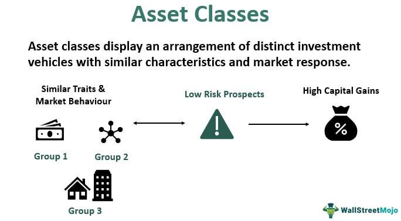

## Table of Contents

## What is an asset class?

An asset class is a group of investments that have similar characteristics and behave in a similar way in the market. Think of it like sorting different types of things into categories. For example, stocks, bonds, and real estate are all different asset classes. Each one has its own way of making money and its own level of risk.

People use asset classes to help them make decisions about where to put their money. By understanding the different types of asset classes, investors can spread out their investments to reduce risk. This is called diversification. For example, if you only invest in stocks and the stock market goes down, you could lose a lot of money. But if you also have some money in bonds or real estate, those might not go down at the same time, so your overall loss might be less.

## Why is diversification important in investing?

Diversification is important in investing because it helps to spread out the risk. Imagine you have all your money in one type of investment, like stocks. If something bad happens to the stock market, you could lose a lot of money. But if you spread your money across different types of investments, like stocks, bonds, and real estate, you're less likely to lose everything at once. It's like not putting all your eggs in one basket.

By diversifying, you can also smooth out the ups and downs of your investments. Different asset classes don't always go up or down at the same time. So, when one type of investment is doing badly, another might be doing well. This can help keep your overall investment more stable over time. It's a way to protect yourself and make your money work better for you in the long run.

## What are the main types of asset classes?

The main types of asset classes are stocks, bonds, and real estate. Stocks are pieces of ownership in a company. When you buy a stock, you're buying a small part of that company. If the company does well, the value of your stock can go up, and you might get money from the company's profits, called dividends. Bonds are like loans you give to a company or government. They promise to pay you back with interest over time. Real estate is property, like houses or buildings, that you can rent out or sell for a profit.

Another important asset class is cash and cash equivalents. This includes money in your bank account, savings accounts, and short-term investments like money market funds. These are very safe but usually don't grow as much as other investments. Commodities are another type, which includes things like gold, oil, and agricultural products. Their prices can go up and down based on supply and demand. Finally, there are alternative investments, like hedge funds, private equity, and collectibles like art or wine. These can be riskier but might offer higher returns.

## How does diversification across asset classes reduce risk?

Diversification across asset classes reduces risk by spreading your investments over different types of assets. Imagine you have all your money in stocks. If the stock market crashes, you could lose a lot. But if you also have some money in bonds, real estate, and cash, those might not go down at the same time. So, even if one type of investment loses value, the others might hold steady or even go up, balancing out your overall losses.

This strategy works because different asset classes often react differently to the same economic events. For example, when the stock market goes down, people might move their money into bonds, making bond prices go up. By having a mix of stocks, bonds, real estate, and other investments, you're less likely to see all your money go down at once. This helps protect your money and makes your investment portfolio more stable over time.

## Can you explain the concept of correlation in the context of asset class diversification?

Correlation is about how different investments move together. Imagine you have two friends, and when one is happy, the other is usually happy too. That's like a high correlation. But if one friend is happy when the other is sad, that's a low correlation. In investing, if two asset classes have a high correlation, they tend to go up or down at the same time. If they have a low correlation, they might move in opposite directions or not move together at all.

When you diversify your investments across asset classes with low correlation, you spread out your risk. For example, stocks and bonds often have a low correlation. When the stock market goes down, people might buy more bonds, making bond prices go up. By having some money in stocks and some in bonds, you can balance out the ups and downs. This way, even if one type of investment loses value, the others might not, helping to keep your overall investment more stable.

## What are the benefits of including alternative investments in a diversified portfolio?

Including alternative investments in a diversified portfolio can help you spread out your risk even more. Alternative investments, like hedge funds, private equity, and collectibles, often don't move in the same way as stocks and bonds. This means that when the stock market goes down, your alternative investments might not go down at the same time. By having some of your money in these different types of investments, you can protect your money better and make your overall investment more stable.

Another benefit of alternative investments is the chance for higher returns. While they can be riskier, they also have the potential to grow your money more than traditional investments like stocks and bonds. For example, investing in a successful startup through private equity could lead to big profits if the company does well. So, by adding alternative investments to your portfolio, you're not just spreading out your risk, but also giving yourself a shot at bigger rewards.

## How should a beginner start diversifying their investment portfolio?

A beginner should start by understanding the basics of different asset classes like stocks, bonds, and real estate. It's important to learn how each one works and the level of risk they come with. Start small by investing in a mix of these asset classes. For example, you could put some money into a stock market index fund, which is a safe way to invest in stocks, and some into a bond fund. This way, you're spreading your money across different types of investments right from the start.

As you get more comfortable, you can think about adding alternative investments like real estate investment trusts (REITs) or even commodities like gold. These can help you spread your risk even more because they often don't move in the same way as stocks and bonds. Remember, the key is to keep learning and slowly build up your portfolio over time. Don't rush into anything you don't understand, and consider talking to a financial advisor to help you make the best choices for your money.

## What are the potential drawbacks of over-diversification?

Over-diversification can make your investment portfolio too complicated. When you spread your money across too many different investments, it can be hard to keep track of everything. You might end up spending a lot of time and energy just trying to manage your investments instead of focusing on the big picture. Plus, if you have too many small investments, the fees and costs can add up, eating into your returns.

Another problem with over-diversification is that it can water down your returns. When you have money in too many places, the good performance of one investment might get canceled out by the poor performance of another. This can make it hard to beat the market or reach your financial goals. It's like trying to catch too many fish with a big net – you might catch a lot, but you won't get the big ones that could really make a difference.

## How can rebalancing help maintain optimal asset class diversification?

Rebalancing helps keep your investments in line with your plan. Over time, some of your investments might grow faster than others. This can make your portfolio unbalanced. For example, if your stocks do really well, you might end up with too much money in stocks and not enough in bonds. Rebalancing means selling some of the stocks that grew a lot and buying more bonds to get back to your original plan. This way, you keep your risk level where you want it.

Rebalancing also helps you stick to your diversification strategy. It makes sure you're not putting too many eggs in one basket, even if one type of investment is doing great. By regularly checking and adjusting your portfolio, you can keep it diversified and balanced. This can help you feel more confident that you're on track to meet your financial goals, no matter what the market does.

## What role does geographic diversification play in asset class diversification?

Geographic diversification means spreading your investments across different countries and regions. This can help reduce risk because different parts of the world can have different economic conditions. For example, if the economy in one country is doing badly, another country's economy might be doing well. By investing in different places, you're less likely to lose all your money if something goes wrong in one area.

Adding geographic diversification to your asset class diversification can make your portfolio even stronger. If you only invest in your own country, you might miss out on opportunities in other places. Plus, it can protect you from problems like a weak currency or political issues in one country. By spreading your money around the world, you can balance out the ups and downs of different markets and make your overall investment more stable.

## How do different economic cycles affect the performance of various asset classes?

Different economic cycles can really change how well different asset classes do. When the economy is growing, like during an expansion, stocks usually do well. Companies make more money, and people feel good about spending, so stock prices go up. But during a recession, when the economy is shrinking, stocks can lose a lot of value. People are worried about their jobs and spending less, so companies make less money, and stock prices go down. Bonds can be a bit different. They often do better during a recession because people move their money into safer investments, which can push bond prices up.

Real estate can also be affected by economic cycles. During a boom, property values go up because more people want to buy homes and businesses. But if the economy slows down, real estate can suffer. People might not be able to afford to buy, and businesses might not need as much space, so property values can drop. Commodities like gold and oil can be a bit trickier. Their prices can go up or down based on what's happening in the world, but they can sometimes do well when other investments are struggling, like during times of high inflation or uncertainty.

## What advanced strategies can experts use to optimize asset class diversification?

Experts can use advanced strategies like tactical asset allocation to optimize their diversification. This means they change their investments based on what they think will happen in the market. For example, if they think stocks will do well, they might put more money into stocks for a while. Then, if they think bonds will do better, they'll shift money into bonds. This can help them take advantage of short-term opportunities and manage risk better. It's like playing chess with your money, always thinking a few moves ahead.

Another strategy is using alternative investments in a smart way. Experts might use hedge funds or private equity to add something different to their portfolio. These investments can be riskier but can also offer big rewards. By carefully choosing the right alternative investments, experts can spread their risk even more and possibly get higher returns. It's like adding special tools to your toolbox that can help you build a stronger financial future.

## References & Further Reading

[1]: Markowitz, H. (1952). ["Portfolio Selection."](https://onlinelibrary.wiley.com/doi/abs/10.1111/j.1540-6261.1952.tb01525.x) The Journal of Finance, 7(1), 77-91.

[2]: Lopez de Prado, M. (2018). ["Advances in Financial Machine Learning."](https://www.amazon.com/Advances-Financial-Machine-Learning-Marcos/dp/1119482089) Wiley.

[3]: Chan, E. P. (2009). ["Quantitative Trading: How to Build Your Own Algorithmic Trading Business."](https://github.com/ftvision/quant_trading_echan_book) Wiley.

[4]: Jansen, S. (2018). ["Machine Learning for Algorithmic Trading: Predictive models to extract signals from market and alternative data for systematic trading strategies with Python."](https://github.com/stefan-jansen/machine-learning-for-trading) Packt Publishing.

[5]: Fabozzi, F. J., Focardi, S. M., & Kolm, P. N. (2010). ["Quantitative Equity Investing: Techniques and Strategies."](https://www.semanticscholar.org/paper/Quantitative-Equity-Investing%3A-Techniques-and-Fabozzi-Focardi/1c49a2a53919f7e65cb96f16691b8ff726fd3cd7) Wiley.