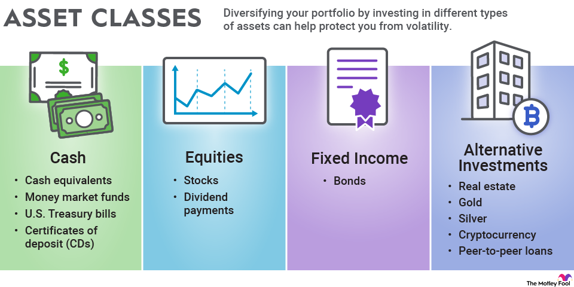

## Table of Contents

## What is an asset class?

An asset class is a group of investments that have similar characteristics and behave in a similar way in the market. Think of it like sorting your toys into different boxes based on what they are. For example, stocks, bonds, and real estate are all different asset classes. Each one has its own way of making money and its own level of risk.

Understanding asset classes is important because it helps people make smart choices about where to put their money. If you know how different asset classes work, you can mix them in a way that might lower your risk and increase your chances of making money. For example, stocks might grow a lot but can be risky, while bonds might not grow as much but are usually safer. By spreading your money across different asset classes, you can balance out the ups and downs of the market.

## What are the main types of asset classes?

The main types of asset classes are stocks, bonds, and cash equivalents. Stocks are pieces of ownership in a company. When you buy a stock, you're buying a small part of that company. If the company does well, the value of your stock might go up, and you might get dividends, which are like little payments from the company. Bonds are like loans you give to a company or government. They promise to pay you back with interest over time. Cash equivalents are things like savings accounts or money market funds, which are very safe and easy to turn into cash.

Another important asset class is real estate, which means property like houses or buildings. Real estate can make money through rent or by increasing in value over time. Commodities are another type, and they include things like gold, oil, or agricultural products. These can be affected by things like weather or global demand. Finally, there are alternative investments, which can include things like art, wine, or even cryptocurrencies. These can be riskier but might offer big rewards if they do well.

## Why is asset class picking important for investment?

Picking the right asset class is super important for your investments because it helps you match your money with what you want to achieve. If you want to grow your money a lot over a long time, you might pick stocks because they can go up a lot in value. But if you want something safer and you need the money soon, you might choose bonds or cash equivalents because they are less risky and easier to get your money back quickly.

Also, by choosing different asset classes, you can spread out your risk. This is called diversification. If you put all your money in one type of investment and it does badly, you could lose a lot. But if you spread your money across stocks, bonds, real estate, and maybe even some commodities, if one goes down, the others might still do okay. This way, you can protect your money and still have a chance to make it grow.

## How do different asset classes perform over time?

Over time, different asset classes can perform very differently. Stocks usually have the chance to grow a lot, but they can also go down a lot. If you look at history, stocks have often given the best returns over many years, but they can be bumpy along the way. For example, if you had invested in the stock market for 20 years, you might have seen your money grow a lot, but there could have been some scary times when the market dropped.

Bonds are usually safer than stocks. They don't grow as much, but they also don't fall as much. Bonds give you regular interest payments, which can be nice if you need steady money. Over time, bonds might not make your money grow as fast as stocks, but they help keep your money safe. Cash equivalents, like savings accounts, are the safest but they usually don't grow much at all. They're good for money you might need soon.

Real estate and commodities can be a bit trickier. Real estate can grow in value and give you rent money, but it can also be hard to sell quickly and needs a lot of work. Commodities like gold can go up and down a lot based on what's happening in the world. Alternative investments, like art or cryptocurrencies, can be very risky but might give you big rewards if you pick the right ones. Each asset class has its own way of behaving over time, so it's important to think about what you want and how much risk you can handle.

## What factors should beginners consider when picking an asset class?

When beginners are [picking](/wiki/asset-class-picking) an asset class, they should first think about their goals. Are they saving for a big purchase soon, like a car or a house? If so, they might want to pick safer options like bonds or cash equivalents because they need the money soon and can't afford to lose it. If they are saving for something far away, like retirement, they might be okay with riskier options like stocks because they have time to wait for the ups and downs to even out.

Another thing to consider is how much risk they can handle. Some people can stay calm when their investments go up and down a lot, while others get really worried. If you're the kind of person who gets nervous easily, you might want to stick with safer investments. Also, beginners should think about spreading their money across different asset classes. This is called diversification, and it can help protect your money if one type of investment does badly. By mixing stocks, bonds, and maybe even some real estate or commodities, you can balance out the risks and still have a chance to grow your money over time.

## How does risk tolerance affect asset class selection?

Risk tolerance is how much risk you can handle when you invest your money. If you have a high risk tolerance, it means you're okay with your investments going up and down a lot. You might pick more stocks because they can grow a lot but can also lose value quickly. On the other hand, if you have a low risk tolerance, you'll want to keep your money safer. You might choose more bonds or cash equivalents because they don't change as much and you won't lose sleep over your investments.

Understanding your risk tolerance helps you pick the right asset classes for you. If you're young and saving for retirement, you might be okay with more risk because you have time to wait for the market to go up again. But if you're close to needing your money, like for buying a house, you'll want to be more careful and pick safer investments. Knowing how much risk you can handle is key to feeling good about your investment choices.

## What are the tax implications of different asset classes?

Different asset classes have different tax rules that can affect how much money you keep after taxes. When you invest in stocks, you might have to pay taxes on any profits you make when you sell them. This is called capital gains tax. If you hold the stocks for more than a year, you might pay a lower tax rate than if you sell them in less than a year. Also, if you get dividends from stocks, those are usually taxed too, but at a special rate that's often lower than your regular income tax.

Bonds and cash equivalents have their own tax rules. The interest you earn from bonds is usually taxed as regular income, which can be higher than the tax on stock dividends or long-term capital gains. Some bonds, like municipal bonds, might be tax-free at the federal level, and sometimes at the state level too, which can be a big advantage. Cash equivalents like savings accounts also have interest that's taxed as regular income. 

Real estate and commodities have different tax treatments as well. With real estate, you might be able to deduct things like mortgage interest and property taxes, which can lower your taxable income. If you sell a property, you'll pay capital gains tax on any profit, but you might be able to delay that tax by using a special rule called a 1031 exchange. Commodities like gold can be taxed as collectibles, which have a higher capital gains tax rate than stocks. It's important to understand these tax rules so you can pick the best asset classes for your situation and keep more of your money.

## How do economic cycles influence asset class performance?

Economic cycles, which are the ups and downs of the economy over time, can really change how different asset classes do. When the economy is doing well and growing, stocks usually do great because companies are making more money and people feel good about spending. This is called an expansion. During this time, people might also feel more confident about buying real estate, so that can do well too. But when the economy starts to slow down, which is called a contraction or recession, stocks can drop a lot because people are worried and companies might not make as much money. Bonds can be a safer bet during these times because they don't go up and down as much as stocks.

Different asset classes can also react differently at different parts of the economic cycle. For example, at the start of a recovery, when the economy is just starting to get better, stocks might start to go up but not as fast as later on. Commodities like oil might do well when the economy is growing fast because more people are using them. But when the economy is at the top of its cycle and might be about to slow down, people might start moving their money into safer things like bonds or cash equivalents. Understanding where we are in the economic cycle can help you pick the right asset classes to invest in at the right time.

## What role does diversification play in asset class picking?

Diversification is like not putting all your eggs in one basket. When you pick different asset classes to invest in, you spread out your money so that if one type of investment does badly, the others might still do okay. This can help protect your money from big losses. For example, if you only invest in stocks and the stock market goes down a lot, you could lose a lot of money. But if you also have some money in bonds or real estate, those might not go down as much, and they can help balance out the losses from the stocks.

By spreading your investments across different asset classes, you can also have a better chance of making money over time. Different asset classes do well at different times. When the economy is growing, stocks might do really well, but when things slow down, bonds might be safer. By having a mix of stocks, bonds, and maybe even some real estate or commodities, you can take advantage of the good times in different parts of the market. Diversification helps you manage risk and can lead to a smoother ride for your investments.

## How can advanced investors use asset class correlations to optimize their portfolio?

Advanced investors can use asset class correlations to make their portfolios better by understanding how different investments move together. Correlation is a number that shows how much two things move in the same way. If two asset classes have a high correlation, they tend to go up and down together. If they have a low or negative correlation, they might move in opposite ways. By picking asset classes that don't move together much, investors can lower the risk in their portfolio. For example, if stocks and bonds have a low correlation, when stocks go down, bonds might stay the same or even go up, helping to balance out the losses.

Using correlations, advanced investors can create a mix of investments that can help them reach their goals while keeping risk under control. They might look at historical data to see how different asset classes have moved together in the past. Then, they can adjust their portfolio to include more of the asset classes that have low correlations with each other. This way, if one part of their portfolio does badly, another part might do well, smoothing out the overall performance. By carefully choosing asset classes based on their correlations, investors can build a more stable and potentially more profitable portfolio.

## What are some advanced strategies for asset class rotation?

Asset class rotation is when investors move their money from one type of investment to another based on what's happening in the economy. It's like switching from playing with one type of toy to another because you think the new one will be more fun. For example, if an investor thinks the economy is going to grow a lot, they might move more money into stocks because stocks usually do well when the economy is strong. But if they think the economy might slow down, they might move money into bonds or cash equivalents because those are safer and don't go up and down as much as stocks.

Advanced investors use different tools to help them decide when to rotate their asset classes. They might look at economic indicators like unemployment rates, inflation, and interest rates to guess where the economy is headed. They also use something called technical analysis, which is like looking at charts to see patterns in how investments have moved in the past. By combining these tools with their understanding of how different asset classes perform in different parts of the economic cycle, advanced investors can try to move their money to the right places at the right times. This can help them make more money and keep their investments safer.

## How can one use quantitative models to predict asset class trends?

Quantitative models are like special math tools that help investors guess what might happen to different types of investments. These models use numbers and data to look for patterns and make predictions. For example, they might use past information about how stocks, bonds, and other investments have moved to guess what might happen next. By looking at things like how the economy is doing, interest rates, and even what people are saying on social media, these models can help investors decide where to put their money. The idea is to use all this information to make smarter choices and maybe make more money.

But using quantitative models isn't perfect. Sometimes the predictions can be wrong because the future doesn't always follow the same patterns as the past. Also, these models need a lot of good data to work well, and if the data is bad or missing, the predictions can be off. Still, many advanced investors use these models because they can give them an edge. By combining the predictions from quantitative models with their own knowledge and other tools, investors can try to stay one step ahead and make better decisions about which asset classes to invest in.

## What is the Role of Diversification in Asset Class Picking?

Diversification across asset classes is a fundamental principle in investment strategy, aimed at reducing risk and enhancing returns. The cornerstone of diversification is the correlation among different asset classes. Correlation measures how asset prices move in relation to each other. When assets are perfectly positively correlated ($\rho = 1$), they move in the same direction, while perfectly negatively correlated assets ($\rho = -1$) move in opposite directions. Ideally, investors seek to construct portfolios with low or negative correlation between assets to minimize risk.

For example, equities and bonds typically exhibit low correlation. During economic downturns, equities may perform poorly while bonds maintain or even increase in value. Similarly, commodities often have low correlation with stocks and bonds because their performance depends on different economic factors such as supply and demand dynamics rather than corporate earnings or interest rates.

Building a portfolio with non-correlated asset classes is crucial. This non-correlation reduces the portfolio's overall [volatility](/wiki/volatility-trading-strategies), leading to a smoother long-term return profile. If one asset class experiences a downturn, the performance of others may offset this, stabilizing the portfolio's value. This concept is mathematically supported by Modern Portfolio Theory, which shows that combining assets with less than perfect correlation can lead to a reduction in risk, according to the formula for portfolio variance:

$$
\sigma^2_p = \sum_{i} w_i^2 \sigma_i^2 + \sum_{i} \sum_{j \neq i} w_i w_j \sigma_i \sigma_j \rho_{ij}
$$

where $\sigma^2_p$ is the portfolio variance, $w_i$ and $w_j$ are the weights of asset $i$ and $j$, $\sigma_i$ and $\sigma_j$ are the standard deviations of the assets, and $\rho_{ij}$ is the correlation coefficient between assets $i$ and $j$.

The practice of including non-correlated asset classes enables investors to achieve a more efficient frontier, balancing expected returns for a given level of risk. This is particularly relevant in [algorithmic trading](/wiki/algorithmic-trading), where dynamically optimizing the asset mix based on evolving correlations can lead to better risk-adjusted returns. The goal is to enhance performance through strategic asset selection and weighting, leveraging differential correlations to hedge against market volatility while capturing growth potential in varying economic conditions.

## References & Further Reading

[1]: Asness, C. S., Moskowitz, T. J., & Pedersen, L. H. (2013). ["Value and Momentum Everywhere."](https://papers.ssrn.com/sol3/papers.cfm?abstract_id=1363476) Journal of Finance, 68(3), 929-985.

[2]: Ang, A. (2014). ["Asset Management: A Systematic Approach to Factor Investing"](https://www.amazon.com/Asset-Management-Systematic-Factor-Investing/dp/0199959323). Oxford University Press.

[3]: Gibson, R. C. (2008). ["Asset Allocation: Balancing Financial Risk, Fifth Edition."](https://www.amazon.com/Asset-Allocation-Balancing-Financial-Fifth/dp/0071549570) McGraw-Hill Education.

[4]: Reilly, F. K., & Brown, K. C. (2011). ["Investment Analysis and Portfolio Management."](https://www.amazon.com/Investment-Analysis-Portfolio-Management-Frank/dp/0538482389) Cengage Learning.

[5]: Ilmanen, A. (2011). ["Expected Returns: An Investor's Guide to Harvesting Market Rewards."](https://www.amazon.com/Expected-Returns-Investors-Harvesting-Financial/dp/1119990726) Wiley Finance.

[6]: Grinold, R. C., & Kahn, R. N. (2000). ["Active Portfolio Management: A Quantitative Approach for Producing Superior Returns and Controlling Risk, Second Edition."](https://www.amazon.com/Active-Portfolio-Management-Producing-Controlling/dp/0070248826) McGraw-Hill.

[7]: Chincarini, L. B., & Kim, D. (2006). ["Quantitative Equity Portfolio Management: An Active Approach to Portfolio Construction and Management."](https://www.amazon.com/Quantitative-Equity-Portfolio-Management-Construction/dp/0071459391) McGraw-Hill Education.