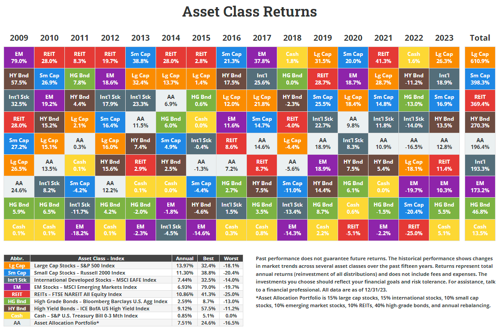

In algorithmic trading, the selection of asset classes is a critical factor that directly influences the success of trading strategies. Asset class picking involves the identification and allocation of various asset types — such as equities, bonds, and commodities — within a portfolio. This process lies at the heart of effective portfolio management and risk management.

Strategic and tactical asset allocation are complementary approaches that play significant roles in optimizing portfolio performance. Strategic asset allocation involves setting target allocations for different asset classes based on long-term investment goals and risk tolerance. This approach often relies on a disciplined, static asset distribution that is periodically rebalanced to maintain desired levels of risk and return. In contrast, tactical asset allocation allows for more agile adjustments in asset class distribution based on short-term market opportunities and economic conditions, aiming to capitalize on market inefficiencies and anomalies.

The case for asset class diversification is rooted in the principle of reducing unsystematic risk. By combining a variety of asset classes within a portfolio, investors can mitigate the impact of adverse movements in any single asset class on overall portfolio returns. Diversification leverages the varying correlation structures among asset classes, which often react differently to market events. For example, when equities underperform due to market volatility, bonds may provide stable returns, thus cushioning the overall portfolio. 

Incorporating multiple asset classes into algorithmic trading models enhances the robustness of these strategies by spreading risk and taking advantage of diverse return drivers. This multi-faceted approach not only helps to smooth out the volatility of portfolio returns but also increases the potential for enhanced returns by exploiting relative strengths across asset classes.

Overall, asset class picking in algorithmic trading is not just about choosing individual assets but about thoughtfully allocating resources across a spectrum of asset classes. This comprehensive strategy reduces risk and seeks to enhance returns, laying the foundation for sustained performance in complex financial markets.




## Understanding Asset Classes

Asset classes form the foundation of investment portfolios and are integral to algorithmic trading strategies. They are groupings of financial instruments that exhibit similar characteristics and are influenced by similar market factors. Understanding these classes is paramount for investors and traders aiming to optimize portfolio performance and manage risk effectively.

### Defining Asset Classes and Their Financial Characteristics

An asset class is a collection of investments that share comparable attributes and are subject to the same regulations. They tend to react similarly in market environments, although the degree of impact may vary. The primary objective of categorizing investments into asset classes is to facilitate diversification—spreading investments across assets that do not move in tandem, thereby reducing portfolio risk. The financial characteristics of asset classes typically include factors such as risk, return potential, income-generating capability, and liquidity.

### Common Types of Asset Classes

1. **Equities:** Equities, commonly known as stocks, represent ownership in a corporation. They are associated with higher risk and higher potential returns compared to fixed-income securities. Equities are prone to market volatility but historically offer growth over long investment horizons. They provide dividends, which are a distribution of a portion of a company’s earnings to shareholders, aside from potential price appreciation.

2. **Fixed Income:** These securities, including bonds, are known for providing steady income. Investors lend money to an issuer (government or corporation) in exchange for periodic interest payments and the return of the bond's face value when it matures. Fixed income is typically less volatile than equities and often used to balance risks in a portfolio with its relatively stable and predictable return.

3. **Commodities:** Commodities include physical goods such as gold, oil, and agricultural products. They often serve as a hedge against inflation due to their tangible nature. Commodities are influenced by supply and demand dynamics, geopolitical factors, and economic indicators, which can lead to volatility. They provide diversification benefits due to their low correlation with traditional stock and bond markets.

### Emergence of Alternative Asset Classes

The financial landscape has witnessed the rise of alternative asset classes that provide unique opportunities and risks:

1. **Real Estate:** This involves investing in physical properties or real estate investment trusts (REITs). Real estate offers income through rent and benefits from property value appreciation. It is often viewed as a hedge against inflation, and its performance may have low correlation with traditional assets, adding a diversification edge.

2. **Cryptocurrencies:** Digital currencies like Bitcoin and Ethereum have gained prominence in recent years. Characterized by high volatility, they operate independently of traditional banking systems, using blockchain technology. Cryptocurrencies offer potential for significant returns but also exhibit substantial risk due to regulatory uncertainty and market speculation.

The evolution of asset classes reflects the broader changes in financial markets and investor strategies. The inclusion of alternative assets such as real estate and cryptocurrencies signifies the dynamic nature of modern portfolios seeking diversification and risk management beyond traditional asset classes. Understanding these classes and their traits is essential for informed strategic decision-making in algorithmic trading and investment management.


## Strategic Asset Allocation and Asset Class Picking

Strategic asset allocation is a cornerstone of investment management, emphasizing the importance of asset class picking in crafting a portfolio that aligns with an investor's risk tolerance and financial goals. Asset class picking involves selecting different categories of assets, such as equities, bonds, or commodities, to achieve a desired risk-return profile. This selection process is guided by strategic asset allocation frameworks, which dictate the proportion of each asset class in a portfolio.

Market-implied projections play a critical role in optimizing returns relative to risk. These projections, derived from current market information and future expectations, inform investors about potential asset class performance. By interpreting these market signals, investors can position their portfolios to maximize returns while maintaining an acceptable risk level. For instance, if market projections indicate a favorable outlook for equities due to expected economic growth, a strategic asset allocation might increase the equity weighting in a portfolio to capitalize on these expectations.

Basic strategies such as asset class switching are employed to adapt to changing economic cycles. Asset class switching involves adjusting the allocation to different asset types as economic conditions evolve. During an economic expansion, equities may be favored due to their growth potential, whereas in a recession, fixed-income securities might be preferred for their relatively stable returns. This strategy helps in navigating the cyclical nature of markets, thereby enhancing portfolio performance.

In essence, asset class picking, guided by strategic asset allocation frameworks and informed by market-implied projections, enables investors to strategically position their portfolios. By employing asset class switching strategies, investors can proactively adjust to economic cycles, optimizing returns while managing risk effectively.


## Tactical Strategies in Asset Class Picking

Tactical strategies in asset class picking involve leveraging multiple asset classes to exploit market inefficiencies effectively. These strategies emphasize short-term adjustments and are nimble enough to adapt to market conditions and anomalies, offering portfolio managers tools to enhance returns even amidst volatility.

### Role of Momentum, Value, and Carry Strategies

**Momentum Strategy**: This approach capitalizes on the trend-following behavior seen in asset prices. By selecting asset classes that have shown recent outperformance, it seeks to benefit from continued movements in the same direction. The momentum effect can often be quantitatively modeled using past asset returns to predict future movements. This strategy can be applied across equities, commodities, or even currencies.

**Value Strategy**: Value investing involves picking asset classes that appear to be undervalued based on fundamental metrics such as price-to-earnings ratios or book values. These metrics help in identifying assets that are inexpensive relative to their intrinsic value. Tactical allocation using value strategy could mean shifting investments toward asset classes with good value propositions when market conditions support valuation convergence to historical norms.

**Carry Strategy**: Carry trades exploit the returns from holding higher-yielding assets funded by borrowing in lower-yielding ones. In fixed income or foreign exchange markets, this might involve differentiating between short-term interest rates. For example, a fund might borrow in a currency with a lower interest rate and invest in a currency with a higher rate, betting on the rate differential as a consistent return source.

### Market Anomalies and Flexibility in Strategy Adaptation

Market anomalies, such as unexpected macroeconomic shifts or unprecedented geopolitical events, necessitate a fluid approach to tactical strategies. Traditional models might falter under these conditions, requiring the deployment of adaptive strategies that can recalibrate capital allocation based on real-time data.

Flexibility is crucial because the correlations between asset classes can change depending on market conditions, often unexpectedly. Adaptation strategies include leveraging machine learning algorithms that can identify subtle patterns and signals across various asset classes more efficiently than human-driven analysis.

By continuously refining tactical strategies, investors can better position themselves to capture short-term gains while managing risk. Building a diverse toolkit that incorporates momentum, value, and carry strategies across multiple asset classes prepares asset managers to confront various market inefficiencies, irrespective of prevailing conditions. This dynamic approach not only aims to exploit inefficiencies but also enhances the robustness of the entire investment portfolio.


## Combining Momentum and Value Strategies

Combining momentum and value strategies in asset class picking has consistently demonstrated success in generating abnormal returns. Momentum strategy relies on the tendency of assets that have performed well in the past to continue performing well in the future, while value strategy focuses on identifying undervalued assets based on financial metrics. These two strategies, when employed together, have been documented in numerous studies to complement each other, leading to enhanced portfolio performance.

Empirical evidence supports the effectiveness of this combination. For instance, research by Asness et al. (2013) found that integrating momentum and value strategies can deliver significant abnormal returns across different asset classes. They observed that this combination outperforms each strategy when used independently, benefiting from the differing return cycles of momentum and value. As momentum often capitalizes on short-term trends and value targets long-term price corrections, the blend of these approaches allows for diversified timing of returns, offering robust portfolio performance across varying market conditions.

A crucial technique in combining these strategies is the application of Z-scores to standardize value signals across asset classes. Z-scores help transform raw value metrics, which may have different distributions depending on the asset class, into a uniform scale. This standardization is essential for meaningful comparisons and ranking of assets across diverse classes. For example, using Python, one could compute a Z-score for the price-to-earnings ratio (P/E) across different equities as follows:

```python
import numpy as np

def compute_z_scores(values):
    mean = np.mean(values)
    std_dev = np.std(values)
    z_scores = [(value - mean) / std_dev for value in values]
    return z_scores

# Sample P/E ratios for different asset classes
pe_ratios = [12, 15, 7, 20, 11, 8]

z_scores = compute_z_scores(pe_ratios)
print("Z-scores for P/E ratios:", z_scores)
```

By transforming value metrics into Z-scores, asset managers can construct a more balanced and analytically robust portfolio, leveraging the strengths of both momentum and value strategies while controlling for the risk associated with individual asset class characteristics. This approach supports systematic decision-making, aiding in the pursuit of superior risk-adjusted returns.


## Global Macroeconomic Risk and Asset Class Picking

Global macroeconomic factors have a profound impact on the performance of various asset classes, influencing returns and altering risk profiles. These factors include interest rates, inflation, currency fluctuations, GDP growth, and geopolitical events, among others. Understanding these influences is critical for effective asset class selection and optimal portfolio management.

The integration of asset markets across countries can significantly affect returns. In today's globalized economy, financial markets are increasingly interconnected. A change in interest rates in the United States, for example, can have ripple effects across global equity and bond markets. This interconnectedness means that shocks in one market can quickly spread to others, amplifying macroeconomic risks. For instance, when a major economy like China's exhibits signs of slowing growth, it can affect commodity demand, impacting commodity-exporting countries and companies worldwide.

To navigate these macroeconomic risks, investors can adopt various strategies in their asset class selection:

1. **Diversification Across Geographies**: By investing in asset classes from different regions, investors can reduce exposure to country-specific risks. For example, while one country's economy might be slowing down, another might be experiencing growth, balancing potential portfolio losses.

2. **Utilizing Economic Indicators**: Investors should pay attention to leading economic indicators that can signal changes in global macroeconomic conditions. These indicators can help investors anticipate market shifts and adjust asset class allocations accordingly. Tools like the Purchasing Managers' Index (PMI) or consumer confidence surveys can provide insights into future economic activity.

3. **Dynamic Asset Allocation**: Flexibility in asset allocation allows investors to shift investments based on changing macroeconomic conditions. For example, during periods of rising interest rates, fixed-income securities might underperform, prompting a shift towards equities or commodities, which could perform better in such environments.

4. **Hedging Strategies**: Incorporating hedging strategies using derivatives or other financial instruments can mitigate macroeconomic risks. For example, currency futures can protect against unfavorable currency movements, while interest rate swaps can hedge against rising interest rates.

5. **Factor-Based Investing**: Emphasizing factors such as momentum, value, and low volatility can provide a more systematic approach to navigating macroeconomic risks. By selecting assets that exhibit desirable factor characteristics, investors can potentially enhance risk-adjusted returns.

These approaches require a comprehensive understanding of global economic trends and an ability to anticipate their impacts. By being proactive and adaptable in asset class picking, investors can better manage the challenges posed by global macroeconomic risks, achieving more stable and potentially higher returns.


## The Role of Diversification in Asset Class Picking

Diversification across asset classes is a fundamental principle in investment strategy, aimed at reducing risk and enhancing returns. The cornerstone of diversification is the correlation among different asset classes. Correlation measures how asset prices move in relation to each other. When assets are perfectly positively correlated ($\rho = 1$), they move in the same direction, while perfectly negatively correlated assets ($\rho = -1$) move in opposite directions. Ideally, investors seek to construct portfolios with low or negative correlation between assets to minimize risk.

For example, equities and bonds typically exhibit low correlation. During economic downturns, equities may perform poorly while bonds maintain or even increase in value. Similarly, commodities often have low correlation with stocks and bonds because their performance depends on different economic factors such as supply and demand dynamics rather than corporate earnings or interest rates.

Building a portfolio with non-correlated asset classes is crucial. This non-correlation reduces the portfolio's overall volatility, leading to a smoother long-term return profile. If one asset class experiences a downturn, the performance of others may offset this, stabilizing the portfolio's value. This concept is mathematically supported by Modern Portfolio Theory, which shows that combining assets with less than perfect correlation can lead to a reduction in risk, according to the formula for portfolio variance:

$$
\sigma^2_p = \sum_{i} w_i^2 \sigma_i^2 + \sum_{i} \sum_{j \neq i} w_i w_j \sigma_i \sigma_j \rho_{ij}
$$

where $\sigma^2_p$ is the portfolio variance, $w_i$ and $w_j$ are the weights of asset $i$ and $j$, $\sigma_i$ and $\sigma_j$ are the standard deviations of the assets, and $\rho_{ij}$ is the correlation coefficient between assets $i$ and $j$.

The practice of including non-correlated asset classes enables investors to achieve a more efficient frontier, balancing expected returns for a given level of risk. This is particularly relevant in algorithmic trading, where dynamically optimizing the asset mix based on evolving correlations can lead to better risk-adjusted returns. The goal is to enhance performance through strategic asset selection and weighting, leveraging differential correlations to hedge against market volatility while capturing growth potential in varying economic conditions.


## Conclusion

Effective asset class picking in algorithmic trading brings numerous benefits that can significantly enhance portfolio performance. By carefully selecting and allocating assets, traders are better positioned to capitalize on market opportunities while mitigating potential risks. This strategic selection process involves a thorough analysis of different asset classes, considering their historical performance, current market conditions, and future prospects.

Diversification is key to optimizing portfolio performance. By spreading investments across a variety of asset classes—including equities, fixed income, and alternative assets like real estate and cryptocurrencies—traders can reduce unsystematic risk. A well-diversified portfolio minimizes the impact of volatility in any single asset class, providing more stable returns over the long term. The correlation characteristics between asset classes play a crucial role, as non-correlated assets help smooth out performance dips when markets become turbulent.

It is paramount for traders to persistently explore innovative strategies for asset class allocation. The financial landscape is ever-evolving, with new asset classes and investment instruments emerging regularly. Investors must remain vigilant and continue to test and adapt new models and strategies to maintain a competitive edge. Approaches that blend quantitative techniques with fundamental analysis, like factor-based investing, can unveil new paths in asset allocation practices.

In conclusion, the sophisticated process of asset class picking is not just an optional consideration in algorithmic trading—it is a fundamental component of any sound investment strategy. By embracing diversification and continuously seeking cutting-edge approaches in asset class allocation, traders can better navigate market complexities and aim for superior risk-adjusted returns.


