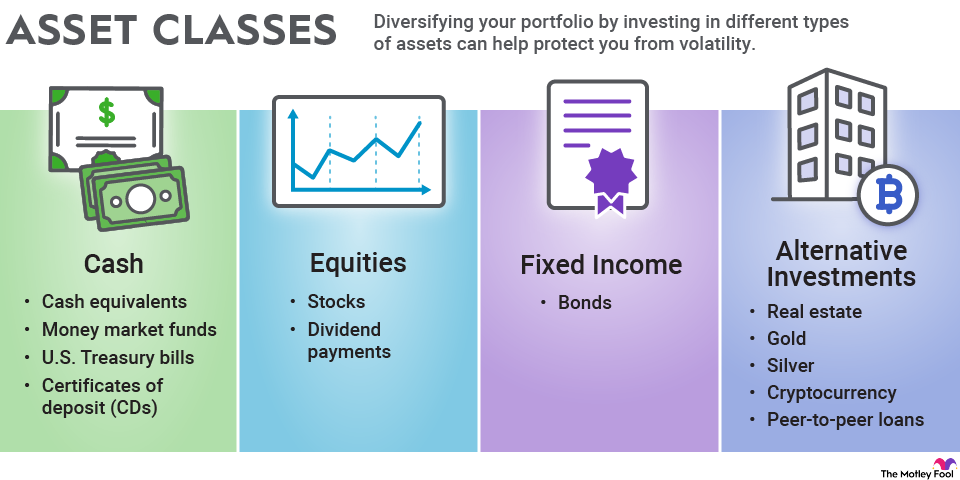

## Table of Contents

## What are asset classes and why are they important for investing?

Asset classes are groups of similar types of investments. The main ones are stocks, bonds, and cash. Stocks are pieces of ownership in a company, bonds are loans you give to a company or government, and cash is money you keep in a bank or at home. There are also other asset classes like real estate, commodities, and cryptocurrencies. Each asset class has its own way of making money and its own level of risk.

Asset classes are important for investing because they help you spread out your risk. This is called diversification. If you put all your money in one type of investment, like only stocks, you could lose a lot if the stock market goes down. But if you spread your money across different asset classes, like stocks, bonds, and cash, you can protect yourself better. Different asset classes often do well at different times, so having a mix can help smooth out your returns and make your investments more stable over time.

## What is the difference between stocks and bonds?

Stocks and bonds are two different ways to invest your money. When you buy a stock, you are buying a small piece of a company. This means you own a part of that company and can make money if the company does well. The value of your stock can go up or down depending on how the company is doing. Stocks can be risky because if the company does badly, you could lose money.

Bonds are different. When you buy a bond, you are lending money to a company or a government. They promise to pay you back the money you lent them, plus some extra money called interest, over a certain period of time. Bonds are usually less risky than stocks because you know you will get your money back as long as the company or government doesn't go bankrupt. But, the returns on bonds are usually lower than the potential returns on stocks.

In simple terms, stocks are about owning a piece of a company and hoping it grows, while bonds are about lending money and getting it back with interest. Both can be part of a good investment plan, but they work in different ways and have different levels of risk and reward.

## How do real estate investments work as an asset class?

Real estate investments mean buying property like houses, apartments, or land to make money. When you buy a property, you can make money in two ways. One way is by renting it out to people who pay you rent every month. The other way is by selling the property later for more money than you paid for it. Real estate can be a good investment because property prices often go up over time, and you can get a steady income from rent.

Real estate is different from stocks and bonds because it's something you can touch and see. It's also less likely to go up and down in value as quickly as stocks. But, real estate can be harder to buy and sell than stocks or bonds. It takes more money to start, and you have to take care of the property or hire someone to do it. Also, things like taxes, repairs, and finding good tenants can make real estate more complicated than other types of investments.

## What are commodities and how can they be included in an investment portfolio?

Commodities are things you can buy and sell, like oil, gold, or wheat. They are different from stocks and bonds because they are physical items that people use every day. When you invest in commodities, you are betting that the price of these items will go up. For example, if you think the price of oil will increase, you can buy oil commodities and sell them later for a profit.

Including commodities in your investment portfolio can help you spread out your risk. Commodities often do well when other investments like stocks are doing badly. This means they can help protect your money during tough times. You can invest in commodities by buying them directly, like buying gold bars, or by investing in commodity-focused mutual funds or exchange-traded funds (ETFs). These funds let you invest in a bunch of different commodities at once, which can be easier and less risky than buying commodities one by one.

## What role do cash and cash equivalents play in asset allocation?

Cash and cash equivalents, like money in a savings account or short-term government bonds, are important parts of an investment plan. They are the safest types of investments because they don't go up and down in value like stocks or commodities. Having some of your money in cash means you can use it quickly if you need it for emergencies or if you see a good investment opportunity.

Including cash in your asset allocation helps balance out the risk in your portfolio. While cash doesn't grow as fast as other investments, it helps keep your money safe and stable. This way, if other parts of your investments go down, you still have some money that's secure. It's like having a safety net that can help you feel more confident about your overall investment strategy.

## How does investing in cryptocurrencies differ from traditional asset classes?

Investing in cryptocurrencies, like Bitcoin or Ethereum, is different from traditional asset classes like stocks, bonds, or real estate. Cryptocurrencies are digital money that isn't controlled by banks or governments. They can go up and down in value a lot more than traditional investments. This makes them very risky but also gives them the chance to grow a lot if you pick the right one at the right time. Unlike stocks, where you own part of a company, or bonds, where you lend money, cryptocurrencies are more like betting on the future of a new technology.

Traditional asset classes have been around for a long time and are more predictable. Stocks and bonds have rules and regulations that help keep them stable. Real estate and commodities are physical things that people use every day. Cryptocurrencies, on the other hand, are new and can be hard to understand. They are not backed by anything physical, and their value comes from what people think they're worth. This makes them very different from traditional investments, where you can often see and touch what you're investing in.

## What are alternative investments and how do they fit into a diversified portfolio?

Alternative investments are types of investments that don't fit into the usual categories like stocks, bonds, or cash. They can include things like hedge funds, private equity, art, collectibles, and even things like wine or vintage cars. These investments can be riskier and harder to sell quickly, but they can also offer the chance to make a lot of money if you pick the right one. They're called "alternative" because they're different from the standard investments most people think about.

Adding alternative investments to a diversified portfolio can help spread out your risk even more. Because they often don't move up and down in value at the same time as stocks or bonds, they can help protect your money when other parts of your investments are doing badly. But, they can also be hard to understand and might need more work to manage. So, while they can be a good addition to a portfolio, it's important to know what you're getting into and maybe talk to a financial advisor to make sure they fit well with your overall investment plan.

## How can one assess the risk and return of different asset classes?

To assess the risk and return of different asset classes, you need to look at how much money you might make and how likely it is that you could lose money. For stocks, you can check the past performance of the company and the overall market. Stocks can go up a lot, but they can also go down a lot. Bonds are usually safer than stocks because you get your money back with interest, but they don't grow as fast. You can look at the credit rating of the bond to see how likely it is that the company or government will pay you back.

Real estate and commodities can be trickier to assess. For real estate, you need to think about the location, how much rent you can charge, and how much the property might be worth in the future. Commodities depend a lot on what's happening in the world, like the price of oil or gold. They can be very up and down. Cash and cash equivalents are the safest because they don't change in value much, but they also don't grow much.

Cryptocurrencies are the hardest to predict because they're new and can change a lot in a short time. You need to understand the technology and what people think about it. Alternative investments like art or collectibles can be hard to value because they depend on what people are willing to pay for them. Overall, to assess risk and return, you need to look at past performance, understand the market, and think about how each asset class fits into your overall investment plan.

## What is the impact of inflation on various asset classes?

Inflation means that the prices of things go up over time, so your money can buy less. This can affect different types of investments in different ways. For stocks, inflation can be good or bad. If a company can raise its prices to keep up with inflation, its profits might go up, and so might its stock price. But if the company can't raise prices, its profits could go down, and so could its stock price. Bonds are usually hurt by inflation because the interest you get might not be enough to keep up with rising prices, so your money loses value over time.

Real estate can sometimes be a good way to fight inflation because property prices and rent often go up when inflation goes up. This means you might make more money from your real estate investment. Commodities like oil and gold can also do well during inflation because their prices often go up when the cost of living goes up. Cash and cash equivalents are the worst hit by inflation because they don't grow at all, so the money you keep in the bank loses value as prices go up. Cryptocurrencies are new, so it's hard to say how inflation affects them, but some people think they could be a way to protect your money from inflation.

Alternative investments like art or collectibles can be hard to predict with inflation. If more people want to buy them when prices are going up, their value might go up too. But if people don't want to spend money on them during inflation, their value might go down. Overall, understanding how inflation impacts different asset classes can help you make smarter choices about where to put your money to protect it from losing value over time.

## How should one's investment strategy change with different life stages and financial goals?

As you go through different stages of life, your investment strategy should change to match your financial goals and how much risk you can handle. When you're young and just starting out, you might want to take more risks because you have a long time to make up for any losses. This means you could put more of your money in stocks, which can grow a lot over time but can also go down a lot. As you get older and start thinking about buying a house or having a family, you might want to be a bit safer. You could start moving some of your money into bonds or real estate, which are less risky but still grow over time. The idea is to balance growing your money with keeping it safe.

As you get closer to retiring, your focus changes again. Now, you want to make sure you have enough money to live on when you're not working anymore. This means you might want to put more of your money in things like bonds and cash, which are safer and give you steady income. You might still keep some money in stocks to keep growing your savings, but not as much as when you were younger. Your financial goals, like saving for your kids' college or planning for a comfortable retirement, will guide how you spread out your investments. It's all about finding the right mix that works for where you are in life and what you want to achieve.

## What are the tax implications of investing in different asset classes?

When you invest in different types of assets, the taxes you have to pay can be different. For stocks, if you sell them for more than you paid, you have to pay capital gains tax. If you hold the stocks for more than a year, the tax rate is usually lower than if you sell them in less than a year. Dividends from stocks can also be taxed, but sometimes at a lower rate if they are "qualified dividends." Bonds can be taxed too. The interest you earn from bonds is usually taxed as regular income, but some bonds, like municipal bonds, might not be taxed at the federal level and sometimes at the state level too.

Real estate investments have their own set of tax rules. If you sell a property for more than you paid, you'll pay capital gains tax. But you can also deduct things like mortgage interest, property taxes, and the costs of repairs and improvements from your taxes. Commodities can be tricky because they're often traded through futures contracts, which can be taxed differently depending on how long you hold them. Cash and cash equivalents like savings accounts have interest that's taxed as regular income. Cryptocurrencies are treated like property for tax purposes, so if you sell them for a profit, you'll pay capital gains tax. Alternative investments like art or collectibles can also lead to capital gains tax when sold, but they might have different rules and rates. Understanding these tax implications can help you make smarter choices about where to invest your money.

## How can advanced investors use asset class correlations to optimize their portfolio performance?

Advanced investors can use asset class correlations to make their investment portfolios work better. Correlations show how different types of investments move up and down together. If two asset classes have a high positive correlation, they tend to go up and down at the same time. If they have a low or negative correlation, they move differently. By understanding these correlations, investors can pick a mix of investments that balance each other out. For example, if stocks and bonds usually move in opposite directions, having some of each can help keep your portfolio steady when the market goes up and down.

To use correlations to improve their portfolio, advanced investors might look at historical data to see how different asset classes have moved together in the past. They can then adjust their investments to lower the overall risk. For instance, if they see that stocks and commodities don't move together much, they might put some money in commodities to protect their portfolio if stocks go down. It's like putting different pieces of a puzzle together to make a strong picture. By doing this, investors can aim for better returns while keeping their risks under control.

## References & Further Reading

[1]: Bergstra, J., Bardenet, R., Bengio, Y., & Kégl, B. (2011). ["Algorithms for Hyper-Parameter Optimization."](https://papers.nips.cc/paper/4443-algorithms-for-hyper-parameter-optimization) Advances in Neural Information Processing Systems 24.

[2]: ["Advances in Financial Machine Learning"](https://www.amazon.com/Advances-Financial-Machine-Learning-Marcos/dp/1119482089) by Marcos Lopez de Prado

[3]: ["Evidence-Based Technical Analysis: Applying the Scientific Method and Statistical Inference to Trading Signals"](https://www.amazon.com/Evidence-Based-Technical-Analysis-Scientific-Statistical/dp/0470008741) by David Aronson

[4]: ["Machine Learning for Algorithmic Trading"](https://github.com/stefan-jansen/machine-learning-for-trading) by Stefan Jansen

[5]: ["Quantitative Trading: How to Build Your Own Algorithmic Trading Business"](https://www.amazon.com/Quantitative-Trading-Build-Algorithmic-Business/dp/1119800064) by Ernest P. Chan