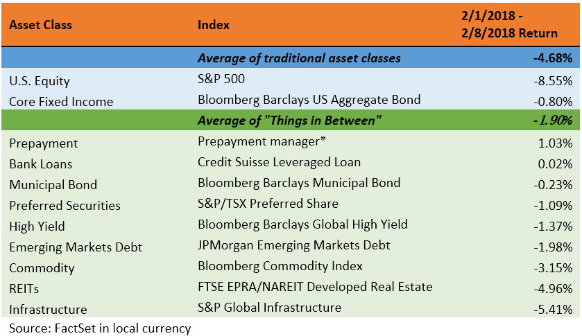

## Table of Contents

## What are asset classes and why are they important in investing?

Asset classes are groups of similar types of investments. The main ones are stocks, bonds, and cash. Stocks are shares in a company, bonds are loans you give to a government or company, and cash is money you can use right away. There are also other asset classes like real estate and commodities, which are things you can touch like gold or oil.

Asset classes are important in investing because they help you spread your money around. This is called diversification. By having different types of investments, you lower the risk that all your money will go down at the same time. For example, if stocks go down, bonds might go up or stay the same. This can help protect your money and make it grow over time. Knowing about asset classes helps you make smarter choices about where to put your money.

## What are the most common asset classes besides stocks and bonds?

Besides stocks and bonds, some of the most common asset classes are cash and cash equivalents, real estate, and commodities. Cash and cash equivalents include money in your bank account, savings accounts, and short-term investments like money market funds. These are very safe and easy to turn into cash when you need it. Real estate is another big asset class. This includes buying homes, apartments, or commercial buildings. Real estate can grow in value over time and can also give you money from rent.

Commodities are another common asset class. These are physical things like gold, oil, or agricultural products like wheat and corn. Commodities can be a good way to protect your money from inflation, which is when prices go up over time. Each of these asset classes has its own risks and rewards, so it's important to understand them before you invest. By spreading your money across different asset classes, you can lower your risk and have a better chance of making your money grow.

## How do real estate investments differ from stocks and bonds?

Real estate investments are different from stocks and bonds because they involve buying physical property like houses or buildings. When you invest in real estate, you can make money in two main ways: by renting out the property to tenants, which gives you a steady income, and by selling the property later for more than you paid for it, which is called capital appreciation. Real estate also has unique costs and risks, like needing to fix up the property or dealing with tenants who don't pay rent on time.

Stocks, on the other hand, are pieces of ownership in a company. When you buy stocks, you're hoping the company does well so the value of your stocks goes up. You can also make money from stocks through dividends, which are payments the company might give to its shareholders. Stocks can be easier to buy and sell than real estate, but they can also go up and down in value a lot more quickly.

Bonds are like loans you give to a company or government. When you buy a bond, you're lending money and in return, you get regular interest payments until the bond matures, at which point you get your money back. Bonds are usually safer than stocks but don't grow as much in value. Unlike real estate, bonds don't require you to manage any physical property, but they can be affected by changes in interest rates.

## What role do commodities play in a diversified investment portfolio?

Commodities can be a helpful part of a diversified investment portfolio because they can protect your money from inflation. Inflation is when the prices of things go up over time, and it can make your money worth less. Commodities like gold, oil, and agricultural products often go up in price when inflation happens. So, having some of your money in commodities can help keep the value of your whole portfolio from going down too much when prices rise.

Another reason to include commodities in your portfolio is that they often don't move in the same way as stocks and bonds. When the stock market goes down, commodities might stay the same or even go up. This can help balance out the ups and downs in your investments. By spreading your money across different types of investments, including commodities, you can lower your risk and have a better chance of making your money grow over time.

## Can you explain what alternative investments are and give examples?

Alternative investments are types of investments that are different from the usual ones like stocks, bonds, and cash. They can be a good way to spread your money around and lower your risk because they often don't move in the same way as the more common investments. Alternative investments can be a bit harder to buy and sell, and they might need more work to understand and manage, but they can also offer chances to make more money.

Some examples of alternative investments are hedge funds, private equity, and real assets like art or wine. Hedge funds are like special investment clubs that use different strategies to try to make money, even when the market is going down. Private equity is when you invest in private companies that aren't on the stock market. Real assets are things you can touch, like art, wine, or even rare coins. These can grow in value over time and can be a fun way to invest, but they can also be risky and hard to sell quickly.

## How does investing in cryptocurrencies compare to traditional asset classes?

Investing in cryptocurrencies is different from traditional asset classes like stocks, bonds, and real estate. Cryptocurrencies, like Bitcoin and Ethereum, are digital money that uses special technology called blockchain. They aren't controlled by banks or governments, which can be exciting but also risky. The prices of cryptocurrencies can change a lot in a short time, much more than stocks or bonds. This means you could make a lot of money quickly, but you could also lose a lot.

Traditional asset classes like stocks and bonds are usually easier to understand and have been around for a long time. Stocks let you own part of a company, and you can make money if the company does well. Bonds are like loans you give to a company or government, and they give you regular payments. Real estate is about buying property, which can give you money from rent and might go up in value over time. These traditional investments are often seen as safer because they don't change in price as much as cryptocurrencies, but they might not grow as fast either.

## What are the risks and benefits of investing in private equity?

Investing in private equity means putting your money into companies that aren't on the stock market. One big benefit is that you might make a lot of money if the company does well. Private companies can grow a lot before they go public, and if you get in early, you could see big returns. Another good thing is that private equity can help you spread your money around. Since it doesn't move the same way as stocks and bonds, it can help balance out your whole investment plan.

But there are also risks. Private equity can be hard to sell quickly. If you need your money back fast, you might have trouble getting it out. Also, it can be harder to know how well a private company is doing because they don't have to share as much information as public companies. This means you might not know if your investment is doing well until it's too late. Plus, private equity often needs a lot of money to start with, so it might not be for everyone.

## How can hedge funds be considered an asset class and what are their unique characteristics?

Hedge funds are often considered an asset class because they offer a different way to invest your money compared to stocks, bonds, and other common investments. They use special strategies to try to make money no matter what the market is doing. This can be helpful for people who want to spread their money around and lower their risk. Hedge funds are usually managed by experts who make decisions about where to put the money, and they often need a lot of money to start with, so they might not be for everyone.

One unique thing about hedge funds is that they can use a lot of different ways to make money. They might use things like borrowing money to invest more, or betting that certain investments will go down in value. This can make them riskier than other investments, but it can also mean they have a chance to make more money. Another special thing about hedge funds is that they are usually only for rich people or big investors because they have high fees and need a lot of money to start. This makes them different from other investments that are easier for regular people to get into.

## What is the impact of inflation on different asset classes?

Inflation means that the prices of things go up over time, and it can affect different asset classes in different ways. For cash and cash equivalents, like money in the bank, inflation is bad because it makes the value of your money go down. If prices are going up but your money stays the same, you can buy less with it. Bonds can also be hurt by inflation because the interest they pay might not keep up with rising prices, making the money you get back worth less.

Stocks can be a bit of a mixed bag when it comes to inflation. Sometimes, companies can raise their prices to keep up with inflation, which can help their stock prices go up. But if inflation gets too high, it can hurt the economy and make stock prices go down. Real estate often does well with inflation because property prices and rent can go up, helping to protect the value of your investment. Commodities like gold and oil usually do well with inflation too, because their prices often go up when other prices do.

Alternative investments like hedge funds and private equity can be harder to predict with inflation. Some hedge funds might use special strategies to protect against inflation, but others might not. Private equity can be good if the companies you invest in can raise their prices, but it can be bad if high inflation hurts the economy. Overall, having a mix of different asset classes can help you deal with inflation better, because what hurts one type of investment might help another.

## How do different asset classes perform during various economic cycles?

Different asset classes can act differently during different economic cycles. In good times, when the economy is growing, stocks usually do well. Companies make more money, and their stock prices go up. Real estate can also do well because people have jobs and can buy houses or rent apartments. Bonds might not do as well in good times because people want to take more risks with their money. Commodities like oil can go up because businesses need more of them to grow.

In bad times, when the economy is slowing down or in a recession, stocks can go down a lot. People worry about companies making less money, so they sell their stocks. Bonds can do better in bad times because they are safer, and people want to protect their money. Real estate might go down too, because fewer people can afford to buy homes or pay rent. Commodities can be tricky; some, like gold, might go up because people see them as a safe place to put their money, but others, like oil, might go down because businesses use less of them.

Alternative investments like hedge funds and private equity can be hard to predict during economic cycles. Some hedge funds use special strategies to make money no matter what the economy is doing, but others might struggle in bad times. Private equity can do well if the companies they invest in can weather the economic storm, but they can also do badly if those companies suffer. Having a mix of different asset classes can help you handle the ups and downs of economic cycles better.

## What advanced strategies can be used to optimize returns across multiple asset classes?

To optimize returns across multiple asset classes, one advanced strategy is called asset allocation. This means spreading your money across different types of investments like stocks, bonds, real estate, and commodities. By doing this, you can lower your risk because when one type of investment goes down, another might go up. You can also change how much money you put into each type of investment based on what's happening in the economy. For example, if you think the economy will grow, you might put more money into stocks. If you think it will slow down, you might put more into bonds. This way, you can try to get the best returns while keeping your risk under control.

Another strategy is called tactical asset allocation. This is when you make quick changes to your investments based on short-term market conditions. For example, if you think a certain type of investment will do well for a short time, you might put more money into it. But this needs a lot of work and knowledge because you have to keep watching the market and be ready to change your investments quickly. It can be risky, but if you do it right, it can help you make more money. Both of these strategies can help you make the most of your investments across different asset classes, but they need you to understand the market and be ready to make changes when needed.

## How can one measure and manage the correlation between different asset classes in a portfolio?

To measure the correlation between different asset classes in a portfolio, you can use a number called the correlation coefficient. This number goes from -1 to 1. If it's close to 1, it means the two asset classes move together a lot. If it's close to -1, it means they move in opposite ways. If it's around 0, it means they don't really move together at all. You can find these numbers by looking at past data and seeing how the prices of different asset classes have moved over time. There are tools and software that can help you do this, so you don't have to do all the math yourself.

To manage the correlation between different asset classes, you want to pick investments that don't all move the same way. This is called diversification. If you have some stocks, some bonds, and some real estate, and they don't all go up or down at the same time, your whole portfolio will be less risky. You can also change how much money you put into each asset class based on what's happening in the market. If you think stocks and bonds will start moving together more, you might want to put more money into something like commodities or real estate to keep your portfolio balanced. By keeping an eye on how your investments are moving and making smart changes, you can manage the correlation and try to get better returns while keeping your risk low.

## What is Diversification Across Asset Classes?

Diversification involves strategically distributing investments across multiple asset classes to reduce risk and potentially enhance portfolio returns. The core idea of diversification is that different asset classes typically do not experience price changes simultaneously or in the same direction, reducing overall portfolio [volatility](/wiki/volatility-trading-strategies). This risk management approach can protect investors from significant losses in a single asset class during market downturns.

At its core, diversification operates under Modern Portfolio Theory (MPT), introduced by Harry Markowitz in 1952. This theory suggests that an investment portfolio consisting of diverse assets can achieve a higher risk-adjusted return. Mathematically, this is represented by the optimization of a portfolio's expected return for a given level of risk, defined as:

$$

E(R_p) = \sum_{i=1}^{n} w_iE(R_i) 
$$

$$

\sigma^2_p = \sum_{i=1}^{n} \sum_{j=1}^{n} w_i w_j \sigma_{i,j} 
$$

Where $E(R_p)$ is the expected return of the portfolio, $w_i$ is the weight of each asset $i$ in the portfolio, $E(R_i)$ is the expected return of asset $i$, $\sigma^2_p$ is the portfolio variance, and $\sigma_{i,j}$ is the covariance between asset $i$ and asset $j$.

Investors can diversify by incorporating a mix of asset classes such as:

1. **Bonds**: Typically low-risk investments providing fixed interest returns, helping stabilize and generate steady income in a diversified portfolio.

2. **Stocks**: Historically offer higher returns with greater risk and volatility. Stocks contribute to potential growth and counterbalance the conservative nature of bonds.

3. **Cash Equivalents**: Include assets like Treasury bills or money market funds. These provide liquidity and capital preservation, though with lower returns.

4. **Commodities**: Physical goods like gold, oil, or agricultural products. Commodities can diversify against inflationary pressures and different economic cycles.

By mixing these asset classes, investors can build portfolios tailored to specific risk preferences and return objectives. This approach aligns with the observation that financial markets are influenced by a multitude of factors, including economic, geopolitical, and technological changes, which affect asset classes differently. Diversification, therefore, remains a fundamental strategy to enhance long-term investment performance while managing downside risks.

 to Algorithmic Trading

Algorithmic trading, often referred to as 'algo trading', involves the use of computer algorithms to automate the execution of trades based on predefined criteria. This technology-driven approach leverages the capabilities of computers to analyze extensive datasets rapidly and make informed trading decisions with minimal human intervention. By implementing complex mathematical models and statistical analyses, [algorithmic trading](/wiki/algorithmic-trading) systems can optimize entry and [exit](/wiki/exit-strategy) points for trades, aiming to maximize profits and minimize costs.

One of the primary benefits of algorithmic trading is the speed at which transactions can be executed. In financial markets, milliseconds can make a significant difference in the profitability of a trade. Automated systems can act on trading signals at a pace that far exceeds human capabilities, taking advantage of even the smallest market fluctuations.

Furthermore, algorithmic trading reduces the potential for human error during the trading process. Emotional trading decisions, often influenced by fear or greed, can be detrimental to investment performance. By adhering to a systematic approach, algorithmic trading ensures that trades are made based solely on objective criteria.

Algorithmic trading can be employed across various asset classes, including both stocks and bonds. In the equity markets, algorithms can analyze market conditions and historical data to execute trades that capitalize on short-term trends or market inefficiencies. In bond markets, algorithmic tools can be used to optimize trading strategies by assessing yield differentials and executing trades that leverage [interest rate](/wiki/interest-rate-trading-strategies) movements.

The strategic advantages of algorithmic trading are not limited to particular markets but extend across the financial landscape, making it an invaluable tool for modern investors seeking to enhance their trading performance.

## References & Further Reading

[1]: Markowitz, H. (1952). ["Portfolio Selection."](https://onlinelibrary.wiley.com/doi/abs/10.1111/j.1540-6261.1952.tb01525.x) The Journal of Finance, 7(1), 77-91.

[2]: Lopez de Prado, M. (2018). ["Advances in Financial Machine Learning."](https://www.amazon.com/Advances-Financial-Machine-Learning-Marcos/dp/1119482089) Wiley.

[3]: Jansen, S. (2020). ["Machine Learning for Algorithmic Trading."](https://github.com/stefan-jansen/machine-learning-for-trading) Packt Publishing.

[4]: Aronson, D. R. (2006). ["Evidence-Based Technical Analysis: Applying the Scientific Method and Statistical Inference to Trading Signals."](https://www.amazon.com/Evidence-Based-Technical-Analysis-Scientific-Statistical/dp/0470008741) Wiley.

[5]: Chan, E. P. (2009). ["Quantitative Trading: How to Build Your Own Algorithmic Trading Business."](https://github.com/ftvision/quant_trading_echan_book) Wiley.