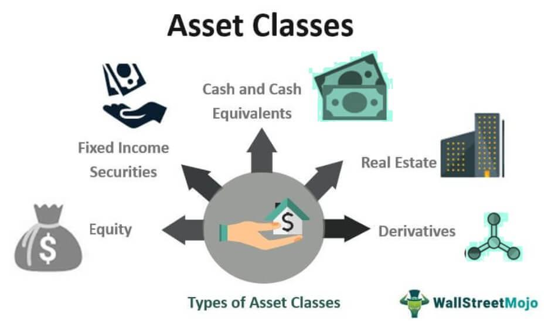

The modern investment landscape presents a multifaceted environment characterized by a diverse range of asset classes and trading methodologies. These complexities are shaped by the intricate dynamics of the financial markets and the continuous evolution of investment strategies. At the core of this landscape are bonds and stocks, which form the foundational pillars of most investment portfolios. Bonds, as fixed-income securities, are typically associated with lower risk and provide steady income through interest payments. Conversely, stocks represent equity ownership in companies and, although they offer the potential for higher returns, they are generally accompanied by higher levels of volatility.

In recent years, technological advancements have further transformed the investment landscape, introducing novel methodologies such as algorithmic trading. This innovative approach employs computer algorithms to execute trades, optimizing them based on predetermined criteria. Algorithmic trading leverages data analysis and computational power to enhance decision-making processes, thus optimizing investment strategies and minimizing costs.



Understanding both traditional asset classes and emerging trading technologies is crucial for investors seeking to optimize their portfolios. The integration of diverse assets, coupled with advanced trading methodologies, allows for effective diversification and risk management. This holistic approach to investing not only aims to maximize returns but also seeks to stabilize portfolio performance amidst market fluctuations.

As the investment world continues to evolve, staying informed about the developments in these key areas is essential. Investors can better navigate the complexities of the financial markets and capitalize on emerging opportunities by comprehensively understanding the intricacies of bonds, stocks, and algorithmic trading. This article aims to provide insights into these vital components, facilitating more informed investment decisions and strategic portfolio management.

## Table of Contents

## Understanding Asset Classes: Bonds and Stocks

An asset class is a group of investments that share similar characteristics and are subject to the same set of laws and regulations. The two primary asset classes include bonds and stocks, both of which are integral to constructing diversified investment portfolios.

Bonds are fixed-income securities that are generally regarded as low-risk investments. They are essentially loans made by an investor to a borrower, which could be a corporation, a municipal entity, or a government. Bonds typically provide regular interest payments, known as coupon payments, until they reach maturity, at which point the principal is usually repaid. Due to their predictable income stream and principal repayment, bonds are attractive to risk-averse investors seeking stability and a reliable return. The risk associated with bonds is influenced by factors such as interest rates, credit risk, and inflation. For instance, a rise in interest rates often leads to a decline in bond prices due to the inverse relationship between bond prices and interest rates.

Stocks, on the other hand, represent equity ownership in a company. By purchasing stocks, investors gain partial ownership of the issuing company and claim to a portion of its assets and earnings. Stocks have historically offered higher returns compared to bonds, but this potential for higher returns comes with increased [volatility](/wiki/volatility-trading-strategies). Stock prices fluctuate based on company performance, industry conditions, and broader economic factors. Investors in stocks may receive dividends—periodic payments distributed from a company’s earnings—but the primary means of capital appreciation is through an increase in stock value over time. 

Both bonds and stocks serve as the foundation for many investment portfolios, providing distinct benefits that enhance income generation and capital growth. Bonds are favored for their low-risk, income-generating properties, while stocks are pursued for their potential to deliver higher returns through equity appreciation. By strategically allocating investments across these asset classes, investors can tailor their portfolios to balance risk and return according to their individual financial goals and risk tolerance. 

The strategic deployment of these asset classes is crucial for developing a well-rounded investment strategy. Understanding their unique characteristics and how they interact within a portfolio context is vital for risk management and optimizing overall returns.

## Diversification Across Asset Classes

Diversification involves strategically distributing investments across multiple asset classes to reduce risk and potentially enhance portfolio returns. The core idea of diversification is that different asset classes typically do not experience price changes simultaneously or in the same direction, reducing overall portfolio volatility. This risk management approach can protect investors from significant losses in a single asset class during market downturns.

At its core, diversification operates under Modern Portfolio Theory (MPT), introduced by Harry Markowitz in 1952. This theory suggests that an investment portfolio consisting of diverse assets can achieve a higher risk-adjusted return. Mathematically, this is represented by the optimization of a portfolio's expected return for a given level of risk, defined as:

$$

E(R_p) = \sum_{i=1}^{n} w_iE(R_i) 
$$

$$

\sigma^2_p = \sum_{i=1}^{n} \sum_{j=1}^{n} w_i w_j \sigma_{i,j} 
$$

Where $E(R_p)$ is the expected return of the portfolio, $w_i$ is the weight of each asset $i$ in the portfolio, $E(R_i)$ is the expected return of asset $i$, $\sigma^2_p$ is the portfolio variance, and $\sigma_{i,j}$ is the covariance between asset $i$ and asset $j$.

Investors can diversify by incorporating a mix of asset classes such as:

1. **Bonds**: Typically low-risk investments providing fixed interest returns, helping stabilize and generate steady income in a diversified portfolio.

2. **Stocks**: Historically offer higher returns with greater risk and volatility. Stocks contribute to potential growth and counterbalance the conservative nature of bonds.

3. **Cash Equivalents**: Include assets like Treasury bills or money market funds. These provide liquidity and capital preservation, though with lower returns.

4. **Commodities**: Physical goods like gold, oil, or agricultural products. Commodities can diversify against inflationary pressures and different economic cycles.

By mixing these asset classes, investors can build portfolios tailored to specific risk preferences and return objectives. This approach aligns with the observation that financial markets are influenced by a multitude of factors, including economic, geopolitical, and technological changes, which affect asset classes differently. Diversification, therefore, remains a fundamental strategy to enhance long-term investment performance while managing downside risks.

 to Algorithmic Trading

Algorithmic trading, often referred to as 'algo trading', involves the use of computer algorithms to automate the execution of trades based on predefined criteria. This technology-driven approach leverages the capabilities of computers to analyze extensive datasets rapidly and make informed trading decisions with minimal human intervention. By implementing complex mathematical models and statistical analyses, [algorithmic trading](/wiki/algorithmic-trading) systems can optimize entry and [exit](/wiki/exit-strategy) points for trades, aiming to maximize profits and minimize costs.

One of the primary benefits of algorithmic trading is the speed at which transactions can be executed. In financial markets, milliseconds can make a significant difference in the profitability of a trade. Automated systems can act on trading signals at a pace that far exceeds human capabilities, taking advantage of even the smallest market fluctuations.

Furthermore, algorithmic trading reduces the potential for human error during the trading process. Emotional trading decisions, often influenced by fear or greed, can be detrimental to investment performance. By adhering to a systematic approach, algorithmic trading ensures that trades are made based solely on objective criteria.

Algorithmic trading can be employed across various asset classes, including both stocks and bonds. In the equity markets, algorithms can analyze market conditions and historical data to execute trades that capitalize on short-term trends or market inefficiencies. In bond markets, algorithmic tools can be used to optimize trading strategies by assessing yield differentials and executing trades that leverage [interest rate](/wiki/interest-rate-trading-strategies) movements.

The strategic advantages of algorithmic trading are not limited to particular markets but extend across the financial landscape, making it an invaluable tool for modern investors seeking to enhance their trading performance.

## Algorithmic Strategies: Enhancing Traditional Trading

Algorithmic trading employs a variety of strategies to optimize trading performance by exploiting market inefficiencies. These strategies enhance traditional trading processes and are instrumental in generating consistent returns.

Market-making is one of the foundational strategies in algorithmic trading. It involves providing [liquidity](/wiki/liquidity-risk-premium) to the market by simultaneously placing buy and sell orders for a financial instrument. This strategy capitalizes on the bid-ask spread, [earning](/wiki/earning-announcement) profits from the small differences between the price at which a security is bought and sold. Market-makers facilitate smoother market operations, especially in volatile environments, by ensuring continuous trading.

Statistical [arbitrage](/wiki/arbitrage) is another prominent strategy that relies on quantitative methods to identify pricing inefficiencies between correlated securities. It involves constructing a portfolio of long and short positions that are statistically likely to converge over time. By leveraging statistical models, traders can predict price movements and execute trades to capture these divergences before they correct themselves.

Momentum trading capitalizes on the persistence of market trends. The core principle is buying assets experiencing an upward trend and short-selling assets on a downward trend. This strategy assumes that assets will continue to move in their current direction for a period. Algorithmic systems can quickly identify and act on these trends in fast-moving markets, enhancing the probability of profit.

Mean reversion, on the other hand, is predicated on the idea that asset prices and returns eventually move back towards their historical average. Traders using this strategy identify assets that deviate significantly from their mean and make trades expecting a return to the average level. This technique is particularly effective in markets exhibiting temporary price dislocations.

Algorithmic trading strategies are especially potent in volatile and highly liquid markets, where rapid price changes and transaction volumes provide opportunities for exploiting inefficiencies. The automation and precision offered by algorithms enable quick adaptation to market conditions, ensuring optimal trade execution and maximizing returns.

## Role of Technology in Algorithmic Trading

Technological advancements are fundamentally transforming algorithmic trading, significantly enhancing its precision, efficiency, and adaptability. Artificial Intelligence (AI) and [machine learning](/wiki/machine-learning) are at the forefront of this evolution, introducing capabilities that enable traders to analyze vast amounts of data more effectively. AI's ability to recognize complex patterns and predict market trends leads to more informed trading decisions, minimizing human error and optimizing both entry and exit points.

One of the key technological innovations includes custom large language models (LLMs), which are designed to process and analyze unstructured financial text data, such as news articles and earnings reports. LLMs offer insights by identifying sentiment and extracting actionable information from the text. This capability allows traders to anticipate market movements based on real-time data analysis. Implementing LLMs in trading strategies can be illustrated with a simple Python snippet using a basic natural language processing (NLP) model:

```python
from transformers import pipeline

# Load a sentiment analysis pipeline
classifier = pipeline('sentiment-analysis')

# Example financial text
financial_news = "The company's earnings this quarter exceeded expectations causing a surge in stock prices."

# Analyze sentiment
result = classifier(financial_news)
print(result)
```

Here, the sentiment analysis of financial news can be used to guide trading strategies by rapidly converting qualitative text into quantitative sentiment scores, which may indicate bullish or bearish trends.

The infrastructure supporting algorithmic trading must be robust to handle the intricate demands of processing vast data flows and executing trades with minimal latency. High-frequency trading, a subset of algorithmic trading, requires infrastructures that can support immense throughputs and low-latency trading engines. Utilizing cloud computing and edge computing can provide the necessary scalability and speed, ensuring that trading algorithms remain competitive even in the most dynamic markets.

The architecture of these infrastructures often follows a distributed computing model, leveraging high-performance clusters and parallel processing to compute large datasets efficiently. This setup is crucial, particularly in environments that require real-time processing of market data, where even microsecond delays can significantly impact trading outcomes.

In conclusion, the fusion of AI, machine learning, and advanced infrastructures has made algorithmic trading more robust and sophisticated. As these technologies continue to evolve, their role in shaping the future of financial markets will become increasingly prominent, providing traders with unparalleled tools to navigate and capitalize on market complexities.

## Challenges and Risks of Algorithmic Trading

Algorithmic trading, despite its significant advantages, is not without challenges and risks that must be carefully managed. Technological failures, often resulting from hardware malfunctions or software bugs, can lead to substantial financial losses. An unexpected system crash or a bug in the code can halt trading operations or cause incorrect trade executions. For instance, faulty algorithms can lead to fat-finger errors where large orders are unintentionally placed due to programming mistakes.

Additionally, the high speed and frequency at which algorithmic trading occurs can exacerbate market volatility. Algorithms can react to market conditions much faster than human traders, which can lead to sudden and drastic market movements. A well-known example of such a scenario is the "flash crash" of May 6, 2010, when algorithmic trading contributed to a rapid market plummet within minutes, wiping out nearly a trillion dollars of market value before rebounding.

The complexity of trading algorithms themselves presents another layer of risk. As algorithms become more advanced, they often contain sophisticated strategies and calculations that are not easily interpretable by traders. This opacity makes it challenging to predict how algorithms will behave in unforeseen market conditions, presenting a risk of unanticipated losses.

To mitigate these risks, proper risk management practices are paramount. Continuous monitoring of algorithmic trading systems can help detect irregularities or malfunctions quickly, allowing traders to minimize potential damage. Additionally, maintaining an up-to-date and robust risk management framework can aid in anticipating and controlling the impact of volatile market conditions.

Regular updates and testing of algorithms are crucial to ensure they align with current market conditions and regulatory requirements. Backtesting algorithms against historical market data is a common practice to validate their effectiveness. Python, with its rich libraries such as `numpy` and `pandas`, facilitates such [backtesting](/wiki/backtesting) practices. Here is a simple example of a backtesting framework using Python:

```python
import pandas as pd

def backtest_strategy(data, strategy):
    current_position = None
    for index, row in data.iterrows():
        if strategy == 'buy' and current_position != 'long':
            current_position = 'long'
            # Implement logic to execute buy
        elif strategy == 'sell' and current_position != 'short':
            current_position = 'short'
            # Implement logic to execute sell
    return current_position

# Example usage
historical_data = pd.DataFrame({'prices': [100, 105, 102, 108, 110]})
result = backtest_strategy(historical_data, 'buy')
print('Final Position:', result)
```

Ultimately, addressing these challenges effectively necessitates a balance between leveraging emerging technologies and maintaining robust risk management practices. Ensuring transparency and incorporating fail-safes can significantly reduce the adverse effects of algorithmic trading risks.

## Conclusion: The Future of Investing

The integration of diverse asset classes with sophisticated trading technologies like algorithmic trading is significantly influencing the future of investing. This shift necessitates that investors stay abreast of ongoing developments in these domains to manage their portfolios effectively and seize emerging opportunities. The synergy between various asset classes and algorithmic tactics is paving the way for enhanced investment strategies that are both efficient and innovative.

Algorithmic trading, driven by advanced computational techniques and data analytics, offers significant strategic advantages. It enables high-speed transaction execution and improved risk management while providing opportunities for market insights not easily accessible through traditional means. Investors utilizing these technologies can optimize trading decisions, reduce costs, and react swiftly to market changes, thus gaining a competitive edge.

However, while the advantages are compelling, the responsible and ethical use of technology in trading remains paramount. Ethical considerations and regulatory compliance are critical to ensuring that the integration of technology in the financial markets does not lead to adverse outcomes like increased market volatility or exploitation of market inefficiencies. Investors and firms must implement stringent control mechanisms and continuous oversight to safeguard against potential technological and operational risks.

Moreover, the future landscape of investing will be shaped by advancements in [artificial intelligence](/wiki/ai-artificial-intelligence) and machine learning, which hold the potential to revolutionize data analysis and predictive modeling in financial markets. These technologies can further enhance decision-making capabilities, offering unprecedented insights and automation possibilities.

In conclusion, the evolution of investment strategies through the integration of asset classes with algorithmic trading technologies presents a promising frontier. By remaining informed and adhering to ethical practices, investors can ensure these advancements lead to sustainable and successful investment outcomes in the ever-evolving financial markets.

## References & Further Reading

[1]: Markowitz, H. (1952). ["Portfolio Selection."](https://onlinelibrary.wiley.com/doi/abs/10.1111/j.1540-6261.1952.tb01525.x) The Journal of Finance, 7(1), 77-91.

[2]: Lopez de Prado, M. (2018). ["Advances in Financial Machine Learning."](https://www.amazon.com/Advances-Financial-Machine-Learning-Marcos/dp/1119482089) Wiley.

[3]: Jansen, S. (2020). ["Machine Learning for Algorithmic Trading."](https://github.com/stefan-jansen/machine-learning-for-trading) Packt Publishing.

[4]: Aronson, D. R. (2006). ["Evidence-Based Technical Analysis: Applying the Scientific Method and Statistical Inference to Trading Signals."](https://www.amazon.com/Evidence-Based-Technical-Analysis-Scientific-Statistical/dp/0470008741) Wiley.

[5]: Chan, E. P. (2009). ["Quantitative Trading: How to Build Your Own Algorithmic Trading Business."](https://github.com/ftvision/quant_trading_echan_book) Wiley.