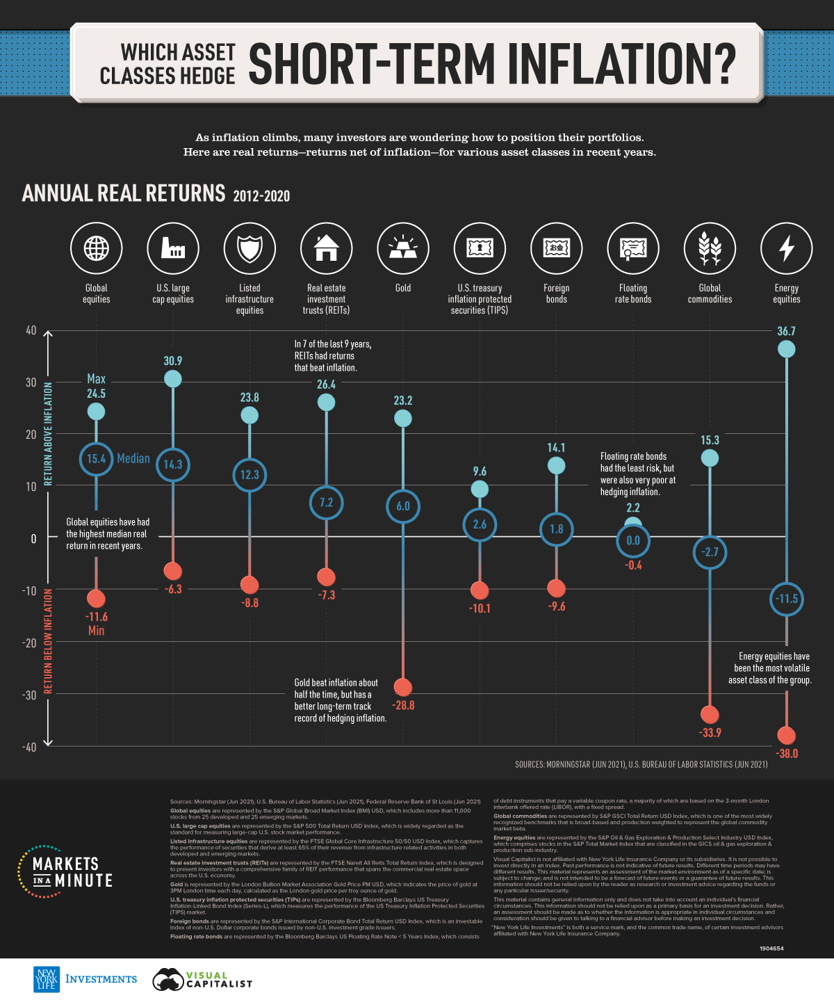

## Table of Contents

## What is inflation and why is it important to protect against it?

Inflation is when the prices of things we buy, like food and clothes, go up over time. It means that the money we have today will buy less stuff in the future. For example, if a candy bar costs $1 now, in a few years it might cost $1.20 because of inflation. Inflation happens for many reasons, like when there's more money around than there are things to buy, or when the costs of making things go up.

It's important to protect against inflation because it can make our money worth less. If we save money under our mattress, it won't grow, and we'll be able to buy less with it as time goes on. To protect against inflation, we can put our money in places where it can grow, like in a savings account that earns interest or in investments like stocks. This way, our money can keep up with or even outpace the rising prices, so we can still afford the things we need and want in the future.

## What are asset classes and how do they relate to inflation protection?

Asset classes are different types of things you can invest your money in. They can be things like stocks, which are pieces of ownership in companies, bonds, which are like loans you give to governments or companies, real estate, which is property like houses or buildings, and commodities, which are things like gold or oil. Each asset class can behave differently over time, and they can help you grow your money in different ways.

Some asset classes are better at protecting your money from inflation than others. For example, stocks can be good because companies might be able to raise their prices when inflation goes up, which can make their profits and the value of their stocks go up too. Real estate can also be good because as things get more expensive, the value of property might go up, and you can charge more rent. Commodities like gold are often seen as a hedge against inflation because their prices can go up when the value of money goes down. By spreading your money across different asset classes, you can better protect yourself from the effects of inflation.

## What is the difference between real and nominal returns in the context of inflation?

When you invest your money, you can look at two kinds of returns: nominal returns and real returns. Nominal returns are the actual percentage increase you see in your investment without considering inflation. For example, if you put $100 into a savings account and it grows to $105 after a year, your nominal return is 5%. This is the simple, straightforward number you see on your statement.

Real returns, on the other hand, take inflation into account. They show how much your investment has really grown after adjusting for the rising prices. If inflation was 3% in the same year, your real return would be the nominal return minus the inflation rate, which is 5% minus 3%, giving you a real return of 2%. This means your money grew by 2% in terms of what it can actually buy. Understanding real returns is important because it gives you a clearer picture of whether your investment is keeping up with or beating inflation.

## How can real estate serve as an inflation hedge?

Real estate can be a good way to protect your money from inflation because as prices go up, the value of properties often goes up too. When inflation makes things more expensive, people need more money to buy or rent homes. This means that if you own a house or an apartment building, you can charge more rent or sell the property for more money. This helps your real estate investment grow in value at the same time that inflation is making your money worth less.

Another way real estate helps with inflation is through mortgages. If you have a fixed-rate mortgage, the amount you pay each month stays the same even if prices go up. This means that over time, as your income might increase with inflation, the cost of your mortgage feels like less of a burden. Plus, if you're renting out a property, the rent you collect can go up with inflation, helping you earn more money to cover the costs and keep your investment strong.

## What role do commodities play in protecting against inflation?

Commodities like gold, oil, and agricultural products can help protect your money from inflation. When prices go up because of inflation, the value of commodities often goes up too. This happens because commodities are real things that people need, so when money loses value, people are willing to pay more for these items. For example, if inflation makes money worth less, the price of gold might go up because people see it as a safe place to keep their wealth.

Using commodities as an inflation hedge means that your investments can grow in value at the same time that inflation is making your cash worth less. If you invest in commodities, you might find that their prices rise faster than the rate of inflation, which helps keep your money's buying power strong. This way, even if the cost of living goes up, the value of your commodity investments could help you stay ahead of inflation.

## How do Treasury Inflation-Protected Securities (TIPS) work to combat inflation?

Treasury Inflation-Protected Securities, or TIPS, are a special kind of bond from the U.S. government that helps protect your money from inflation. When you buy a TIPS, the bond's value goes up and down with inflation. This means if inflation goes up, the value of your TIPS goes up too, so you get more money back when the bond matures. The interest you earn on a TIPS also adjusts with inflation, making sure that the money you get keeps up with rising prices.

TIPS work like this: let's say you buy a TIPS with a $1,000 face value and it pays 1% interest each year. If inflation goes up by 2% in a year, the value of your TIPS would increase to $1,020. You would then earn interest on this new, higher value, so you'd get 1% of $1,020, which is $10.20 in interest for that year. By adjusting both the bond's value and the interest payments with inflation, TIPS help make sure your investment keeps its buying power even when prices go up.

## Can stocks be considered an effective hedge against inflation? Why or why not?

Stocks can be a good way to protect your money from inflation, but it depends on the situation. When inflation goes up, companies might be able to charge more for their products and services, which can lead to higher profits. If a company makes more money, the value of its stock can go up too. This means that if you own stocks in these companies, your investment could grow faster than inflation, helping to keep your money's value strong. However, not all companies can raise their prices easily, and some might struggle if their costs go up because of inflation. So, stocks from different industries might react differently to inflation.

On the other hand, stocks can be risky because their value can go up and down a lot, even without inflation. During times of high inflation, the stock market might be more unpredictable because people might worry about the economy. If people think inflation is bad for businesses, they might sell their stocks, which can make stock prices drop. So, while stocks can be a good way to fight inflation, they are not always a sure thing. It's important to pick stocks carefully and maybe spread your money across different kinds of investments to balance the risks.

## What are the risks associated with using alternative investments for inflation protection?

Alternative investments, like real estate, commodities, or even art and collectibles, can help protect your money from inflation. But they come with their own risks. One big risk is that they can be hard to sell quickly. If you need your money back fast, you might not be able to find someone to buy your investment right away. Also, these investments can be more complicated and might need more work to understand and manage. You might need to spend time learning about them or hire someone to help you, which can cost more money.

Another risk is that the value of alternative investments can go up and down a lot. For example, the price of gold or real estate can change a lot because of things like the economy, politics, or even the weather. This means your investment might not always keep up with inflation, and you could lose money if you have to sell when the price is low. It's important to think about how much risk you're okay with and to spread your money around different types of investments to lower the chance that you'll lose a lot if one investment does badly.

## How do inflation-linked bonds compare to other fixed-income securities in terms of inflation protection?

Inflation-linked bonds, like TIPS, are a special kind of fixed-income security designed to protect your money from inflation. They work by adjusting both the bond's value and the interest payments you get based on inflation rates. This means if prices go up, the value of your bond and the interest you earn will go up too, helping your investment keep up with or even beat inflation. Other fixed-income securities, like regular bonds, don't adjust for inflation. So, if you buy a regular bond and inflation goes up, the money you get back when the bond matures might not buy as much as it did when you first bought it.

Because inflation-linked bonds adjust for inflation, they are usually better at protecting your money than other fixed-income securities. But, they might have lower interest rates than regular bonds because they come with this extra protection. This means you might earn less interest over time, but you're more likely to keep the buying power of your money. It's a trade-off: you might get less money in interest, but you're safer from losing value because of inflation.

## What advanced strategies can investors use to optimize their portfolios for inflation protection?

One advanced strategy for protecting your money from inflation is to use something called asset allocation. This means spreading your money across different types of investments like stocks, bonds, real estate, and commodities. By doing this, you can balance the risks and rewards of each type of investment. For example, if stocks are doing well but inflation is making bonds lose value, having some money in real estate or commodities might help keep your overall portfolio strong. It's like not putting all your eggs in one basket, so if one part of your investment goes down, the other parts might help make up for it.

Another strategy is to use inflation swaps or inflation-linked derivatives. These are more complex financial tools that can help you bet on future inflation rates. An inflation swap lets you exchange a fixed [interest rate](/wiki/interest-rate-trading-strategies) for one that changes with inflation, which can protect your money if inflation goes up. Inflation-linked derivatives, like options or futures, let you make deals based on how inflation might change in the future. These tools can be tricky to understand and use, so they're usually for more experienced investors. But, if used right, they can be a powerful way to protect your money from inflation.

## How does the correlation between different asset classes affect their effectiveness as inflation hedges?

When different types of investments, or asset classes, move up and down together, we call that correlation. If two asset classes have a high correlation, it means they tend to go up or down at the same time. When it comes to protecting your money from inflation, it's helpful if the asset classes in your portfolio don't all move the same way. If stocks, bonds, and real estate all go down when inflation goes up, they won't be good at keeping your money safe. But if some of them go up when inflation rises, like commodities often do, they can help balance out the losses in other parts of your portfolio.

Understanding how different asset classes relate to each other can help you pick the right mix for your investments. For example, if you know that stocks and real estate often go up when inflation goes up, but bonds might go down, you can put more money into stocks and real estate and less into bonds. This way, when inflation hits, your portfolio might still grow even if some parts of it lose value. By paying attention to how asset classes move together, you can build a stronger defense against inflation and keep your money's buying power strong over time.

## What are the long-term historical performances of various asset classes during periods of high inflation?

Over the years, different types of investments have reacted differently to high inflation. Stocks have often been a good choice during these times because many companies can raise their prices when things get more expensive, which can lead to higher profits and higher stock values. For example, during the 1970s, a time of high inflation in the U.S., stocks did better than bonds. But not all stocks do well; companies that can't easily raise their prices might struggle. Real estate also tends to do well during high inflation because property values and rents can go up, helping to keep the value of your investment strong.

Commodities like gold and oil have also been good at protecting money from inflation. When prices go up, people often see commodities as a safe place to keep their wealth, which can drive their prices up too. During the 1970s, gold prices soared as inflation rose. On the other hand, regular bonds usually don't do well during high inflation because their fixed interest payments lose value as prices go up. But inflation-linked bonds like TIPS are designed to adjust with inflation, making them a better choice for these times. Overall, a mix of stocks, real estate, and commodities has often been the best way to keep your money safe when inflation is high.

## References & Further Reading

[1]: ["Investing Amid Low Expected Returns: Making the Most When Markets Offer the Least"](https://www.amazon.com/Investing-Amid-Low-Expected-Returns/dp/1119860199) by Antti Ilmanen

[2]: Bodie, Z., & Willen, P. (2004). ["HEALTH, RISK, AND PORTFOLIO CHOICE."](https://www.bostonfed.org/-/media/Documents/Workingpapers/PDF/ppdp0703.pdf) National Bureau of Economic Research.

[3]: ["Inflation Protection: It’s Not Just for TIPS"](https://tipswatch.com/tips-in-depth/) by Amy C. Arnott, Morningstar.

[4]: ["Adaptive Asset Allocation: Dynamic Global Portfolios to Profit in Good Times – and Bad"](https://www.amazon.com/Adaptive-Asset-Allocation-Dynamic-Portfolios/dp/1119220351) by Adam Butler, Michael Philbrick, Rodrigo Gordillo, and David Berns

[5]: Fama, E. F., & French, K. R. (1993). ["Common Risk Factors in the Returns on Stocks and Bonds."](https://www.sciencedirect.com/science/article/pii/0304405X93900235) Journal of Financial Economics.

[6]: ["Successful Algorithmic Trading: Discover AI Techniques to Master Algorithmic Trading"](https://github.com/pystat/SuccessfulAlgorithmicTrading/blob/master/Successful%20Algorithmic%20Trading.pdf) by Sourav Ghosh