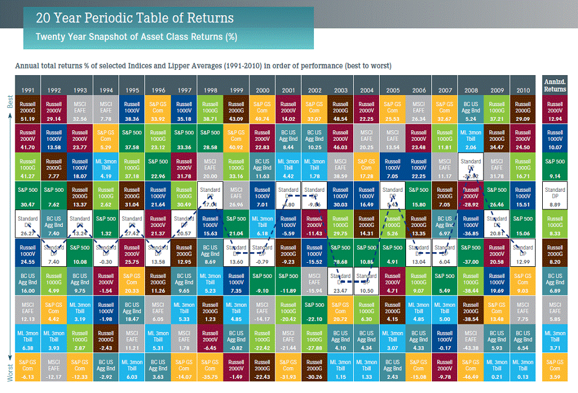

## Table of Contents

## What are asset classes?

Asset classes are groups of similar investments. They help investors understand and manage their money better. Common asset classes include stocks, bonds, and cash. Each asset class has its own level of risk and potential for growth. By spreading money across different asset classes, investors can balance risk and reward.

Stocks are shares in companies and can grow a lot but can also lose value quickly. Bonds are loans to governments or companies and usually offer steady income with less risk than stocks. Cash and cash equivalents, like savings accounts, are the safest but offer the lowest returns. Understanding these differences helps people make smarter choices about where to put their money.

## How many main types of asset classes are there?

There are three main types of asset classes: stocks, bonds, and cash. Stocks are pieces of ownership in a company. When you buy stocks, you hope the company does well and the value of the stock goes up. Bonds are like loans you give to a company or government. They pay you back with interest over time. Cash is money in your bank account or similar safe places where you can get it quickly.

Each type of asset class has different levels of risk and reward. Stocks can grow a lot but can also lose value fast. Bonds are usually safer than stocks but don't grow as much. Cash is the safest but it doesn't grow much at all. By understanding these three types, you can choose where to put your money based on how much risk you're willing to take and how much growth you want.

## What is the difference between stocks and bonds?

Stocks and bonds are two different ways to invest your money. When you buy a stock, you are buying a small piece of a company. This means you own a part of that company and can make money if the company does well. The value of your stock can go up or down depending on how the company is doing. Stocks can be risky because if the company does badly, you could lose money. But if the company does well, your stock can grow a lot.

Bonds are different because when you buy a bond, you are lending money to a company or a government. They promise to pay you back the money you lent them, plus some extra money called interest, over a certain period of time. Bonds are usually safer than stocks because you know you will get your money back as long as the company or government doesn't go bankrupt. But bonds usually don't grow as much as stocks, so you might make less money with them.

## What role do real estate investments play in an investment portfolio?

Real estate investments can be a big part of an investment portfolio. They are different from stocks and bonds because you own actual property, like houses or buildings. Real estate can grow in value over time, which means you could sell it for more money than you paid for it. It can also give you regular income if you rent it out to others. This makes real estate a good way to spread out your investments and not put all your money in one place.

Adding real estate to your portfolio can also help balance the risk. While stocks can go up and down a lot, real estate often changes more slowly. This can make your overall investments safer because if stocks are doing badly, your real estate might still be doing well. But remember, real estate can be hard to sell quickly and it takes money to take care of properties. So, it's important to think about these things when deciding how much real estate to include in your investment plan.

## How do commodities differ from other asset classes?

Commodities are things you can touch, like gold, oil, or wheat. They are different from other asset classes like stocks and bonds because they are not pieces of companies or loans. Instead, commodities are raw materials that people use every day. Their prices can go up and down based on how much people want them and how much is available. For example, if there's a lot of oil but not many people want it, the price might go down. But if there's not much oil and lots of people need it, the price can go up.

Adding commodities to your investment mix can help spread out your risk. When stocks and bonds are doing badly, commodities might still be doing well. This is because commodities often don't move the same way as stocks and bonds. But commodities can be risky too. Their prices can change a lot because of things like weather or politics. So, it's good to think about how much you want to invest in commodities and understand that they can be a bit more unpredictable than other types of investments.

## What are alternative investments and why might they be included in a portfolio?

Alternative investments are types of investments that don't fit into the usual categories like stocks, bonds, or cash. They can include things like real estate, commodities, hedge funds, private equity, and even art or wine. These investments are often used by people who want to spread their money around in different ways to lower their risk. Alternative investments can behave differently from traditional investments, which means they might go up in value when other parts of your portfolio are going down.

People might include alternative investments in their portfolio because they want to try to make more money or protect their money better. For example, if the stock market is doing badly, your real estate or art might still be worth a lot. This can help balance out the ups and downs of your overall investments. But, alternative investments can be riskier and harder to understand than regular investments. It's important to do your homework and maybe talk to a financial advisor before putting your money into them.

## How does liquidity vary across different asset classes?

Liquidity means how easy it is to turn an investment into cash without losing a lot of money. Some asset classes are very liquid, like stocks and cash. Stocks can usually be sold quickly on a stock market, and you get your money fast. Cash is the most liquid because you can use it right away for anything you need. These types of investments are good if you might need your money soon.

Other asset classes are less liquid, like real estate and some alternative investments. Real estate can take a long time to sell, and you might not get as much money as you want if you need to sell fast. Things like art or wine can be even harder to sell quickly because not many people might want to buy them at the time you need to sell. These investments are better if you can wait a while before needing your money back.

## What are the risk and return characteristics of each major asset class?

Stocks can give you a lot of money if the companies you invest in do well, but they can also lose a lot of value quickly. This means they are risky, but they also have the chance for big rewards. When the economy is doing well, stocks usually do well too. But if the economy has problems, stocks can drop a lot. Stocks can also give you money from dividends, which are payments companies make to their shareholders.

Bonds are usually safer than stocks because they are like loans you give to a company or government. They pay you back with interest over time, so you know how much money you will get and when. This makes bonds less risky, but they also don't grow as much as stocks. If the company or government can't pay you back, you might lose money, but this is less common than losing money with stocks.

Cash and cash equivalents, like money in a savings account, are the safest but they don't grow much. You can use cash right away, which makes it very liquid. But because it's so safe, you won't make as much money as you might with stocks or bonds. Cash is good to have if you need money quickly or want to be sure your money is safe.

## How should asset allocation be adjusted based on an investor's risk tolerance?

When deciding how to split your money between different types of investments, it's important to think about how much risk you're okay with. If you don't like taking big risks, you might want to put more of your money in safer places like bonds and cash. These don't grow as fast as stocks, but they won't lose as much value if the market goes down. This way, you can feel more secure about your money even if it means you might not make as much.

On the other hand, if you're okay with taking more risks because you want the chance to make more money, you might put more of your money into stocks. Stocks can go up a lot and make you more money, but they can also drop a lot and lose you money. If you're young and have a long time before you need your money, you might be able to handle more risk because you have time to wait for the market to go back up. It's all about finding the right balance that makes you feel comfortable with your investments.

## What impact do economic cycles have on different asset classes?

Economic cycles, like times when the economy is growing or shrinking, can really change how different types of investments do. When the economy is doing well and growing, stocks usually do great because companies are making more money and people feel good about spending. This can make the value of stocks go up a lot. Bonds might not do as well because people want to put their money in stocks instead. But cash and cash equivalents, like money in a savings account, don't change much because they are safe and don't grow much anyway.

On the other hand, when the economy is not doing well and might be shrinking, stocks can lose a lot of value because people are worried and not spending as much. This can make companies struggle and their stock prices drop. Bonds can become more popular because they are safer and people want to protect their money. Real estate and commodities can also be affected; real estate might not sell as well and commodity prices can drop if fewer people want them. Understanding these cycles can help you decide when to buy or sell different types of investments.

## How can derivatives be used to manage risk in various asset classes?

Derivatives are financial tools that can help you manage risk in your investments. They are like contracts that get their value from something else, like stocks, bonds, or commodities. For example, you can use something called an option, which gives you the right to buy or sell an asset at a certain price. If you think the price of a stock might go down, you can buy an option to sell it at a higher price later. This way, even if the stock price drops, you can still sell it at the higher price you agreed on and lose less money.

Derivatives can also help you make money if you think the market will change in a certain way. For instance, if you believe the price of oil will go up, you can buy a futures contract that lets you buy oil at today's price and sell it later at the higher price. This can protect you if you own oil and want to lock in a good selling price. But remember, using derivatives can be tricky and risky if you don't understand them well. It's important to learn about them or talk to a financial advisor before using them in your investment plan.

## What advanced strategies exist for optimizing returns across multiple asset classes?

One way to make more money from different types of investments is by using something called asset allocation. This means you spread your money across stocks, bonds, real estate, and other things. By doing this, you can balance out the risk and reward. For example, if stocks are not doing well, your bonds or real estate might still be doing okay. You can also use a strategy called rebalancing, which means you check your investments every now and then and move your money around to keep the balance you want. This can help you buy more of something when it's cheap and sell it when it's expensive, which can lead to better returns over time.

Another strategy is called diversification, which is a bit like asset allocation but goes deeper. Instead of just spreading your money across different types of investments, you also spread it within each type. For example, in stocks, you might invest in different industries like tech, healthcare, and energy. This way, if one industry has problems, the others might still do well. You can also use something called tactical asset allocation, where you change how much money you have in each type of investment based on what you think will happen in the market. This can be more risky but can also help you make more money if you guess right.

Lastly, you can use advanced tools like derivatives to fine-tune your investments. Derivatives are like contracts that get their value from something else, like stocks or commodities. They can help you protect your money if you think the market will go down, or make more money if you think it will go up. For example, you might use options to protect your stocks if you think their price will drop. But remember, using derivatives can be tricky and risky, so it's important to understand them well or talk to a financial advisor before trying them out.

## References & Further Reading

[1]: Bergstra, J., Bardenet, R., Bengio, Y., & Kégl, B. (2011). ["Algorithms for Hyper-Parameter Optimization."](https://dl.acm.org/doi/10.5555/2986459.2986743) Advances in Neural Information Processing Systems 24.

[2]: ["Advances in Financial Machine Learning"](https://www.amazon.com/Advances-Financial-Machine-Learning-Marcos/dp/1119482089) by Marcos Lopez de Prado

[3]: Aronson, D. R. (2006). ["Evidence-Based Technical Analysis: Applying the Scientific Method and Statistical Inference to Trading Signals."](https://www.amazon.com/Evidence-Based-Technical-Analysis-Scientific-Statistical/dp/0470008741) John Wiley & Sons.

[4]: Jansen, S. (2020). ["Machine Learning for Algorithmic Trading."](https://github.com/stefan-jansen/machine-learning-for-trading) Packt Publishing Limited.

[5]: Chan, E. P. (2008). ["Quantitative Trading: How to Build Your Own Algorithmic Trading Business."](https://github.com/ftvision/quant_trading_echan_book) Wiley.