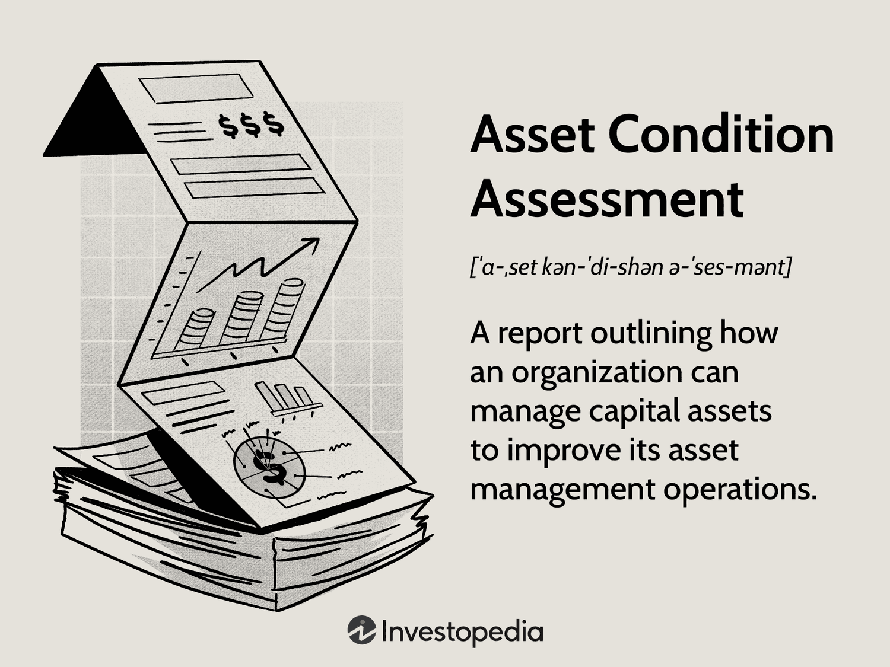

## Table of Contents

## What is asset condition assessment?

Asset condition assessment is a process where people check the state of things like buildings, roads, or machinery to see if they are in good shape or need repairs. It helps owners understand how well their assets are doing and plan for any needed maintenance or upgrades. By doing this, they can keep their assets working well and avoid big problems or costs in the future.

This assessment usually involves looking at the asset closely, sometimes using special tools or technology to find any issues that might not be easy to see. The results help in making decisions about what to fix first, how much money to spend, and when to do the work. It's important because it helps keep everything safe and working properly, which is good for both the owners and the people who use the assets.

## Why is asset condition assessment important?

Asset condition assessment is important because it helps keep things like buildings, roads, and machines in good shape. By checking these assets regularly, owners can find problems early before they get worse. This means they can fix small issues before they turn into big, expensive problems. It's like going to the doctor for a check-up; it's better to catch a health problem early than to wait until it's serious.

Doing an asset condition assessment also helps owners plan better. They can figure out which assets need attention first and how much money they need to spend on repairs or upgrades. This planning can save money in the long run and make sure that everything stays safe and works well. It's good for everyone who uses these assets because it keeps them reliable and in good condition.

## What are the key components of an asset condition assessment?

The first key component of an asset condition assessment is inspection. This means looking at the asset closely to see if there are any problems. People might use their eyes, tools, or even special technology to check every part of the asset. They look for things like cracks, wear and tear, or anything that doesn't look right. This helps them understand the current state of the asset and find any issues that need fixing.

The second key component is analysis. After the inspection, the information collected needs to be studied. This means figuring out how serious the problems are and what caused them. It also involves deciding which issues need to be fixed first and how much it might cost. This analysis helps make a plan for repairs or upgrades, so the asset can stay in good shape.

The third key component is reporting. Once the inspection and analysis are done, a report is made. This report explains what was found, what needs to be done, and how much it will cost. It's important because it helps everyone understand the condition of the asset and what steps to take next. This report is used to make decisions about maintenance and to keep everyone informed about the asset's health.

## How often should asset condition assessments be conducted?

Asset condition assessments should be done regularly, but how often depends on the type of asset and how it's used. For things like buildings or roads that a lot of people use every day, it's a good idea to check them at least once a year. This helps catch any problems early and keeps everything safe and working well. If the asset is really important or if it's showing signs of wear and tear, you might need to check it more often, maybe every few months.

For machines or equipment that are used less often, you might be able to do the assessments every two or three years. But if the machine is old or if it's used in a tough environment, you should check it more often to make sure it stays in good shape. The main thing is to find a balance so you can keep the asset working well without spending too much time or money on assessments.

## What are the common methods used for asset condition assessment?

One common method for asset condition assessment is visual inspection. This means looking at the asset with your eyes to check for any problems. People might walk around the asset, like a building or a bridge, and look for things like cracks, rust, or other signs of wear and tear. Sometimes, they use tools like cameras or drones to get a better look at hard-to-reach places. Visual inspection is simple and doesn't need special equipment, but it can miss problems that are hidden inside the asset.

Another method is using technology like sensors and non-destructive testing (NDT). Sensors can be placed on the asset to keep an eye on things like temperature, vibration, or pressure. This helps catch problems early. NDT methods, like ultrasound or X-rays, can look inside the asset without damaging it. These methods are good for finding hidden issues, but they can be more expensive and need special equipment and trained people to use them.

A third method is data analysis. This involves looking at information collected over time about the asset's performance and condition. By studying this data, people can spot patterns or changes that might show a problem is starting. For example, if a machine is using more power than usual, it might need maintenance. Data analysis can be done using computers and special software, which makes it easier to keep track of many assets at once.

## What tools and technologies are used in asset condition assessment?

One type of tool used in asset condition assessment is simple and easy to use: visual inspection tools. These include things like cameras, binoculars, and drones. Cameras help take pictures or videos of the asset, which can be looked at closely later. Binoculars let people see details from far away, which is helpful for big assets like bridges or tall buildings. Drones can fly around and take pictures or videos from angles that are hard for people to reach. These tools are great because they don't need special skills to use and can help find problems just by looking.

Another set of tools used are more advanced and use technology like sensors and non-destructive testing (NDT) equipment. Sensors can be put on the asset to measure things like temperature, vibration, or pressure. This helps keep track of the asset's health over time and can warn about problems before they get bad. NDT equipment, like ultrasound machines or X-ray devices, can look inside the asset without breaking it. This is useful for finding hidden issues, like cracks inside a metal beam. These tools need special training to use and can be more expensive, but they give a lot of detailed information.

Lastly, data analysis tools are used to make sense of all the information collected about the asset. Computers and special software can look at data over time to find patterns or changes that might show a problem. For example, if a machine starts using more power than usual, the software might point this out as a sign that maintenance is needed. Data analysis tools help manage many assets at once and make it easier to plan for repairs or upgrades.

## How can asset condition assessment improve asset management?

Asset condition assessment helps improve asset management by giving owners important information about the health of their assets. When owners know exactly what condition their buildings, roads, or machines are in, they can make better decisions about maintenance and repairs. They can fix small problems before they become big ones, which saves money and keeps everything working well. This also means they can plan their budget better because they know how much money they need to spend on keeping their assets in good shape.

By using asset condition assessments regularly, owners can also keep their assets safe for everyone who uses them. If they find and fix problems early, they can avoid accidents or breakdowns that could hurt people or damage property. Plus, keeping assets in good condition can make them last longer, which means owners don't have to replace them as often. This all adds up to better asset management because owners can keep their assets working well, safe, and cost-effective over time.

## What are the regulatory requirements for asset condition assessment?

Regulatory requirements for asset condition assessment can vary depending on the country and the type of asset. In many places, there are rules that say certain assets, like bridges or buildings, need to be checked regularly to make sure they are safe. These rules are set by government agencies to protect people and make sure that important assets are kept in good shape. For example, a city might have laws that say bridges must be inspected every two years to check for damage or wear.

In industries like oil and gas or power generation, there are also strict rules about checking equipment and machinery. These rules are often set by both government and industry groups to prevent accidents and ensure that everything works safely. Companies in these industries have to follow these rules or they could get in trouble, like being fined or having to shut down their operations. So, it's important for them to do regular asset condition assessments to meet these requirements and keep everything running smoothly.

## How do you document and report the results of an asset condition assessment?

When you do an asset condition assessment, it's important to write down what you find. You start by making notes during the inspection. You write about any problems you see, like cracks or rust, and you might take pictures or videos to show what you mean. After the inspection, you use all this information to make a report. The report should be clear and easy to understand. It tells people what condition the asset is in, what needs to be fixed, and how urgent those fixes are. You might also include how much it will cost to make the repairs.

The report is really important because it helps everyone know what's going on with the asset. You can share it with the people who own the asset, the people who will do the repairs, and sometimes even the public if it's something like a bridge or a road. The report should have a summary at the beginning that explains the main points quickly. Then, it should go into more detail about what was found during the inspection, what the problems mean, and what should be done next. By keeping good records and making clear reports, you help make sure that the asset stays safe and works well.

## What are the challenges faced during asset condition assessment?

One big challenge in doing asset condition assessments is getting to all parts of the asset. Some places might be hard to reach, like the top of a tall building or the inside of a machine. This can make it tough to see everything and find all the problems. Another challenge is that some problems might be hidden and hard to see, like cracks inside a wall or a pipe. Special tools and technology can help, but they can be expensive and need people who know how to use them.

Another challenge is making sure the assessment is done the same way every time. If different people do the inspections or if the rules change, the results might not be the same. This can make it hard to keep track of how the asset is doing over time. Also, it can take a lot of time and money to do these assessments, especially if the asset is big or if there are a lot of them to check. Finding the right balance between doing enough checks to keep the asset safe and not spending too much time or money can be tricky.

## How can data analytics enhance asset condition assessment?

Data analytics can make asset condition assessments better by helping people see patterns and trends that they might miss just by looking at the asset. When you collect data over time, like how much power a machine uses or how often a bridge is used, you can use computers to look at this information and find out if something is changing. For example, if a machine starts using more power than usual, data analytics can spot this and tell you that the machine might need maintenance soon. This helps catch problems early before they get worse, which saves money and keeps everything working well.

Using data analytics also makes it easier to manage many assets at the same time. Instead of checking each asset one by one, you can use software to keep track of all of them and see which ones need attention first. This helps plan repairs and upgrades better because you can see the big picture. It's like having a map that shows you where to go and what to do next, making sure that all your assets stay in good shape without spending too much time or money.

## What advanced techniques are used in expert-level asset condition assessment?

In expert-level asset condition assessments, advanced techniques like thermography are used to find problems that you can't see with your eyes. Thermography uses special cameras that can see heat. By looking at the heat patterns on an asset, experts can find places where things might be wearing out or breaking down. For example, if a part of a machine is hotter than it should be, it might mean there's a problem inside that needs fixing. This technique is really helpful because it can show issues early, before they cause big trouble.

Another advanced technique is using drones with high-tech sensors. Drones can fly around and take pictures or videos from places that are hard for people to reach, like the top of a tall building or under a bridge. These drones can also [carry](/wiki/carry-trading) sensors that measure things like vibrations or sounds, which can tell experts if something is wrong with the asset. By using drones, experts can get a lot of information quickly and safely, which helps them make better decisions about what needs to be fixed and when.

## References & Further Reading

[1]: Bergstra, J., Bardenet, R., Bengio, Y., & Kégl, B. (2011). ["Algorithms for Hyper-Parameter Optimization."](https://dl.acm.org/doi/10.5555/2986459.2986743) Advances in Neural Information Processing Systems 24.

[2]: ["Advances in Financial Machine Learning"](https://www.amazon.com/Advances-Financial-Machine-Learning-Marcos/dp/1119482089) by Marcos Lopez de Prado

[3]: ["Evidence-Based Technical Analysis: Applying the Scientific Method and Statistical Inference to Trading Signals"](https://www.amazon.com/Evidence-Based-Technical-Analysis-Scientific-Statistical/dp/0470008741) by David Aronson

[4]: ["Machine Learning for Algorithmic Trading"](https://github.com/PacktPublishing/Machine-Learning-for-Algorithmic-Trading-Second-Edition) by Stefan Jansen

[5]: ["Quantitative Trading: How to Build Your Own Algorithmic Trading Business"](https://books.google.com/books/about/Quantitative_Trading.html?id=j70yEAAAQBAJ) by Ernest P. Chan