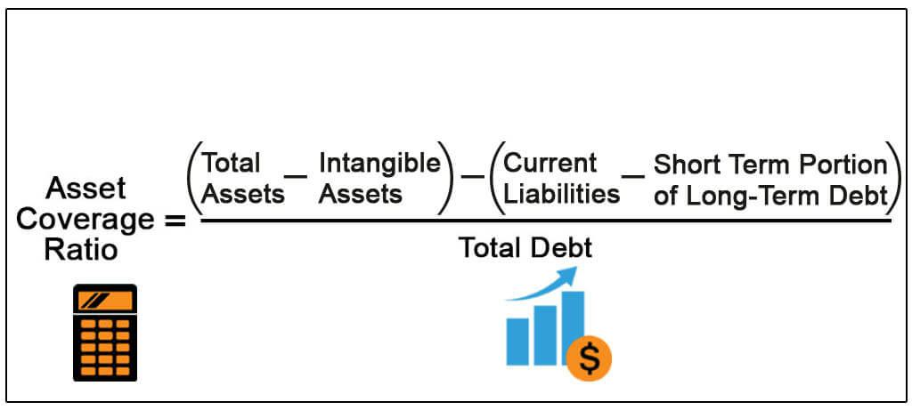

## Table of Contents

## What is the Asset Coverage Ratio?

The Asset Coverage Ratio is a financial measure that shows how well a company can cover its debts using its assets. It tells us if a company has enough assets to pay off its loans if it needed to. To find this ratio, you add up all the company's assets and then subtract any short-term debts. After that, you divide this number by the company's total debts. A higher ratio means the company is in a better position to pay its debts.

This ratio is important for investors and lenders because it helps them see how safe their money is with the company. If the ratio is high, it means the company has a lot of assets compared to its debts, which is good. But if the ratio is low, it might mean the company could have trouble paying back what it owes. This can be a warning sign for people thinking about lending money to or investing in the company.

## How is the Asset Coverage Ratio calculated?

The Asset Coverage Ratio is figured out by first adding up all the things a company owns, like buildings, equipment, and money in the bank. These are called assets. Then, you take away any short-term debts the company has to pay back soon. After doing this, you divide what's left by the total amount of money the company owes, which includes both short-term and long-term debts. This gives you the Asset Coverage Ratio.

This ratio helps people see if a company can pay back its loans using what it owns. A higher number means the company has more assets than debts, which is good. It shows the company is in a strong position to handle its debts. A lower number means the company might struggle to pay back what it owes, which could be risky for people who lend money to the company or invest in it.

## Why is the Asset Coverage Ratio important for investors?

The Asset Coverage Ratio is important for investors because it shows if a company can pay back its debts using its assets. This ratio tells investors if the company has enough valuable things, like buildings or money, to cover what it owes. If the ratio is high, it means the company is in a good position and less risky for investors. They feel more confident that their investment is safe because the company can handle its debts well.

On the other hand, if the Asset Coverage Ratio is low, it's a warning sign for investors. It means the company might not have enough assets to pay back its loans, which is risky. Investors might think twice about putting their money into the company because there's a higher chance they could lose it if the company can't pay its debts. So, this ratio helps investors make smarter decisions about where to invest their money.

## What does a high Asset Coverage Ratio indicate?

A high Asset Coverage Ratio means a company has a lot of assets compared to its debts. This is good because it shows the company can easily pay back what it owes using its things, like buildings or money in the bank. When investors see a high ratio, they feel safer about putting their money into the company. It tells them the company is strong and less likely to have money problems.

This ratio is important for people who lend money to the company too. If the ratio is high, lenders know the company has enough valuable stuff to cover its loans. This makes them more willing to lend money because they believe they will get it back. So, a high Asset Coverage Ratio is a sign of a healthy and stable company, which is good news for both investors and lenders.

## What does a low Asset Coverage Ratio suggest?

A low Asset Coverage Ratio means a company doesn't have many assets compared to its debts. This is a warning sign because it shows the company might struggle to pay back what it owes. If the company can't cover its loans with its things, like buildings or money, it could be in trouble. This makes the company riskier for people who might want to invest in it or lend it money.

When investors see a low Asset Coverage Ratio, they might think twice about putting their money into the company. They worry that if the company can't pay its debts, they could lose their investment. Lenders also see a low ratio as a red flag. They might be less willing to give the company money because they're not sure they'll get it back. So, a low Asset Coverage Ratio suggests the company is in a weaker financial position and could face challenges in the future.

## How does the Asset Coverage Ratio differ from other financial ratios?

The Asset Coverage Ratio is different from other financial ratios because it focuses on how well a company can pay its debts using its assets. Other ratios might look at different things, like how much profit a company makes or how quickly it can turn its inventory into cash. For example, the Debt-to-Equity Ratio compares a company's total debts to its total equity, showing how much the company relies on borrowed money. The Asset Coverage Ratio, on the other hand, tells us if the company has enough stuff to cover what it owes, which is important for understanding its financial health in a different way.

Another key difference is that the Asset Coverage Ratio is especially useful for lenders and bondholders. They want to know if the company can pay back its loans if things go wrong. Ratios like the Current Ratio or Quick Ratio, which measure a company's ability to pay short-term debts, don't give the same information about long-term debt coverage. The Asset Coverage Ratio gives a clearer picture of the company's ability to handle all its debts, not just the ones due soon. This makes it a valuable tool for anyone worried about the company's long-term financial stability.

## Can you provide an example of how to compute the Asset Coverage Ratio?

Imagine a company has total assets worth $1 million. This includes everything they own, like buildings, equipment, and cash. They also have short-term debts of $200,000, which are loans they need to pay back soon. Their total debts, including both short-term and long-term, add up to $600,000. To find the Asset Coverage Ratio, we start by subtracting the short-term debts from the total assets. So, $1 million minus $200,000 equals $800,000. Then, we divide this number by the total debts. So, $800,000 divided by $600,000 gives us an Asset Coverage Ratio of about 1.33.

This means for every dollar of debt, the company has $1.33 in assets after paying off its short-term debts. A ratio of 1.33 is considered pretty good because it shows the company has more than enough assets to cover its debts. If the ratio was lower, like 0.5, it would mean the company only has half a dollar in assets for every dollar of debt, which would be a warning sign that the company might struggle to pay back what it owes. So, the Asset Coverage Ratio helps us see if a company is in a strong financial position or if it might be risky.

## What industries typically have higher Asset Coverage Ratios?

Industries that usually have higher Asset Coverage Ratios are those that own a lot of big things, like buildings, land, or heavy equipment. For example, companies in the real estate business often have high ratios because they own lots of property. These properties can be sold to pay off debts if needed. Also, utility companies, like those that provide electricity or water, have a lot of infrastructure that counts as assets. This makes their Asset Coverage Ratios higher because they have more valuable stuff to cover their debts.

Another type of industry with high Asset Coverage Ratios is manufacturing. These companies often have a lot of expensive machinery and factories. Even though they might have big loans to buy these things, the value of their assets is usually much higher than their debts. This is good because it means they can pay back what they owe using their equipment if they have to. So, industries that need a lot of big, costly things to do their work tend to have higher Asset Coverage Ratios.

## How does the Asset Coverage Ratio affect a company's borrowing capacity?

The Asset Coverage Ratio is important for a company's borrowing capacity because it shows lenders how safe their money is. If a company has a high Asset Coverage Ratio, it means they have a lot of valuable things, like buildings or equipment, compared to their debts. This makes lenders feel more comfortable giving the company more money because they know the company can pay back the loans using their assets if needed. A high ratio tells lenders that the company is in a strong financial position, so they might be willing to lend more money or offer better loan terms.

On the other hand, if a company has a low Asset Coverage Ratio, it means they don't have many assets compared to their debts. This can make lenders worried because it shows the company might struggle to pay back what it owes. When lenders see a low ratio, they might not want to lend as much money, or they might charge higher interest rates to cover the risk. So, a low Asset Coverage Ratio can limit how much a company can borrow and make borrowing more expensive, which can affect the company's growth and operations.

## What are the limitations of using the Asset Coverage Ratio?

The Asset Coverage Ratio can be helpful, but it has some limitations. One big problem is that it doesn't tell the whole story about a company's financial health. It only looks at assets and debts, but it doesn't consider other important things like how much money the company is making or how well it's doing in the market. Also, the value of assets can change over time. For example, if a company owns buildings, their value might go up or down depending on the real estate market. So, the Asset Coverage Ratio might not always give a clear picture of whether a company can really pay its debts.

Another limitation is that not all assets are easy to turn into cash quickly. Some assets, like specialized equipment or property, might take a long time to sell or might not sell for as much as they're worth on paper. This means that even if a company has a high Asset Coverage Ratio, it might still have trouble paying its debts if it can't sell its assets fast enough. Also, different industries have different norms for what a good Asset Coverage Ratio looks like. What's considered a good ratio in one industry might be seen as bad in another, so it's important to compare companies within the same industry to get a fair idea of their financial health.

## How can a company improve its Asset Coverage Ratio?

A company can improve its Asset Coverage Ratio by increasing its assets or reducing its debts. One way to increase assets is by making more money and using it to buy valuable things like buildings or equipment. Another way is to sell things they don't need anymore and use that money to pay down debts. If a company can find ways to make more profit, they can use that extra money to grow their assets or pay off loans faster. This makes the company's financial position stronger because they have more stuff to cover what they owe.

Reducing debts is another good way to boost the Asset Coverage Ratio. A company can do this by paying off loans early if they have the money, or by not taking on new debt unless it's really necessary. Sometimes, a company can talk to their lenders about better terms or lower interest rates, which can make it easier to pay down what they owe. By focusing on both increasing assets and lowering debts, a company can make its Asset Coverage Ratio higher, showing that it's in a better position to handle its financial obligations.

## What trends in the Asset Coverage Ratio should financial analysts monitor?

Financial analysts should keep an eye on how the Asset Coverage Ratio changes over time for a company. If the ratio is going up, it's a good sign because it means the company is getting better at covering its debts with its assets. This could happen if the company is making more money and using it to buy more valuable things, or if they're paying off their loans. A rising trend in the Asset Coverage Ratio shows that the company is becoming stronger and less risky for investors and lenders.

On the other hand, if the Asset Coverage Ratio is going down, it's a warning sign. This means the company might be taking on more debt or not growing its assets as fast as it should. A falling trend could mean the company is in a weaker financial position and might have trouble paying back what it owes. Analysts need to watch these trends closely to understand if the company is managing its money well or if it's facing financial challenges.

## What is the role of understanding financial ratios in investment analysis?

Financial ratios are vital analytical tools employed to evaluate a company's financial performance and health, providing a quantitative basis for comparing companies and making investment decisions. These ratios are categorized into three primary groups: liquidity ratios, profitability ratios, and coverage ratios, each serving distinct purposes and offering insights into various facets of a company's operations.

Liquidity ratios measure a company's ability to meet its short-term obligations, important for assessing the financial stability of a business. Key liquidity ratios include the current ratio, calculated as:

$$
\text{Current Ratio} = \frac{\text{Current Assets}}{\text{Current Liabilities}}
$$

and the quick ratio, which provides a more stringent measure by excluding inventory from current assets:

$$
\text{Quick Ratio} = \frac{\text{Current Assets} - \text{Inventory}}{\text{Current Liabilities}}
$$

These ratios give investors insights into a firm's operational efficiency and its capability to utilize its assets efficiently.

Profitability ratios, on the other hand, assess a company's ability to generate profit relative to its revenue, assets, equity, and other financial metrics. Critical profitability ratios include the net profit margin, which illustrates the percentage of revenue that becomes profit after all expenses:

$$
\text{Net Profit Margin} = \left( \frac{\text{Net Income}}{\text{Revenue}} \right) \times 100
$$

and return on equity (ROE), which measures the profitability relative to shareholders' equity:

$$
\text{Return on Equity (ROE)} = \left( \frac{\text{Net Income}}{\text{Shareholder's Equity}} \right) \times 100
$$

These ratios help investors determine how effectively a company is using its resources to generate earnings.

Coverage ratios evaluate a firm's capacity to service its debts and financial obligations. The interest coverage ratio, for example, assesses how easily a company can pay interest on its outstanding debt, calculated as:

$$
\text{Interest Coverage Ratio} = \frac{\text{Earnings Before Interest and Taxes (EBIT)}}{\text{Interest Expenses}}
$$

This ratio is crucial in determining the financial stability of a business and its risk levels.

Investors commonly use these financial ratios to compare companies within the same industry, facilitating an understanding of which companies are performing better or worse under similar economic conditions. By conducting an in-depth analysis of these ratios, investors can make more informed decisions, recognizing a company's strengths and weaknesses, which aids in constructing a robust investment portfolio. Ultimately, mastering the use of financial ratios enhances an investor's ability to make strategic investment choices, harnessing quantitative insights to optimize financial outcomes.

## What is the Asset Coverage Ratio and how does it measure financial stability?

The asset coverage ratio is an essential financial metric used to measure a company's capacity to meet its debt obligations through the liquidation of its assets. This ratio is particularly important for lenders and investors as it provides an indication of the financial stability and risk profile of a business. 

The primary function of the asset coverage ratio is to evaluate how effectively a company can repay its outstanding obligations. This is done by analyzing whether the firm's assets, upon liquidation, will cover its debts. A higher asset coverage ratio typically suggests that a company poses a lower risk to creditors and investors, as it indicates greater availability of asset-based collateral to cover liabilities.

Mathematically, the asset coverage ratio can be expressed as follows:

$$
\text{Asset Coverage Ratio} = \frac{\text{Total Assets} - \text{Intangible Assets} - \text{Current Liabilities}}{\text{Total Debt}}
$$

In this computation, intangible assets such as patents and goodwill are excluded because they are not easily converted into cash. Adjustments are also made for current liabilities to provide a more accurate measure of a company's net asset base that can be liquidated in distress scenarios. 

While the asset coverage ratio is beneficial, it is necessary to reconcile the book value of assets reflected in financial statements with their actual market value. Market values can fluctuate due to various factors, and reliance solely on book values might not provide an accurate assessment of asset [liquidity](/wiki/liquidity-risk-premium).

For banks and creditors, the asset coverage ratio serves as a critical guideline in appraising the solvency of a business. It helps in determining the level of financial risk associated with a lending or investment decision. A prudent analysis of this ratio can aid in making informed decisions about extending credit and assessing the potential for recovery in case of default. 

Overall, the asset coverage ratio plays an integral role in evaluating financial stability, guiding investment decisions, and determining a company’s creditworthiness.

## References & Further Reading

[1]: ["Advances in Financial Machine Learning"](https://www.amazon.com/Advances-Financial-Machine-Learning-Marcos/dp/1119482089) by Marcos Lopez de Prado

[2]: ["Evidence-Based Technical Analysis: Applying the Scientific Method and Statistical Inference to Trading Signals"](https://www.amazon.com/Evidence-Based-Technical-Analysis-Scientific-Statistical/dp/0470008741) by David Aronson

[3]: ["Machine Learning for Algorithmic Trading"](https://github.com/stefan-jansen/machine-learning-for-trading) by Stefan Jansen

[4]: ["Quantitative Trading: How to Build Your Own Algorithmic Trading Business"](https://www.amazon.com/Quantitative-Trading-Build-Algorithmic-Business/dp/1119800064) by Ernest P. Chan

[5]: Damodaran, A. (2012). ["Investment Valuation: Tools and Techniques for Determining the Value of any Asset."](https://books.google.com/books/about/Investment_Valuation.html?id=5SRHAAAAQBAJ) John Wiley & Sons. 

[6]: Fabozzi, F. J., Focardi, S. M., & Rachev, S. T. (2007). ["The Mathematics of Financial Modeling and Investment Management."](https://onlinelibrary.wiley.com/doi/book/10.1002/9781118856406) John Wiley & Sons.