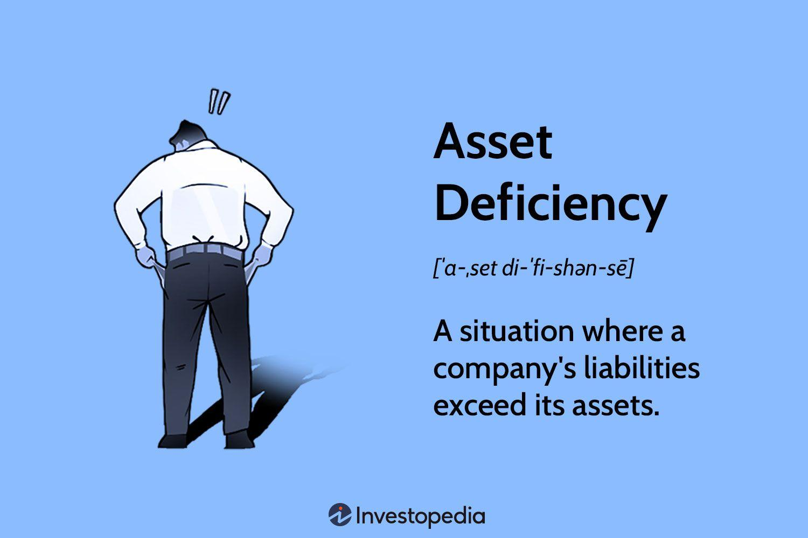

## Table of Contents

## What is asset deficiency?

Asset deficiency happens when a company or person owes more money than the value of what they own. Imagine you have a piggy bank with $100, but you borrowed $150 from a friend. You would be in asset deficiency because your piggy bank (your asset) is worth less than what you owe.

This situation can be stressful and risky. If you can't pay back the money you borrowed, you might have to sell things you own or even declare bankruptcy. Companies with asset deficiency might struggle to get more loans or might have to close down if they can't fix their financial problems.

## How is asset deficiency different from insolvency?

Asset deficiency and insolvency are related but different. Asset deficiency is when the total value of what you own (your assets) is less than what you owe (your liabilities). Imagine you have a piggy bank with $100, but you owe $150. Your assets are deficient because they are worth less than your debt.

Insolvency, on the other hand, is when you can't pay your bills on time, even if your assets are worth more than your debts. For example, you might own a house worth $200,000, but if you can't pay your monthly mortgage of $1,000, you are insolvent. So, asset deficiency is about the total value of what you own versus what you owe, while insolvency is about your ability to pay your debts when they are due.

## What are the common causes of asset deficiency?

Asset deficiency often happens when people or companies spend more money than they have. This can happen if they borrow a lot of money to buy things or invest in their business, but those things don't end up being worth as much as they hoped. For example, if a company takes out a big loan to buy new equipment, but the equipment breaks down and can't be used, the company might end up with less value in assets than the amount of the loan.

Another common cause is when the value of what someone owns goes down. This can happen because of changes in the market or the economy. For instance, if you bought a house for a high price and then the housing market crashes, the value of your house might drop below what you owe on your mortgage. This would put you in asset deficiency because your asset (the house) is now worth less than your debt.

Sometimes, unexpected events like natural disasters or lawsuits can also lead to asset deficiency. If a business gets sued and has to pay a large amount of money, it might not have enough assets left to cover its debts. Similarly, if a natural disaster destroys a company's inventory or property, the loss in asset value could push the company into asset deficiency.

## Can you provide examples of asset deficiency in small businesses?

Imagine a small bakery that took out a loan to buy new ovens and fancy equipment. They thought the new equipment would help them make more delicious treats and attract more customers. But, the ovens broke down after a few months and the bakery couldn't afford to fix them. Now, the bakery still has to pay back the loan, but the broken ovens are worth much less than what they owe. This is an example of asset deficiency because the bakery's assets (the ovens) are worth less than their debt (the loan).

Another example is a small tech startup that borrowed money to develop a new app. They spent a lot on hiring programmers and buying software, but the app didn't become popular and didn't make any money. The startup still has to pay back the loan, but the app and the software they bought are not worth as much as the loan. This puts the startup in asset deficiency because their assets (the app and software) are worth less than their debt (the loan).

## How does asset deficiency affect a company's financial statements?

Asset deficiency shows up on a company's financial statements in a big way. The balance sheet is where you can see it clearly. On the balance sheet, you list all the things the company owns (assets) and all the money it owes (liabilities). If the total value of the assets is less than the total value of the liabilities, that's asset deficiency. This means the company's "net worth" or "equity" is negative, which is shown on the balance sheet as a negative number under shareholders' equity. This can make it hard for the company to get new loans or attract investors because it shows that the company is in a risky financial situation.

The income statement can also be affected by asset deficiency, though indirectly. If a company is struggling to pay its debts because its assets are worth less than what it owes, it might have to cut back on spending or sell off assets at a loss. This can lead to lower profits or even losses, which will show up on the income statement. When profits go down, it can make the asset deficiency worse because the company has less money to pay off its debts. So, asset deficiency can create a cycle of financial trouble that shows up in both the balance sheet and the income statement.

## What are the legal implications of asset deficiency for a business?

When a business has asset deficiency, it means they owe more money than what they own. This can lead to legal problems. If the business can't pay its debts, the people or companies it owes money to might take them to court. A court might force the business to sell its assets to pay off what it owes. If selling the assets isn't enough to cover the debts, the business might have to declare bankruptcy. This is a legal process where the business tells the court it can't pay its debts and asks for help figuring out what to do next.

In some cases, the owners of the business might be personally responsible for the debts if they signed personal guarantees on loans. This means their own money and things they own could be at risk. Also, if the business was not honest about its financial situation when it borrowed money or did business with others, it could face legal action for fraud. This can lead to fines or even criminal charges against the people running the business. So, asset deficiency can create a lot of legal headaches and make it hard for a business to keep going.

## How can asset deficiency be identified in financial analysis?

To spot asset deficiency in a company, you need to look at the balance sheet. The balance sheet shows what a company owns (assets) and what it owes (liabilities). If you add up all the assets and then subtract all the liabilities, you get the company's equity. If this number is negative, it means the company has asset deficiency. This is because the total value of what the company owns is less than what it owes.

Financial analysts often use ratios to help identify asset deficiency. One useful ratio is the debt-to-asset ratio, which you find by dividing total liabilities by total assets. If this ratio is more than 1, it means the company's debts are bigger than its assets, which is a sign of asset deficiency. By looking at these numbers and ratios, analysts can see if a company is in a risky financial situation and might need to take action to fix its problems.

## What strategies can be used to manage or mitigate asset deficiency?

One way to manage or fix asset deficiency is to sell things the company owns that are not needed anymore. This can help pay off some of the debts and make the asset deficiency smaller. Another way is to try to bring in more money by finding new customers or selling more to the ones the company already has. This extra money can be used to pay down the debts and improve the company's financial situation. It's also important to look closely at how the company is spending money and cut back on any costs that are not necessary. This can free up more money to pay off debts and help the company get back on track.

Sometimes, a company might need to talk to the people it owes money to and see if they can agree on a new plan to pay back the debts more slowly or in smaller amounts. This can give the company more time to fix its financial problems. If things are really bad, the company might need to think about bringing in new investors or even selling the business to someone else who can help turn things around. The key is to act quickly and come up with a good plan to deal with the asset deficiency before it gets worse.

## How do creditors view asset deficiency when assessing creditworthiness?

When creditors look at a company to see if they should lend them money, they pay close attention to asset deficiency. If a company's assets are worth less than what they owe, it means they are in a risky financial situation. Creditors see this as a red flag because it suggests the company might not be able to pay back the money they borrow. It makes the company less creditworthy because there's a higher chance the creditor won't get their money back.

To manage this risk, creditors might decide not to lend money to a company with asset deficiency, or they might charge higher interest rates to make up for the extra risk. They might also ask for more guarantees, like asking the company's owners to promise to pay the debt with their own money if the company can't. By being careful and strict, creditors try to protect themselves from losing money if the company's financial situation gets worse.

## What role does asset deficiency play in bankruptcy proceedings?

When a company is in asset deficiency, it means they owe more money than what they own. This can be a big reason why a company might have to go through bankruptcy. In bankruptcy, the company tells the court they can't pay their debts and needs help figuring out what to do next. The court looks at the company's financial situation, including the asset deficiency, to decide what should happen. If the company's assets are worth less than its debts, the court might decide to liquidate the company, which means selling everything the company owns to pay off as much of the debt as possible.

During the bankruptcy process, asset deficiency can affect how the company's debts are handled. If the company's assets are sold and there's not enough money to pay everyone back, some creditors might not get all their money. The court has rules about who gets paid first, like secured creditors who have a claim on specific assets. If there's still money left after paying these creditors, it goes to unsecured creditors, but often there isn't enough to pay everyone in full. So, asset deficiency can make the bankruptcy process more complicated and can mean that some people or companies the business owes money to might not get paid back completely.

## How can asset deficiency impact a company's ability to secure funding?

When a company has asset deficiency, it means they owe more money than the value of what they own. This makes it really hard for the company to get new loans or funding. Banks and investors see asset deficiency as a big warning sign. It tells them that the company is in a risky financial situation and might not be able to pay back the money they borrow. Because of this, banks might say no to giving the company a loan, or they might charge a lot more interest to make up for the risk.

If the company does manage to get funding, it might come with strict rules. For example, the lender might ask for more guarantees, like making the company's owners promise to pay the debt with their own money if the company can't. This is because the lender wants to make sure they have a better chance of getting their money back. So, asset deficiency can make it tough for a company to grow or even keep running because they can't easily get the money they need.

## What advanced financial ratios and metrics are used to assess the severity of asset deficiency?

To understand how bad a company's asset deficiency is, financial experts use special ratios and numbers. One important ratio is the debt-to-equity ratio, which you find by dividing the company's total liabilities by its total equity. If this number is high, it means the company is using a lot of borrowed money compared to what the owners have put in. Another helpful ratio is the interest coverage ratio, which shows if the company can pay the interest on its debts with its earnings. If this ratio is low, it means the company might struggle to pay its debts, making the asset deficiency worse.

Another key metric is the current ratio, which compares the company's current assets to its current liabilities. A low current ratio can mean the company won't be able to pay its short-term debts, which can make asset deficiency more serious. Also, the quick ratio, which is similar but leaves out inventory, can show if the company has enough liquid assets to cover its immediate debts. By looking at these ratios and metrics, experts can get a clear picture of how severe the company's asset deficiency is and what steps might be needed to fix it.

## What is the importance of understanding business finance and asset deficiency?

Business finance refers to the strategic management of a company’s financial resources, encompassing activities such as budgeting, forecasting, investing, and monitoring financial performance. Effective financial management is crucial for ensuring a business's operational efficiency and long-term growth. Key components of business finance include acquiring funds from various sources, managing those funds to meet business objectives, and investing them strategically to generate returns.

Asset deficiency emerges when a company's liabilities surpass its total assets. Mathematically, this can be expressed as:

$$
\text{Asset Deficiency} = \text{Liabilities} - \text{Assets}
$$

When liabilities are greater than assets, the resulting positive value indicates a state of financial distress. This situation suggests the company may face difficulties in meeting its obligations and could potentially default. Multiple factors can lead to asset deficiency, such as excessive borrowing, declining asset values, or inadequate cash flow management.

Recognizing the indicators of asset deficiency is vital for businesses to prevent severe financial repercussions. Common signs include consistent negative cash flows, an increase in borrowing, or a decrease in shareholder equity. It is important for businesses to regularly monitor their balance sheet to assess the ratio of liabilities to assets. The debt-to-asset ratio can be a helpful metric:

$$
\text{Debt-to-Asset Ratio} = \frac{\text{Total Liabilities}}{\text{Total Assets}}
$$

A high debt-to-asset ratio suggests a greater risk of financial distress, as it reflects a higher proportion of the company’s assets being financed through debt.

Addressing asset deficiency requires proactive measures such as restructuring debts, divesting non-performing assets, or seeking additional capital infusion. Developing a comprehensive financial strategy can help businesses navigate these challenges, focusing on improving asset quality and operational efficiency. By doing so, companies can better manage their liabilities and enhance their financial resilience against potential default scenarios.

## References & Further Reading

[1]: Lopez de Prado, M. (2018). ["Advances in Financial Machine Learning"](https://www.amazon.com/Advances-Financial-Machine-Learning-Marcos/dp/1119482089). Wiley.

[2]: Aronson, D. R. (2007). ["Evidence-Based Technical Analysis: Applying the Scientific Method and Statistical Inference to Trading Signals"](https://onlinelibrary.wiley.com/doi/book/10.1002/9781118268315). Wiley.

[3]: Jansen, S. (2020). ["Machine Learning for Algorithmic Trading"](https://github.com/stefan-jansen/machine-learning-for-trading). Packt Publishing.

[4]: Chan, E. P. (2009). ["Quantitative Trading: How to Build Your Own Algorithmic Trading Business"](https://github.com/ftvision/quant_trading_echan_book). Wiley.

[5]: Pardo, R. (2011). ["The Evaluation and Optimization of Trading Strategies"](https://onlinelibrary.wiley.com/doi/book/10.1002/9781119196969). Wiley.