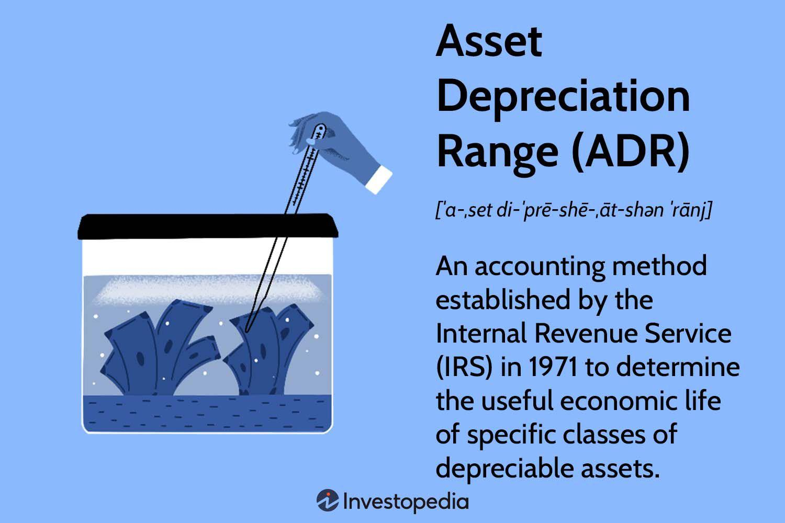

## Table of Contents

## What is asset depreciation?

Asset depreciation is the process of spreading out the cost of a big item that a business buys over the time it uses it. This is important because it helps businesses match the expense of the item with the income it helps to generate. For example, if a company buys a machine for $10,000 and expects to use it for 10 years, it might record a $1,000 expense each year instead of all at once.

There are different ways to calculate depreciation, but the most common methods are straight-line and declining balance. Straight-line depreciation means you divide the cost of the asset by the number of years you expect to use it. Declining balance depreciation means you take a bigger expense in the early years and smaller ones later on. The method a business chooses can affect its financial statements and tax bills, so it's important to pick the right one.

## Why is it important to understand asset depreciation?

Understanding asset depreciation is important because it helps businesses keep track of their money in a fair way. When a business buys something big like a machine or a building, it doesn't use up all the value of that item right away. Instead, it uses the item over time to make money. By spreading out the cost of the item over the years it's used, the business can match the expense with the income it earns. This makes the business's financial reports more accurate and helps everyone see how well the business is doing.

It's also important for tax reasons. The way a business calculates depreciation can change how much tax it has to pay each year. If a business can take a bigger expense in the early years, it might pay less tax then. But it will have to pay more later on. So, understanding depreciation helps businesses plan their taxes better. It also helps them decide when to buy new things and how to manage their money overall.

## What are the different methods of calculating asset depreciation?

There are several ways to calculate asset depreciation, but the most common methods are straight-line depreciation, declining balance depreciation, and units of production depreciation. Straight-line depreciation is the simplest method. You take the cost of the asset and subtract its expected value at the end of its useful life, then divide that by the number of years you expect to use it. For example, if you buy a machine for $10,000 and expect it to be worth $2,000 after 8 years, you would subtract $2,000 from $10,000 to get $8,000, then divide that by 8 to get a yearly depreciation expense of $1,000.

Declining balance depreciation is a bit more complicated. It lets you take a bigger expense in the early years and smaller ones later on. You start with the cost of the asset and multiply it by a fixed rate, usually double the straight-line rate. For example, if you use a double declining balance method on the same $10,000 machine with an 8-year life, you would use a 25% rate (double the straight-line rate of 12.5%). The first year's depreciation would be $2,500 ($10,000 x 25%), and then you would apply the same rate to the remaining balance each year.

Units of production depreciation is another method that bases the expense on how much the asset is used. You figure out the total number of units the asset is expected to produce over its life, then divide the cost of the asset by that number to get a per-unit depreciation rate. Each year, you multiply the number of units produced by the per-unit rate to find the depreciation expense. This method is good for assets like machinery where usage can vary a lot from year to year.

## How does the straight-line method of depreciation work?

The straight-line method of depreciation is a simple way to spread out the cost of an asset over its useful life. You start by figuring out how much the asset will be worth at the end of its life, which is called its salvage value. Then, you subtract the salvage value from the original cost of the asset to find out how much of the cost you need to depreciate. After that, you divide that amount by the number of years you expect to use the asset. This gives you the amount of depreciation expense you record each year.

For example, if you buy a machine for $10,000 and expect it to be worth $2,000 after 8 years, you would subtract $2,000 from $10,000 to get $8,000. Then, you divide $8,000 by 8 years to get a yearly depreciation expense of $1,000. So, each year, you would record a $1,000 expense on your financial statements until the end of the machine's useful life. This method is easy to use and understand, making it a popular choice for many businesses.

## What is the declining balance method of depreciation?

The declining balance method of depreciation is a way to spread out the cost of an asset over its useful life, but it's different from the straight-line method. Instead of taking the same amount of depreciation expense each year, you take a bigger expense in the early years and a smaller one later on. This method is good for assets that lose their value faster at the beginning of their life. You start with the full cost of the asset and multiply it by a fixed rate, which is usually double the straight-line rate. This is why it's often called the double declining balance method.

For example, if you buy a machine for $10,000 and expect to use it for 8 years, you would use a 25% rate (double the straight-line rate of 12.5%). In the first year, you would take $2,500 in depreciation ($10,000 x 25%). Then, in the second year, you would apply the same 25% rate to the remaining $7,500, which would give you a depreciation expense of $1,875. You keep doing this each year, but you stop when the asset's book value reaches its salvage value or when you've used up the asset's useful life, whichever comes first. This method can help businesses save on taxes in the early years because they can claim a bigger expense then.

## Can you explain the units of production method of depreciation?

The units of production method of depreciation is a way to spread out the cost of an asset based on how much it's used. You start by figuring out how many units the asset is expected to produce over its whole life. Then, you take the cost of the asset and subtract its salvage value, which is what it will be worth at the end of its life. You divide this amount by the total number of units to find out how much depreciation to record for each unit produced.

Each year, you look at how many units the asset actually produced and multiply that by the per-unit depreciation rate. This gives you the depreciation expense for that year. This method is really good for assets like machines where how much they're used can change a lot from year to year. It helps businesses match the expense of the asset more closely with the income it helps generate.

## What is the Asset Depreciation Range (ADR) system?

The Asset Depreciation Range (ADR) system is a way to figure out how to spread out the cost of an asset over time. It was made by the U.S. government to help businesses calculate depreciation in a fair way. Instead of using just one way to calculate depreciation, the ADR system lets businesses pick a range of years to use for each type of asset. This range is based on how long the government thinks the asset should last.

Using the ADR system, a business can choose a shorter or longer time to depreciate an asset, as long as it stays within the range set by the government. This gives businesses some flexibility to match their depreciation with how they actually use their assets. The ADR system was used a lot in the past, but it's not used as much now because newer tax laws have changed how businesses can depreciate their assets.

## How does the ADR system affect tax calculations?

The ADR system affects tax calculations by giving businesses some choice in how they spread out the cost of their assets. It lets them pick a time to depreciate an asset that fits within a range set by the government. This means a business can decide to take a bigger tax deduction in the early years by choosing a shorter time, or a smaller deduction by choosing a longer time. This flexibility helps businesses plan their taxes better and match their expenses with their income more accurately.

Even though the ADR system isn't used as much today, it used to be really important for tax planning. Newer tax laws like the Modified Accelerated Cost Recovery System (MACRS) have taken its place. But the idea behind the ADR system, which is to give businesses some control over their depreciation, still matters. It helps them manage their money and taxes in a way that works best for them.

## What are the advantages of using the ADR system for businesses?

The ADR system gives businesses a way to choose how long they want to spread out the cost of their big items. This means they can pick a time that fits how they use the item. If a business thinks an item will wear out faster, they can choose a shorter time and take a bigger tax break in the early years. This can help them save money on taxes when they need it most. It's like having a bit of control over when to pay less tax, which can be really helpful for planning how to use their money.

Another good thing about the ADR system is that it lets businesses match their expenses with their income better. If a business uses an item a lot in the beginning and less later on, they can choose a shorter time to spread out the cost. This makes their financial reports look more accurate because the expense matches the time when the item is helping them make money. Even though the ADR system isn't used as much now, the idea of giving businesses some control over their depreciation is still important.

## How can software tools assist in managing asset depreciation?

Software tools can help businesses keep track of their big items and how much they're worth over time. These tools can do all the math for depreciation, so businesses don't have to do it themselves. They can use different ways to calculate depreciation, like straight-line, declining balance, or units of production, and they can change the way they do it if they need to. This makes it easier for businesses to follow the rules and keep their financial reports correct.

These tools also help businesses plan better. They can show what the depreciation will look like in the future, so businesses can see how it will affect their taxes and money. They can also keep track of when to buy new things or fix old ones. With all this information in one place, businesses can make smarter choices about how to use their money and save on taxes.

## What are the common challenges faced when implementing the ADR system?

When businesses try to use the ADR system, they often find it hard because it's not as simple as other ways to calculate depreciation. The ADR system lets businesses pick a time to spread out the cost of their big items, but they have to stay within a range set by the government. This can be confusing because businesses need to know what the right range is for each item, and they might need to do a lot of research to figure it out. Also, if the rules change, businesses have to keep up with the new rules, which can be a lot of work.

Another challenge is that the ADR system isn't used as much anymore. Newer tax laws have changed how businesses can calculate depreciation, so many businesses have switched to other methods like MACRS. This means that if a business wants to use the ADR system, they might have a hard time finding software or tools that still support it. They might also have trouble explaining to their accountants or tax people why they're using an older system, which can make things more complicated.

## How do international accounting standards impact the use of different depreciation methods?

International accounting standards, like those set by the International Accounting Standards Board (IASB), can affect how businesses choose to calculate depreciation. These standards are meant to make sure that financial reports from different countries are easy to compare. They give rules on how to spread out the cost of big items over time. For example, the IASB's standard IAS 16 says that businesses should use a way to calculate depreciation that matches the item's use and how it loses value. This means businesses might have to use different methods for different items, depending on what makes the most sense.

Even though these standards give some rules, they also let businesses pick from different ways to calculate depreciation, like straight-line, declining balance, or units of production. This flexibility helps businesses follow the rules while also matching their expenses with their income in a way that works for them. But it can also make things more complicated because businesses need to keep up with the rules and make sure they're using the right method for each item. If a business works in different countries, they might have to use different methods for each place, which can be a lot of work.

## What is the Alternative Depreciation System (ADS)?

The Alternative Depreciation System (ADS) is a depreciation method mandated for specific asset categories under U.S. tax law. It stands out from the Modified Accelerated Cost Recovery System (MACRS) due to its distinct approach in handling depreciation timeframes. While MACRS allows businesses to expedite depreciation and thus claim higher tax deductions in the initial years of an asset's life, ADS spreads depreciation deductions over a longer period. This extended allocation under ADS often aligns better with the actual economic life of assets, providing a stabilizing effect on financial planning and long-term forecasting.

ADS is particularly applicable to assets used predominantly outside the United States, tax-exempt investments, and assets used in farming businesses, among others. For businesses with these types of assets, ADS can prove beneficial due to its alignment with international financial reporting standards, potentially reducing discrepancies between U.S. and global accounting practices.

Mathematically, the depreciation deduction per year under ADS for an asset with an initial cost $C$, residual value $R$, and expected useful life $n$ years is calculated using the straight-line method as follows:

$$
\text{Annual Depreciation Expense} = \frac{C - R}{n}
$$

This formula's simplicity underscores the predictability and uniformity of expenses in financial statements, which can aid businesses in strategic decision-making and cash flow management. By adhering to a consistent and extended depreciation schedule, firms leveraging ADS can benefit from greater financial consistency and alignment with international regulations, enhancing strategic stability over the asset's life cycle.

## What is the relationship between algorithmic trading and depreciation?

Algorithmic trading leverages advanced computational tools and techniques to automate the process of buying and selling financial securities. One of the key elements that influence [algorithmic trading](/wiki/algorithmic-trading) strategies is the accurate valuation of assets, assets whose values are often impacted by depreciation. Depreciation is an accounting method of allocating the cost of a tangible or physical asset over its useful life, and it directly affects the book value of assets on a company's balance sheet.

For algorithmic trading systems, integrating precise asset valuations that account for depreciation is crucial. This is because trading algorithms rely on financial data to develop predictive models that guide trading decisions. Depreciation affects the carrying amount of an asset, which in turn influences algorithms that might use this data to assess the future performance or risk associated with a particular asset or portfolio.

For instance, suppose an algorithm is designed to analyze companies based on their asset efficiency or return on assets (ROA). This metric can be calculated as follows:

$$

\text{ROA} = \frac{\text{Net Income}}{\text{Average Total Assets}} 
$$

In this formula, the 'Total Assets' figure is heavily influenced by the depreciation method employed. If a company is using a method like Modified Accelerated Cost Recovery System (MACRS), it may report lower net book values for its assets compared to another entity using a method like the Alternative Depreciation System (ADS). This discrepancy can lead to variations in the ROA calculations, thereby affecting trading algorithms that prioritize companies with higher efficiency indices.

Moreover, trading algorithms often incorporate data from financial statements, wherein depreciation plays a key role in shaping components such as net income and cash flow statements. Depreciation is a non-cash expense that reduces taxable income, thereby increasing free cash flow — a crucial input for valuation models like Discounted Cash Flow (DCF) analysis. Algorithms that utilize cash flow projections to determine intrinsic stock values may prioritize securities from companies that manage depreciation effectively to enhance [liquidity](/wiki/liquidity-risk-premium).

Incorporating depreciation data into trading models also helps algorithms approximate the true economic value of assets, leading to more accurate predictions and better-optimized portfolios. This involves programming the model to adjust the book value of assets progressively, reflecting depreciation over time. With the evolution of [machine learning](/wiki/machine-learning), these models can be trained to become more adept at predicting how depreciation will impact future earnings and asset utilization.

In summary, the integration of depreciation into algorithmic trading not only adjusts the lens through which financial data is viewed but also enhances the robustness of trading strategies. By ensuring that asset valuations reflect their realistic economic worth, traders and analysts can build more efficient and accurate trading systems.

## References & Further Reading

IRS Publication 946 provides comprehensive guidelines on the depreciation of property for tax purposes. It outlines various methods and special rules for depreciating property, detailing how businesses can benefit from allowable deductions, thus affecting their taxable income and cash flow. This publication is vital for understanding compliance with U.S. tax regulations concerning asset depreciation and offers practical information on implementing methods like MACRS.

In "Algorithmic Trading: Winning Strategies and Their Rationale" by Ernest P. Chan, readers can explore the intersection of algorithmic trading with asset valuations, including the implications of depreciation. Chan provides insights into constructing trading algorithms that incorporate economic data and depreciation effects, advocating for strategies that leverage statistical models and historical financial patterns to optimize trading outcomes.

The analysis titled "Depreciation Methods: Analysis and Strategic Applications in Financial Planning" reviews various depreciation techniques and their roles in financial strategy. It discusses how methods like ADR, ACRS, and MACRS influence business planning, tax liabilities, and trading decisions. This source presents a strategic look at aligning depreciation choices with long-term corporate goals, encouraging a harmonized approach between accounting practices and financial planning.

