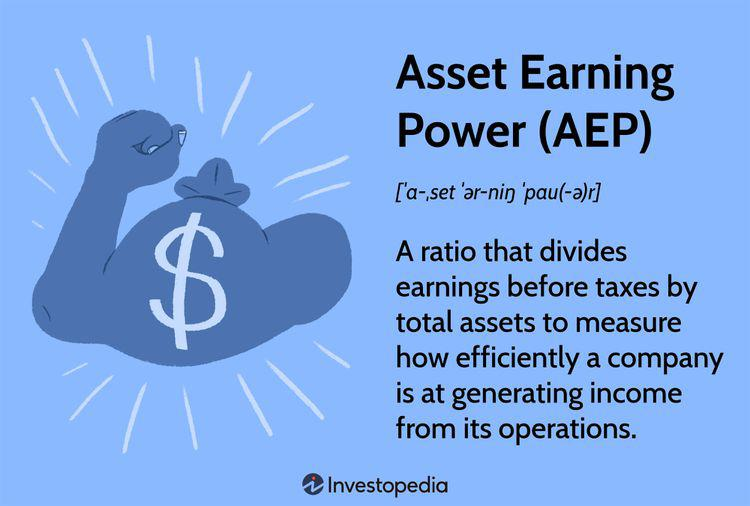

## Table of Contents

## What is Asset Earning Power?

Asset Earning Power is a way to figure out how much money a company's assets can make in a year. It helps investors and business owners see if the company is using its assets well to make money. To find the Asset Earning Power, you take the company's yearly earnings and divide it by the total value of its assets. This gives you a percentage that shows how well the assets are working to bring in money.

This measure is important because it shows if a company is good at turning its assets into profits. If the percentage is high, it means the company is doing a great job with its assets. If it's low, the company might need to find better ways to use its assets or maybe even sell some that aren't helping much. By looking at the Asset Earning Power, people can make smarter choices about investing in or running a business.

## How is Asset Earning Power calculated?

Asset Earning Power is calculated by dividing a company's yearly earnings by the total value of its assets. This gives you a percentage that shows how well the company is using its assets to make money. For example, if a company earns $100,000 a year and has assets worth $1,000,000, the Asset Earning Power would be 10%. This means for every dollar of assets, the company makes 10 cents in earnings.

This calculation is important because it helps people see if a company is good at turning its assets into profits. A high percentage means the company is doing well with its assets. A low percentage might mean the company needs to find better ways to use its assets or maybe sell some that aren't helping much. By understanding the Asset Earning Power, investors and business owners can make smarter decisions about where to put their money or how to run their business.

## Why is Asset Earning Power important for investors?

Asset Earning Power is important for investors because it shows how well a company is using its stuff to make money. If a company has a high Asset Earning Power, it means they are good at turning their buildings, machines, and other things into profits. This is good news for investors because it means the company is doing a great job and might be a good place to put their money.

On the other hand, if a company has a low Asset Earning Power, it might mean they are not using their stuff as well as they could. This could be a warning sign for investors that the company might not be a good investment. By looking at the Asset Earning Power, investors can decide if a company is worth investing in or if they should look for better opportunities elsewhere.

## Can you provide an example of how to apply Asset Earning Power in a real-world scenario?

Imagine you are thinking about investing in a small bakery called "Sweet Treats." The bakery makes $50,000 a year in profit and has total assets worth $250,000, including their ovens, mixers, and the building they own. To find out the Asset Earning Power, you would take the yearly profit of $50,000 and divide it by the total assets of $250,000. This gives you an Asset Earning Power of 20%. This means for every dollar of assets, the bakery makes 20 cents in profit. 

Seeing this, you might think "Sweet Treats" is doing a good job using its assets to make money. A 20% Asset Earning Power is pretty good, so you might feel more confident about investing in the bakery. On the other hand, if another bakery, "Delicious Delights," has the same amount of assets but only makes $25,000 a year, its Asset Earning Power would be 10%. This lower percentage might make you think twice about investing in "Delicious Delights" because they are not using their assets as well as "Sweet Treats." By comparing the Asset Earning Power of different companies, you can make smarter choices about where to put your money.

## What are the key factors that affect Asset Earning Power?

Several things can affect a company's Asset Earning Power. One big thing is how well the company uses its stuff, like machines or buildings, to make money. If they use their stuff really well, they can make more money, which means a higher Asset Earning Power. Another thing is how much money the company makes overall. If they have a lot of profit, that helps their Asset Earning Power go up. But if they don't make much money, their Asset Earning Power will be lower.

Another important [factor](/wiki/factor-investing) is the type of stuff the company has. Some things, like new machines or good buildings, can help make more money. But if a company has old machines that break a lot, they might not be able to make as much money, which can lower their Asset Earning Power. Also, the kind of business the company is in can make a difference. Some businesses, like tech companies, might have a higher Asset Earning Power because they can make a lot of money with less stuff than, say, a factory that needs a lot of big machines.

## How does Asset Earning Power differ from other financial metrics?

Asset Earning Power is different from other financial metrics because it looks at how well a company uses its stuff to make money. For example, Return on Assets (ROA) is similar because it also looks at how much profit a company makes from its assets. But ROA uses net income, which is after taxes and other expenses, while Asset Earning Power uses the company's yearly earnings before these costs. This makes Asset Earning Power a bit more straightforward because it shows how much money the company's stuff can make before other costs get taken out.

Another way Asset Earning Power is different is when you compare it to Return on Investment (ROI). ROI looks at the profit made on an investment compared to its cost. It's about how much money you make from putting money into something. Asset Earning Power, on the other hand, focuses on how well the company's stuff, like machines or buildings, is used to make money. It doesn't just look at one investment but at all the company's assets together. This gives a bigger picture of how well the whole company is doing with what it has.

## What are the limitations of using Asset Earning Power as a sole investment criterion?

Using Asset Earning Power as the only way to decide if you should invest in a company can be tricky. It's good because it shows how well a company uses its stuff to make money. But it doesn't tell you everything you need to know. For example, it doesn't look at how much debt the company has. A company might have a high Asset Earning Power, but if it also has a lot of debt, it might not be a safe investment. Also, Asset Earning Power doesn't tell you about the company's future plans or how the market is doing. These things can be really important when deciding where to put your money.

Another problem with only using Asset Earning Power is that it can be different for different kinds of businesses. A tech company might have a high Asset Earning Power because it doesn't need a lot of stuff to make money. But a factory might have a lower Asset Earning Power because it needs a lot of big machines. If you only look at Asset Earning Power, you might think the factory is not doing well, but it might actually be doing great for its type of business. So, it's important to use other financial measures too, like looking at the company's growth, how much money it makes compared to other companies in the same business, and what people think about its future.

## How can Asset Earning Power be used to compare companies within the same industry?

Asset Earning Power can help you compare companies in the same industry by showing how well each company uses its stuff to make money. If you look at two companies that make cars, for example, and one has a higher Asset Earning Power, it means that company is better at turning its factories, machines, and other things into profits. This can be a good sign for investors because it shows which company is doing a better job with what it has.

But, it's important to remember that even within the same industry, companies can be different. One car company might focus on making luxury cars, while another makes cheaper cars for more people. These differences can affect their Asset Earning Power. So, when you compare companies, you should also think about what kind of products they make and how they run their business. This way, you get a fuller picture of how well each company is doing.

## What role does Asset Earning Power play in valuation models?

Asset Earning Power can be a helpful piece of information when figuring out how much a company is worth. In valuation models, people use different numbers and calculations to guess a company's value. Asset Earning Power is one of those numbers. It shows how well a company uses its stuff to make money. If a company has a high Asset Earning Power, it might mean the company is worth more because it's good at turning its assets into profits. This can make investors feel more confident about the company's value.

But, Asset Earning Power is just one part of the puzzle. Valuation models also look at other things like how much money the company makes overall, how much debt it has, and what people think about its future. So, while Asset Earning Power can give you a good idea about how well a company is doing with its stuff, it's not the only thing to consider. You need to look at the whole picture to really understand a company's value.

## How can changes in Asset Earning Power signal shifts in a company's operational efficiency?

Changes in a company's Asset Earning Power can tell you a lot about how well the company is running. If the Asset Earning Power goes up, it usually means the company is getting better at using its stuff, like machines or buildings, to make money. This could be because they got new, better machines, or maybe they found a smarter way to use what they already have. When investors see this, they might think the company is doing a good job and becoming more efficient.

On the other hand, if the Asset Earning Power goes down, it might mean the company is not using its stuff as well as before. This could happen if their machines are getting old and breaking more often, or if they're not keeping up with new ways to do things. A drop in Asset Earning Power can be a warning sign for investors that the company might be losing its edge and needs to find ways to improve how it operates.

## What advanced techniques can be used to enhance the accuracy of Asset Earning Power calculations?

To make Asset Earning Power calculations more accurate, one advanced technique is to adjust the earnings for any one-time events or unusual costs. This means taking out things like big legal fees or the costs of closing a factory that won't happen again. By doing this, you get a clearer picture of what the company's stuff can really earn year after year. Another way to improve accuracy is by using a weighted average of assets over time. Instead of just looking at the value of the assets at one moment, you can look at how the value changes over a few years. This can give a better idea of how well the company is using its stuff to make money.

Another technique is to consider the quality and age of the assets. Newer, more efficient machines might help a company make more money than old, worn-out ones. By taking this into account, you can get a more accurate view of the company's Asset Earning Power. Also, using industry benchmarks can help. If you know what a good Asset Earning Power is for similar companies, you can see if the company you're looking at is doing well or not. This can make your calculations more meaningful and help you understand how the company stacks up against others in its field.

## How does macroeconomic environment influence Asset Earning Power and its interpretation?

The macroeconomic environment can have a big impact on a company's Asset Earning Power. Things like interest rates, inflation, and how well the economy is doing overall can change how much money a company makes from its stuff. For example, if interest rates go up, it might cost the company more to borrow money to buy new machines or buildings. This can lower their earnings and make their Asset Earning Power go down. On the other hand, if the economy is doing well and people are buying more, the company might be able to sell more of its products and make more money, which would boost its Asset Earning Power.

When looking at Asset Earning Power, it's important to think about what's happening in the bigger economic picture. If the economy is in a recession, a company might have a lower Asset Earning Power, but that doesn't always mean they're doing a bad job. It could just be because people are buying less. On the flip side, if the economy is booming, a high Asset Earning Power might not be as impressive because everyone is doing well. So, to really understand a company's Asset Earning Power, you need to see how it fits into what's going on in the economy as a whole.

## What is Understanding Asset Earning Power?

Asset Earning Power (AEP) is a financial metric used to evaluate a company's ability to generate earnings from its assets. It provides a snapshot of how effectively a company's assets contribute to its overall profitability. AEP is defined as a company's operating income divided by its total assets. The formula for calculating AEP is:

$$
\text{AEP} = \frac{\text{Operating Income}}{\text{Total Assets}}
$$

This ratio is crucial as it highlights a company's efficiency in utilizing its asset base to generate income. Higher AEP values typically indicate that a company is proficient in leveraging its assets to produce substantial earnings, which is often a positive sign for potential investors and financial analysts.

One of the primary advantages of using AEP over other profitability ratios, such as return on equity (ROE) or return on assets (ROA), is its focus on core operating income without the effects of financial leverage. While ROE can be influenced by a company's debt structure, AEP provides a clearer view of operational efficiency by concentrating solely on income generated from assets. Additionally, unlike ROA, AEP specifically measures operational profitability without the influence of taxes and interest, offering a more direct assessment of asset utilization.

Industry examples can further illustrate the importance and application of AEP. For instance, in capital-intensive industries like manufacturing or real estate, companies with high AEPs are often more attractive as they indicate strong management and effective asset deployment. Conversely, a low AEP in such sectors might raise concerns about operational inefficiencies or underutilized assets.

Investors frequently use AEP to compare companies across various sectors as it offers a standardized measure that transcends industry-specific financial structures. By focusing on operating income, AEP allows investors to assess companies on an operational level rather than being swayed by differences in capital structure or tax strategies. This approach can be particularly useful when comparing firms with similar operational profiles but disparate financial strategies.

In summary, Asset Earning Power serves as a vital tool in financial analysis, providing insights into a company's operational effectiveness and asset management. By focusing on the core ability of a firm's assets to generate income, AEP helps investors and analysts make informed comparisons and investment decisions across different companies and industries.

## What is the Role of AEP in Financial Performance Analysis?

Asset Earning Power (AEP) is an essential metric for assessing a company's financial health and performance. It evaluates a company's capability to generate income from its assets, offering a comprehensive measure that goes beyond traditional profitability ratios like Return on Assets (ROA) or Return on Equity (ROE). AEP is calculated by dividing a company's operating income by its total assets, providing insights into how effectively a company is utilizing its assets to generate earnings. 

$$
\text{AEP} = \frac{\text{Operating Income}}{\text{Total Assets}}
$$

### AEP as a Critical Tool

Asset Earning Power serves as a valuable tool for investors and analysts. It offers a clearer picture of a company’s operational efficiency, allowing stakeholders to evaluate financial performance effectively. Unlike other ratios that might be influenced by financing decisions or tax strategies, AEP focuses solely on the operational prowess of an organization.

### Case Studies: High AEP Ratios in Successful Companies

Examining successful companies with high AEP ratios highlights the metric's practical implications. For instance, tech companies known for their capital-light business models often report high AEP ratios, as they generate substantial revenue without significant asset bases. Such instances underscore the importance of AEP in sectors where intangible assets play a vital role, helping investors discern true operational strength from financial maneuvering.

### Impact of AEP on Investment Decisions and Financial Forecasting

AEP significantly influences investment decisions and financial forecasting. Investors utilize AEP to compare companies within the same industry, aiding in the selection of businesses with superior asset utilization efficiencies. Additionally, AEP serves as a predictive tool in financial forecasting, offering a baseline for estimating a company’s future earnings potential. By analyzing changes in AEP over time, stakeholders can gauge a company’s growth trajectory and adjust investment strategies accordingly.

### Limitations of AEP and Considerations for Accuracy

Despite its advantages, AEP is not without limitations. As a financial ratio, it is susceptible to periodic fluctuations due to transient factors such as seasonal sales or temporary operational inefficiencies. Furthermore, AEP does not account for varying asset compositions and depreciations that can skew interpretations, nor does it consider external factors like market conditions that may impact asset productivity. Therefore, while AEP is a potent analytical tool, it should be used in conjunction with other financial metrics to paint a holistic picture of a company’s financial health.

In summary, Asset Earning Power is a pivotal component in financial performance analysis. It provides a nuanced view of how well a company utilizes its resources to generate income, ultimately aiding in nuanced investment decisions and strategic financial planning.

## References & Further Reading

[1]: Koller, T., Goedhart, M., & Wessels, D. (2010). ["Valuation: Measuring and Managing the Value of Companies"](https://www.wiley.com/en-us/Valuation%3A+Measuring+and+Managing+the+Value+of+Companies%2C+7th+Edition-p-9781119610885). Wiley Finance.

[2]: Damodaran, A. (2012). ["Investment Valuation: Tools and Techniques for Determining the Value of Any Asset"](https://books.google.com/books/about/Investment_Valuation.html?id=5SRHAAAAQBAJ). Wiley Finance.

[3]: Chan, E. (2013). ["Algorithmic Trading: Winning Strategies and Their Rationale"](https://github.com/ftvision/quant_trading_echan_book). Wiley Trading.

[4]: López de Prado, M. (2018). ["Advances in Financial Machine Learning"](https://www.amazon.com/Advances-Financial-Machine-Learning-Marcos/dp/1119482089). Wiley.

[5]: Mullins, D. (1993). ["Does the Capital Asset Pricing Model Work?"](https://hbr.org/1982/01/does-the-capital-asset-pricing-model-work). Harvard Business Review.

[6]: Aronson, D. (2006). ["Evidence-Based Technical Analysis: Applying the Scientific Method and Statistical Inference to Trading Signals"](https://www.amazon.com/Evidence-Based-Technical-Analysis-Scientific-Statistical/dp/0470008741). Wiley Trading.