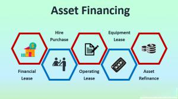

## Table of Contents

## What is asset financing?

Asset financing is a way for businesses to get the equipment or vehicles they need without paying for them all at once. Instead of using their own money, a business can borrow money to buy these assets. They then pay back the loan over time, usually with interest. This can help a business keep more cash on hand for other important things like running the business or expanding.

There are different types of asset financing, like hire purchase or leasing. With hire purchase, the business eventually owns the asset after making all the payments. With leasing, the business uses the asset for a set period but doesn't own it at the end. Asset financing can be a good option for businesses that need expensive equipment but don't want to spend a lot of money upfront. It can help them grow and manage their money better.

## How does asset financing work?

Asset financing works by letting a business borrow money to buy things like machines, vehicles, or other equipment they need. Instead of paying for everything at once, the business makes smaller payments over time. This way, they can use the equipment right away but spread out the cost. The business usually has to pay interest on the loan, which is like a fee for borrowing the money. The lender, like a bank or a finance company, keeps the asset as security until the loan is fully paid off.

There are different ways to do asset financing. One way is called hire purchase, where the business pays off the loan and then owns the asset at the end. Another way is leasing, where the business uses the asset for a certain time but gives it back or buys it at the end of the lease. Asset financing helps businesses because it lets them get what they need without using up all their money at once. This can be really helpful for growing a business or managing cash flow better.

## What are the different types of assets that can be financed?

Asset financing can be used for many different types of things that businesses need. Some common assets include vehicles like cars, trucks, or vans. These are important for businesses that need to transport goods or people. Another big category is machinery and equipment, like construction tools, manufacturing machines, or kitchen equipment for restaurants. These help businesses do their work more efficiently. Computers and office equipment, like desks and chairs, are also often financed because they are essential for running an office.

Other types of assets that can be financed include medical equipment for hospitals or clinics, which can be very expensive. Agricultural equipment, like tractors or harvesters, is important for farming businesses. Sometimes, even furniture and fixtures in a store or office can be financed. This helps businesses set up their spaces without spending a lot of money all at once. 

In some cases, businesses can also finance intangible assets, like software or intellectual property. This can be useful for tech companies or businesses that rely on specialized software to operate. Overall, asset financing is flexible and can cover a wide range of things that businesses need to grow and operate effectively.

## Who can benefit from asset financing?

Small businesses can really benefit from asset financing. They often don't have a lot of money to spend on big things like machines or vehicles all at once. By using asset financing, they can get what they need without using up all their cash. This helps them keep money for other important things, like paying employees or buying supplies. It also lets them grow their business faster because they can start using new equipment right away.

Big businesses can also use asset financing to their advantage. Even though they might have more money, it can still be smart to spread out the cost of expensive equipment over time. This helps them manage their cash flow better and keep more money available for other investments or emergencies. Plus, it can be easier to upgrade to newer, better equipment more often, which can help them stay competitive.

Asset financing isn't just for businesses. Sometimes, individuals can use it too. For example, someone might finance a car or a piece of equipment they need for a personal project. This way, they can get what they need without having to save up all the money first. It makes big purchases more manageable and helps people achieve their goals sooner.

## What are the steps involved in obtaining asset financing?

To get asset financing, the first thing a business or person needs to do is find a lender. This could be a bank, a finance company, or even a special company that focuses on asset financing. They should look at different lenders to see who offers the best deals and terms. Once they pick a lender, they need to apply for the financing. They will need to fill out an application form and give the lender information about their business, like how much money they make and how they plan to use the asset. The lender will also want to know about the asset itself, like what it is and how much it costs.

After the application is in, the lender will check it to see if the business or person can pay back the loan. They will look at things like credit history and financial statements. If everything looks good, the lender will approve the financing. Then, the business or person can buy the asset, and they will start making payments to the lender over time. These payments will include the cost of the asset plus interest. It's important to keep making these payments on time so the lender stays happy and the business can keep using the asset.

Sometimes, the lender might ask for something called a down payment, which is a part of the cost that the business or person pays right away. The rest of the cost is then spread out over time. If the business can't make the payments, the lender might take back the asset. But if everything goes well, at the end of the financing term, the business might own the asset completely, depending on the type of financing they chose.

## What are the interest rates and terms typically associated with asset financing?

Interest rates for asset financing can change a lot depending on things like the type of asset, how long the loan is for, and how good the borrower's credit is. Usually, interest rates for asset financing are between 5% and 20%. If a business has a good credit history, they might get a lower rate. But if their credit isn't so good, they might have to pay a higher rate. Also, the type of asset can affect the rate. For example, financing a car might have different rates than financing a big machine.

The terms of asset financing can also be different depending on the lender and the kind of financing. Most of the time, the loan term is between one and five years, but it can be shorter or longer. With hire purchase, the business makes payments over time and owns the asset at the end. With leasing, the business uses the asset for a set time but might have to give it back or buy it at the end. The terms will say how much the payments are and how often they need to be made, like monthly or yearly. It's important for the business to understand these terms so they can plan their money well and make sure they can keep up with the payments.

## How does asset financing compare to traditional loans?

Asset financing and traditional loans are both ways for businesses to get money, but they work a bit differently. With asset financing, the money is used to buy a specific thing, like a machine or a car. The business makes payments over time and the asset is used as security for the loan. This means if the business can't pay, the lender can take the asset back. Traditional loans, on the other hand, give the business money that they can use for anything they want. These loans might need something else as security, like property or personal guarantees, or they might not need any security at all.

The interest rates and terms can also be different between asset financing and traditional loans. Asset financing often has interest rates that are between 5% and 20%, depending on the asset and the business's credit. The terms are usually shorter, from one to five years, and the payments are tied to the asset. Traditional loans might have different interest rates, sometimes lower if the business has good credit and can offer good security. The terms for traditional loans can be longer, and the payments are based on the total loan amount, not just one asset. So, businesses need to think about what they need the money for and what kind of payments they can handle when choosing between asset financing and traditional loans.

## What are the advantages of using asset financing for businesses?

Asset financing helps businesses a lot because it lets them get the things they need without spending all their money at once. Instead of paying for a big machine or vehicle all at once, a business can make smaller payments over time. This keeps more cash in the business for other important things like paying employees or buying supplies. It also makes it easier for the business to grow because they can start using the new equipment right away without waiting to save up all the money.

Another good thing about asset financing is that it can be easier to get than other kinds of loans. Since the asset itself is used as security, lenders might be more willing to give the loan, even if the business's credit isn't perfect. This can be a big help for small businesses or new businesses that might not have a lot of credit history. Plus, with asset financing, businesses can often upgrade to newer, better equipment more often, which can help them stay ahead of their competition.

## What are the potential drawbacks or risks of asset financing?

Asset financing can have some risks that businesses need to think about. One big risk is that if the business can't make the payments, the lender might take back the asset. This could be a big problem if the business really needs that equipment to keep working. Also, asset financing usually comes with interest, which means the business ends up paying more over time than if they had bought the asset outright. This can add up and make the total cost a lot higher.

Another thing to consider is that asset financing might tie the business to a certain asset for a long time. If the business wants to switch to something newer or better before the financing is paid off, it could be tricky and expensive. Plus, if the asset loses value quickly, like some kinds of vehicles or technology, the business might end up paying for something that's not worth as much anymore. It's important for businesses to think about these risks and plan carefully before choosing asset financing.

## How does asset financing impact a company's balance sheet and tax situation?

Asset financing can change how a company's balance sheet looks. When a company uses asset financing, it doesn't have to pay for the whole asset right away. Instead, it borrows money to buy the asset and then pays it back over time. On the balance sheet, the asset will be listed, and there will also be a liability for the loan. This can make the company's balance sheet look healthier because it shows the asset as an asset and the loan as a liability, but it doesn't use up all the company's cash at once. This can help the company keep more cash on hand for other things.

Asset financing can also affect a company's taxes. Depending on the type of financing, the company might be able to claim tax deductions. For example, with hire purchase, the company can often claim depreciation on the asset and interest on the loan as tax deductions. This can lower the company's taxable income and save them money on taxes. But it's important for the company to talk to a tax expert to understand all the rules and make sure they're doing everything right.

## What are some advanced strategies for optimizing asset financing?

One advanced strategy for optimizing asset financing is to carefully match the financing term with the asset's useful life. If a business knows how long an asset will be useful, they can choose a financing term that ends around the same time. This way, they can plan to upgrade to newer equipment without being stuck with old, less useful stuff. It also helps them spread out the cost of the asset over its useful life, which can make their cash flow better. Another part of this strategy is to look at different kinds of financing, like hire purchase or leasing, and pick the one that fits the business's needs best. For example, if the business wants to own the asset at the end, hire purchase might be better. But if they want to upgrade often, leasing could be the way to go.

Another strategy is to use asset financing to manage tax benefits. Businesses can often claim tax deductions for depreciation on the asset and interest on the loan. By planning their financing around these tax benefits, they can lower their taxable income and save money. It's important for businesses to work with a tax expert to make sure they're using these benefits the right way. Also, businesses can look at bundling different assets into one financing deal. This can sometimes get them better terms or lower interest rates because the lender sees it as a bigger, more secure loan. By thinking carefully about these strategies, businesses can make the most out of asset financing and help their business grow and manage money better.

## How do regulatory changes affect asset financing practices?

Regulatory changes can have a big impact on how businesses use asset financing. When the rules change, it can affect things like interest rates, how much money businesses can borrow, and what kind of paperwork they need to do. For example, if new rules make it harder for businesses to get loans, they might have to look for other ways to get the equipment they need. Or, if the rules change to make it easier to claim tax benefits, more businesses might choose to use asset financing to save money on taxes. It's important for businesses to keep up with these changes so they can adjust their plans and make the best choices for their needs.

Sometimes, regulatory changes can also affect the kinds of assets that can be financed. If the government decides to put more rules on certain types of equipment, like making them meet new safety or environmental standards, it can change how much they cost or how easy they are to finance. This means businesses might need to look for different kinds of assets or find new lenders who are willing to work with the new rules. Keeping an eye on these changes helps businesses stay flexible and make sure they're following all the rules while still getting the equipment they need to grow and succeed.

## References & Further Reading

[1]: Bergstra, J., Bardenet, R., Bengio, Y., & Kégl, B. (2011). ["Algorithms for Hyper-Parameter Optimization."](https://dl.acm.org/doi/10.5555/2986459.2986743) Advances in Neural Information Processing Systems 24.

[2]: ["Advances in Financial Machine Learning"](https://www.amazon.com/Advances-Financial-Machine-Learning-Marcos/dp/1119482089) by Marcos Lopez de Prado

[3]: ["Evidence-Based Technical Analysis: Applying the Scientific Method and Statistical Inference to Trading Signals"](https://www.amazon.com/Evidence-Based-Technical-Analysis-Scientific-Statistical/dp/0470008741) by David Aronson

[4]: ["Machine Learning for Algorithmic Trading"](https://github.com/stefan-jansen/machine-learning-for-trading) by Stefan Jansen

[5]: ["Quantitative Trading: How to Build Your Own Algorithmic Trading Business"](https://www.amazon.com/Quantitative-Trading-Build-Algorithmic-Business/dp/1119800064) by Ernest P. Chan