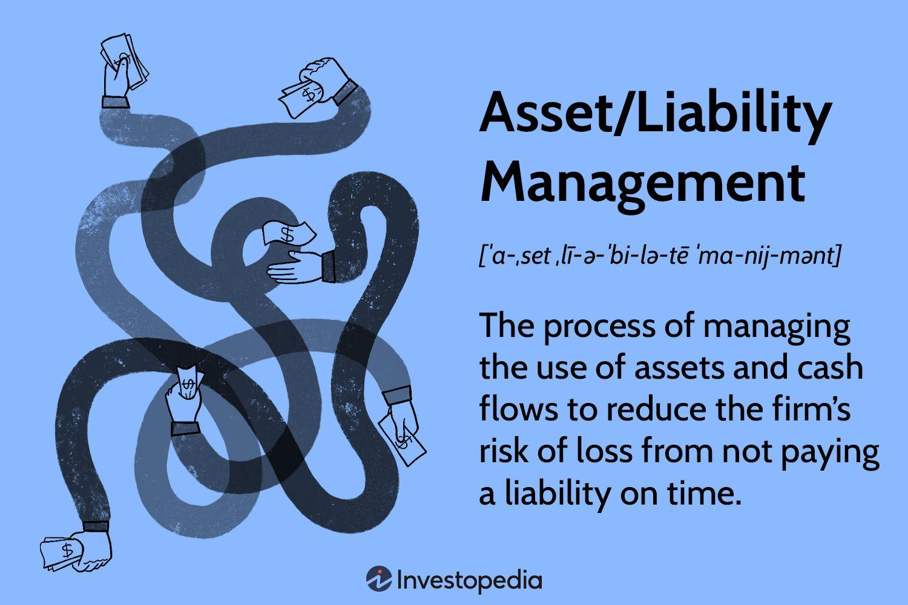

## Table of Contents

## What is asset and liability management?

Asset and liability management, often called ALM, is a way for banks and other financial institutions to manage the risks that come from their everyday business. This involves looking at the money they have coming in and going out, and making sure they have enough money to cover what they owe. It's like balancing a checkbook, but on a much bigger scale. The goal is to make sure the bank stays healthy and can keep serving its customers, even when things like interest rates or the economy change.

A big part of ALM is matching up the times when money comes in with the times when money goes out. For example, if a bank gives out a long-term loan, it needs to make sure it has enough money coming in over that same long period to cover it. This can be tricky because people can take their money out of the bank at any time, while loans might not be paid back for years. By carefully planning and using different financial tools, banks can manage these timing differences and reduce the risk of not having enough money when they need it.

## Why is asset and liability management important for businesses?

Asset and liability management is important for businesses because it helps them stay financially healthy. Just like people need to keep track of their money to make sure they can pay their bills, businesses need to do the same. By managing their assets (things they own that have value) and liabilities (things they owe), businesses can make sure they have enough money to cover their costs and keep running smoothly. This is especially important for businesses that deal with a lot of money, like banks, because they need to be ready for changes in the economy or interest rates.

Another reason asset and liability management is important is that it helps businesses plan for the future. By understanding when money will come in and when it needs to go out, businesses can make smart decisions about investments and growth. For example, if a business knows it will have a lot of money coming in next year, it might decide to expand or buy new equipment. On the other hand, if it knows it will have to pay back a big loan soon, it might decide to save more money instead. This kind of planning helps businesses avoid financial trouble and grow in a stable way.

## Can you provide a simple example of an asset and a liability?

An asset is something that a person or a business owns that has value. For example, if you own a car, that car is an asset because you can use it to drive places or sell it for money. If you have money in a savings account, that money is also an asset because you can use it to buy things or pay bills.

A liability is something that a person or a business owes to someone else. For example, if you borrow money from a bank to buy a car, the loan you have to pay back is a liability. If you owe money on a credit card, that debt is also a liability because you have to pay it back in the future.

## How do banks manage their assets and liabilities?

Banks manage their assets and liabilities by keeping a close eye on the money coming in and going out. They do this by making sure they have enough money to cover what they owe. For example, if a bank gives out loans, it needs to have enough money in its accounts to pay back people who want to take their money out of the bank. Banks also use different financial tools, like bonds or other investments, to make sure they have money coming in at the right times to match when they need to pay out money.

Another way banks manage their assets and liabilities is by planning for the future. They try to predict what will happen with interest rates and the economy, and then they make decisions based on those predictions. For instance, if a bank thinks interest rates will go up, it might change the rates it offers on loans or savings accounts. By doing this kind of planning, banks can reduce the risk of running into money problems and keep their business stable.

## What are the key principles of asset and liability management?

The key principles of asset and liability management are about making sure a business, like a bank, has enough money to cover what it owes and to keep running smoothly. One important principle is to match the times when money comes in with the times when money needs to go out. For example, if a bank gives out a loan that will be paid back over five years, it needs to make sure it has money coming in over those five years to cover it. This helps the bank avoid running out of money if a lot of people want to take their money out at the same time.

Another principle is to plan for the future and be ready for changes in things like interest rates or the economy. Banks try to predict what might happen and then make decisions based on those predictions. If they think interest rates will go up, they might change the rates they offer on loans or savings accounts. By planning ahead, banks can reduce the risk of financial problems and keep their business stable. This kind of planning helps them make smart decisions about where to put their money and how to grow their business safely.

## How does interest rate risk affect asset and liability management?

Interest rate risk is when the value of what a bank owns or owes changes because interest rates go up or down. This can be a big problem for banks because it can change how much money they make or lose. For example, if a bank gives out a loan with a fixed interest rate and then interest rates go up, the bank might miss out on making more money from new loans with higher rates. On the other hand, if interest rates go down, the bank might have to pay more to people who put money in the bank because they expect higher interest on their savings.

To manage interest rate risk, banks try to match the interest rates on their loans with the interest rates they pay to people who deposit money. This means if they have a lot of loans with fixed rates, they might also try to have a lot of savings accounts with fixed rates. By doing this, banks can make sure that if interest rates change, the money they make from loans and the money they pay on deposits will change in a similar way. This helps them keep their finances balanced and avoid big losses if interest rates move a lot.

## What role does liquidity management play in asset and liability management?

Liquidity management is a big part of asset and liability management. It's all about making sure a bank has enough cash or things that can be turned into cash quickly. This is important because people can come to the bank at any time and want to take their money out. If the bank doesn't have enough cash on hand, it might have to say no, which can cause big problems. So, banks need to keep a good amount of liquid assets, like cash or government bonds, to make sure they can always give money to people who want it.

Liquidity management also helps banks plan for the future. They need to think about when they will need a lot of cash and make sure they have it ready. For example, if a bank knows that a lot of loans will be paid back soon, it can use that money to cover any big withdrawals. By keeping a close eye on their liquidity, banks can make sure they always have enough money to cover what they owe and keep their customers happy. This is a key part of staying financially healthy and avoiding trouble.

## How can mismatches between assets and liabilities impact a company's financial health?

Mismatches between assets and liabilities can really hurt a company's financial health. When a company's money coming in doesn't match up with the money going out, it can run into big problems. For example, if a company has a lot of money tied up in long-term investments but needs to pay back a short-term loan, it might not have enough cash on hand. This can lead to the company not being able to pay its bills on time, which can damage its reputation and make it hard to get more loans in the future.

These mismatches can also make a company more vulnerable to changes in the economy or interest rates. If interest rates go up and a company has a lot of debt with variable rates, its costs can go up a lot. At the same time, if the company's income doesn't go up, it might struggle to cover these higher costs. By not matching up the timing and types of its assets and liabilities, a company can find itself in a tight spot, struggling to keep up with its financial obligations and potentially facing serious financial trouble.

## What are some advanced strategies used in asset and liability management?

One advanced strategy in asset and liability management is called duration matching. This means a bank tries to make the time it takes for its money to come in match the time it needs to pay out money. For example, if a bank has a lot of loans that will be paid back over ten years, it might invest in bonds that also pay back over ten years. This way, if interest rates change, the bank's income and costs will change at the same time, helping it stay balanced. It's like making sure the money coming in and going out is in sync, so the bank doesn't get caught off guard by big changes.

Another strategy is called interest rate swaps. This is when a bank agrees with another company to exchange interest payments. For example, if a bank has a loan with a variable interest rate but wants a fixed rate, it can swap its variable rate payments for fixed rate payments from another company. This helps the bank manage the risk of interest rates going up or down unexpectedly. By using swaps, the bank can make its cash flow more predictable and protect itself from sudden changes in the market.

A third strategy is stress testing. This means the bank runs simulations to see how it would handle really tough situations, like a big drop in the economy or a sudden change in interest rates. By doing these tests, the bank can figure out where it might be weak and make plans to fix those problems before they happen. It's like practicing for a big game, so when the real challenge comes, the bank is ready and can keep its finances strong.

## How do regulatory requirements influence asset and liability management practices?

Regulatory requirements play a big role in how banks manage their assets and liabilities. These rules are made by governments to make sure banks are safe and can handle their money well. For example, banks have to keep a certain amount of money in reserve, which means they can't use all their money for loans or investments. This helps make sure they always have enough cash to give to people who want to take their money out. Also, there are rules about how much risk banks can take, like limits on how much they can lend to one person or company. By following these rules, banks can avoid getting into big financial trouble and keep their customers' money safe.

Another way regulatory requirements affect asset and liability management is by making banks do regular checks on their finances. These checks, called stress tests, help banks see how they would do if something bad happened, like a big drop in the economy. Regulators want to make sure banks are ready for these tough times, so they set rules about how often these tests need to be done and what they need to cover. By following these rules, banks can plan better and make sure they have enough money to cover their costs, even when things get hard. This helps keep the whole financial system stable and protects people's savings.

## Can you explain the use of derivatives in managing asset and liability risks?

Derivatives are financial tools that banks use to manage the risks of their assets and liabilities. They are like bets on what might happen in the future with things like interest rates or the value of money. For example, a bank might use a derivative called an interest rate swap to change a variable interest rate loan into a fixed rate loan. This helps the bank know exactly how much money it will need to pay, even if interest rates go up or down. By using derivatives, banks can protect themselves from big changes in the market and keep their finances more stable.

Another way banks use derivatives is to hedge against currency risk. If a bank has loans or investments in different countries, the value of those assets and liabilities can change if the value of one country's money goes up or down compared to another. To manage this risk, the bank might use a derivative called a currency forward, which lets it lock in the exchange rate for a future date. This way, the bank knows exactly how much money it will get or need to pay, no matter what happens to the exchange rates. Using derivatives like this helps banks manage their money better and avoid big losses from changes in the market.

## What are the latest trends and technologies impacting asset and liability management?

One big trend in asset and liability management is the use of artificial intelligence and machine learning. These technologies help banks predict what might happen in the future, like changes in interest rates or the economy. By using AI, banks can make better decisions about where to put their money and how to manage their risks. For example, AI can look at a lot of data to find patterns that people might miss, helping banks plan better and stay financially healthy. This makes asset and liability management more accurate and efficient.

Another trend is the use of blockchain technology. Blockchain can make it easier and safer for banks to keep track of their assets and liabilities. It's like a digital ledger that everyone can see but no one can change without everyone agreeing. This helps banks trust the information they have about their money and reduces the chance of mistakes or fraud. Using blockchain can also speed up the process of managing assets and liabilities, making it easier for banks to keep everything in balance and react quickly to changes.

## What is the role of asset management in financial stability?

Asset management plays a pivotal role in maintaining financial stability by optimizing the allocation and utilization of financial resources to maximize returns while managing risk. A fundamental aspect of asset management involves balancing risk and return to achieve long-term financial objectives. This practice is critical for both individual investors and financial institutions, who seek to grow their asset bases and maintain the capacity to meet future liabilities.

In the context of financial institutions, asset management is a strategic approach to ensuring that assets are invested in a manner that not only seeks to yield optimal returns but also aligns with the institution's risk tolerance and financial objectives. This process involves the continuous assessment and analysis of market conditions and investment opportunities, which can be aided by sophisticated financial models and software tools. For example, institutions might employ quantitative models to evaluate risk-adjusted returns, which can be represented by the Sharpe ratio:

$$
\text{Sharpe Ratio} = \frac{R_p - R_f}{\sigma_p}
$$

where $R_p$ is the expected portfolio return, $R_f$ is the risk-free rate, and $\sigma_p$ is the portfolio standard deviation.

Institutions often use asset management strategies to diversify their investments, thereby spreading risk across different asset classes or geographical regions. This diversification aims to protect against market volatility and potential losses in any single investment category. Moreover, asset managers must remain vigilant in monitoring economic indicators, geopolitical events, and other factors that may impact market dynamics and thus require adjustments to investment strategies.

Furthermore, successful asset management necessitates the integration of emerging technologies and data analytics. Advanced data analytics and [machine learning](/wiki/machine-learning) models can improve the decision-making process, enabling asset managers to identify and exploit market inefficiencies more effectively. These technologies assist in predicting market trends, evaluating asset performance, and optimizing portfolio allocation.

In summary, asset management is integral to achieving financial stability by ensuring effective resource allocation and risk management. As market conditions evolve, continuous monitoring and adaptive strategies are essential for maintaining the balance between risk and return and meeting long-term financial goals.

## References & Further Reading

[1]: Bergstra, J., Bardenet, R., Bengio, Y., & Kégl, B. (2011). ["Algorithms for Hyper-Parameter Optimization."](https://dl.acm.org/doi/10.5555/2986459.2986743) Advances in Neural Information Processing Systems 24.

[2]: ["Advances in Financial Machine Learning"](https://www.amazon.com/Advances-Financial-Machine-Learning-Marcos/dp/1119482089) by Marcos Lopez de Prado

[3]: ["Evidence-Based Technical Analysis: Applying the Scientific Method and Statistical Inference to Trading Signals"](https://www.amazon.com/Evidence-Based-Technical-Analysis-Scientific-Statistical/dp/0470008741) by David Aronson

[4]: ["Machine Learning for Algorithmic Trading"](https://github.com/stefan-jansen/machine-learning-for-trading) by Stefan Jansen

[5]: ["Quantitative Trading: How to Build Your Own Algorithmic Trading Business"](https://github.com/LucindaYa/quant-resources/blob/master/Quantitative%20Trading%20How%20to%20Build%20Your%20Own%20Algorithmic%20Trading%20Business.pdf) by Ernest P. Chan