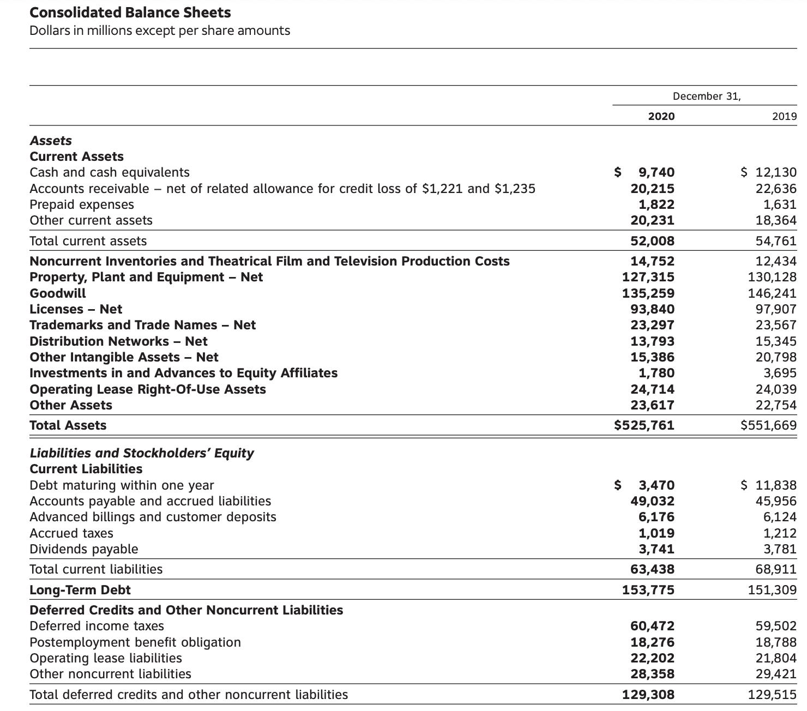

In the rapidly evolving world of finance, the effective management of assets and liabilities is crucial for maintaining financial stability. As the financial landscape becomes increasingly complex, the interconnected roles of liability management, asset management, and algorithmic trading emerge as fundamental components in shaping financial strategies. Grasping these concepts is essential for investors, financial institutions, and individuals aiming to navigate the intricacies of financial markets.

Liability management involves the strategic handling of financial obligations to ensure not only timely repayment but also the overall financial health of an institution. Financial institutions such as banks and insurance companies must adeptly manage liabilities to maintain liquidity and solvency, employing strategies like maturity matching and financial instruments such as swaps.



Conversely, asset management is centered around the optimal allocation and utilization of financial resources to maximize returns. Key to this practice is the balancing of risk and return, essential for achieving long-term financial objectives. Asset managers continually monitor market conditions and investment opportunities to grow asset bases while ensuring the capacity to meet future liabilities.

Algorithmic trading, or algo trading, plays a pivotal role in contemporary finance by using pre-defined algorithms to automate trade processes. This innovation enables the rapid analysis and execution of trades, especially prevalent in high-frequency trading environments such as stocks, forex, and cryptocurrencies. 

The integration of liability and asset management with algo trading techniques provides advanced mechanisms for risk reduction and enhanced efficiency. This synergy enables financial institutions to comply with regulatory demands and adjust swiftly to market dynamics.

As technology advances, the financial sector faces the imperative to remain agile and adaptive, leveraging opportunities presented by these evolving practices. Stakeholders in financial markets must prioritize continuous education and collaboration to stay competitive in this dynamic environment.

## Table of Contents

## Liability Management and Its Significance

Liability management is a critical aspect of financial operations, focusing on managing obligations to ensure timely repayment and maintain financial health. This is integral to the longevity and efficiency of financial institutions, including banks and insurance firms, which must navigate the complexities of balancing their financial commitments with available resources. Given the heightened scrutiny from regulators and stakeholders, these institutions place a strong emphasis on maintaining both [liquidity](/wiki/liquidity-risk-premium) and solvency.

A core strategy within liability management is matching the maturities of assets and liabilities. By aligning the timing of cash inflows and outflows, institutions can mitigate risks associated with fluctuations in interest rates and other market variables. For example, when the duration of liabilities matches the duration of corresponding assets, the institution can shield itself from adverse impacts caused by [interest rate](/wiki/interest-rate-trading-strategies) [volatility](/wiki/volatility-trading-strategies). This practice is crucial in ensuring that institutions can meet their obligations without resorting to costly financial maneuvers.

Financial institutions also employ various financial instruments, such as swaps and derivatives, which allow them to hedge against risk and manage debt efficiently. Swaps, for instance, are contracts that involve the exchange of cash flows between two parties, typically to secure more favorable interest rates or to switch from a variable to a fixed interest rate structure. These instruments provide a mechanism for institutions to stabilize their financial position and enhance their capacity to manage liabilities effectively.

Effective liability management not only aids in reducing financial risk but also contributes to enhanced profitability. By strategically managing their liabilities, institutions can reduce funding costs and improve their overall financial performance. Furthermore, a carefully crafted liability management strategy can lead to increased confidence from stakeholders, enabling an institution to access capital markets at more favorable terms.

In summary, liability management is pivotal for financial institutions aiming to ensure stability and optimize performance. By adeptly managing their obligations and employing strategic financial instruments, these organizations can significantly mitigate risk and enhance their operational efficiency.

## The Role of Asset Management in Financial Stability

Asset management plays a pivotal role in maintaining financial stability by optimizing the allocation and utilization of financial resources to maximize returns while managing risk. A fundamental aspect of asset management involves balancing risk and return to achieve long-term financial objectives. This practice is critical for both individual investors and financial institutions, who seek to grow their asset bases and maintain the capacity to meet future liabilities.

In the context of financial institutions, asset management is a strategic approach to ensuring that assets are invested in a manner that not only seeks to yield optimal returns but also aligns with the institution's risk tolerance and financial objectives. This process involves the continuous assessment and analysis of market conditions and investment opportunities, which can be aided by sophisticated financial models and software tools. For example, institutions might employ quantitative models to evaluate risk-adjusted returns, which can be represented by the Sharpe ratio:

$$
\text{Sharpe Ratio} = \frac{R_p - R_f}{\sigma_p}
$$

where $R_p$ is the expected portfolio return, $R_f$ is the risk-free rate, and $\sigma_p$ is the portfolio standard deviation.

Institutions often use asset management strategies to diversify their investments, thereby spreading risk across different asset classes or geographical regions. This diversification aims to protect against market volatility and potential losses in any single investment category. Moreover, asset managers must remain vigilant in monitoring economic indicators, geopolitical events, and other factors that may impact market dynamics and thus require adjustments to investment strategies.

Furthermore, successful asset management necessitates the integration of emerging technologies and data analytics. Advanced data analytics and [machine learning](/wiki/machine-learning) models can improve the decision-making process, enabling asset managers to identify and exploit market inefficiencies more effectively. These technologies assist in predicting market trends, evaluating asset performance, and optimizing portfolio allocation.

In summary, asset management is integral to achieving financial stability by ensuring effective resource allocation and risk management. As market conditions evolve, continuous monitoring and adaptive strategies are essential for maintaining the balance between risk and return and meeting long-term financial goals.

## Integrating Liability Management and Asset Management

Asset/liability management (ALM) is a critical practice in financial institutions, aimed at optimizing the organization’s balance sheet by effectively coordinating assets and liabilities. The goal of ALM is to manage interest rate risk and liquidity risk, ensuring that the cash flows from assets are synchronized with those of liabilities. This involves aligning the maturities, currencies, and cash flows of both sides of the balance sheet to maintain financial stability and profitability.

Interest rate risk arises from the variability of interest rates in the market, which can affect the net interest margin of financial institutions. By employing ALM strategies, institutions can mitigate this risk through various techniques such as duration matching, which involves matching the duration of assets and liabilities to help stabilize the institution’s economic value against interest rate fluctuations. 

Liquidity risk is another concern for financial institutions, referring to the possibility of not being able to meet short-term obligations due to a mismatch in the cash flow timings of assets and liabilities. An effective ALM strategy ensures that there is an adequate liquidity buffer and that assets can be liquidated or liabilities can be refinanced swiftly without incurring significant losses.

Recent advances in technology have significantly refined ALM practices. The integration of sophisticated software solutions allows financial institutions to conduct comprehensive scenario analysis, stress testing, and real-time monitoring, thus improving the precision and effectiveness of ALM. Software applications leverage data analytics and predictive modeling, providing insights that enhance decision-making processes regarding risk management and strategic planning.

Moreover, the use of automation and machine learning in ALM has further enhanced the ability to detect patterns, predict market movements, and adjust strategies dynamically. This technological edge is crucial as financial markets continue to evolve, presenting new challenges and opportunities. 

By continuously adapting ALM practices with these innovative tools, financial institutions can better manage risks associated with market volatility and maintain their overall financial health. The integration of liability management and asset management via advanced ALM strategies ensures the alignment of an institution’s financial functions with its long-term objectives.

## The Rise of Algorithmic Trading in Finance

Algorithmic trading, commonly referred to as algo trading, employs computer algorithms to automate trading activities in financial markets. This approach leverages advanced computational capabilities to analyze substantial datasets and execute trades at a pace that far surpasses human proficiency. This technological innovation plays an integral role in high-frequency trading ([HFT](/wiki/high-frequency-trading-strategies)), which is prevalent across diverse markets such as stocks, [forex](/wiki/forex-system), and cryptocurrencies.

The efficiency of [algorithmic trading](/wiki/algorithmic-trading) stems from its ability to process market data in real-time, using algorithms designed to identify potential trading opportunities based on pre-defined criteria. These algorithms can promptly respond to market conditions, making split-second decisions that are crucial for capturing optimal trading opportunities.

High-frequency trading is a subset of algo trading characterized by exceptionally high speeds, a large number of transactions, and extremely short-term investment horizons. HFT firms utilize sophisticated algorithms that can execute thousands of orders per second, often taking advantage of minute price discrepancies across different markets or financial instruments to generate profits.

Numerous strategies are employed in algorithmic trading, adapting to various market conditions and investment goals. Among these, trend-following strategies are notable for their reliance on statistical analysis to identify and exploit persistent market trends. Such strategies assume that historical price movements can inform future market behaviors, allowing algorithms to generate buy or sell signals based on emerging trends.

Another prominent algo trading strategy is statistical [arbitrage](/wiki/arbitrage), which involves profiting from the price differences of related financial instruments. This strategy typically requires the implementation of complex mathematical models to analyze price relations and predict temporary deviations from those relations. When the model detects a deviation, the algorithm can execute trades that capitalize on the expected price corrections.

Python has become a preferred programming language for implementing algorithmic trading strategies due to its extensive financial libraries and ease of use. For example, the following Python code snippet demonstrates a simple mean-reversion strategy, where the aim is to buy low and sell high based on historical price averages:

```python
import numpy as np
import pandas as pd

# Example price data
prices = pd.Series([100, 102, 105, 107, 110, 108, 106, 109])

# Calculate rolling mean and standard deviation
window = 3
rolling_mean = prices.rolling(window=window).mean()
rolling_std = prices.rolling(window=window).std()

# Trading signals: buy when price < mean - std, sell when price > mean + std
signals = (prices < (rolling_mean - rolling_std)) * 1 - (prices > (rolling_mean + rolling_std)) * 1

print("Trading Signals:\n", signals)
```

In summary, the rise of algorithmic trading signifies a transformative advancement in financial markets, enabling traders to leverage technology for enhanced efficiency and profitability. By employing diverse strategies such as trend-following and [statistical arbitrage](/wiki/statistical-arbitrage), algorithmic trading continues to reshape the dynamics of trading activities worldwide.

## The Intersection of Asset Management and Algo Trading

Advancements in technology have significantly influenced the field of asset management by introducing algorithmic trading, a practice that leverages computer algorithms to execute trades based on pre-determined criteria. Algorithmic trading, often referred to as algo trading, has transformed the way asset managers operate by providing tools to optimize trade execution, reduce transaction costs, and enhance portfolio performance.

One of the primary benefits of algo trading is its ability to process and analyze large volumes of financial data at speeds that far exceed human capabilities. This rapid processing enables asset managers to seize market opportunities that may only be available for short time periods and improve the timing of trade executions. Moreover, algorithms can be designed to minimize market impact and reduce slippage, thereby optimizing the execution price of trades.

Data analytics plays a critical role in the development of effective algorithmic trading strategies. By employing machine learning techniques, asset managers can analyze historical data to identify patterns and trends, allowing for the creation of more sophisticated and adaptive trading models. For instance, machine learning algorithms can be trained to recognize recurring market conditions and adjust trading strategies accordingly, improving decision-making and risk management.

Furthermore, the integration of algorithmic trading into asset management strategies has enabled a paradigm shift towards quantitative and systematic approaches. This transformation is characterized by a reliance on numerical data and statistical models to drive investment decisions, as opposed to traditional, discretionary methods. The symbiotic relationship between asset management and algo trading has thus facilitated the development of advanced trading strategies such as statistical arbitrage, [momentum](/wiki/momentum) trading, and mean-reversion approaches. These strategies capitalize on inefficiencies and patterns in the financial markets that may not be apparent through traditional analysis.

Python, a popular programming language in the finance industry, is extensively utilized for developing algorithmic trading systems due to its rich ecosystem of libraries such as NumPy, pandas, and scikit-learn. These libraries provide robust tools for data manipulation, analysis, and the implementation of machine learning algorithms. For example, a simple mean-reversion strategy can be implemented in Python to exploit price deviations as follows:

```python
import numpy as np
import pandas as pd

# Assuming 'prices' is a pandas DataFrame containing historical price data
window_size = 20
z_score_threshold = 1.5

# Calculate the rolling mean and standard deviation
rolling_mean = prices.rolling(window=window_size).mean()
rolling_std = prices.rolling(window=window_size).std()

# Calculate the z-score for mean reversion
z_score = (prices - rolling_mean) / rolling_std

# Generate trading signals based on z-score
buy_signals = (z_score < -z_score_threshold)
sell_signals = (z_score > z_score_threshold)
```

In conclusion, the integration of algorithmic trading into asset management has redefined traditional investment strategies, offering increased efficiency and adaptability. As technological advancements continue, it is anticipated that this intersection will further evolve, presenting new opportunities and challenges for asset managers seeking to maintain a competitive edge in the financial markets.

## Benefits and Challenges of Combined Financial Practices

Integrating liability management, asset management, and algorithmic trading offers substantial benefits, particularly in enhancing risk management and operational efficiency. By combining these financial practices, organizations can better align their financial strategies with both market dynamics and regulatory frameworks. This integration allows financial institutions to mitigate risks associated with interest rates, liquidity, and market volatility while optimizing asset performance and capital utilization.

One of the standout benefits is the ability of organizations to comply with regulatory demands more effectively. The synchronization of asset and liability management ensures that institutions maintain the necessary capital reserves and liquidity ratios, thus adhering to regulatory standards such as those set by the Basel III framework. Algorithmic trading further amplifies these advantages by providing precise, data-driven insights that can lead to improved decision-making and compliance.

However, the integration of these practices is not without challenges. Market volatility is a significant concern, as unpredictable shifts can affect the underlying assumptions of liability and asset strategies, potentially leading to mismatches between assets and liabilities. Moreover, the reliance on high-frequency data in algo trading necessitates robust data management systems to ensure the accuracy and integrity of information. Poor data quality or inadequate data processing capabilities can lead to suboptimal trading decisions and increased operational risks.

To maximize the potential of these integrated financial practices, continuous innovation and adaptation are crucial. Firms must invest in advanced technologies and analytical tools to handle vast amounts of data and adapt to evolving market conditions. These tools include machine learning models and predictive analytics, which can enhance the predictability and robustness of financial strategies.

In conclusion, while the integration of liability management, asset management, and algorithmic trading presents challenges, it also offers avenues for considerable improvements in risk management and operational performance. By leveraging technological advancements and maintaining a proactive approach to innovation, financial institutions can navigate the complexities of modern financial markets more effectively, ensuring growth and compliance in a rapidly changing environment.

## Conclusion

The convergence of liability management, asset management, and algorithmic trading is significantly reshaping financial operations, empowering institutions to achieve superior performance and stability. By integrating these elements, financial institutions can more effectively manage risk and optimize returns, enhancing their capacity to navigate financial markets' complexities. The synergy between these practices facilitates a holistic approach to financial management, where liabilities are strategically aligned with assets, and trading executions are optimized through sophisticated algorithms.

Technological advancements play a pivotal role in this transformation, enabling real-time data processing and analysis that drive innovation in financial strategies. As technology continues to evolve, the financial sector must maintain agility and adaptability to harness emerging opportunities. This adaptability not only involves adopting new technological tools but also fostering a forward-thinking organizational culture that embraces change and anticipates future trends.

Stakeholders within financial markets must prioritize education and collaboration to remain competitive. Continuous learning about new financial technologies and methodologies is critical, as is building partnerships that leverage diverse expertise. Collaborative efforts can drive the development of innovative solutions that address the challenges posed by market volatility, regulatory requirements, and data management. Ultimately, by embracing the convergence of these financial practices, stakeholders can enhance their strategic capabilities and sustain long-term success in a dynamic environment.

## References & Further Reading

[1]: Bergstra, J., Bardenet, R., Bengio, Y., & Kégl, B. (2011). ["Algorithms for Hyper-Parameter Optimization."](https://dl.acm.org/doi/10.5555/2986459.2986743) Advances in Neural Information Processing Systems 24.

[2]: ["Advances in Financial Machine Learning"](https://www.amazon.com/Advances-Financial-Machine-Learning-Marcos/dp/1119482089) by Marcos Lopez de Prado

[3]: ["Evidence-Based Technical Analysis: Applying the Scientific Method and Statistical Inference to Trading Signals"](https://www.amazon.com/Evidence-Based-Technical-Analysis-Scientific-Statistical/dp/0470008741) by David Aronson

[4]: ["Machine Learning for Algorithmic Trading"](https://github.com/stefan-jansen/machine-learning-for-trading) by Stefan Jansen

[5]: ["Quantitative Trading: How to Build Your Own Algorithmic Trading Business"](https://github.com/LucindaYa/quant-resources/blob/master/Quantitative%20Trading%20How%20to%20Build%20Your%20Own%20Algorithmic%20Trading%20Business.pdf) by Ernest P. Chan