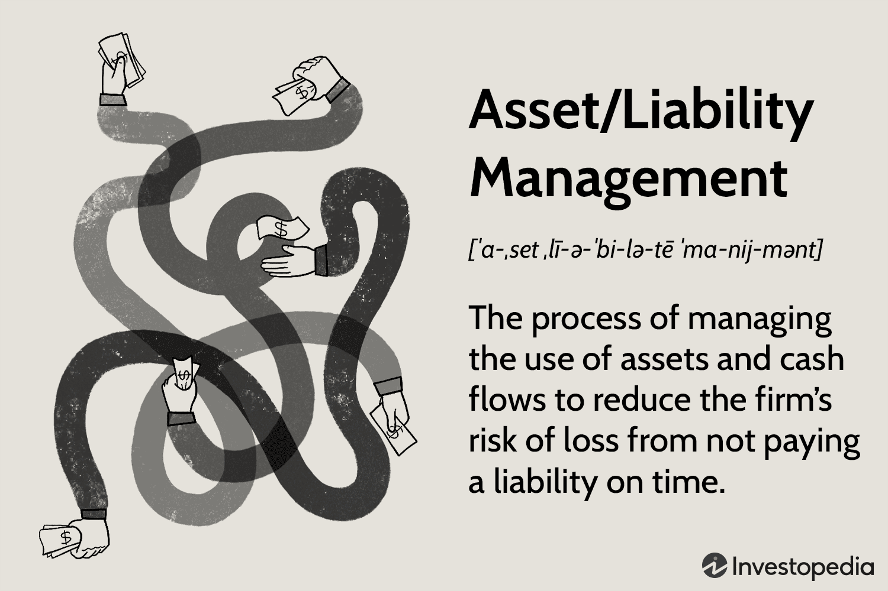

In the landscape of modern finance, the management of liabilities and assets is crucial for maintaining financial stability and achieving strategic goals. In recent decades, financial markets have undergone significant transformations, driven by globalization, technological advancements, and regulatory changes. These factors have collectively increased the complexity of financial mechanisms, necessitating a more comprehensive and integrated approach to financial management.

Liability management, asset management, and algorithmic trading are three domains that have become increasingly intertwined in optimizing financial strategies. Liability management involves the strategic handling of financial obligations to ensure an organization remains solvent and liquid. As financial institutions navigate challenging environments, the ability to deftly manage liabilities is fundamental for maintaining operational resilience and building stakeholder confidence.



Conversely, asset management focuses on the dynamic allocation of resources to maximize returns within acceptable risk parameters. By employing diverse portfolios with varied asset classes, organizations can mitigate market volatility and enhance their asset base to prepare for future liabilities. The use of advanced analytical tools and metrics like the Sharpe Ratio assists in evaluating risk-adjusted returns, enabling informed decision-making.

Algorithmic trading, or algo trading, introduces a technological dimension by automating the trading process using pre-programmed rules and computational algorithms. This approach facilitates rapid analysis and execution of trades, essential for capitalizing on fleeting market opportunities. Languages such as Python are instrumental in developing these algorithms, allowing for the implementation of sophisticated strategies like statistical arbitrage and trend-following that leverage historical data for predictive insights.

The interplay between liability management, asset management, and algorithmic trading is central to developing robust financial strategies. Embracing the integration of these components allows for improved risk management and performance optimization. As financial entities adapt to evolving market conditions, the confluence of advanced technology and strategic planning becomes vital for sustainable success.

In this article, we will explore how these distinct areas coalesce to form a cohesive framework for financial stability and growth. Particular emphasis will be placed on technological advancements and their role in bridging these domains to support more efficient and effective financial operations.

## Table of Contents

## Understanding Liability Management

Liability management is a critical aspect of modern financial strategy, focusing on the effective handling of financial obligations to maintain solvency and [liquidity](/wiki/liquidity-risk-premium) within an institution. The primary objective is to ensure that the organization can meet its debt obligations without compromising operational stability or growth potential. This involves a careful balancing act, where financial institutions align their liabilities — such as bonds, loans, and other forms of debt — with the cash flow generated from their assets.

One fundamental strategy in liability management is maturity matching. This involves coordinating the maturities of assets and liabilities to ensure that cash inflows from assets are available to meet the cash outflows required by liabilities. By doing so, institutions can protect themselves from liquidity shortages and reduce exposure to [interest rate](/wiki/interest-rate-trading-strategies) risk, which can occur when there's a mismatch between asset and liability durations.

Moreover, the use of financial derivatives plays a significant role in managing liabilities. Derivatives such as interest rate swaps, futures, and options are commonly employed to hedge against fluctuations in interest rates or currency values. This type of risk mitigation is essential for maintaining financial stability, particularly in volatile market conditions.

The alignment of asset maturities with liabilities is vital for shielding institutions from interest rate variations. For example, if interest rates rise, having short-term assets and long-term liabilities can lead to increased costs, whereas aligning the two can buffer against such impacts.

Effective liability management is not only about maintaining internal financial stability; it also has external implications. Demonstrating a robust liability management strategy can enhance confidence among stakeholders, including investors, creditors, and regulators. This confidence is built through a clear display of strategic planning and risk management capabilities, reinforcing the institution's reputation and reliability in the financial market.

In summary, liability management requires a thoughtful approach to aligning financial obligations with asset strategies, leveraging tools such as maturity matching and financial derivatives. By doing so, financial institutions can sustain operations, manage risks effectively, and foster trust and confidence among stakeholders.

## The Importance of Asset Management

Asset management focuses on the strategic allocation of resources to achieve maximum financial returns while operating within predefined risk levels. Effective asset management requires a dynamic approach to monitoring and adjusting investment holdings, enabling organizations to increase their asset base and adequately prepare for future liabilities.

To mitigate market [volatility](/wiki/volatility-trading-strategies), asset managers often diversify portfolios across various asset classes, such as equities, fixed income, real estate, and commodities. This diversification strategy is crucial as it reduces exposure to any single type of investment risk, fostering stability and potential growth. When determining the optimal mix of investments, asset managers frequently utilize financial tools like the Sharpe Ratio. This ratio measures risk-adjusted return, calculated as:

$$
\text{Sharpe Ratio} = \frac{E[R_p] - R_f}{\sigma_p}
$$

where $E[R_p]$ denotes the expected portfolio return, $R_f$ represents the risk-free rate, and $\sigma_p$ is the standard deviation of portfolio returns. A higher Sharpe Ratio indicates that an investment produces better returns per unit of risk.

Technological advancements, notably in [machine learning](/wiki/machine-learning) and [artificial intelligence](/wiki/ai-artificial-intelligence), have become increasingly integral to asset management. These technologies offer sophisticated analytical capabilities, identifying patterns and trends in large datasets that would be impossible to analyze manually. Machine learning algorithms can forecast market conditions or optimize portfolio allocations by analyzing historical data and real-time market information. Python is a popular programming language for these applications due to its versatility and extensive libraries such as NumPy and pandas, which facilitate data analysis, and TensorFlow and scikit-learn, which support machine learning models.

Incorporating technology into asset management not only enhances the precision of investment strategies but also improves efficiency, reducing time spent on data analysis and portfolio management. The seamless integration of these technological tools allows asset managers to make informed and timely investment decisions, effectively balancing the pursuit of higher returns with risk management objectives.

## Algorithmic Trading: The Technological Boost

Algorithmic trading automates the trading process by employing pre-defined rules and computational algorithms. This approach allows for unprecedented speed and efficiency in executing trades, which is particularly crucial in fast-paced financial markets. One significant aspect of [algorithmic trading](/wiki/algorithmic-trading) is high-frequency trading ([HFT](/wiki/high-frequency-trading-strategies)), a subsector that enhances trading efficiency through ultra-fast execution speeds. HFT platforms aim to capitalize on minuscule price discrepancies in the market by executing a large number of orders at high speeds. 

The central advantage of algorithmic trading lies in its ability for rapid analysis and execution. Algorithms can process vast amounts of market data, identify trading opportunities, and execute orders within milliseconds, a feat that is beyond human capabilities. This rapidity is essential for capturing fleeting market opportunities that may be available only for a very brief time frame.

Python, along with other programming languages, plays a crucial role in developing and implementing these algorithms. The language's simplicity and vast array of libraries for data analysis and machine learning make it ideal for creating sophisticated trading strategies. For instance, Python's `pandas` library facilitates data manipulation, while `numpy` enhances numerical computations, both of which are vital for algorithmic trading.

Statistical [arbitrage](/wiki/arbitrage) and trend-following are key strategies employed in algorithmic trading, leveraging historical data for predictive analytics. Statistical arbitrage involves the use of complex mathematical models to identify and exploit pricing inefficiencies between related financial instruments. Trend-following, on the other hand, is based on the premise that asset prices tend to move in observable trends. Both strategies rely heavily on historical data to predict future price movements.

In Python, a simple example of a trend-following algorithm could involve using moving averages. Consider the following code snippet:

```python
import numpy as np
import pandas as pd

# Generate a simple moving average (SMA)
def moving_average(data, window_size):
    return data.rolling(window=window_size).mean()

# Example time series data
price_data = pd.Series([120, 121, 119, 118, 122, 124, 121, 125])

# Calculate moving averages
short_window = 3
long_window = 5

short_mavg = moving_average(price_data, short_window)
long_mavg = moving_average(price_data, long_window)

# Generate signals
signals = np.where(short_mavg > long_mavg, 1.0, 0.0)  # Buy signal where short-term MA crosses above long-term MA
```

In this example, the algorithm calculates short-term and long-term moving averages of a given time series and generates buy signals when the short-term moving average crosses above the long-term moving average. This is a basic illustration of how algorithms can be employed to automate decision-making in trading.

Overall, algorithmic trading represents a significant technological boost for financial markets, increasing speed, efficiency, and the potential for profits. Through the application of computational algorithms, market participants can make data-driven decisions that align with complex, highly dynamic trading environments.

## Integrating Liability Management, Asset Management, and Algo Trading

Integrating liability management, asset management, and algorithmic trading into a cohesive financial strategy presents a comprehensive approach to managing risks and enhancing performance. Advanced Asset-Liability Management (ALM) strategies play a pivotal role in this integration by aligning assets with liabilities to maximize returns and mitigate risks, such as interest rate fluctuations. This involves techniques like duration matching or using derivatives to hedge potential discrepancies between asset and liability time horizons.

Algorithmic trading offers a significant technological boost to this integrated approach by providing real-time market insights and execution capabilities. Algorithms can analyze vast amounts of market data swiftly, identifying trends and patterns that may not be immediately apparent to human traders. This is particularly beneficial for high-frequency trading, where execution speed can translate into better pricing and increased profitability.

Moreover, the synergistic deployment of liability and asset management with algorithmic trading allows financial institutions to adhere to regulatory requirements more effectively. Through the precise calibration of their portfolios, institutions can maintain compliance with existing regulations, while also pursuing strategic objectives such as capital optimization and risk reduction.

In terms of technology, continuous adaptation is vital. The financial market landscape is dynamic, influenced by rapid technological advancements and evolving regulatory environments. Institutions must invest in cutting-edge technologies and analytical tools to keep pace. Machine learning and artificial intelligence are becoming increasingly integral, providing deeper insights and fostering more informed decision-making processes.

For example, Python's extensive libraries like Pandas for data manipulation, NumPy for numerical operations, and SciPy for statistical analyses can be used to build robust models that support ALM strategies. Here's a simple Python snippet that demonstrates aligning asset durations with liability durations using these libraries:

```python
import numpy as np
import pandas as pd

# Example asset and liability durations
asset_durations = np.array([3, 5, 7])
liability_durations = np.array([4, 6, 8])

# Align durations by minimizing difference
alignment = np.abs(asset_durations - liability_durations)
optimal_strategy_index = np.argmin(alignment)

optimal_strategy = {'Asset Duration': asset_durations[optimal_strategy_index],
                    'Liability Duration': liability_durations[optimal_strategy_index]}

print("Optimal Strategy:", optimal_strategy)
```

Embracing these integrated practices equips financial entities with a strategic advantage in navigating competitive markets. By fostering a culture of innovation and relentless improvement, institutions not only enhance their financial performance but also solidify their market footprint, ultimately driving sustainable success.

## Benefits and Challenges

Integrated practices in the fields of liability management, asset management, and algorithmic trading can significantly enhance risk management and operational efficiency for financial institutions. These synergies offer distinct advantages, including optimized resource allocation and improved decision-making processes. However, they also present challenges such as market volatility and the intricate nature of data management, particularly in algorithmic trading.

One of the primary benefits of integrating these financial strategies is the potential for substantial improvements in risk management. By aligning liability management with asset management and leveraging algorithmic trading, financial institutions can more effectively balance risks and returns. This integration facilitates the development of sophisticated risk assessment models that can adjust to fluctuating market conditions, thereby ensuring more stable financial outcomes.

Operational efficiency is another key advantage of this integrated approach. Combining asset and liability management with algorithmic trading allows for the automation of complex financial processes, freeing up resources for strategic initiatives. This efficiency is particularly crucial in high-frequency trading environments, where the speed and accuracy of transactions are paramount.

Nevertheless, these benefits are accompanied by significant challenges. Market volatility remains a constant threat, requiring institutions to maintain robust risk management frameworks. Additionally, the high complexity of data management in algorithmic trading poses hurdles. The vast amount of data generated requires sophisticated analytical tools for meaningful interpretation and decision-making.

To address these challenges effectively, investing in advanced technologies and analytical tools is imperative. Financial institutions must embrace innovations in data analytics, machine learning, and IT infrastructure to manage and interpret complex datasets efficiently. Such investments enable institutions to remain agile and responsive to market changes, mitigating the risks associated with volatility and data complexity.

A proactive, innovation-driven approach is essential for maximizing the benefits of integrated financial strategies. Institutions that prioritize continuous innovation and adaptability are better positioned to capture opportunities and mitigate threats in a volatile market environment. This involves not only technological investments but also fostering a culture of learning and adaptation within the organization.

Despite these challenges, the rewards of integrating liability management, asset management, and algo trading can lead to stronger financial performance and enhanced market positioning. Institutions that successfully navigate the complexities of these integrated practices can achieve a competitive edge, sustaining growth and profitability in evolving financial landscapes. Through strategic foresight and technological advancement, financial entities can harness the full potential of these synergies, ensuring long-term success and stability.

## Conclusion

The synergy achieved through the convergence of liability management, asset management, and algorithmic trading represents a significant restructuring of contemporary financial strategies. Through the integration of these domains, coupled with technological advancements, financial institutions can enhance their ability to manage risks while simultaneously optimizing returns. This is achieved by aligning asset and liability maturities, utilizing advanced financial derivatives for risk mitigation, and employing algorithmic trading for efficient market transactions.

A foundational element in capitalizing on these synergies is the commitment of stakeholders to continuous learning and adaptability. The rapidly evolving landscape of financial markets requires institutions to be prepared to adjust to new technologies and strategic frameworks swiftly. By fostering a culture of innovation and openness to change, institutions can better position themselves to exploit the benefits of integrated financial practices.

Embracing convergent methodologies enables financial entities to navigate complex markets effectively. This requires an integrative approach to financial management that reflects both strategic foresight and technological proficiency. For instance, deploying machine learning algorithms in asset management or leveraging high-frequency trading techniques can significantly improve decision-making processes and yield favorable financial outcomes.

In conclusion, the current dynamic financial environment demands an agile approach from institutions. This involves not only leveraging technological advancements but also developing strategic insights that facilitate sustainable success. By doing so, financial entities can ensure robust performance in the face of market uncertainties, thereby securing their position in a competitive landscape.

## References & Further Reading

[1]: Bergstra, J., Bardenet, R., Bengio, Y., & Kégl, B. (2011). ["Algorithms for Hyper-Parameter Optimization."](https://dl.acm.org/doi/10.5555/2986459.2986743) Advances in Neural Information Processing Systems 24.

[2]: ["Advances in Financial Machine Learning"](https://www.amazon.com/Advances-Financial-Machine-Learning-Marcos/dp/1119482089) by Marcos Lopez de Prado

[3]: ["Evidence-Based Technical Analysis: Applying the Scientific Method and Statistical Inference to Trading Signals"](https://www.amazon.com/Evidence-Based-Technical-Analysis-Scientific-Statistical/dp/0470008741) by David Aronson

[4]: ["Machine Learning for Algorithmic Trading"](https://github.com/stefan-jansen/machine-learning-for-trading) by Stefan Jansen

[5]: ["Quantitative Trading: How to Build Your Own Algorithmic Trading Business"](https://www.amazon.com/Quantitative-Trading-Build-Algorithmic-Business/dp/1119800064) by Ernest P. Chan