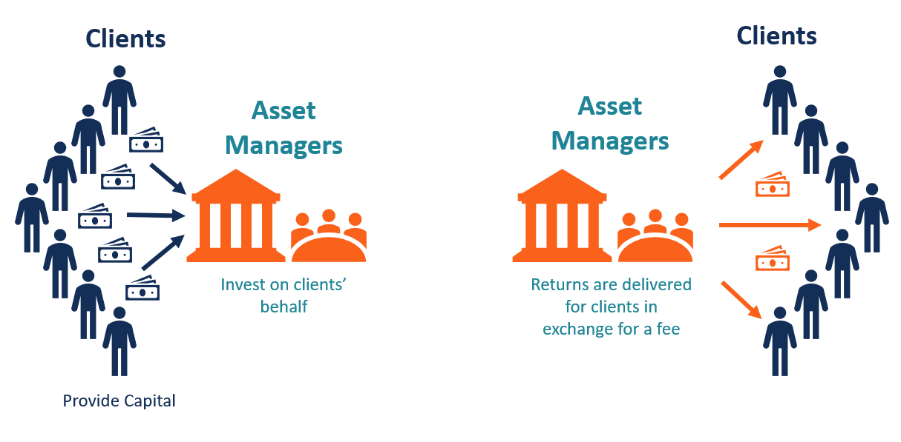

## Table of Contents

## What is an Asset Management Company?

An Asset Management Company, often called an AMC, is a firm that invests money on behalf of its clients. These clients can be individuals, businesses, or institutions like pension funds. The main job of an AMC is to grow the money of its clients by investing it in different places, like stocks, bonds, and real estate. They use their expertise to make smart investment choices and try to get the best returns possible for their clients.

AMCs also manage funds, which are collections of investments. When people buy into a fund, they are pooling their money together with other investors. The AMC then uses this pool of money to buy a variety of assets. This helps spread out the risk, so if one investment does poorly, the whole fund doesn't suffer as much. By managing these funds, AMCs help people invest without having to pick individual stocks or bonds themselves.

## What types of assets do Asset Management Companies typically manage?

Asset Management Companies usually handle a wide range of assets. The most common ones are stocks, which are shares in companies, and bonds, which are like loans to companies or governments. They also invest in real estate, which means buying properties like buildings or land. Another type of asset they manage is commodities, like gold or oil. These different types of assets help spread out the risk and can offer different ways to grow the money of their clients.

Besides these, AMCs also manage mutual funds and exchange-traded funds (ETFs). Mutual funds are pools of money from many investors that the AMC uses to buy a mix of stocks, bonds, or other assets. ETFs are similar but can be traded like stocks on an exchange. These funds make it easier for people to invest without having to pick each asset themselves. By managing these funds, AMCs help their clients get a diverse set of investments that can match their goals and how much risk they want to take.

Some AMCs also deal with alternative investments, which can include things like hedge funds, private equity, and even art or collectibles. These are often riskier but can offer higher returns. By managing such a variety of assets, AMCs aim to meet the different needs and goals of their clients, whether they want steady growth or are willing to take more risk for potentially bigger rewards.

## How does an Asset Management Company operate?

An Asset Management Company, or AMC, works by taking money from people and using it to buy different types of investments like stocks, bonds, and real estate. People give their money to the AMC because they trust the company to make good choices about where to invest it. The AMC uses its knowledge and skills to pick the best investments that match what the people want, like growing their money slowly or taking more risks for bigger rewards. The AMC charges a fee for managing the money, usually a small percentage of the total amount invested.

Once the AMC has the money, it puts it into different funds. These funds can be mutual funds or ETFs, which are like big baskets of investments. By putting money into these funds, the AMC spreads out the risk so that if one investment does badly, it doesn't hurt the whole fund too much. The AMC keeps track of how the investments are doing and makes changes when needed to try to get the best results for the people who gave them their money. They also give regular reports to their clients to show how their investments are doing and to help them make decisions about their money.

## What are the main services provided by an Asset Management Company?

An Asset Management Company, or AMC, helps people grow their money by investing it in different things like stocks, bonds, and real estate. They take the money from their clients and put it into funds, like mutual funds or ETFs. These funds are like big baskets of investments that help spread out the risk. The AMC uses its knowledge to pick the best investments that match what their clients want, whether it's steady growth or taking more risks for bigger rewards. They charge a small fee for managing the money, usually a percentage of the total amount invested.

The AMC keeps a close eye on how the investments are doing and makes changes when needed to try to get the best results for their clients. They also give regular reports to their clients to show how their investments are doing and to help them make decisions about their money. Besides managing funds, AMCs can offer other services like financial planning, where they help people plan for their future, and retirement planning, where they help people save for when they stop working. By offering these services, AMCs help their clients reach their financial goals.

## Who are the typical clients of an Asset Management Company?

The typical clients of an Asset Management Company are a mix of individuals, businesses, and big organizations. Individuals might be people who want to save for retirement or grow their savings. They give their money to the AMC because they trust the company to make smart investment choices. Businesses use AMCs to manage their extra money or to plan for future growth. They want to make sure their money is working hard for them.

Big organizations, like pension funds or insurance companies, also use AMCs. These organizations have a lot of money to invest and need help managing it. They rely on AMCs to handle their investments so they can focus on their main work. By working with an AMC, all these clients hope to grow their money safely and reach their financial goals.

## What qualifications are required to work at an Asset Management Company?

To work at an Asset Management Company, you usually need a good education in finance or business. A bachelor's degree in finance, economics, or a related field is often required. Many people in this job also have a master's degree, like an MBA or a Master's in Finance. Besides school, it helps to have certificates like the Chartered Financial Analyst (CFA) or the Certified Financial Planner (CFP). These show that you know a lot about investing and managing money.

Experience is also important. Many people start in entry-level jobs at banks or investment firms and work their way up. They learn about the markets, how to analyze investments, and how to talk to clients. Good communication skills are key because you need to explain complex ideas in a simple way to clients. Being good with numbers and paying attention to detail are also important. Working at an Asset Management Company means you need to keep learning and stay up-to-date with what's happening in the financial world.

## How do Asset Management Companies generate revenue?

Asset Management Companies make money by charging fees to their clients. The main fee they charge is called a management fee, which is a small percentage of the total money they are managing. For example, if someone gives them $100,000 to invest, the AMC might charge 1% of that each year, which is $1,000. This fee pays for the AMC's work in [picking](/wiki/asset-class-picking) and managing investments. The more money they manage, the more they earn from these fees.

Sometimes, AMCs also charge performance fees. This means if they do a really good job and make more money for their clients than expected, they get an extra fee. This encourages the AMC to work hard to get the best results. Besides these fees, AMCs might also make money from other services they offer, like financial planning or retirement planning. By offering these extra services, they can earn more money and help their clients in different ways.

## What are the key performance indicators for an Asset Management Company?

Key performance indicators (KPIs) for an Asset Management Company help them see how well they are doing. One important KPI is the total amount of money they manage, called assets under management (AUM). The more money they manage, the more fees they can earn. Another KPI is the return on investment (ROI), which shows how much money their investments have made for their clients. A high ROI means the AMC is picking good investments. They also look at client retention rates, which show how many clients keep using their services over time. High retention means clients are happy with the AMC's work.

Another important KPI is the expense ratio, which is how much it costs to run the funds they manage. A lower expense ratio means more money stays with the clients. AMCs also pay attention to risk-adjusted returns, which look at how much risk they took to get their returns. Good risk-adjusted returns show the AMC is balancing risk and reward well. Lastly, they track client satisfaction through surveys and feedback. High satisfaction means clients trust the AMC and are likely to recommend it to others. These KPIs help AMCs understand their performance and make better decisions for their clients.

## How does regulation impact Asset Management Companies?

Regulation has a big impact on how Asset Management Companies, or AMCs, work. Governments and financial watchdogs make rules to protect people who invest their money with AMCs. These rules make sure AMCs are honest and clear about what they do with the money. For example, AMCs have to tell their clients about any fees they charge and how their investments are doing. They also have to follow strict rules about what kinds of investments they can make and how much risk they can take. This helps keep the financial system safe and fair for everyone.

These rules can also make it harder for AMCs to do their job. They have to spend time and money to make sure they follow all the regulations. Sometimes, the rules can limit what investments AMCs can make, which might mean they can't always pick the best options for their clients. But, even with these challenges, regulations are important. They help build trust between AMCs and their clients, which is key to the whole financial world working well.

## What are the risks associated with investing through an Asset Management Company?

Investing through an Asset Management Company can come with some risks. One big risk is that the value of your investments might go down. This can happen if the stocks, bonds, or other things the AMC buys don't do well. Even though AMCs try to pick good investments, no one can predict the future, and sometimes things don't work out as planned. Another risk is that you might not make as much money as you hoped. The fees the AMC charges can eat into your returns, and if the investments don't grow fast enough, you might end up with less money than you expected.

There's also the risk that the AMC might make bad choices or even do something wrong. They have to follow lots of rules, but mistakes can still happen. If an AMC doesn't manage your money well or breaks the rules, it could hurt your investments. Lastly, there's the risk that you might not fully understand what the AMC is doing with your money. It's important to ask questions and make sure you know what's going on, but sometimes the details can be hard to understand. By knowing these risks, you can make better choices about whether to invest through an AMC.

## How do Asset Management Companies manage risk?

Asset Management Companies, or AMCs, work hard to manage risk for their clients. They do this by spreading out the money they manage across different types of investments, like stocks, bonds, and real estate. This is called diversification. By not putting all the money into one thing, they reduce the chance that a single bad investment will hurt the whole fund. AMCs also keep a close eye on how their investments are doing and make changes when needed. If they see a big risk coming, they might sell some investments and buy others to protect their clients' money.

Another way AMCs manage risk is by setting rules about how much risk they can take. They have to follow these rules, which are often set by the government or financial watchdogs. These rules help make sure AMCs don't take too many chances with their clients' money. AMCs also use special tools and models to predict how risky an investment might be. By using these tools, they can make smarter choices and try to keep their clients' money safe while still trying to grow it.

## What are the latest trends and innovations in the Asset Management industry?

The asset management industry is always changing, and one big trend right now is the use of technology. More and more, AMCs are using things like [artificial intelligence](/wiki/ai-artificial-intelligence) and big data to help them pick investments. These tools can look at huge amounts of information really fast and find patterns that people might miss. This helps AMCs make better choices and manage risk more carefully. Another trend is the rise of robo-advisors, which are computer programs that give investment advice without a human doing it. They're cheaper than traditional AMCs and can be a good choice for people who want to invest but don't have a lot of money to start with.

Another important trend is the focus on sustainable and responsible investing. More people want to put their money into companies that are good for the environment or society. This is called [ESG](/wiki/esg-investing) investing, which stands for Environmental, Social, and Governance. AMCs are paying more attention to these factors when they pick investments. They're also offering more funds that focus on ESG, so people can invest in a way that matches their values. This trend is growing fast and is changing how AMCs think about what makes a good investment.

Lastly, there's a trend towards more personalized services. AMCs are using technology to give their clients more tailored advice and investment options. They can look at a person's whole financial situation and make a plan that fits their specific goals and how much risk they want to take. This is different from the old way of just putting everyone's money into the same funds. By offering these personalized services, AMCs can help their clients reach their financial goals in a way that feels right for them.

## What is the Role of Asset Management?

Asset management is a critical function in the financial sector, tasked with managing and growing investment portfolios for institutions and individual clients. The primary goal in asset management is to increase the value of the client's portfolio over time while carefully controlling risk exposure. This process involves a detailed understanding of market dynamics, financial instruments, and the specific investment goals of each client.

Asset management companies (AMCs) are organizations that offer these services, providing professional expertise to guide investment strategies. These companies use rigorous analysis and strategic planning to optimize portfolio performance. Through diversification, asset managers can spread risk across various investment types, industries, and geographical regions, thereby enhancing the potential for returns while mitigating potential losses. 

The success of an asset management strategy often depends on the ability to effectively balance risk and return. This balance is typically quantified using the Sharpe Ratio, which measures the excess return per unit of risk:

$$
\text{Sharpe Ratio} = \frac{R_p - R_f}{\sigma_p}
$$

where $R_p$ is the portfolio return, $R_f$ is the risk-free rate, and $\sigma_p$ is the standard deviation of the portfolio's excess return. A higher Sharpe Ratio indicates a more attractive risk-adjusted return, a central objective for asset managers.

Moreover, technology plays a pivotal role in modern asset management. Advanced data analytics and [machine learning](/wiki/machine-learning) algorithms are increasingly utilized to analyze market trends and forecast future movements. This technological leverage provides a competitive edge, allowing managers to make informed decisions, adjust portfolios dynamically, and respond quickly to market fluctuations.

Asset managers also consider the [liquidity](/wiki/liquidity-risk-premium) of investments, ensuring that the portfolio includes assets that can be readily bought or sold in the market without causing a significant impact on the asset's price. This aspect is essential for meeting clients' immediate and potential future cash flow needs.

Furthermore, AMCs tailor their services to meet the diverse needs of their clients, which may range from modest individual accounts to large institutional portfolios. They often offer various products such as mutual funds, exchange-traded funds (ETFs), and tailored investment strategies that reflect specific risk appetites and investment horizons.

In summary, asset management is a sophisticated process that combines financial acumen, market knowledge, and strategic foresight. By effectively managing risk and leveraging opportunities for growth, asset managers aim to achieve the financial objectives set by their clients, playing an indispensable role in the broader financial ecosystem.

## References & Further Reading

[1]: Pojarliev, M., & Levich, R. (2008). ["Do Professional Currency Managers Beat the Benchmark?"](https://www.jstor.org/stable/40390336) Financial Analysts Journal, 64(5), 18-32.

[2]: Lopez de Prado, M. (2018). ["Advances in Financial Machine Learning"](https://www.amazon.com/Advances-Financial-Machine-Learning-Marcos/dp/1119482089). Wiley.

[3]: Aldridge, I. (2013). ["High-Frequency Trading: A Practical Guide to Algorithmic Strategies and Trading Systems"](https://www.amazon.com/High-Frequency-Trading-Practical-Algorithmic-Strategies/dp/1118343506). Wiley.

[4]: Greiner, M. (2014). ["Determination of Optimal Hedge Fund Portfolios"](https://link.springer.com/article/10.1007/s10957-012-0208-1). Gabler Verlag.

[5]: Chan, E. (2009). ["Quantitative Trading: How to Build Your Own Algorithmic Trading Business"](https://github.com/ftvision/quant_trading_echan_book). Wiley.

[6]: Aronson, D. R. (2007). ["Evidence-Based Technical Analysis: Applying the Scientific Method and Statistical Inference to Trading Signals"](https://onlinelibrary.wiley.com/doi/book/10.1002/9781118268315). Wiley.

[7]: Jansen, S. (2020). ["Machine Learning for Algorithmic Trading"](https://github.com/stefan-jansen/machine-learning-for-trading). Packt Publishing.