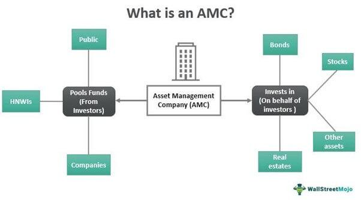

The modern financial landscape has undergone a transformative evolution driven by the integration of technology and innovative strategies. Central to this evolution are investment funds, financial services, asset management, and algorithmic trading, which collectively define and shape the operational dynamics of contemporary markets. Investment funds function as collective vehicles for pooling capital from diverse investors to acquire a wide range of securities, thereby enabling diversification and professional management. Asset management encompasses the strategic oversight of investment portfolios, aiming to enhance growth while prudently managing potential risks.

Meanwhile, financial services cover an expansive suite of offerings, from traditional banking and insurance to modern investment and digital payment platforms, providing essential infrastructure for economic progression and investment opportunities. The intersection of financial services with technology has led to unprecedented levels of efficiency, accessibility, and choice for consumers.



At the forefront of technological innovation in finance is algorithmic trading, which employs sophisticated algorithms to automate trade execution. This process leverages speed and volume to capitalize on minor market fluctuations with reduced human intervention, playing a crucial role in high-frequency trading environments across diverse markets, including stocks, forex, and cryptocurrencies. Together, these components form the backbone of modern finance, fostering a dynamic and efficient ecosystem while presenting unique challenges and risks that must be adeptly navigated.

## Table of Contents

## What are Investment Funds?

Investment funds operate as collective investment vehicles, pooling capital from multiple investors to purchase a range of securities. This structure offers several advantages, such as diversification, professional management, and economies of scale, which are crucial for both novice and seasoned investors.

One of the primary features of investment funds is diversification. By investing in a broad array of assets, these funds help mitigate risks that are commonly associated with investing in individual securities. This is achieved by spreading investments across different asset classes, sectors, or geographic regions, reducing the impact of any single asset's poor performance on the overall portfolio.

Investment funds are professionally managed, with fund managers or management teams responsible for making investment decisions. These professionals leverage their expertise, conducting research and analysis to select the best securities that align with the fund's objectives. This level of professional oversight provides investors with reassurance, especially those who might lack the time or knowledge to manage their investments effectively.

Moreover, investment funds benefit from economies of scale. By pooling resources, they can lower transaction costs and access investments that may be out of reach for individual investors. This bulk-buying advantage allows funds to manage costs more efficiently, sometimes resulting in lower expense ratios compared to smaller, independent investment accounts.

There are several common types of investment funds, each catering to different investor needs and objectives. Mutual funds are one of the most popular types, allowing investors to buy shares in a diversified portfolio that is actively managed by a professional team. Hedge funds, typically targeted at high-net-worth individuals and institutional investors, employ a variety of sophisticated strategies to achieve high returns, often involving higher risk. Exchange-traded funds (ETFs) are similar to mutual funds but trade on stock exchanges like individual stocks, offering [liquidity](/wiki/liquidity-risk-premium) and flexibility in trading.

The primary objectives of investment funds vary, with some focusing on income generation, while others target capital appreciation. Income-focused funds may invest in bonds or dividend-paying stocks to provide regular income to investors. In contrast, funds aimed at capital appreciation may seek out stocks or other assets with significant growth potential, reinvesting earnings to compound returns over time.

In summary, investment funds play a pivotal role in modern investment strategies, offering a blend of diversification, professional expertise, and accessibility. As investors seek to achieve specific financial goals, these funds provide structured and efficient avenues for capital growth and income generation.

## The Role of Asset Management

Asset management is a critical function in the financial sector, tasked with managing and growing investment portfolios for institutions and individual clients. The primary goal in asset management is to increase the value of the client's portfolio over time while carefully controlling risk exposure. This process involves a detailed understanding of market dynamics, financial instruments, and the specific investment goals of each client.

Asset management companies (AMCs) are organizations that offer these services, providing professional expertise to guide investment strategies. These companies use rigorous analysis and strategic planning to optimize portfolio performance. Through diversification, asset managers can spread risk across various investment types, industries, and geographical regions, thereby enhancing the potential for returns while mitigating potential losses. 

The success of an asset management strategy often depends on the ability to effectively balance risk and return. This balance is typically quantified using the Sharpe Ratio, which measures the excess return per unit of risk:

$$
\text{Sharpe Ratio} = \frac{R_p - R_f}{\sigma_p}
$$

where $R_p$ is the portfolio return, $R_f$ is the risk-free rate, and $\sigma_p$ is the standard deviation of the portfolio's excess return. A higher Sharpe Ratio indicates a more attractive risk-adjusted return, a central objective for asset managers.

Moreover, technology plays a pivotal role in modern asset management. Advanced data analytics and [machine learning](/wiki/machine-learning) algorithms are increasingly utilized to analyze market trends and forecast future movements. This technological leverage provides a competitive edge, allowing managers to make informed decisions, adjust portfolios dynamically, and respond quickly to market fluctuations.

Asset managers also consider the liquidity of investments, ensuring that the portfolio includes assets that can be readily bought or sold in the market without causing a significant impact on the asset's price. This aspect is essential for meeting clients' immediate and potential future cash flow needs.

Furthermore, AMCs tailor their services to meet the diverse needs of their clients, which may range from modest individual accounts to large institutional portfolios. They often offer various products such as mutual funds, exchange-traded funds (ETFs), and tailored investment strategies that reflect specific risk appetites and investment horizons.

In summary, asset management is a sophisticated process that combines financial acumen, market knowledge, and strategic foresight. By effectively managing risk and leveraging opportunities for growth, asset managers aim to achieve the financial objectives set by their clients, playing an indispensable role in the broader financial ecosystem.

## Financial Services and Their Impact

Financial services encompass a wide variety of offerings that play a crucial role in the functioning of global economies. Key components of financial services include banking, investment management, insurance, and financial advisory services, each contributing to economic stability and growth. These services facilitate efficient allocation of resources by channeling funds from savers to borrowers and enabling risk management, wealth accumulation, and liquidity. 

The banking sector, one of the oldest financial services, provides an array of products like savings and checking accounts, loans, and mortgages. Banks act as intermediaries in the financial system, offering a secure place for individuals and businesses to deposit money and extend credit. Investment services, involving both individual and institutional investors, help in capital formation through the purchase and sale of securities, such as stocks and bonds. This sector aims to optimize returns by diversifying investments and managing risks through strategies grounded in extensive market analysis.

Insurance provides a critical safety net by allowing individuals and businesses to mitigate financial risks associated with unforeseen events. Various insurance products cover life, health, property, and liability risks, ensuring financial security and continuity. Meanwhile, financial advisory services guide clients on financial planning, investment strategies, and retirement savings, adapting to their specific financial goals and risk tolerances.

The impact of financial services is profound in stimulating economic growth, as they enable investments in infrastructure, innovation, and human capital. Accessibility to financing options empowers businesses to expand operations, create jobs, and contribute to the economic development of a country. Moreover, personal financial management tools help individuals save for retirement, education, and emergencies, contributing to personal financial health.

The integration of technology has significantly transformed financial services, leading to the emergence of fintech, which enhances efficiency and accessibility while reducing costs. Digital platforms, [artificial intelligence](/wiki/ai-artificial-intelligence), and blockchain are some of the technological advancements driving this transformation. Online banking, mobile payments, robo-advisors, and peer-to-peer lending have democratized financial services, making them more accessible to underserved populations.

For example, consider a simple Python program illustrating a compound interest calculation, a fundamental concept used in financial planning and banking:

```python
def compound_interest(principal, rate, time, n):
    # Calculate compound interest
    amount = principal * (1 + rate / n) ** (n * time)
    interest = amount - principal
    return interest, amount

# Principal amount, annual interest rate, time in years, number of times interest is compounded per year
principal_amount = 10000  # $10,000
annual_rate = 0.05  # 5% annual interest
years = 10  # for 10 years
compounding_periods_per_year = 4  # quarterly compounding

interest, final_amount = compound_interest(principal_amount, annual_rate, years, compounding_periods_per_year)
```

Through the combination of these diverse services and technological innovations, the financial industry has evolved into a more inclusive, resilient, and adaptive system, crucial for supporting both individual financial goals and broader economic progress.

 to Algorithmic Trading

Algorithmic trading, commonly referred to as algo trading, leverages computer programs to automate the trading process. By employing pre-determined algorithms, these systems can execute trades with minimal human intervention. The core advantage of [algorithmic trading](/wiki/algorithmic-trading) lies in its capability to process and act on market data at extraordinary speeds, often executing trades in fractions of a second. This characteristic makes it particularly useful in high-frequency trading ([HFT](/wiki/high-frequency-trading-strategies)), where the sheer [volume](/wiki/volume-trading-strategy) and rapid speed of transactions are critical.

In algo trading, algorithms are designed to identify profitable opportunities by analyzing market conditions, historical data, and statistical models. These algorithms can vary from simple strategies, such as moving averages, to sophisticated ones that incorporate machine learning and artificial intelligence for predictive modeling. The goal is to capitalize on small market discrepancies, which can be exploited repeatedly for profit.

A typical example of a simple algorithm might involve the use of moving averages where a trade is triggered when a shorter-term moving average crosses above a longer-term moving average, a signal often interpreted as a buying opportunity. 

```python
# Example of a simple moving average crossover strategy
def moving_average(data, window_size):
    return data.rolling(window=window_size).mean()

def crossover_strategy(data, short_window, long_window):
    short_mavg = moving_average(data['Close'], short_window)
    long_mavg = moving_average(data['Close'], long_window)

    signals = pd.DataFrame(index=data.index)
    signals['signal'] = 0.0
    signals['signal'][short_window:] = np.where(short_mavg[short_window:] > long_mavg[short_window:], 1.0, 0.0)
    signals['positions'] = signals['signal'].diff()

    return signals
```

Despite its benefits, algorithmic trading is not without challenges. Technical failures, such as software bugs or network outages, can lead to significant financial losses. The reliance on technology also introduces the risk of market manipulation or the amplification of market [volatility](/wiki/volatility-trading-strategies). Furthermore, ensuring the algorithms are robust and adaptive to changing market conditions demands continuous monitoring and adjustment by traders.

Algorithmic trading has also found a substantial role in diverse financial markets, including stocks, foreign exchange ([forex](/wiki/forex-system)), and cryptocurrencies. Each market presents unique opportunities and challenges, which algos exploit by adapting their strategies to the specific characteristics of the assets traded.

In summary, algorithmic trading enhances trading efficiency and precision through automation, largely influencing modern financial markets by maximizing speed and minimizing human biases. Yet, its execution and maintenance require careful consideration to mitigate associated risks.

## The Benefits and Challenges of Algo Trading

Algorithmic trading, often referred to as algo trading, capitalizes on the power of advanced algorithms and computing capabilities to improve the efficiency of trade execution. It offers significant advantages, primarily driven by its ability to process large volumes of data swiftly and execute trades with remarkable precision and speed. This capability is essential in capturing small price inefficiencies in the market, which manual trading might miss due to slower execution times. Algorithms, devoid of emotional biases, ensure decisions are made based on data-driven insights, promoting consistency and rationality in trading.

A typical algorithmic trading strategy could involve statistical [arbitrage](/wiki/arbitrage), where the algorithm identifies and exploits pricing discrepancies between correlated securities. An example in Python to identify such opportunities could look like:

```python
import numpy as np

# Simulated price data for two correlated securities
security_A = np.random.normal(loc=100, scale=1, size=1000)
security_B = np.random.normal(loc=100, scale=1.1, size=1000)

# Calculate the spread
spread = security_A - security_B

# Define and apply a simple arbitrage logic
threshold = 0.5
positions = []

for i in range(len(spread)):
    if spread[i] > threshold:
        positions.append('Sell A, Buy B')
    elif spread[i] < -threshold:
        positions.append('Buy A, Sell B')
    else:
        positions.append('Hold')
```

While the benefits are clear, algorithmic trading also presents challenges. One significant risk is technical failure, where system bugs or connectivity issues can disrupt operations, leading to erroneous trades. Furthermore, sophisticated algorithms can contribute to increased market volatility, as seen during the Flash Crash of 2010, when automated selling led to a rapid, deep market decline.

Moreover, improperly managed algorithmic strategies [carry](/wiki/carry-trading) the potential for substantial financial loss. A poor understanding of the underlying market mechanics or misconfigured algorithms can result in significant deviations from expected performance. This highlights the importance of rigorous testing and robust risk management frameworks.

In conclusion, while algorithmic trading offers efficiency and precision, it must be implemented with careful consideration of associated risks and challenges to fully exploit its potential benefits.

## Conclusion

Investment funds, financial services, asset management, and algorithmic trading are pivotal in shaping the modern financial market. These components form a cohesive and interconnected system that channels capital flow, manages assets, and facilitates seamless trading activities. The dynamic and efficient nature of this ecosystem is both a strength and a challenge. While it allows for rapid growth and diversification of assets, it also demands vigilant management to navigate potential volatility and systemic risks.

Incorporating advanced technologies has amplified the reach and efficiency of financial services, providing unprecedented access and opportunities for investors and institutions alike. However, this progression has introduced complexities, particularly in managing the vast amounts of data and the rapid execution of trades through algorithmic systems. The potential for technical glitches or missteps in strategy poses significant risks, necessitating robust risk management frameworks and strategic oversight.

As the financial industry progresses, strategic management in these areas becomes even more crucial. The ability to harness technology's benefits while mitigating its risks will likely dictate future success in the financial sector. Organizations that can effectively integrate these elements while maintaining robust control mechanisms are positioned to lead in the evolving financial landscape. This ongoing evolution emphasizes the importance of adaptability and innovation in ensuring sustainable growth and operational resilience in the financial markets.

## References & Further Reading

[1]: Pojarliev, M., & Levich, R. (2008). ["Do Professional Currency Managers Beat the Benchmark?"](https://www.jstor.org/stable/40390336) Financial Analysts Journal, 64(5), 18-32.

[2]: Lopez de Prado, M. (2018). ["Advances in Financial Machine Learning"](https://www.amazon.com/Advances-Financial-Machine-Learning-Marcos/dp/1119482089). Wiley.

[3]: Aldridge, I. (2013). ["High-Frequency Trading: A Practical Guide to Algorithmic Strategies and Trading Systems"](https://www.amazon.com/High-Frequency-Trading-Practical-Algorithmic-Strategies/dp/1118343506). Wiley.

[4]: Greiner, M. (2014). ["Determination of Optimal Hedge Fund Portfolios"](https://link.springer.com/article/10.1007/s10957-012-0208-1). Gabler Verlag.

[5]: Chan, E. (2009). ["Quantitative Trading: How to Build Your Own Algorithmic Trading Business"](https://github.com/ftvision/quant_trading_echan_book). Wiley.

[6]: Aronson, D. R. (2007). ["Evidence-Based Technical Analysis: Applying the Scientific Method and Statistical Inference to Trading Signals"](https://onlinelibrary.wiley.com/doi/book/10.1002/9781118268315). Wiley.

[7]: Jansen, S. (2020). ["Machine Learning for Algorithmic Trading"](https://github.com/stefan-jansen/machine-learning-for-trading). Packt Publishing.