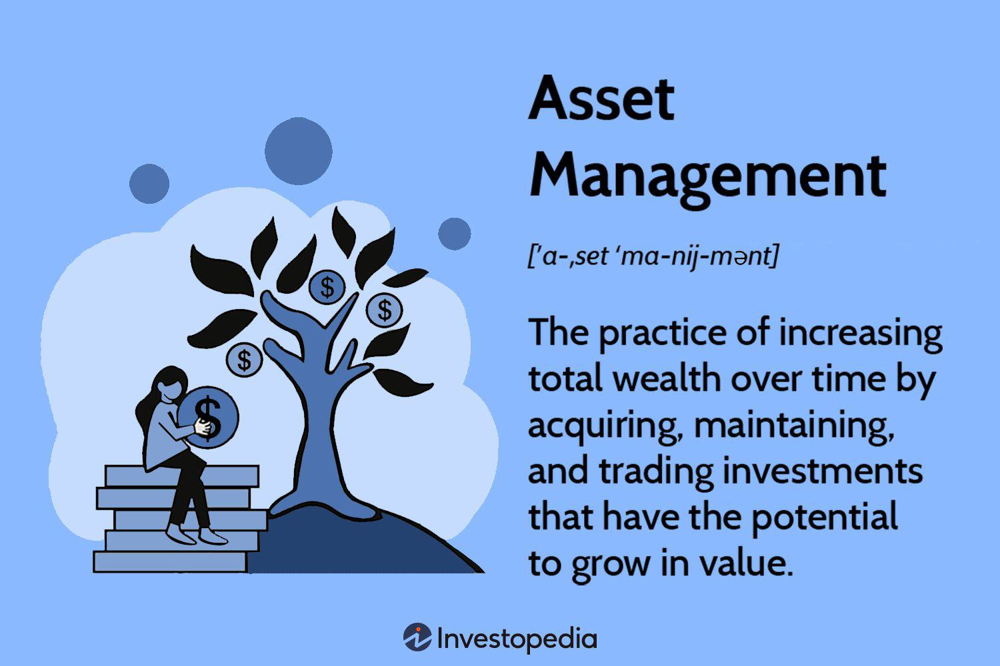

The financial services sector is a multifaceted and ever-evolving domain, pivotal to the economic infrastructure of global markets. It encompasses diverse elements such as asset management, trading, and financial advisory, each playing a critical role in managing and growing wealth within acceptable risk parameters.

Asset management is fundamental in this landscape, as it involves overseeing a portfolio of investments on behalf of clients. Asset managers, who undertake this responsibility, are tasked with balancing profit generation and risk exposure, thereby securing the financial futures of individuals and institutions alike. Their expertise is instrumental in navigating the complexities of financial markets and tailoring strategies to meet specific investment goals.



Algorithmic trading, or algo trading, marks a considerable progression in trading methodologies. Utilizing sophisticated computer algorithms, it automates the execution of trades, significantly boosting speed and accuracy. By mitigating human error and emotional factors, algo trading enhances efficiency and precision in financial transactions. This technological shift is reshaping how trades are conducted, bringing about a more structured and quantitative approach to market participation.

This article examines the interconnectedness of asset management, asset managers, and algorithmic trading within the financial services industry. It highlights how these components collaborate to optimize investment returns, emphasizing their collective contribution to the financial ecosystem. Through a deeper understanding of these roles, stakeholders in the financial sector can better forecast trends and enhance decision-making processes in pursuit of superior investment outcomes.

## Table of Contents

## Understanding Asset Management

Asset management represents a critical component of the financial services industry, focusing on the professional administration of a variety of financial securities and other assets to achieve specific investment goals on behalf of investors. The assets under management can vary widely and typically include stocks, bonds, real estate, commodities, and mutual funds. These diversified asset classes are managed within a portfolio to ensure a balanced approach that aligns with the investment objectives and risk tolerance of clients.

The primary goal of asset management is to optimize portfolio returns while mitigating risks, adhering to individual client preferences and financial aspirations. To achieve this, asset managers employ strategic portfolio management techniques that align with the investor’s timeline and risk appetite. This process involves sophisticated financial analysis, where historical and projected market performance data are extensively analyzed to inform investment decisions. 

Asset managers go beyond selecting appropriate investments. Their responsibilities incorporate continuous market research and analysis to respond effectively to fluctuating economic conditions. They employ various analytical methods, including quantitative models and qualitative assessments, to evaluate market trends, company performances, and economic indicators. This comprehensive analysis ensures that the selected investment strategies remain relevant and aligned with the evolving market environment.

Moreover, asset managers must regularly re-balance portfolios to maintain the desired allocation of asset classes in response to market movements. This dynamic approach allows for adjusting the portfolio to optimize it for current and anticipated market conditions. The ability to pivot and adapt investment strategies is essential for managing risks and ensuring the sustainability and growth of the client’s wealth over time.

In summary, asset management is a dynamic process that involves a blend of strategic planning, rigorous analysis, and ongoing evaluation to meet specific investment goals. Through diversified asset allocation and active portfolio management, asset managers strive to maximize returns for investors while managing associated risks efficiently.

## The Role of Asset Managers

Asset managers, also known as portfolio managers or financial advisors, play a critical role in the financial services industry by overseeing and managing investments on behalf of their clients. Their primary responsibility is to construct and manage a portfolio that aligns with the client's financial goals, risk tolerance, and investment horizon. To achieve this, asset managers develop customized strategies and provide expert advice tailored to the unique needs of each client, whether they are individuals or institutions.

At the core of the asset manager's responsibility is the fiduciary duty to act in the best interest of their clients. This duty requires them to prioritize clients' financial objectives above their own, carefully managing any potential conflicts of interest. This can involve a range of activities from selecting appropriate investment vehicles to monitoring and rebalancing the portfolio to optimize performance over time.

Asset managers employ a variety of strategies to make informed investment decisions. Fundamental analysis involves evaluating the financial health and competitive positioning of companies to forecast their performance, using metrics like earnings, revenue, and dividends. In contrast, technical analysis focuses on historical price and [volume](/wiki/volume-trading-strategy) data to identify trends and patterns in the market, often employing statistical tools and charting techniques.

Incorporating these analyses, asset managers continuously assess economic indicators, market conditions, and geopolitical events to adapt their strategies. This dynamic approach ensures that portfolios are aligned with changing market landscapes and that they are positioned to capitalize on emerging opportunities while mitigating potential risks.

Overall, the pivotal role of asset managers lies in their ability to synthesize vast amounts of information and leverage their expertise to guide clients through the complexities of the financial markets, helping them achieve their long-term financial aspirations.

## Algorithmic Trading: The Future of Asset Management

Algorithmic trading, or algo trading, utilizes sophisticated algorithms to facilitate rapid, data-driven trading decisions. By automating the decision-making process, algo trading can efficiently process substantial volumes of data, enabling the prompt execution of trades. This automation significantly reduces the probability of human error and mitigates emotional bias that can often impede trading decisions.

At the core of [algorithmic trading](/wiki/algorithmic-trading) is the utilization of AI and [machine learning](/wiki/machine-learning) technologies, which have revolutionized the process by enhancing risk management and strategic execution capabilities. These technologies enable algorithms to adapt to market conditions in real-time, optimizing trading strategies based on a myriad of variables. For instance, a machine learning model might predict short-term price movements based on historical data and current market conditions, subsequently executing trades based on these predictions with minimal latency. Here is a simple Python example using a stochastic indicator to generate trading signals:

```python
import numpy as np
import pandas as pd

# Example stock price data
data = {'Close': [100, 102, 101, 105, 107, 106, 108, 110]}
prices = pd.DataFrame(data)

# Calculate the stochastic indicator
window = 5
prices['Lowest'] = prices['Close'].rolling(window=window).min()
prices['Highest'] = prices['Close'].rolling(window=window).max()
prices['Stochastic'] = (prices['Close'] - prices['Lowest']) / (prices['Highest'] - prices['Lowest']) * 100

# Generate buy/sell signals
buy_signal = prices['Stochastic'] < 20
sell_signal = prices['Stochastic'] > 80

# Output the signals
print("Buy Signals:")
print(prices[buy_signal])
print("\nSell Signals:")
print(prices[sell_signal])
```

Algorithmic trading is central to high-frequency trading ([HFT](/wiki/high-frequency-trading-strategies)), where large volumes of small trades are executed in milliseconds. This capability is pivotal in enhancing market [liquidity](/wiki/liquidity-risk-premium) and efficiency, as it often narrows bid-ask spreads and ensures that transactions are executed at the best possible prices.

However, the efficacy of algo trading also depends on advanced data analytics and robust computational infrastructure. Algorithms require continuous fine-tuning to remain effective amid evolving market conditions and regulatory landscapes. As these technologies progress, they promise to refine and expand the scope of asset management strategies, providing investors with unprecedented tools for optimizing returns and managing risks.

## Benefits and Challenges of Algo Trading in Asset Management

Algorithmic trading, also known as algo trading, offers substantial benefits in asset management, primarily through increased efficiency and precision in executing trades and managing portfolios. Algo trading systems are capable of processing large datasets at high speeds, executing trades at optimal prices, and adjusting to market fluctuations swiftly. This efficiency results in cost savings and improved portfolio management for asset managers.

One of the significant advantages of algorithmic trading is its ability to back-test and optimize strategies through historical data analysis. By evaluating trade strategies against historical market conditions, asset managers can identify strengths and weaknesses within their systems, ultimately refining their trading approaches to enhance decision-making processes. This analytical capability is essential for developing strategies that can adapt to evolving market dynamics.

Algorithmic trading, however, is not without challenges. Ensuring data security is a critical concern, as the reliance on complex algorithms and large datasets makes trading systems vulnerable to cyber threats. Protecting sensitive financial data and algorithmic models from unauthorized access is crucial in maintaining trust and operational integrity.

Another challenge involves managing the complexities associated with algorithmic models. These models often require fine-tuning and regular updates to remain relevant and effective in dynamic market conditions. The intricate nature of algorithms necessitates a thorough understanding and careful management, requiring expertise in both finance and technology.

Regulatory concerns also pose challenges, as the financial services industry sees continuous changes in regulations governing algorithmic trading. Compliance with these regulations is vital to prevent legal issues and potential financial penalties. Asset management firms must stay abreast of regulatory developments and ensure their trading systems conform to relevant legal standards.

The successful integration of algorithmic trading into asset management demands robust infrastructure and advanced data analytics capabilities. This includes high-performance computing systems capable of handling voluminous data and executing trades at high speeds. Additionally, skilled personnel adept in both finance and technology are essential to oversee operations and ensure the effective functioning of algorithmic trading systems. The synergy between technological infrastructure and human expertise positions asset management firms to leverage algorithmic trading effectively, despite the challenges presented.

## Conclusion

With the rapid advancement in technology, the landscape of asset management is undergoing a substantial transformation through the adoption of algorithmic trading. Asset managers are increasingly leveraging these technological advancements to enhance their service offerings, aiming to better meet the sophisticated expectations of their clients. Algorithmic trading brings about greater efficiency and precision in investment processes, allowing asset managers to execute trades with high speed and accuracy, thus optimizing portfolio performance.

Despite the inherent challenges—such as the need to secure data, manage the complexities of advanced algorithmic models, and navigate regulatory frameworks—the integration of asset management strategies with cutting-edge algorithmic trading technologies promises a bright future for the financial services industry. These innovations not only improve the accuracy and efficiency of market activities but also provide asset managers with valuable strategic insights, enabling them to better align their operations with client objectives.

As the ecosystem of asset management continues to evolve, both asset managers and investors have much to gain. The ability to harness data-driven, algorithmically enhanced trading strategies means improved investment outcomes and an elevated level of strategic foresight. This evolution signifies a future where financial markets are more efficient, transparent, and capable of delivering on the increasingly complex needs of market participants.

## References & Further Reading

[1]: Bergstra, J., Bardenet, R., Bengio, Y., & Kégl, B. (2011). ["Algorithms for Hyper-Parameter Optimization."](https://dl.acm.org/doi/10.5555/2986459.2986743) Advances in Neural Information Processing Systems 24.

[2]: ["Advances in Financial Machine Learning"](https://www.amazon.com/Advances-Financial-Machine-Learning-Marcos/dp/1119482089) by Marcos Lopez de Prado

[3]: ["Evidence-Based Technical Analysis: Applying the Scientific Method and Statistical Inference to Trading Signals"](https://www.amazon.com/Evidence-Based-Technical-Analysis-Scientific-Statistical/dp/0470008741) by David Aronson

[4]: ["Machine Learning for Algorithmic Trading"](https://github.com/PacktPublishing/Machine-Learning-for-Algorithmic-Trading-Second-Edition) by Stefan Jansen

[5]: ["Quantitative Trading: How to Build Your Own Algorithmic Trading Business"](https://books.google.com/books/about/Quantitative_Trading.html?id=j70yEAAAQBAJ) by Ernest P. Chan