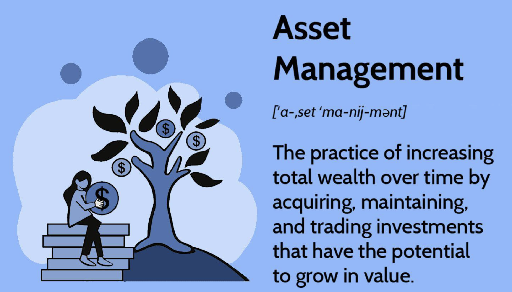

## Table of Contents

## What is asset management?

Asset management is the process of keeping track of and taking care of things that a person or a company owns, like money, buildings, or equipment. It helps make sure these things are used in the best way possible to reach goals, like making more money or saving costs. People who work in asset management, often called asset managers, look at how well the assets are doing and decide how to use them to get the best results.

Asset management can be different depending on what kind of assets are involved. For example, managing money might mean choosing which stocks or bonds to buy, while managing buildings could involve deciding when to fix or replace parts of them. The main goal is always to make the assets more valuable over time. By planning carefully and making smart choices, asset managers help make sure that the assets keep working well and keep growing in value.

## What are the different types of assets managed in asset management?

Asset management involves handling different kinds of things that people or companies own. These things, called assets, can be split into two main groups: financial assets and physical assets. Financial assets are things like money, stocks, bonds, and other investments that you can't touch but have value. People who manage these assets, like financial advisors, help decide where to put this money to make it grow, like choosing which stocks to buy or which bonds to invest in.

Physical assets, on the other hand, are things you can touch, like buildings, machines, vehicles, and equipment. Managing these assets means taking care of them, deciding when to fix or replace them, and making sure they are used in the best way possible. For example, a company might have a fleet of trucks that need regular maintenance to keep running smoothly. Asset managers make sure these trucks are well-maintained and used efficiently to save costs and keep the business running smoothly.

Both types of assets are important for different reasons. Financial assets help increase wealth over time, while physical assets are crucial for day-to-day operations and can also gain value over time if managed well. Good asset management involves balancing the needs of both types of assets to achieve the best overall results for the owner.

## Who is an asset manager and what do they do?

An asset manager is someone who takes care of things that people or companies own, like money, buildings, or machines. These things are called assets, and the asset manager's job is to make sure they are used in the best way possible. This means they look at how well the assets are doing and decide how to use them to reach goals, like making more money or saving costs.

For example, if someone has money to invest, an asset manager might choose which stocks or bonds to buy to help that money grow. If a company owns buildings, the asset manager might decide when to fix or replace parts of them to keep them working well. The main goal of an asset manager is to make the assets more valuable over time by planning carefully and making smart choices.

## What qualifications are needed to become an asset manager?

To become an asset manager, you usually need a strong background in finance, business, or a related field. Many asset managers have at least a bachelor's degree in finance, economics, business administration, or accounting. Some even go on to get a master's degree, like an MBA, to learn more about managing money and businesses. It's also helpful to have certifications like the Chartered Financial Analyst (CFA) or Certified Financial Planner (CFP), which show that you know a lot about investing and financial planning.

Besides education, experience is very important for becoming an asset manager. Many start their careers in entry-level finance jobs, like financial analysts or investment analysts, where they learn how to look at data and make decisions about money. Over time, they can move up to bigger roles with more responsibility. Good communication and problem-solving skills are also key, because asset managers need to explain their decisions to clients and work with teams to manage assets well.

## How do asset managers create value for their clients?

Asset managers create value for their clients by making smart choices about how to use their money and other things they own. They look at all the different things a client has, like stocks, bonds, or buildings, and decide the best way to use them to make more money or save costs. For example, if a client has money to invest, an asset manager might choose to buy stocks that they think will go up in value. This helps the client's money grow over time.

They also keep a close eye on how well these assets are doing. If something isn't working well, like a machine that keeps breaking down, the asset manager will decide whether to fix it or replace it. By taking care of these things and making sure they are used in the best way possible, asset managers help their clients save money and make their assets more valuable. In the end, good asset management means the client's wealth can grow and their business can run smoothly.

## What are the common strategies used by asset managers?

Asset managers use different strategies to help their clients make money or save costs. One common strategy is diversification, which means spreading the client's money across different types of investments, like stocks, bonds, and real estate. This helps lower the risk because if one investment doesn't do well, others might still be doing okay. Another strategy is active management, where the asset manager keeps a close eye on the market and makes changes to the investments based on what's happening. They might buy or sell stocks quickly to take advantage of short-term changes in the market.

Another strategy is passive management, which is the opposite of active management. Here, the asset manager tries to match the performance of a market index, like the S&P 500, instead of trying to beat it. This usually means buying a mix of stocks that make up the index and holding onto them for a long time. Passive management is often cheaper because it doesn't involve as much buying and selling. Finally, asset managers might also use a strategy called asset allocation, where they decide how much of the client's money should go into different types of investments based on the client's goals and how much risk they're willing to take. This helps balance the potential for making money with the risk of losing it.

## How do asset managers assess and manage risk?

Asset managers look at risk by thinking about what could go wrong with the things their clients own, like money, stocks, or buildings. They use tools like risk analysis to see how likely it is that something bad will happen and how much it could hurt their clients. For example, if a client has a lot of money in one stock, the asset manager might worry that if that stock goes down, the client could lose a lot of money. So, they might suggest spreading the money across different stocks or types of investments to lower the risk. They also keep an eye on things like the economy, interest rates, and world events, because these can change how risky an investment is.

To manage risk, asset managers use different strategies. One way is to balance the client's money between safe and risky investments. Safe investments, like bonds, might not make a lot of money but are less likely to lose value. Risky investments, like stocks, can make more money but are more likely to go down in value. By mixing these, the asset manager can help the client make money while keeping the risk at a level they're comfortable with. They might also use things like stop-loss orders, which automatically sell an investment if it drops too much, to limit how much money the client could lose. By doing all these things, asset managers help their clients keep their money safe while still trying to make it grow.

## What is the role of asset managers in portfolio diversification?

Asset managers play a big role in helping their clients spread out their investments, which is called portfolio diversification. They look at all the different things their clients own, like stocks, bonds, and real estate, and decide how to mix them up so that the client's money isn't all in one place. This helps lower the risk because if one type of investment doesn't do well, others might still be okay. For example, if all a client's money is in tech stocks and the tech industry has a bad year, they could lose a lot. But if the money is spread out across different industries, the loss might not be as bad.

Asset managers use different ways to diversify a portfolio. They might suggest buying stocks from different countries or industries, or they might recommend mixing stocks with bonds and other types of investments. They keep an eye on how well each part of the portfolio is doing and make changes if they think it's needed. By doing this, they help their clients keep their money safe while still trying to make it grow over time.

## How do regulatory environments affect asset management practices?

Regulatory environments have a big impact on how asset managers do their job. They have to follow rules set by governments and other groups to make sure they are doing things the right way. These rules can be about things like how they can invest money, how much they can charge for their services, and how they need to report what they're doing. For example, in the United States, the Securities and Exchange Commission (SEC) has rules that asset managers need to follow to protect investors. If asset managers don't follow these rules, they could get in trouble and might even have to pay fines.

Because of these rules, asset managers have to be very careful about how they manage money and other assets. They might need to spend a lot of time making sure they are following all the regulations, which can take time away from other parts of their job. Sometimes, these rules can also limit what kinds of investments they can make or how they can do their work. But, these rules are important because they help make sure that asset managers are being honest and fair, and that they are looking out for their clients' best interests.

## What are the latest trends and technologies impacting asset management?

The latest trends in asset management include a big push towards using technology to make things easier and more efficient. One big trend is the use of [artificial intelligence](/wiki/ai-artificial-intelligence) (AI) and [machine learning](/wiki/machine-learning). These technologies help asset managers look at a lot of data quickly and find patterns that they might not see otherwise. For example, AI can help predict how the stock market might move or which investments might do well in the future. Another trend is the use of robo-advisors, which are computer programs that can manage a client's money without a human asset manager. These robo-advisors use algorithms to make investment choices based on the client's goals and how much risk they want to take.

Another important trend is the focus on environmental, social, and governance ([ESG](/wiki/esg-investing)) factors. More and more people want to invest in companies that are good for the environment, treat their workers well, and follow good rules for running their business. Asset managers are paying more attention to these ESG factors when they choose investments for their clients. Technology is also helping here, with tools that can track and report on how well a company is doing in these areas. Overall, these trends and technologies are changing how asset managers work, making it easier for them to make smart choices and meet their clients' needs.

## How do asset managers integrate ESG (Environmental, Social, and Governance) factors into their strategies?

Asset managers are paying more attention to ESG factors because more people want to invest in companies that are good for the environment, treat their workers well, and follow good rules for running their business. To do this, asset managers look at how a company is doing in these areas before deciding to invest in it. For example, they might check if a company is reducing its carbon emissions, if it has fair labor practices, or if it has a diverse board of directors. By choosing companies that do well in these areas, asset managers can help their clients invest in a way that matches their values and can also be good for the long-term success of their investments.

To make sure they are considering ESG factors, asset managers use special tools and data. These tools help them track how companies are doing in terms of the environment, social issues, and governance. They might use scores or ratings to see how a company compares to others in its industry. This information helps them decide which companies to invest in and how much risk they are taking by doing so. By integrating ESG factors into their strategies, asset managers can help their clients make money while also making a positive impact on the world.

## What advanced techniques do expert asset managers use to optimize portfolio performance?

Expert asset managers use advanced techniques like quantitative analysis to optimize how well a portfolio performs. This means they use math and computer programs to look at a lot of data and find patterns that can help them make better investment choices. They might use something called [factor](/wiki/factor-investing) investing, where they pick investments based on certain things like how big a company is or how much it grows. Another technique is risk parity, which is about balancing the risk in a portfolio so that each investment has an equal chance of affecting the overall performance. By using these methods, asset managers can make smarter decisions and help their clients' money grow more effectively.

Another advanced technique is dynamic asset allocation, where asset managers change how much money is in different types of investments based on what's happening in the market. For example, if they think the stock market is going to do well, they might put more money into stocks. If they think the economy is going to slow down, they might move money into safer investments like bonds. They also use something called tactical asset allocation, where they make short-term changes to take advantage of quick changes in the market. By being flexible and adjusting their strategies, expert asset managers can help their clients make more money while also managing risk.

## References & Further Reading

[1]: Bergstra, J., Bardenet, R., Bengio, Y., & Kégl, B. (2011). ["Algorithms for Hyper-Parameter Optimization."](https://dl.acm.org/doi/10.5555/2986459.2986743) Advances in Neural Information Processing Systems 24.

[2]: ["Advances in Financial Machine Learning"](https://www.amazon.com/Advances-Financial-Machine-Learning-Marcos/dp/1119482089) by Marcos Lopez de Prado

[3]: ["Evidence-Based Technical Analysis: Applying the Scientific Method and Statistical Inference to Trading Signals"](https://www.amazon.com/Evidence-Based-Technical-Analysis-Scientific-Statistical/dp/0470008741) by David Aronson

[4]: ["Machine Learning for Algorithmic Trading"](https://github.com/PacktPublishing/Machine-Learning-for-Algorithmic-Trading-Second-Edition) by Stefan Jansen

[5]: ["Quantitative Trading: How to Build Your Own Algorithmic Trading Business"](https://books.google.com/books/about/Quantitative_Trading.html?id=j70yEAAAQBAJ) by Ernest P. Chan