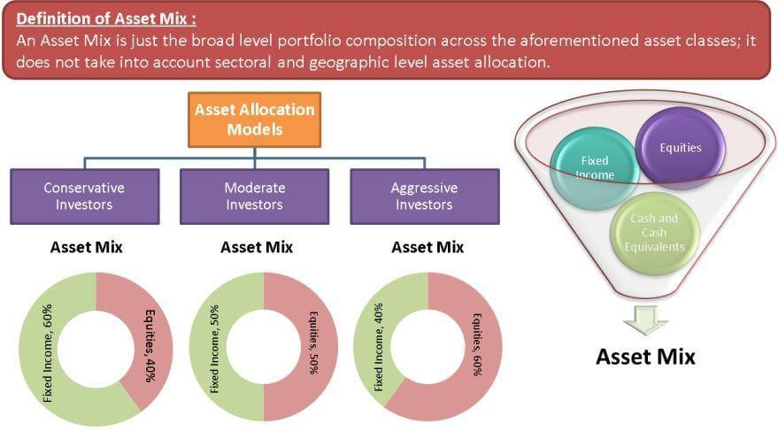

Investment funds are designed to cater to various financial goals through a diversified portfolio of assets. The core objective of these funds is to optimize investment returns while managing risks, which is primarily achieved by implementing robust asset mix strategies. An asset mix strategy involves allocating portions of the investment portfolio among different asset classes, such as equities, fixed income, and real estate, to balance risk and reward according to the investor's financial objectives and risk tolerance. 

The efficacy of an asset mix strategy is a significant determinant of a fund's potential returns and associated risks. A well-structured asset mix can lead to optimal risk-adjusted returns by diversifying investments, which in turn can protect against market volatilities. For instance, during economic downturns, the negative performance of some asset classes can be offset by the stability or growth of others, maintaining the overall health of the investment portfolio.



In recent years, technological advancements have significantly impacted how asset mix strategies are implemented, with algorithmic trading playing a transformative role. Algorithmic trading involves using computer algorithms to execute trades based on predetermined criteria such as timing, price, or volume. This has revolutionized portfolio management strategies by enabling rapid trade execution, reducing human error, and facilitating real-time adjustments to the asset mix based on market conditions.

This article explores the integration of asset mix strategies with algorithmic trading for effective portfolio management. By leveraging technology to enhance diversification and improve risk management, investors can achieve more stable and potentially higher returns. The strategic incorporation of algorithms into portfolio management represents a dynamic approach to navigating modern financial markets, paving the way for continuous innovation and data-driven investment strategies.

## Table of Contents

## Understanding Asset Mix

The asset mix is an essential concept in portfolio management, representing the allocation of various asset classes—such as stocks, bonds, and real estate—within a portfolio. The primary goal of an asset mix is to achieve a balance between risk and return. By diversifying across different asset classes, investors can reduce the inherent risk associated with individual investments and enhance the potential for higher returns.

One of the fundamental principles of an asset mix is diversification. Diversification involves spreading investments across various asset classes, industries, and geographic regions to minimize the impact of any single asset's poor performance on the overall portfolio. This approach can be mathematically explained using the concept of correlation. Assets with low or negative correlations provide better diversification benefits, as they are less likely to move in tandem under market fluctuations.

The asset mix can be highly tailored to suit the unique financial goals and risk tolerances of investors. For instance, a conservative investor may prefer a portfolio heavily weighted towards bonds for their stability and income generation, while an aggressive investor might opt for a higher allocation in stocks to capture potential high returns. Additionally, alternative assets like real estate or commodities can be included to further enhance diversification.

Market conditions also influence the asset mix. During bullish markets, portfolios may shift towards equities to capitalize on rising prices. Conversely, in bearish or volatile markets, there might be a move towards bonds or other safer assets to preserve capital. Dynamic asset allocation strategies adjust these weights in response to changing market conditions, aiming to maintain an optimal balance between risk and return.

In conclusion, understanding and optimizing the asset mix is crucial for managing investment risk and achieving financial objectives. By carefully selecting and balancing different asset classes, investors can build resilient portfolios that can withstand various market environments.

## Portfolio Management Basics

Effective portfolio management is central to achieving financial goals through a balanced asset mix. At its core, portfolio management combines scientific analytics with the artistic judgment of financial trends, demanding an in-depth understanding of market fluctuations, asset performance, and robust risk management techniques. 

A pivotal aspect of managing a portfolio is the selection and oversight of a diversified asset mix. Diversification involves spreading investments across various asset classes, such as equities, fixed income, and alternative investments, to reduce overall risk and improve potential returns. This strategy minimizes the impact of poor performance in any single asset, adhering to the fundamental investment principle: "Do not put all your eggs in one basket."

Quantitative methods are extensively employed to gauge optimal asset diversification. One of the foundational formulas used in portfolio management is the expected return of a portfolio, given by:

$$
E(R_p) = \sum_{i=1}^{n} w_i \cdot E(R_i)
$$

where $E(R_p)$ is the expected return of the portfolio, $w_i$ is the weight of asset $i$, and $E(R_i)$ is the expected return of asset $i$.

Simultaneously, the risk or [volatility](/wiki/volatility-trading-strategies) of a portfolio is often assessed using the standard deviation of its returns, guided by:

$$
\sigma_p = \sqrt{\sum_{i=1}^{n} (w_i \cdot \sigma_i)^2 + 2 \cdot \sum_{i=1}^{n-1} \sum_{j=i+1}^{n} w_i \cdot w_j \cdot \sigma_{ij}}
$$

where $\sigma_p$ is the portfolio's standard deviation, $\sigma_i$ is the standard deviation of asset $i$, and $\sigma_{ij}$ is the covariance between asset $i$ and asset $j$.

Successful portfolio management also entails ongoing strategic adjustments based on real-time data. Sophisticated tools and software enable the tracking of asset performance and market trends, allowing for timely rebalancing. The goal is to maintain an optimal return-to-risk ratio, continuously aligning investments with the investor's risk tolerance and financial objectives.

Understanding market dynamics, including macroeconomic indicators and geopolitical factors, is integral to the "art" aspect of portfolio management. An experienced fund manager must interpret these signals and adjust asset allocations proactively. This skill set ensures the portfolio remains aligned with the investor's goals while adapting to external economic conditions.

In conclusion, mastering portfolio management requires a blend of quantitative analysis and qualitative judgment. By effectively selecting and overseeing a diversified asset mix, an investor can achieve a balanced portfolio that maximizes returns while maintaining acceptable risk levels.

## Algorithmic Trading in Portfolio Management

Algorithmic trading is a sophisticated method that employs pre-defined instructions or mathematical models to execute trades automatically in financial markets. This approach enables investors to actively manage portfolios with precision and speed, taking advantage of opportunities in real-time.

Algorithms can be tailored for a variety of trading strategies. High-frequency trading ([HFT](/wiki/high-frequency-trading-strategies)) is one well-known application where algorithms execute a large number of trades in fractions of a second. HFT strategies capitalize on minute price changes and offer the potential for substantial profits, albeit with corresponding risks. On the other hand, algorithms can also be used for adjusting risk management strategies, such as rebalancing portfolios in response to shifts in market conditions or asset performance.

Algorithmic trading enhances diversification by effectively managing multiple asset classes globally. Through the use of sophisticated models, traders or portfolio managers can automatically allocate funds across various asset classes—stocks, bonds, commodities, and more—based on pre-set criteria. This is often achieved through optimization techniques that evaluate historical data and predictive analytics to ensure that the asset allocation aligns with the desired risk-return profile.

To illustrate, consider a simplified Python code snippet that demonstrates how a basic algorithm might be structured to decide on asset allocation based on moving averages, a common indicator used in algorithmic strategies:

```python
import pandas as pd

# Assume asset_prices is a DataFrame with historical prices of our asset
asset_prices = pd.DataFrame({'Asset1': [100, 102, 101, 104, 107],
                             'Asset2': [50, 52, 51, 49, 48]})

def allocate_assets(prices):
    allocation = {}
    moving_average1 = prices['Asset1'].rolling(window=3).mean()
    moving_average2 = prices['Asset2'].rolling(window=3).mean()

    if moving_average1.iloc[-1] > prices['Asset1'].iloc[-1]:
        allocation['Asset1'] = 'sell'
    else:
        allocation['Asset1'] = 'buy'

    if moving_average2.iloc[-1] > prices['Asset2'].iloc[-1]:
        allocation['Asset2'] = 'sell'
    else:
        allocation['Asset2'] = 'buy'

    return allocation

current_allocation = allocate_assets(asset_prices)
print(current_allocation)
```

In this code, a basic strategy determines whether to buy or sell based on the relationship between the asset's current price and its moving average. While simplistic, such strategies, when developed with complexity, help in adjusting a portfolio intelligently.

The key to [algorithmic trading](/wiki/algorithmic-trading)'s effectiveness in portfolio management lies in its ability to adapt and scale. By processing large volumes of data across various markets, algorithms identify patterns and execute trades that optimize the portfolio's performance, diversifying exposure and alleviating risks inherent in manual trading processes.

## Benefits of Algorithmic Trading in Diversification

Algorithmic trading offers significant benefits in diversification by enabling real-time data analysis and swift trade execution. This capability optimizes asset allocation, ensuring that investment portfolios are consistently aligned with market opportunities and risks. The reduction of emotional decision-making is another critical advantage, as algorithms systematically execute trades based on predefined criteria. This systematic approach minimizes the impact of human biases and errors, ultimately leading to more stable investment outcomes.

One of the fundamental benefits of algorithmic trading is its ability to facilitate portfolio rebalancing. Algorithms can be designed to monitor current market conditions and volatility continuously, making necessary adjustments to maintain the desired risk-return profile. For instance, if the market shows a significant shift in volatility, the algorithm can automatically adjust the portfolio's asset allocation, selling overvalued assets and purchasing undervalued ones. This ongoing rebalancing helps in maintaining a stable portfolio that can adapt to market changes effectively.

The application of real-time data analysis further enhances the algorithmic trading process. By analyzing vast datasets instantaneously, algorithms can identify patterns and trends that may not be immediately apparent through traditional analysis. This capability allows for the timely execution of trades, capturing opportunities that could be missed with a slower decision-making process.

Moreover, the implementation of algorithms that utilize various strategies such as trend-following or mean-reversion can diversify the portfolio across different asset classes and geographical regions. The automation of these strategies ensures consistent application, maintaining exposure to profitable opportunities and reducing exposure to declining sectors.

Overall, the integration of algorithmic trading into portfolio management significantly enhances diversification capabilities. Investors can benefit from optimized asset allocation, lessened emotional influence on trading decisions, and consistent rebalancing aligned with current market dynamics, ultimately achieving a more robust and resilient investment portfolio.

## Developing a Diversified Algorithmic Portfolio

Developing a diversified algorithmic portfolio requires the combination of various algorithmic strategies to achieve robust diversification. A commonly used strategy is mean reversion, which operates on the principle that asset prices tend to move back towards their historical average. This strategy involves identifying and exploiting discrepancies between current asset prices and their long-term average, using statistical techniques to determine when to buy low and sell high.

Momentum-based strategies, on the other hand, leverage the propensity of asset prices to continue a trend. By identifying strong trends, these algorithms aim to capture gains by maintaining positions in assets that exhibit substantial upward or downward [momentum](/wiki/momentum). A key [factor](/wiki/factor-investing) in such strategies is the selection of the appropriate time period to analyze, as different assets may exhibit varying trend durations.

Arbitrage opportunities are also central to creating a diversified algorithmic portfolio. These entail capitalizing on price inefficiencies between correlated assets, such as different securities with similar economic functions trading on separate exchanges. While classical [arbitrage](/wiki/arbitrage) focuses on price discrepancies between identical or similar securities across markets, [statistical arbitrage](/wiki/statistical-arbitrage) expands this approach by identifying broader relationships among numerous securities through quantitative models.

To broaden diversification, algorithms must be adept at balancing exposure across various sectors, geographies, and asset classes. This ensures that the portfolio is not overly dependent on any single market or asset type. Implementing such a strategy involves the continuous assessment of correlations and covariances among assets, allowing for the dynamic reallocation of capital to optimize risk-adjusted returns.

Regular [backtesting](/wiki/backtesting) is indispensable for evaluating and refining algorithmic strategies. Backtesting involves simulating the portfolio's performance using historical data to ascertain how the strategy would have performed in the past. This process helps identify potential issues and forecast future performance under various market conditions. It is critical to consider data quality and realistic execution scenarios to avoid overfitting—a common pitfall where a model performs well on historical data but poorly in live trading.

A Python example of a simple mean reversion strategy with backtesting might include the following pseudocode:

```python
import numpy as np
import pandas as pd
import matplotlib.pyplot as plt

# Load historical price data
data = pd.read_csv('historical_data.csv')
prices = data['Close']

# Calculate moving average and standard deviation
moving_average = prices.rolling(window=50).mean()
std_dev = prices.rolling(window=50).std()

# Define buy and sell signals based on mean reversion
buy_signal = prices < (moving_average - 2 * std_dev)
sell_signal = prices > (moving_average + 2 * std_dev)

# Backtest strategy
portfolio = pd.DataFrame(index=data.index, columns=['Position', 'Holdings', 'Cash', 'Total'])
portfolio['Position'] = 0
portfolio['Holdings'] = 0
portfolio['Cash'] = 10000
portfolio.loc[buy_signal, 'Position'] = 1
portfolio.loc[sell_signal, 'Position'] = -1
portfolio['Holdings'] = portfolio['Position'] * prices
portfolio['Cash'] -= np.diff(portfolio['Holdings'].fillna(0), prepend=0)
portfolio['Total'] = portfolio['Holdings'] + portfolio['Cash']

# Plot results
plt.plot(portfolio['Total'])
plt.title('Strategy Backtesting')
plt.show()
```

This code represents a basic structure of a mean reversion strategy, creating buy and sell signals based on deviations from the moving average. The backtesting evaluates the cumulative portfolio value over time.

Developing a diversified algorithmic portfolio requires continuous refinement and adaptation to evolving market conditions, emphasizing data-driven decision-making and strategic diversification to achieve consistent financial objectives.

## Challenges and Risk Management

Algorithmic trading presents various challenges that require robust risk management strategies to ensure consistent portfolio performance. One of the critical concerns is the adaptability of algorithms, particularly in mitigating significant losses during unexpected market movements. Algorithms must be designed with adaptive features, allowing them to respond to volatile conditions. This can be achieved by integrating [machine learning](/wiki/machine-learning) techniques that enable algorithms to learn from past market data and adjust strategies in real time.

Moreover, effective capital allocation is crucial to prevent overexposure to any single asset or strategy. This involves determining the optimal position size for each asset, considering the overall risk tolerance and investment objectives. Risk parity and value-at-risk (VaR) models are often used to assess potential risks associated with different allocations. For example, VaR estimates the maximum potential loss over a specific period, under normal market conditions, at a given confidence level. Algorithms can incorporate this measure to dynamically adjust asset allocations.

```python
import numpy as np

def calculate_var(returns, confidence_level=0.95):
    """
    Calculate the Value at Risk (VaR) for a given confidence level.
    :param returns: List or array of asset returns
    :param confidence_level: Confidence level for VaR (default is 95%)
    :return: VaR value
    """
    returns_sorted = np.sort(returns)
    # Index corresponding to the confidence level
    index = int((1 - confidence_level) * len(returns))
    return returns_sorted[index]

# Example usage
returns = np.random.normal(0, 1, 1000)  # Simulated returns
var = calculate_var(returns, 0.95)
print(f"Value at Risk (95% confidence level): {var}")
```

Risk management also involves utilizing hedging techniques and regular portfolio rebalancing. Hedging strategies, such as options, futures, and swaps, can be employed to protect against downside risk. For instance, by purchasing put options, a portfolio manager can limit potential losses from a drop in asset prices.

Rebalancing, on the other hand, ensures the portfolio remains aligned with the intended asset mix. It involves periodically realigning the weights of the portfolio assets to maintain the desired strategic allocation. This is especially important in response to market fluctuations to avoid unintended risks. Rebalancing can be triggered by threshold values or pre-defined intervals to systematically adjust the portfolio.

Overall, the integration of robust risk management practices within algorithmic trading frameworks is essential. These strategies ensure that portfolios are not only diversified but are also resilient to market shocks, thereby optimizing the risk-reward profile for investors.

## Conclusion

Integrating algorithmic trading with portfolio management offers enhanced diversification and risk management by leveraging technology to execute trades based on sophisticated quantitative models. This integration optimizes the asset mix, harnessing the potential of algorithms to analyze extensive datasets and identify lucrative opportunities with accuracy and speed. Automating asset allocation through algorithmic strategies minimizes human biases and emotional decisions, potentially leading to higher returns and more stable performance over time.

Data-driven decisions are critical in today's fast-paced financial markets, necessitating continuous innovation and adaptation of algorithms to dynamic market conditions. By employing advanced machine learning techniques, portfolio managers can refine their strategies, improving predictive accuracy and responsiveness to market fluctuations. This constant evolution ensures that investment strategies remain relevant, aligning with changing financial landscapes. Ultimately, successful investment strategies rely on a seamless synergy between human insight and technological advancements, enabling more effective portfolio management and optimized asset allocation.

In conclusion, the powerful combination of algorithmic trading and portfolio management empowers investors to strategically navigate complex financial environments, reduce risk through diversification, and capitalize on emerging market trends with precision and agility.

## References & Further Reading

[1]: Bergstra, J., Bardenet, R., Bengio, Y., & Kégl, B. (2011). ["Algorithms for Hyper-Parameter Optimization."](https://dl.acm.org/doi/10.5555/2986459.2986743) Advances in Neural Information Processing Systems 24.

[2]: ["Advances in Financial Machine Learning"](https://www.amazon.com/Advances-Financial-Machine-Learning-Marcos/dp/1119482089) by Marcos Lopez de Prado

[3]: ["Evidence-Based Technical Analysis: Applying the Scientific Method and Statistical Inference to Trading Signals"](https://www.amazon.com/Evidence-Based-Technical-Analysis-Scientific-Statistical/dp/0470008741) by David Aronson

[4]: ["Machine Learning for Algorithmic Trading"](https://github.com/stefan-jansen/machine-learning-for-trading) by Stefan Jansen

[5]: ["Quantitative Trading: How to Build Your Own Algorithmic Trading Business"](https://www.amazon.com/Quantitative-Trading-Build-Algorithmic-Business/dp/1119800064) by Ernest P. Chan