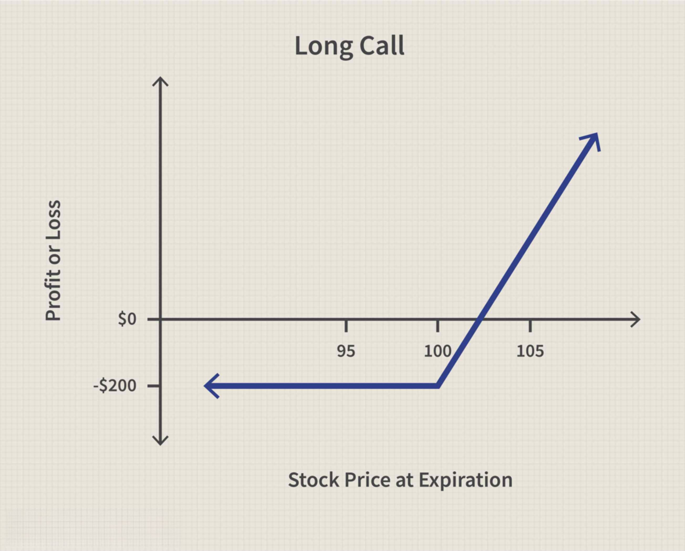

Financial derivatives are essential instruments in the landscape of modern finance, enabling investors and institutions to manage risk, enhance returns, and speculate on price movements with leverage. These tools, which derive their value from underlying assets, include a wide range of contracts such as options, futures, swaps, and forwards. Among these, call options hold notable significance due to their versatility and potential for profit.

A call option is a type of financial instrument that grants the holder the right, but not the obligation, to purchase a specific quantity of an underlying asset at a predetermined price, known as the strike price, within a designated time period. This specificity in terms of rights and obligations distinguishes call options from basic ownership of the underlying asset, allowing traders to engage in strategic plays based on anticipated market movements without the substantial capital outlay needed for outright asset purchases.



The complexity of financial derivatives expands when considering types like asset-or-nothing options. These digital options offer a fixed payout—typically the value of the underlying asset itself—if the option is in-the-money at expiration. Unlike standard call options where the payoff is the difference between the asset price and the strike price, asset-or-nothing options pay off the asset’s full value, providing a unique risk and reward profile that attracts sophisticated investors engaging in speculative trading.

With the advancement of technology, algorithmic trading has become an indispensable strategy in the derivatives market. It involves using automated systems to execute trading decisions based on pre-set rules and criteria, enhancing both the speed and efficiency of trades. This technological edge is especially relevant in the complex world of derivatives, where timely decisions can significantly impact profitability.

This article will highlight the intricacies of financial derivatives by focusing on call options, exploring the specifics of asset-or-nothing options, and examining the impact of algorithmic trading strategies.

## Table of Contents

## Understanding Call Options

Call options are financial contracts that grant the holder the right, but not the obligation, to purchase an underlying asset at a predetermined price, known as the strike price, within a specific time period. This feature distinguishes call options from obligations such as forward contracts, which require the holder to proceed with the transaction. The ability to choose whether or not to exercise the option allows traders to strategically manage risk and make speculative trades in various market conditions.

Mathematically, the value of a call option can be modeled using the Black-Scholes formula, which considers several factors including the current price of the asset ($S$), the strike price ($K$), the time to expiration ($T$), the risk-free [interest rate](/wiki/interest-rate-trading-strategies) ($r$), and the [volatility](/wiki/volatility-trading-strategies) of the asset ($\sigma$). The Black-Scholes formula for a call option is expressed as:

$$
C(S, T) = S \cdot N(d_1) - K \cdot e^{-rT} \cdot N(d_2)
$$

where

$$
d_1 = \frac{\ln(S/K) + (r + \sigma^2/2)T}{\sigma\sqrt{T}}
$$

$$
d_2 = d_1 - \sigma\sqrt{T}
$$

and $N(\cdot)$ is the cumulative distribution function of the standard normal distribution.

Traders utilize call options primarily for two reasons: hedging and speculation. As a hedging instrument, call options provide a form of insurance against rising prices by locking in a maximum purchase cost for the underlying asset. This can be particularly advantageous for businesses reliant on commodities, as they can use call options to stabilize costs and protect against adverse price movements.

In contrast, speculative traders view call options as an opportunity to profit from anticipated price increases in the underlying asset without committing a large capital investment upfront. The leverage provided by options means that traders can potentially achieve significant returns from relatively small price movements in the underlying asset. However, this leverage also comes with high risk, as the value of the option can quickly diminish to zero if the market moves unfavorably relative to the strike price and expiration date.

Overall, call options are versatile tools in financial markets, offering a flexible approach to managing risk and capitalizing on market predictions. Understanding their mechanics and applications is fundamental for any trader involved in derivatives.

## Asset-Or-Nothing Call Options

Asset-or-nothing call options are a distinctive type of binary or digital option, characterized by a payoff structure that diverges significantly from standard call options. In a standard call option, the payoff is determined by the difference between the underlying asset's price and the strike price, provided the asset's price exceeds the strike price at expiration. However, with asset-or-nothing call options, the payoff is not dependent on this price difference. Instead, the holder receives a fixed amount, which is equivalent to the value of the asset itself, if the underlying asset price is above a specified strike price at expiration. If the condition is not met, the option expires worthless.

The payoff structure for an asset-or-nothing call option can be expressed mathematically as:

$$

\text{Payoff} = 
\begin{cases} 
S, & \text{if } S > K \\
0, & \text{otherwise}
\end{cases}
$$

where $S$ is the spot price of the underlying asset at expiration, and $K$ is the strike price of the option.

This binary nature of asset-or-nothing options makes them particularly useful for traders engaging in speculative strategies. These options cater to investors who have a strong conviction that the asset's price will exceed the strike price, as they provide a leveraged way to benefit from their prediction. The all-or-nothing payoff structure can lead to significant profits if the position is correctly timed, but also entails the risk of losing the entire premium paid if the asset does not surpass the strike price.

From a speculative trading standpoint, asset-or-nothing call options enable traders to implement strategies that focus on directional bets. These options' payouts are detached from the magnitude by which the asset's price exceeds the strike price, allowing traders to indirectly target volatility and price movements. Consequently, they are attractive for investors aiming to capitalize on anticipated sharp movements driven by market events or news.

In practice, these options can be integrated into broader trading strategies. Investors might use them to hedge other positions or to express specific market views without deploying substantial capital. The inherent simplicity of the payoff structure of asset-or-nothing call options makes them an effective tool for enhancing portfolio returns, provided the speculative endeavor is aligned with an accurate prediction of market conditions.

## Algorithmic Trading in Derivatives

Algorithmic trading, commonly known as algo trading, involves the use of automated and systematic processes to execute trades in financial markets according to pre-established rules. Its significance in the derivatives market has grown considerably due to the complexities inherent in trading options, futures, and other derivative instruments. These automatic systems can help traders navigate the intricate pricing mechanisms and volatility associated with derivatives, providing a strategic advantage in terms of speed and efficiency.

At the heart of [algorithmic trading](/wiki/algorithmic-trading) lies the use of sophisticated mathematical models and formulas that determine optimal trading opportunities. These algorithms analyze a vast array of data points such as historical market data, current pricing trends, and other relevant economic indicators. By leveraging such information, traders can automate specific trading strategies, executing orders at speeds unattainable by human intervention.

In derivatives trading, algorithms are typically designed to perform tasks such as [arbitrage](/wiki/arbitrage), [market making](/wiki/market-making), and [trend following](/wiki/trend-following). For instance, a simple arbitrage algorithm may exploit price discrepancies in multiple markets by simultaneously buying a derivative at a lower price in one market and selling it at a higher price in another. This process requires rapid execution to be effective, underscoring the importance of algorithmic processes.

To implement these algorithms, programming languages such as Python are commonly used due to their robust libraries and frameworks for quantitative finance. Python libraries like NumPy and Pandas facilitate efficient data handling, while specialized libraries like QuantLib provide tools for building and analyzing complex derivatives models. An example of a basic algorithmic trading script in Python might involve the following steps:

```python
import pandas as pd
import numpy as np

# Sample data representing market prices
prices = pd.Series([100, 102, 101, 103, 102, 105])

# Simple moving average crossover strategy
short_window = 2
long_window = 3

signals = pd.DataFrame(index=prices.index)
signals['price'] = prices
signals['short_mavg'] = prices.rolling(window=short_window, min_periods=1).mean()
signals['long_mavg'] = prices.rolling(window=long_window, min_periods=1).mean()

# Generate buy/sell signals
signals['signal'] = 0.0
signals['signal'][short_window:] = np.where(signals['short_mavg'][short_window:] > signals['long_mavg'][short_window:], 1.0, -1.0)

# Display the signals
print(signals)
```

This script demonstrates a basic moving average crossover strategy, where buy and sell signals are generated based on the short-term moving average surpassing or falling below the long-term moving average, respectively.

Despite its benefits, algorithmic trading in derivatives entails certain risks, predominantly associated with technical failures, connectivity interruptions, and potential erroneous trades stemming from incorrect algorithmic logic. Consequently, robust risk management practices and continuous monitoring are necessary to mitigate these risks, ensuring the reliability and effectiveness of algorithmic trading systems.

## Benefits and Risks of Algorithmic Trading

Algorithmic trading, often referred to as algo trading, offers numerous benefits, primarily due to its ability to execute trades with remarkable efficiency and speed. By employing sophisticated algorithms and technology, traders can process vast amounts of data and perform transactions within milliseconds. This speed advantage is crucial in markets where price fluctuations can occur in mere seconds, allowing traders to capitalize on fleeting opportunities that would otherwise be missed through manual trading. Additionally, algorithmic trading minimizes human emotions, thereby reducing the impact of impulsive decisions driven by fear or greed, thus fostering more disciplined trading strategies.

Alongside these benefits, algorithmic trading also carries several risks. One significant risk is technical failure, which can arise from software bugs, network connectivity issues, or hardware malfunctions. Such failures have the potential to result in substantial financial losses, particularly when trades are executed automatically and at high frequencies. To mitigate these risks, robust testing and a strong technological infrastructure are essential components of any algorithmic trading strategy.

Another noteworthy risk is market manipulation. Algorithmic trading can inadvertently lead to phenomena such as 'quote stuffing' or 'spoofing'. In quote stuffing, rapid submission and withdrawal of orders are utilized to clog trading systems and create artificial market movement, while spoofing involves placing large fake orders to mislead other traders about supply and demand. These unethical tactics can disrupt market integrity and fairness, making it crucial for regulatory bodies to enforce stringent regulations and monitoring systems to detect and counteract such manipulation.

Overall, while algorithmic trading significantly enhances trading capabilities by boosting speed and reducing emotional decision-making, it also necessitates vigilance against technical vulnerabilities and unethical practices. The ongoing evolution and sophistication of algorithmic techniques demand continuous innovation and regulatory oversight to ensure that the benefits of such trading are maximized while the associated risks are effectively managed.

## Case Study: Algo Trading with Asset-Or-Nothing Options

In recent years, algorithmic trading using asset-or-nothing options has gained traction among sophisticated traders and financial institutions. This section examines recent case studies and scenarios demonstrating the implementation of algorithmic strategies with these unique options and evaluates the resulting financial outcomes, along with the associated risks.

One prominent case study involves a [hedge fund](/wiki/hedge-fund-trading-strategies) employing [machine learning](/wiki/machine-learning) algorithms to trade asset-or-nothing options on technology stocks. Their strategy entailed predicting the probability of stock prices exceeding predetermined thresholds at expiration using neural networks trained on historical data. The model considered variables such as market sentiment, historical volatility, and recent price movements. This quantitative approach allowed the hedge fund to automate trades, triggering buy or sell decisions based on the model's predictions.

The outcomes of this strategy highlighted both its profit potential and risks. The use of algorithms enabled the hedge fund to capture significant returns during periods of high market volatility when rapid price changes frequently breached the defined barriers of the asset-or-nothing options. For instance, during an earnings season with unexpected positive announcements, the algorithm successfully predicted price thresholds being surpassed in several instances, resulting in lucrative payouts due to the all-or-nothing nature of the options.

However, this approach was not without risks. A notable challenge was the model's dependence on the accuracy of historical data and the assumptions derived from it. During unprecedented market events, such as geopolitical tensions abruptly influencing tech stocks, the algorithm occasionally misjudged market reactions, leading to losses when the underlying assets failed to meet the option's threshold. Furthermore, the complex nature of machine learning models made it difficult for human analysts to discern the reasoning behind certain trade decisions, posing a risk of opacity and reduced oversight.

A historical analysis of similar algorithmic strategies shows a consistent pattern: the strategies often thrive in volatile markets but can sustain losses during periods of unexpected or subdued market movements. Protection mechanisms, such as dynamically adjusting the parameters of the model in response to identified shortcomings, were essential to enhancing the robustness of the trading system.

In conclusion, trading asset-or-nothing options via algorithmic platforms demonstrates significant profit potential but is inherently accompanied by high risks. Successful implementation relies on meticulously-designed systems that emphasize both predictive accuracy and adaptability to evolving market dynamics.

## Conclusion

Call options and asset-or-nothing options represent integral components of financial markets, each offering unique advantages and challenges to investors. Call options provide the flexibility for investors to acquire assets at predetermined prices, facilitating strategies for hedging risks or speculating on future price movements. Asset-or-nothing options, with their fixed payout structure contingent on the asset's price exceeding a certain threshold, present sophisticated avenues for speculative trading.

The rise of algorithmic trading has significantly transformed how these derivatives are utilized. By harnessing advanced technologies, automated systems execute trades with precision, leveraging pre-set criteria for optimal decision-making. This method enhances trading efficiency and opens opportunities for rapid responses to market changes, which are crucial in a fast-paced environment.

Nevertheless, both benefits and potential pitfalls arise from this technological advancement. While algorithmic trading ensures speed and accuracy, reducing human error, it also poses risks such as technical failures or the potential for market manipulation. These risks underscore the necessity for robust systems and constant monitoring.

For investors and market participants, a comprehensive understanding of call options, asset-or-nothing options, and the mechanisms of algorithmic trading is indispensable. This knowledge not only aids in navigating the complexities of derivative markets but also empowers investors to strategically position themselves to maximize returns while effectively managing risks. As financial markets continue to evolve, these instruments and technologies will likely play an even more pivotal role in shaping investment strategies.

## References & Further Reading

[1]: Hull, J. C. (2014). ["Options, Futures, and Other Derivatives"](https://www.amazon.com/Options-Futures-Other-Derivatives-9th/dp/0133456315). Pearson.

[2]: Black, F., & Scholes, M. (1973). ["The Pricing of Options and Corporate Liabilities."](https://www.cs.princeton.edu/courses/archive/fall09/cos323/papers/black_scholes73.pdf) Journal of Political Economy, 81(3), 637-654.

[3]: Lopez de Prado, M. (2018). ["Advances in Financial Machine Learning"](https://www.amazon.com/Advances-Financial-Machine-Learning-Marcos/dp/1119482089). Wiley.

[4]: Chan, E. P. (2008). ["Quantitative Trading: How to Build Your Own Algorithmic Trading Business"](https://github.com/egorpe/EPChan-QuantitativeTrading/blob/master/example7_6.m). Wiley.

[5]: Jansen, S. (2020). ["Machine Learning for Algorithmic Trading: Predictive models to extract signals from market and alternative data for systematic trading strategies with Python, 2nd Edition"](https://www.amazon.com/Machine-Learning-Algorithmic-Trading-alternative/dp/1839217715). Packt Publishing. 

[6]: Seybold, P. (2006). ["Evidence-Based Technical Analysis: Applying the Scientific Method and Statistical Inference to Trading Signals"](https://www.amazon.com/Evidence-Based-Technical-Analysis-Scientific-Statistical/dp/0470008741). Wiley.