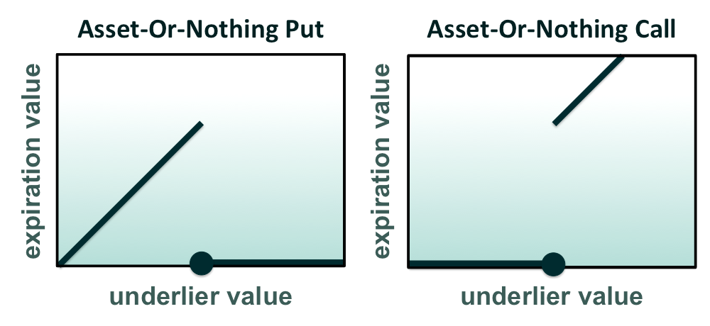

## Table of Contents

## What is an asset-or-nothing call option?

An asset-or-nothing call option is a type of financial option where you only get the asset if the option's price is above a certain level at the end. If it's not, you get nothing. It's different from regular options because you don't get any money if the price is just a little bit above the level; you need it to be above to get the whole asset.

For example, imagine you buy an asset-or-nothing call option for a stock that's currently worth $100. The option says you'll get the stock if its price is above $105 when the option ends. If the stock price is $106, you get the whole stock. But if it's $104, you get nothing, even though it's close. This makes these options a bit riskier but can be exciting if you think the stock will go way up.

## How does an asset-or-nothing call option differ from a standard call option?

An asset-or-nothing call option and a standard call option work differently when it comes to what you get at the end. With a standard call option, if the price of the asset is above a certain level (called the strike price) when the option ends, you can buy the asset at that strike price. You get to keep any extra value if the asset's price is higher than the strike price. For example, if the strike price is $100 and the asset's price is $105, you can buy it for $100 and then sell it for $105, making a profit.

On the other hand, an asset-or-nothing call option is simpler but riskier. If the asset's price is above the strike price when the option ends, you get the whole asset, no matter how much higher the price is. But if the price is even a tiny bit below the strike price, you get nothing at all. Using the same example, if the strike price is $100 and the asset's price is $105, you get the asset. But if it's $99, you get nothing, even though it's close. This makes asset-or-nothing options more of an all-or-nothing bet.

## What is the payoff structure of an asset-or-nothing call option?

The payoff structure of an asset-or-nothing call option is straightforward. If the price of the asset is above the strike price when the option expires, you get the full asset. For example, if the strike price is $100 and the asset's price is $105, you receive the asset. It doesn't matter how much higher the price is; you get the whole asset as long as it's above the strike price.

However, if the asset's price is at or below the strike price when the option expires, you get nothing at all. Using the same example, if the asset's price is $99 or even $100, you don't get the asset. This makes the payoff of an asset-or-nothing call option a bit like an all-or-nothing bet, where you either win big or get nothing.

## Can you explain the concept of a binary option in relation to asset-or-nothing call options?

A binary option is a type of financial option where you either get a fixed amount of money or nothing at all, depending on whether a certain condition is met. It's like making a bet where you either win a set prize or lose your bet completely. An asset-or-nothing call option is a specific kind of binary option. With an asset-or-nothing call option, the condition is whether the price of an asset is above a certain level, called the strike price, at the end of the option. If it is, you get the whole asset; if it's not, you get nothing.

The main difference between a general binary option and an asset-or-nothing call option is what you get if you win. With most binary options, you might get a fixed amount of cash if the condition is met. But with an asset-or-nothing call option, you get the actual asset itself if the price is above the strike price. This makes asset-or-nothing call options a bit more exciting and riskier because you're betting on getting the whole asset, not just some money.

## What are the key factors that influence the pricing of an asset-or-nothing call option?

The price of an asset-or-nothing call option depends on a few important things. One big [factor](/wiki/factor-investing) is how likely it is that the price of the asset will be above the strike price when the option ends. If people think the price will go up a lot, the option will be more expensive because there's a higher chance you'll get the asset. Another factor is how long the option lasts. The longer the option is valid, the more time there is for the price to go up, which can make the option more expensive.

Another key thing is how much the price of the asset can move around, which is called volatility. If the price moves a lot, the option can be pricier because there's a bigger chance the price will jump above the strike price. Also, the interest rates and any dividends the asset might pay can affect the price. If interest rates are high or the asset pays a lot in dividends, it can change how much people are willing to pay for the option.

## How can one calculate the value of an asset-or-nothing call option at expiration?

Calculating the value of an asset-or-nothing call option at expiration is pretty simple. You just need to look at the price of the asset at the time the option ends. If the price is higher than the strike price, you get the whole asset. For example, if the strike price is $100 and the asset's price is $105 when the option expires, you get the asset worth $105. It's that easy.

If the price of the asset is the same as or lower than the strike price, you don't get anything. So, if the asset's price is $99 or even $100 when the option expires, you get nothing. This makes the value of the option at expiration either the full value of the asset or zero, depending on whether the price is above the strike price or not.

## What are the potential uses of asset-or-nothing call options in investment strategies?

Asset-or-nothing call options can be used in investment strategies to make big bets on whether an asset's price will go up a lot. For example, if you think a stock will jump way above a certain price, you might buy an asset-or-nothing call option. If you're right and the stock price goes above the strike price, you get the whole stock. This can be a good way to make a lot of money if you're sure about your prediction, but it's risky because if the stock doesn't go high enough, you get nothing.

Another way to use these options is for hedging. If you own a stock and are worried it might drop a bit but still think it could go up a lot, you could buy an asset-or-nothing call option with a higher strike price. If the stock goes way up, you get the extra stock, which can help make up for any losses on the stock you already own. This can be a way to protect your investment while still having the chance to make more money if things go really well.

## What are the risks associated with trading asset-or-nothing call options?

Trading asset-or-nothing call options can be risky because you either get the whole asset or nothing at all. If the price of the asset is even a little bit below the strike price when the option ends, you lose all the money you spent on the option. This makes it a bit like gambling, where you could lose everything if your guess about the price going up is wrong. It's a big risk because you don't get any money back if the price is close but not above the strike price.

Another risk is that these options can be hard to understand and predict. The price of the option can change a lot based on things like how much the asset's price moves around, how long the option lasts, and what people think will happen to the asset's price. If you don't know a lot about these things, you might end up paying too much for the option or buying one that doesn't have a good chance of paying off. It's important to really understand what you're doing before you start trading these options.

## How do market conditions affect the value of asset-or-nothing call options?

Market conditions can really change the value of asset-or-nothing call options. If the market thinks the price of the asset will go up a lot, the option will be worth more. This is because there's a bigger chance the price will be above the strike price when the option ends, and then you get the whole asset. But if the market is worried and thinks the price might go down or stay the same, the option will be worth less. People won't want to pay as much for something that might not pay off.

Another thing that affects the value is how much the price of the asset can move around, which is called volatility. If the price is jumping all over the place, the option might be more expensive. That's because there's a bigger chance the price will go above the strike price, even if it's just for a little bit. Also, how long the option lasts matters. The longer it lasts, the more time there is for the price to go up, which can make the option more valuable. But if the market is calm and prices aren't moving much, the option might not be worth as much because it's less likely to pay off.

## What are some advanced pricing models used for asset-or-nothing call options?

One popular way to figure out the price of an asset-or-nothing call option is by using the Black-Scholes model. This model looks at things like the current price of the asset, the strike price, how long the option lasts, how much the price can move around (volatility), and the interest rate. It uses a special math formula to guess how likely it is that the price will be above the strike price when the option ends. If the chance is high, the option will be worth more because you're more likely to get the asset.

Another model that people use is the binomial model. This one breaks down the time until the option ends into smaller steps and imagines the price of the asset going up or down at each step. By looking at all the different ways the price could go, it can figure out how likely it is that the price will be above the strike price at the end. This model can be a bit easier to understand because it's more like a step-by-step story of what might happen to the price. Both models help traders decide how much they should pay for the option, but they need to think about how well the model fits the real world and if they trust the guesses it makes about the future.

## How can asset-or-nothing call options be used in combination with other financial instruments?

Asset-or-nothing call options can be used with other financial instruments to make different kinds of bets and protect investments. For example, if you own a stock and think its price might go way up but you're not sure, you could buy an asset-or-nothing call option with a high strike price. If the stock does go way up, you get the extra stock, which can help you make more money. But if the stock stays the same or goes down a bit, you still have your original stock, and you only lose the money you spent on the option.

Another way to use these options is in a strategy called a spread. You could buy an asset-or-nothing call option and also sell a regular call option on the same stock but with a higher strike price. If the stock price goes up a lot but stays below the higher strike price, you get the stock from the asset-or-nothing option but don't have to give it away because the regular call option doesn't get used. This can be a way to make money if you think the stock will go up but not too high. It's like betting on the stock price being in a certain range, which can be less risky than betting on it going way up or way down.

## What are the regulatory considerations for trading asset-or-nothing call options?

Trading asset-or-nothing call options can be tricky because different countries have different rules about them. In some places, these options are seen as a type of gambling, so they might be banned or have strict rules. For example, in the United States, the Securities and Exchange Commission (SEC) and the Commodity Futures Trading Commission (CFTC) keep a close eye on these options. They want to make sure people aren't tricked or hurt by them. So, if you want to trade these options, you need to check the rules in your country and make sure you're following them.

Another thing to think about is that some places might need you to have a special license or to trade through a certain kind of company. This is to make sure that only people who really understand what they're doing can trade these options. Also, the rules might say that you have to tell people about the risks before they buy an option. This is to help people make smart choices and not lose too much money. So, before you start trading asset-or-nothing call options, it's a good idea to learn about the rules where you live and make sure you're doing everything right.

## What are call options and how do they work?

Call options are financial contracts that grant the holder the right, but not the obligation, to purchase an underlying asset at a predetermined price, known as the strike price, within a specific time period. This feature distinguishes call options from obligations such as forward contracts, which require the holder to proceed with the transaction. The ability to choose whether or not to exercise the option allows traders to strategically manage risk and make speculative trades in various market conditions.

Mathematically, the value of a call option can be modeled using the Black-Scholes formula, which considers several factors including the current price of the asset ($S$), the strike price ($K$), the time to expiration ($T$), the risk-free [interest rate](/wiki/interest-rate-trading-strategies) ($r$), and the [volatility](/wiki/volatility-trading-strategies) of the asset ($\sigma$). The Black-Scholes formula for a call option is expressed as:

$$
C(S, T) = S \cdot N(d_1) - K \cdot e^{-rT} \cdot N(d_2)
$$

where

$$
d_1 = \frac{\ln(S/K) + (r + \sigma^2/2)T}{\sigma\sqrt{T}}
$$

$$
d_2 = d_1 - \sigma\sqrt{T}
$$

and $N(\cdot)$ is the cumulative distribution function of the standard normal distribution.

Traders utilize call options primarily for two reasons: hedging and speculation. As a hedging instrument, call options provide a form of insurance against rising prices by locking in a maximum purchase cost for the underlying asset. This can be particularly advantageous for businesses reliant on commodities, as they can use call options to stabilize costs and protect against adverse price movements.

In contrast, speculative traders view call options as an opportunity to profit from anticipated price increases in the underlying asset without committing a large capital investment upfront. The leverage provided by options means that traders can potentially achieve significant returns from relatively small price movements in the underlying asset. However, this leverage also comes with high risk, as the value of the option can quickly diminish to zero if the market moves unfavorably relative to the strike price and expiration date.

Overall, call options are versatile tools in financial markets, offering a flexible approach to managing risk and capitalizing on market predictions. Understanding their mechanics and applications is fundamental for any trader involved in derivatives.

## What are Asset-Or-Nothing Call Options?

Asset-or-nothing call options are a distinctive type of binary or digital option, characterized by a payoff structure that diverges significantly from standard call options. In a standard call option, the payoff is determined by the difference between the underlying asset's price and the strike price, provided the asset's price exceeds the strike price at expiration. However, with asset-or-nothing call options, the payoff is not dependent on this price difference. Instead, the holder receives a fixed amount, which is equivalent to the value of the asset itself, if the underlying asset price is above a specified strike price at expiration. If the condition is not met, the option expires worthless.

The payoff structure for an asset-or-nothing call option can be expressed mathematically as:

$$

\text{Payoff} = 
\begin{cases} 
S, & \text{if } S > K \\
0, & \text{otherwise}
\end{cases}
$$

where $S$ is the spot price of the underlying asset at expiration, and $K$ is the strike price of the option.

This binary nature of asset-or-nothing options makes them particularly useful for traders engaging in speculative strategies. These options cater to investors who have a strong conviction that the asset's price will exceed the strike price, as they provide a leveraged way to benefit from their prediction. The all-or-nothing payoff structure can lead to significant profits if the position is correctly timed, but also entails the risk of losing the entire premium paid if the asset does not surpass the strike price.

From a speculative trading standpoint, asset-or-nothing call options enable traders to implement strategies that focus on directional bets. These options' payouts are detached from the magnitude by which the asset's price exceeds the strike price, allowing traders to indirectly target volatility and price movements. Consequently, they are attractive for investors aiming to capitalize on anticipated sharp movements driven by market events or news.

In practice, these options can be integrated into broader trading strategies. Investors might use them to hedge other positions or to express specific market views without deploying substantial capital. The inherent simplicity of the payoff structure of asset-or-nothing call options makes them an effective tool for enhancing portfolio returns, provided the speculative endeavor is aligned with an accurate prediction of market conditions.

## References & Further Reading

[1]: Hull, J. C. (2014). ["Options, Futures, and Other Derivatives"](https://www.amazon.com/Options-Futures-Other-Derivatives-9th/dp/0133456315). Pearson.

[2]: Black, F., & Scholes, M. (1973). ["The Pricing of Options and Corporate Liabilities."](https://www.cs.princeton.edu/courses/archive/fall09/cos323/papers/black_scholes73.pdf) Journal of Political Economy, 81(3), 637-654.

[3]: Lopez de Prado, M. (2018). ["Advances in Financial Machine Learning"](https://www.amazon.com/Advances-Financial-Machine-Learning-Marcos/dp/1119482089). Wiley.

[4]: Chan, E. P. (2008). ["Quantitative Trading: How to Build Your Own Algorithmic Trading Business"](https://github.com/egorpe/EPChan-QuantitativeTrading/blob/master/example7_6.m). Wiley.

[5]: Jansen, S. (2020). ["Machine Learning for Algorithmic Trading: Predictive models to extract signals from market and alternative data for systematic trading strategies with Python, 2nd Edition"](https://www.amazon.com/Machine-Learning-Algorithmic-Trading-alternative/dp/1839217715). Packt Publishing. 

[6]: Seybold, P. (2006). ["Evidence-Based Technical Analysis: Applying the Scientific Method and Statistical Inference to Trading Signals"](https://www.amazon.com/Evidence-Based-Technical-Analysis-Scientific-Statistical/dp/0470008741). Wiley.