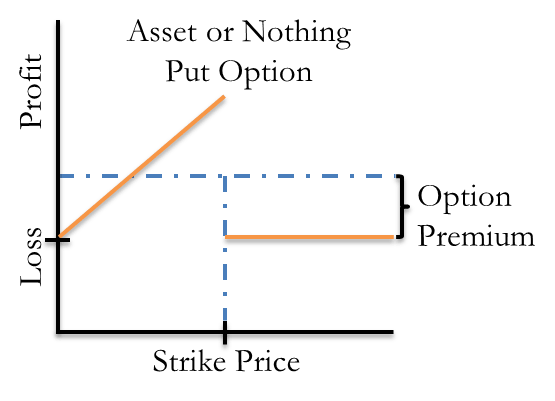

## Table of Contents

## What is an asset-or-nothing put option?

An asset-or-nothing put option is a type of financial option where the buyer gets the full value of the underlying asset if the option expires in the money. In simpler terms, if the price of the asset is below a certain level (called the strike price) when the option expires, the buyer gets the asset's value. If the price is above the strike price, the buyer gets nothing.

This type of option is different from a regular put option, where the buyer would get the difference between the strike price and the asset's value if it's in the money. Asset-or-nothing put options are often used in more complex trading strategies and can be riskier because the payoff is all or nothing. They are less common than standard options but can be useful for specific investment goals.

## How does an asset-or-nothing put option differ from a standard put option?

An asset-or-nothing put option and a standard put option work differently when it comes to what you get if the option is successful. With a standard put option, if the price of the asset is below the strike price when the option expires, you get to sell the asset at the strike price. This means you make money based on the difference between the strike price and the lower market price. For example, if the strike price is $100 and the market price is $90, you get $10 per share.

On the other hand, an asset-or-nothing put option gives you the full value of the asset if it's below the strike price at expiration, but nothing if it's above. So, using the same example, if the market price is $90 and the strike price is $100, you would get the full $90 per share, not just the $10 difference. This makes asset-or-nothing put options riskier because you either get the whole value or nothing at all, whereas with a standard put option, you get something as long as the price is below the strike price.

## What are the key components of an asset-or-nothing put option?

An asset-or-nothing put option has a few main parts that you need to know about. First, there's the strike price. This is the price that the asset needs to be below when the option ends for you to get anything. If the asset's price is below this strike price, you win and get the full value of the asset. Second, there's the expiration date. This is when the option ends, and you find out if you get the asset's value or nothing.

Another important part is the premium. This is what you pay to buy the option. It's like a bet that the asset's price will be below the strike price at the end. If you're wrong and the price is above the strike price, you lose the premium you paid. These parts together make up an asset-or-nothing put option, which is a way to bet on the price of an asset going down, but with a big risk because you get nothing if you're wrong.

## Can you explain the payoff structure of an asset-or-nothing put option?

The payoff structure of an asset-or-nothing put option is pretty straightforward but can be risky. If the price of the asset is below the strike price when the option expires, you get the full value of the asset. For example, if the strike price is $100 and the asset's price is $90 at expiration, you get $90. This is different from a regular put option where you'd only get the difference, which would be $10 in this case.

However, if the price of the asset is above the strike price at expiration, you get nothing. So, if the asset's price is $110 and the strike price is $100, you don't get any money back. This all-or-nothing nature makes asset-or-nothing put options riskier because you either win big or lose the entire premium you paid for the option.

## What are the potential uses of asset-or-nothing put options in investment strategies?

Asset-or-nothing put options can be used in investment strategies to bet on a big drop in an asset's price. Since these options pay out the full value of the asset if it's below the strike price at expiration, they can be useful if you think the price will fall a lot. For example, if you believe a stock will crash, you could buy an asset-or-nothing put option. If the stock price drops below the strike price, you get the full value of the stock at expiration, which could be a big win. This type of option can be a good way to make a large gain from a big price drop.

However, these options are also very risky because you get nothing if the asset's price stays above the strike price. This all-or-nothing payoff means you could lose your entire investment if the price doesn't fall as much as you expect. Some investors might use these options as part of a bigger strategy, maybe to hedge other investments or to diversify their portfolio. But because of the high risk, they are usually used by more experienced traders who understand the market well and are willing to take the chance of losing everything.

## How is the value of an asset-or-nothing put option determined?

The value of an asset-or-nothing put option depends on a few things. First, it's based on how likely it is that the asset's price will be below the strike price when the option expires. If it's very likely, the option is worth more because you have a better chance of getting the full value of the asset. Second, the value also depends on how long there is until the option expires. More time means more chance for the price to move, which can make the option more valuable. Finally, the value is affected by how much the asset's price moves around, which is called volatility. If the price moves a lot, the option could be worth more because there's a bigger chance it will end up below the strike price.

The actual price you pay for the option, called the premium, is what someone else is willing to sell it for. This price takes into account all these factors: the likelihood of the asset being below the strike price, the time left until expiration, and the asset's volatility. If the market thinks the asset's price will drop a lot, the premium will be higher. But remember, even if you pay a high premium, you only get the full value of the asset if it's below the strike price at expiration. If it's not, you lose the entire premium.

## What are the risks associated with trading asset-or-nothing put options?

Trading asset-or-nothing put options is risky because you could lose all the money you spend on the option. If the price of the asset is above the strike price when the option expires, you get nothing back. This means you lose the entire premium you paid to buy the option. It's like betting on a horse race and losing your whole bet if your horse doesn't win.

Another risk is that these options can be hard to understand and predict. The value of the option depends on how likely it is that the asset's price will fall below the strike price, how much time is left until the option expires, and how much the asset's price moves around. If you guess wrong about any of these things, you could lose money. Because of this, asset-or-nothing put options are usually used by experienced traders who know a lot about the market and are willing to take big risks.

## How do market conditions affect the pricing of asset-or-nothing put options?

Market conditions can change how much you pay for an asset-or-nothing put option. If the market thinks the price of the asset will go down a lot, the price of the option will go up. This is because more people want to buy the option, hoping to get the full value of the asset if it falls below the strike price. On the other hand, if the market thinks the asset's price will stay the same or go up, the price of the option will be lower because fewer people want to buy it.

Also, how much the asset's price moves around, called volatility, can affect the price of the option. If the asset's price is likely to change a lot, the option becomes more valuable because there's a bigger chance it will end up below the strike price. Time until the option expires is important too. The more time left, the more chance for the price to move, which can make the option more expensive. All these things together help decide how much you pay for an asset-or-nothing put option.

## What are some common strategies for hedging with asset-or-nothing put options?

Asset-or-nothing put options can be used to hedge against big drops in the price of an asset. If you own a stock and you're worried it might fall a lot, you can buy an asset-or-nothing put option. If the stock's price goes below the strike price by the time the option expires, you get the full value of the stock. This can help make up for the loss in the stock's value. But if the stock's price stays above the strike price, you lose the money you paid for the option.

Another way to use these options for hedging is to combine them with other investments. For example, you might have a portfolio with different stocks and bonds. To protect against a big drop in one of your stocks, you could buy an asset-or-nothing put option on that stock. This way, if the stock crashes, the option pays out the full value, which can help balance out the losses in your portfolio. But remember, these options are risky because you get nothing if the stock's price doesn't fall below the strike price, so they should be used carefully.

## How do asset-or-nothing put options fit into a broader options trading portfolio?

Asset-or-nothing put options can be a part of a bigger options trading plan, but they are a bit tricky to use. These options are good if you think a stock's price will fall a lot. If it does, and the price is below the strike price when the option ends, you get the full value of the stock. This can be a big win if you're right. But if the stock's price doesn't fall enough, you get nothing and lose all the money you paid for the option. Because of this, these options are usually used by people who know a lot about trading and are okay with taking big risks.

In a bigger options trading plan, you might use asset-or-nothing put options to balance out other investments. For example, if you own a stock and you're worried it might crash, you could buy an asset-or-nothing put option on that stock. This way, if the stock does crash, the option pays out the full value, which can help make up for the loss in the stock's value. But you have to be careful because these options are risky. They should be just one part of a bigger plan, and you should think about how they fit with other options and investments you have.

## What are the tax implications of trading asset-or-nothing put options?

Trading asset-or-nothing put options can have tax implications that you need to know about. If you make money from these options, you have to pay taxes on your gains. How much tax you pay depends on how long you held the option before it expired or you sold it. If you held it for a year or less, the gains are considered short-term capital gains and are taxed at your regular income tax rate. If you held it for more than a year, the gains are long-term capital gains, which are usually taxed at a lower rate.

If you lose money on asset-or-nothing put options, you might be able to use those losses to lower your taxes. You can use these losses to offset any gains you made from other investments. If your losses are more than your gains, you can even use some of the losses to reduce your regular income, up to a certain limit each year. It's important to keep good records of all your trades and talk to a tax professional to make sure you're doing everything right with your taxes.

## Can you discuss any advanced mathematical models used to price asset-or-nothing put options?

Pricing asset-or-nothing put options can be done using advanced mathematical models, one of which is the Black-Scholes model. This model is famous in finance for pricing options. It uses things like the current price of the asset, the strike price, the time until the option expires, the risk-free [interest rate](/wiki/interest-rate-trading-strategies), and how much the asset's price moves around, called volatility. For an asset-or-nothing put option, the Black-Scholes model is tweaked a bit. Instead of paying out the difference between the strike price and the asset's price, it pays out the full value of the asset if it's below the strike price. This tweak makes the math a bit different, but the basic idea is the same: figuring out the chance of the option paying out and what that payout might be worth.

Another model that can be used is the binomial model. This model breaks down the time until the option expires into smaller steps and looks at what might happen at each step. It's like playing a game where the asset's price can go up or down at each step, and you figure out the value of the option based on all the possible paths the price could take. For an asset-or-nothing put option, the binomial model would look at all the paths where the asset's price ends up below the strike price and figure out what the option would be worth in those cases. This model can be more detailed than the Black-Scholes model because it can handle more complex situations, but it also needs more math and computer power to use.

## What is the Understanding of Asset-or-Nothing Financial Derivatives?

Asset-or-nothing options are a specialized type of binary option that provide a specific, predetermined payoff, usually a fixed amount, if certain conditions are met at the time of the option's expiration. Unlike conventional options that offer variable returns based on the price movements of the underlying asset, asset-or-nothing options simplify outcomes to an all-or-nothing scenario. At expiration, if the underlying asset meets the set condition, the holder receives the fixed payoff; otherwise, the holder receives nothing.

The payoff structure of an asset-or-nothing put option can be mathematically expressed as:

$$
\text{Payoff} = 
  \begin{cases} 
   Q & \text{if } S_T < K \\
   0 & \text{if } S_T \geq K 
  \end{cases}
$$

where $S_T$ is the price of the underlying asset at time $T$ (expiration), $K$ is the strike price, and $Q$ is the fixed payoff amount.

These derivatives offer unique value propositions in financial markets as they allow investors to benefit from movements in the underlying asset’s price without directly owning it. Asset-or-nothing options are often used for hedging purposes or speculative strategies, especially in volatile markets where sharp price movements are anticipated.

In a financial market context, asset-or-nothing options provide an alternative way to hedge against downside risk or speculate on asset price movements. They afford precise risk control by allowing investors to specify exact payoffs they expect if certain market conditions are realized. This contrasts with the potentially unlimited-and sometimes less predictable-returns associated with traditional options.

The role of these options extends beyond simple payoff structures. Financial institutions and sophisticated traders might employ them to construct complex strategies that take advantage of expected market conditions or, alternatively, use them to hedge positions in broader portfolios, thereby minimizing exposure to adverse price movements while locking in profits in favorable scenarios.

By offering clear-cut outcomes and requiring low capital investment compared to outright asset purchases or conventional options, asset-or-nothing put options serve as a strategic tool in the array of financial derivatives leveraged by market participants to optimize their trading and hedging approaches. These characteristics make them particularly appealing in [algorithmic trading](/wiki/algorithmic-trading) systems, where precise execution and risk management are paramount.

## What are Put Options: Their Definition and Strategic Use?

A put option is a financial derivative that grants its holder the right, but not the obligation, to sell a specific quantity of an underlying asset at a predetermined price, known as the strike price, within a specified timeframe. The primary motivation for acquiring a put option is to hedge against potential declines in the asset's price or to speculate on a decrease in its value. 

### Strategies Employing Put Options

1. **Protective Put (Married Put):** This strategy involves purchasing a put option in conjunction with holding the underlying asset. The aim is to protect the investment from a downward price movement. For example, if an investor owns stocks worth $50 and fears a potential decline, they can buy put options with a strike price of $50. If the stock price drops significantly, the investor can exercise the put option, effectively selling the asset at the predetermined strike price, thus minimizing losses.

2. **Long Put:** In this strategy, traders buy put options on an asset they do not own, speculating that the asset's price will fall. If the market price falls below the strike price, the trader can buy the asset at a lower market price and sell it at the higher strike price, realizing a profit.

3. **Bear Put Spread:** This involves purchasing put options at a specific strike price while simultaneously selling the same number of puts at a lower strike price. Both options have the same expiration date. The goal here is to profit from a moderate decline in the price of the underlying asset, with limited risk and capped potential gains.

### Real-World Examples

Consider a real-world scenario where a trader anticipates a downturn in the stock market. The trader can enter a **long put** position on a widely-followed stock index. By doing so, if the index value decreases, the trader stands to benefit from exercising the put option, which will be in the money (i.e., the market price is below the strike price).

A practical application of the **bear put spread** can be observed in industries with cyclical downturns, such as the oil and gas sector. A trader predicting a temporary dip in oil prices might employ this strategy to gain from the downward movement with limited risk exposure.

### Profit and Loss Calculations

The payoff for a put option can be mathematically expressed as:

$$
\text{Payoff} = \max(0, K - S)
$$

where $K$ is the strike price, and $S$ is the market price at expiration. For a protective put, the net payoff considers both the put payoff and the loss from the underlying asset, and is given by:

$$
\text{Net Payoff} = \max(0, K - S) - P + (S_0 - S)
$$

where $P$ is the premium paid for the put, and $S_0$ is the original price of the underlying asset. This formula illustrates how the protective put strategy cushions against price reductions, ensuring maximum loss is capped to the option premium paid.

Understanding the strategic use of put options equips traders with tools to effectively manage investment risks and capitalize on market downturns. By using these strategies, investors can safeguard assets against [volatility](/wiki/volatility-trading-strategies) while exploring profit opportunities during bearish market conditions.

## References & Further Reading

1. Hull, J. C. (2018). *Options, Futures, and Other Derivatives*. Pearson: A comprehensive textbook that provides in-depth knowledge about derivatives, including options and their strategic applications. It covers essential topics like the pricing of derivatives, hedging strategies, and risk management.

2. Wilmott, P. (2006). *Paul Wilmott on Quantitative Finance*. John Wiley & Sons: This book offers valuable insights into quantitative finance with a focus on derivatives and quantitative strategies applicable to trading options.

3. Black, F., & Scholes, M. (1973). "The Pricing of Options and Corporate Liabilities," *Journal of Political Economy*, 81(3), 637-654: The seminal paper introducing the Black-Scholes model, a critical tool in options pricing and algorithmic trading today.

4. Geman, H. (2005). *Commodities and Commodity Derivatives: Modelling and Pricing for Agriculturals, Metals and Energy*. John Wiley & Sons: Provides understanding on how derivatives, including options, can be applied to commodities, offering context on asset-or-nothing options and underlying assets.

5. Narang, R. K. (2009). *Inside the Black Box: A Simple Guide to Quantitative and High-Frequency Trading*. John Wiley & Sons: Discusses the intricacies of quantitative and algorithmic trading, useful for readers interested in integrating algo strategies in options trading.

6. Aldridge, I. (2013). *High-Frequency Trading: A Practical Guide to Algorithmic Strategies and Trading Systems*. John Wiley & Sons: Explains the technical aspects of high-frequency and algorithmic trading, which are essential for understanding advancements in trading systems using algorithms.

7. "Asset-or-Nothing Options," available at [Investopedia](https://www.investopedia.com/terms/a/assetornothingoption.asp): A concise online resource explaining the basics and pricing of asset-or-nothing options, useful for traders and finance students.

8. "Put Option Definition," available at [Investopedia](https://www.investopedia.com/terms/p/putoption.asp): Offers a straightforward explanation of put options with examples and key concepts relevant to both novice and seasoned traders.

9. "Greek Letters in Options Trading," available at [The Options Guide](https://www.theoptionsguide.com/the-greeks.aspx): This resource covers the role of the Greeks in options trading, focusing on risk management which is crucial in algorithmic trading environments.

10. Euan Sinclair (2010). *Option Trading: Pricing and Volatility Strategies and Techniques*. John Wiley & Sons: Provides deep insights into pricing, volatility, and strategic techniques for options trading, integrating concepts applicable to both traditional and algorithmic trading frameworks.

