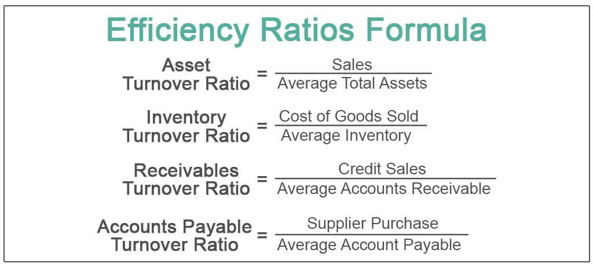

The ever-changing landscape of financial markets has led to the emergence of advanced investment strategies and technological innovations. At the core of these developments lies asset management, which is pivotal in optimizing returns and managing risks effectively. Asset management encompasses a comprehensive approach to evaluating asset performance, ensuring that the assets are utilized in the most productive way. It involves a systematic process of deploying, operating, maintaining, and trading assets in a manner that maximizes returns while minimizing risks. The evaluation of asset performance through metrics such as Return on Assets (ROA) provides essential insights into how efficiently a firm uses its assets to generate income.

A significant technological advancement shaping modern financial markets is algorithmic trading. This form of trading employs sophisticated algorithms to automate trades, thereby enhancing asset performance by ensuring rapid execution, minimizing human error, and capitalizing on market opportunities. Algorithmic trading strategies range from trend following and statistical arbitrage to more complex approaches like mean reversion and high-frequency trading. The integration of machine learning and artificial intelligence into these strategies has further refined their accuracy and adaptability.



This article examines the interconnectedness of asset management, asset performance, and algorithmic trading mechanics, emphasizing their role in the financial ecosystem. By understanding the key components, metrics, and tools that underpin these areas, one can gain insights into the intricacies of modern finance. This exploration offers a comprehensive view of how the fusion of asset management and algorithmic trading is shaping the future of investment strategies, providing a competitive advantage to those who effectively leverage these innovations.

## Table of Contents

## Understanding Asset Management

Asset management encompasses the systematic handling of an entity’s assets to effectively deploy, operate, maintain, and trade them, all while ensuring cost efficiency. This process is tailored to meet several objectives: primarily to maximize returns, manage risks, and optimize asset lifecycles.

Key to achieving these goals is the application of asset performance metrics. Among these, Return on Assets (ROA) stands out as a critical measurement. ROA offers insight into how efficiently a company's management is using its assets to generate earnings. Mathematically, it can be derived as:

$$
\text{ROA} = \frac{\text{Net Income}}{\text{Total Assets}}
$$

A higher ROA indicates proficient asset utilization and management effectiveness, whereas a lower ROA could signal potential inefficiencies that might require strategic redress.

Effective asset management is heavily reliant on accurate data analysis. The plethora of data available today offers a potent tool for strategic decision-making, allowing managers to assess asset performance meticulously. This involves the integration of sophisticated analytics to parse complex datasets, thereby facilitating informed decisions that align with the company's strategic objectives. Technologies such as predictive analytics and big data analytics are increasingly pivotal in enhancing decision-making processes.

Strategically, asset managers must focus on balancing the cost of asset management with the potential returns and the inherent risks associated. This often involves lifecycle management where assets are periodically assessed to decide whether to maintain, upgrade, or replace them. This decision invariably affects both short-term performance and long-term strategic positioning.

In sum, asset management is a comprehensive endeavor requiring meticulous planning, evaluation, and execution. By leveraging accurate data analysis and applying strategic decision-making principles, organizations can effectively manage their assets to enhance performance and achieve their financial goals.

## Metrics for Assessing Asset Performance

Return on Assets (ROA) serves as a critical metric for assessing a firm's efficiency in utilizing its assets to generate net income. Mathematically, ROA is expressed as:

$$
\text{ROA} = \left(\frac{\text{Net Income}}{\text{Total Assets}}\right) \times 100
$$

This ratio provides investors and managers with insights into how effectively a company is managing its resources to produce profits. A high ROA indicates that a company is efficiently using its assets, generating significant income relative to its asset base. Conversely, a declining ROA suggests that there may be inefficiencies in asset utilization, prompting further analysis and strategic adjustments.

In addition to ROA, metrics such as the Fixed Asset Turnover (FAT) and the Cash Conversion Cycle (CCC) are integral to achieving a comprehensive view of asset utilization. The Fixed Asset Turnover ratio evaluates how efficiently a company uses its fixed assets to generate sales, calculated as:

$$
\text{FAT} = \frac{\text{Net Sales}}{\text{Average Net Fixed Assets}}
$$

A high FAT value indicates that a company is effectively deploying its fixed assets in the production of revenue, which is essential for capital-intensive industries. On the other hand, the Cash Conversion Cycle measures the time span between a company's outlay of cash to purchase initial resources and its collection of cash from product sales. It is calculated as follows:

$$
\text{CCC} = \text{Inventory Period} + \text{Receivables Period} - \text{Payables Period}
$$

Shorter CCC values suggest that a firm is capable of quickly converting its investments in inventory and other resources into cash flows from sales. Monitoring and optimizing these metrics allows for improved managerial decisions and enhanced financial performance.

Together, these metrics provide a multidimensional understanding of how well a company is utilizing its assets. Effective asset utilization enhances profitability and can give firms a competitive edge. Firms should maintain regular assessments of these metrics to ensure alignment with strategic goals and to identify potential areas for improvement.

## The Mechanics of Algorithmic Trading

Algorithmic trading represents a significant advancement in financial markets, streamlining the trade execution process through the utilization of advanced algorithms which operate based on predefined criteria. This automated approach facilitates the rapid execution and settlement of trades, thereby enhancing market efficiency and [liquidity](/wiki/liquidity-risk-premium).

A primary strategy employed in [algorithmic trading](/wiki/algorithmic-trading) is [trend following](/wiki/trend-following), which involves identifying and exploiting upward or downward trends in asset prices over a given timeframe. These algorithms typically use technical indicators such as moving averages to trigger buy or sell conditions. For instance, a simple moving average crossover strategy might buy an asset when its short-term moving average crosses above a long-term moving average and sell when the opposite occurs.

Statistical [arbitrage](/wiki/arbitrage) is another common strategy, utilizing mathematical models to identify and exploit price inefficiencies between assets. This strategy often involves pairs trading, where an algorithm identifies historically correlated securities that are temporarily diverging in price and places offsetting trades to profit from a return to equilibrium.

Mean reversion strategies operate on the principle that asset prices will revert to their historical averages over time. Algorithms programmed with mean reversion principles identify overbought or oversold conditions, placing trades with the expectation that prices will revert to their mean.

High-frequency trading ([HFT](/wiki/high-frequency-trading-strategies)) leverages ultra-fast execution speeds to capitalize on small price discrepancies, often executing thousands of trades in fractions of a second. HFT algorithms require low-latency data feeds and connectivity to execute their strategies promptly, taking advantage of market micro-structure inefficiencies.

Enhancements in [machine learning](/wiki/machine-learning) and [artificial intelligence](/wiki/ai-artificial-intelligence) are further refining these trading strategies, improving accuracy and adaptability. These techniques enable algorithmic systems to learn from historical data, recognize complex patterns, and adjust trading strategies dynamically in response to changing market conditions.

For example, a machine learning model might learn from a dataset of historical trades and market conditions to predict future price movements or [volatility](/wiki/volatility-trading-strategies). This predictive capability can then be incorporated into decision-making algorithms that optimize trade execution. A Python implementation of a simple machine learning model for predicting price movements might look like this:

```python
from sklearn.ensemble import RandomForestClassifier
import numpy as np

# Sample feature matrix and target vector
X = np.array([
    [0.5, 1.0, 1.5],
    [1.5, 1.0, 0.5],
    [0.5, 1.0, 0.5]
])
y = np.array([1, 0, 1])  # 1 for an upward move, 0 for downward

# Initialize and train the model
model = RandomForestClassifier(n_estimators=100)
model.fit(X, y)

# Example prediction
new_data = np.array([[1.0, 1.0, 1.0]])
prediction = model.predict(new_data)

print("Predicted movement:", "Up" if prediction[0] == 1 else "Down")
```

This code snippet illustrates how a machine learning model can be trained to predict market movements based on historical data features. Such predictions can then enhance the decision-making process in algorithmic trading, allowing for more informed and adaptive strategies in the continuously evolving financial landscape.

## Performance Evaluation in Algorithmic Trading

Performance evaluation in algorithmic trading is crucial for assessing the effectiveness and reliability of trading strategies. Key metrics such as the Sharpe Ratio, Maximum Drawdown, Win Rate, and Profit Factor are essential tools in this evaluation process.

The Sharpe Ratio measures the average return earned in excess of the risk-free rate per unit of volatility or total risk. It is calculated as:

$$
\text{Sharpe Ratio} = \frac{E[R_p - R_f]}{\sigma_p}
$$

where $E[R_p - R_f]$ is the expected excess return of the portfolio, and $\sigma_p$ is the standard deviation of the portfolio's excess return. A higher Sharpe Ratio indicates better risk-adjusted returns.

Maximum Drawdown represents the largest drop from a peak to a trough in the portfolio's value, indicating potential losses during downturns. A smaller Maximum Drawdown reflects better risk control within a trading strategy.

Win Rate is the percentage of trades that are profitable out of the total trades executed. It is calculated as:

$$
\text{Win Rate} = \left(\frac{\text{Number of Winning Trades}}{\text{Total Number of Trades}}\right) \times 100
$$

A high Win Rate suggests a greater success rate in executing profitable trades.

Profit Factor is the ratio of gross profits to gross losses realized. It is expressed as:

$$
\text{Profit Factor} = \frac{\text{Total Profit from Winning Trades}}{\text{Total Loss from Losing Trades}}
$$

A Profit Factor greater than one indicates that the strategy is making more money than it is losing.

Backtesting platforms such as MetaTrader 4, TradingView, and QuantConnect play a pivotal role in strategy assessment by allowing traders to simulate trading strategies using historical data. This helps identify strengths and weaknesses before applying strategies in live markets.

Statistical analysis further aids in quantifying performance metrics, ensuring strategies are statistically robust. Libraries such as Ta-Lib in Python can be used to perform technical analysis on financial instruments which is critical for algorithmic strategy evaluations.

Visualisation tools enable traders to interpret complex data patterns, trends, and [backtesting](/wiki/backtesting) results effectively. Graphing and visualization libraries such as Matplotlib and Plotly in Python help create detailed visual reports that guide performance optimization.

Evaluating these metrics and leveraging analytical tools is fundamental to refining algorithmic strategies, ensuring they meet desired risk and return thresholds. This comprehensive analysis ultimately supports the development of dynamic, high-performance trading systems.

## Challenges and Considerations

Overfitting represents a significant challenge in algorithmic trading, where strategies excessively tailor their parameters to fit historical data. This often leads to high performance during backtesting but results in poor adaptability to new, unforeseen market conditions. Overfitting occurs when an algorithm captures noise instead of the underlying signal, making it less robust in dynamically changing environments. To mitigate overfitting, practitioners employ techniques such as cross-validation and regularization. Cross-validation involves partitioning data into training and testing subsets to ensure that the model performs well across different segments. Regularization techniques, like L1 (Lasso) and L2 (Ridge) regularizations, introduce penalties to complex models, discouraging excessive fitting to the idiosyncrasies of the dataset.

Transaction costs, which include broker fees, taxes, and slippage, pose another hurdle in algorithmic trading. High-frequency trading strategies, in particular, are significantly affected, as small price movements can be overshadowed by transaction costs. To improve net returns, traders optimize strategies by selecting architectures that minimize transactional expenses. For example, algorithms might be designed to account for bid-ask spreads, executing trades only when predefined criteria are met, ensuring cost efficiency.

Market volatility introduces further complexity by affecting the reliability of algorithmic trading systems. During periods of high volatility, asset prices can swing unpredictably, leading algorithms that are calibrated for stable environments to underperform. Incorporating risk management techniques, such as stop-loss orders or volatility forecasting models, can help mitigate adverse effects.

Continuous monitoring and adaptation are critical to maintaining the viability of algorithmic strategies over time. Market conditions are rarely static; they evolve due to macroeconomic factors, regulatory changes, or technological advancements. Adaptive algorithms capable of learning and adjusting their behaviors in real-time can offer resilience against changing environments. Machine learning techniques, such as [reinforcement learning](/wiki/reinforcement-learning), where models learn optimal policies through trial and error, are increasingly being integrated to enhance adaptiveness.

Python remains a popular choice for implementing real-time monitoring and adaptive capabilities due to its extensive libraries, such as Pandas for data manipulation, NumPy for numerical computations, and sci-kit-learn for implementing machine learning models. This ecosystem allows for rapid development and iteration of robust trading strategies:

```python
import pandas as pd
import numpy as np
from sklearn.model_selection import train_test_split
from sklearn.linear_model import LinearRegression
from sklearn.metrics import mean_squared_error

# Sample data for demonstration
data = pd.DataFrame({
    'price': np.random.randn(1000),
    'volume': np.random.randint(1, 100, 1000)
})

# Feature engineering
data['price_change'] = data['price'].diff()
data.dropna(inplace=True)

# Splitting data
X = data[['price_change', '[volume](/wiki/volume-trading-strategy)']]
y = data['price']

X_train, X_test, y_train, y_test = train_test_split(X, y, test_size=0.2, random_state=42)

# Model training
model = LinearRegression()
model.fit(X_train, y_train)

# Evaluation
predictions = model.predict(X_test)
mse = mean_squared_error(y_test, predictions)
print(f"Mean Squared Error: {mse}")

# Regularization alternative (Lasso)
from sklearn.linear_model import Lasso
lasso = Lasso(alpha=0.1)
lasso.fit(X_train, y_train)
```

This code demonstrates a basic setup for modeling price changes using a linear regression approach, with an option for Lasso regularization to prevent overfitting. Constant updates and strategy refinement remain vital to navigating the fluid landscape of financial markets effectively.

## Integration of Asset Management and Algo Trading

Combining asset management principles with algorithmic trading results in more nuanced and efficient investment strategies. Asset management focuses on the optimal allocation and utilization of resources, while algorithmic trading adds a technological layer that automates and accelerates these processes. This integration enhances both the speed and accuracy of decision-making in financial markets.

Efficient asset allocation is a primary objective of asset management. By employing algorithmic trading strategies, managers can allocate resources dynamically, responding to market changes in real-time. Algorithms can analyze vast datasets far quicker than human counterparts, identifying trends and patterns that inform asset allocation. This automated approach ensures that portfolios are balanced with the most current information, optimizing returns and minimizing risks.

Performance analytics also benefit significantly from algorithmic interventions. Traditional asset management strategies rely on periodic reviews of asset performance, which can be less responsive to market shifts. By integrating algorithmic trading, performance metrics are continuously monitored, and strategies are adjusted in a more timely manner. This real-time adaptability helps in seizing market opportunities and avoiding potential pitfalls.

Real-time data processing is another advantage provided by this integration. Algorithms sift through and analyze market data instantly, offering insights that would be impossible to gather manually. This capability is particularly useful in markets characterized by high volatility, where swift responses can have substantial impacts on investment returns. Furthermore, predictive analytics use historical data and machine learning techniques to forecast future market conditions, allowing managers to preemptively adjust asset positions. The formula for a simple linear regression, often used in predictive analytics, is:

$$
y = \beta_0 + \beta_1x_1 + \epsilon
$$

where $y$ is the dependent variable, $\beta_0$ is the y-intercept, $\beta_1$ is the slope of the line, $x_1$ is the independent variable, and $\epsilon$ is the error term.

The competitive advantage offered by integrating asset management with algorithmic trading is substantial. Companies that effectively marry these two disciplines can outperform those relying solely on traditional management. The seamless blend of human insight and algorithmic precision enables sophisticated financial strategies, harnessing the strengths of both to navigate complex and dynamic markets. Such an approach is not just beneficial—it's essential in an increasingly fast-paced financial ecosystem.

## Conclusion

Asset management and algorithmic trading have become pivotal components of contemporary financial strategies. Together, they create a synergistic approach to optimizing investment outcomes and improving the efficiency of market operations. By harnessing asset performance metrics like Return on Assets (ROA), and employing sophisticated trading algorithms, entities can significantly enhance their decision-making processes. 

Incorporating these advanced techniques does not only involve using historical data to predict future performance but also necessitates the continuous evaluation and adaptation of strategies based on real-time data analytics. This dynamic interaction allows for more precise asset allocation and improved risk management, leading to enhanced returns.

As technological innovations advance, the fusion of asset management principles with algorithmic trading mechanisms is expected to be a driving force in shaping future market leaders. High-frequency data processing and predictive analytics offer a competitive edge by facilitating a rapid response to market changes. This evolution suggests a promising future where financial entities that adeptly integrate these methods will likely maintain a superior position in increasingly complex and dynamic markets.

## References & Further Reading

[1]: Bergstra, J., Bardenet, R., Bengio, Y., & Kégl, B. (2011). ["Algorithms for Hyper-Parameter Optimization."](https://dl.acm.org/doi/10.5555/2986459.2986743) Advances in Neural Information Processing Systems 24.

[2]: ["Advances in Financial Machine Learning"](https://www.amazon.com/Advances-Financial-Machine-Learning-Marcos/dp/1119482089) by Marcos Lopez de Prado

[3]: ["Evidence-Based Technical Analysis: Applying the Scientific Method and Statistical Inference to Trading Signals"](https://www.amazon.com/Evidence-Based-Technical-Analysis-Scientific-Statistical/dp/0470008741) by David Aronson

[4]: ["Machine Learning for Algorithmic Trading"](https://github.com/stefan-jansen/machine-learning-for-trading) by Stefan Jansen

[5]: ["Quantitative Trading: How to Build Your Own Algorithmic Trading Business"](https://github.com/LucindaYa/quant-resources/blob/master/Quantitative%20Trading%20How%20to%20Build%20Your%20Own%20Algorithmic%20Trading%20Business.pdf) by Ernest P. Chan