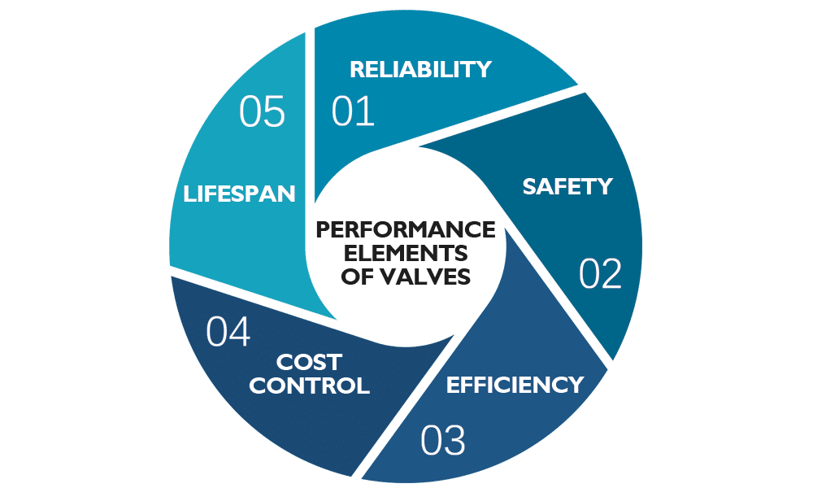

## Table of Contents

## What is asset performance management?

Asset performance management, or APM, is a way to keep track of and improve how well machines and equipment are working. It helps companies make sure their machines are running smoothly and not breaking down often. By using APM, businesses can find problems early, fix them before they get worse, and save money by avoiding big repairs.

APM uses special tools and software to watch over machines all the time. These tools can tell when something might go wrong and suggest what to do to fix it. This helps companies plan better and keep their equipment working longer. In the end, APM makes it easier for businesses to keep their machines in good shape and working well.

## Why is asset performance important for businesses?

Asset performance is important for businesses because it helps them keep their machines and equipment working well. When machines are running smoothly, businesses can make more products and offer better services to their customers. This means they can make more money and grow their business. If machines keep breaking down, it can slow down work and cost a lot of money to fix, which can hurt the business.

Good asset performance also helps businesses save money in the long run. By keeping an eye on how machines are doing and fixing small problems before they get big, companies can avoid expensive repairs and unexpected downtime. This makes it easier to plan and budget for the future. In the end, taking care of assets well helps businesses stay strong and successful.

## What are the basic components of an asset?

An asset is something that a business owns and uses to make money. The basic components of an asset include its physical parts, like the engine or gears of a machine, and its value, which is how much it's worth. Another important part is its condition, which tells us if it's working well or if it needs repairs. The age of the asset also matters because older machines might not work as well as new ones.

There are also intangible parts of an asset, like its history of maintenance and how often it has been used. This information helps businesses know how to take care of the asset and when it might need to be replaced. Finally, the location of the asset is important because it affects how easy it is to use and maintain. All these components together help businesses understand and manage their assets better.

## How does regular maintenance affect asset performance?

Regular maintenance helps keep machines and equipment in good shape, which makes them work better and last longer. When businesses take care of their assets often, they can find small problems before they turn into big ones. This means they can fix things like a loose bolt or a worn-out part before it causes the machine to break down. By doing this, businesses can keep their machines running smoothly and avoid unexpected stops that can slow down work.

Also, regular maintenance helps save money in the long run. When machines are well taken care of, they don't need big, expensive repairs as often. This means businesses can plan their budgets better and not have to spend a lot of money all at once to fix a broken machine. In the end, taking good care of assets through regular maintenance helps businesses keep their machines working well, which makes it easier to make money and grow.

## What are the common metrics used to measure asset performance?

There are several common metrics that businesses use to measure how well their assets are performing. One important metric is uptime, which tells you how much time the machine is working and not broken down. Another metric is the overall equipment effectiveness (OEE), which looks at how well the machine is doing its job by considering things like how fast it's working, how often it's working, and how well it's making good products. The mean time between failures (MTBF) is also used to see how long a machine can work before it breaks down again.

Another useful metric is the mean time to repair (MTTR), which measures how long it takes to fix a machine when it breaks down. This helps businesses know if they can get their machines back to work quickly. The cost of maintenance is another important metric because it shows how much money is being spent to keep the machines running well. By looking at these metrics, businesses can understand how their assets are doing and make plans to keep them working better.

## How can predictive maintenance improve asset efficiency?

Predictive maintenance can improve asset efficiency by helping businesses find problems with their machines before those problems get big. Instead of waiting for a machine to break down, predictive maintenance uses special tools and data to guess when a machine might need fixing. This means businesses can fix small issues before they cause the machine to stop working, which keeps the machines running smoothly and helps avoid unexpected downtime.

By using predictive maintenance, businesses can also save money and time. When machines are taken care of before they break, it usually costs less to fix them than if they break down completely. This also means that the machines can keep working without long stops for repairs, which helps the business keep making products and earning money. In the end, predictive maintenance makes it easier for businesses to keep their machines working well and efficiently.

## What role does IoT play in monitoring asset performance?

The Internet of Things (IoT) helps businesses keep an eye on their machines by connecting them to the internet. With IoT, machines can send information about how they are doing right to a computer. This means businesses can see if a machine is working well or if it might need fixing, even if they are not right next to it. IoT devices, like sensors, can watch things like temperature, vibration, and how much the machine is being used, and then send this information to be checked.

By using IoT, businesses can find problems with their machines early and fix them before they get worse. This helps keep the machines running smoothly and avoids big repairs that can cost a lot of money. IoT also makes it easier to plan when to do maintenance, so machines don't have to stop working unexpectedly. In the end, IoT helps businesses take better care of their machines and keep them working well.

## How do you calculate the return on investment for asset management?

To calculate the return on investment (ROI) for asset management, you need to figure out how much money you make from your assets compared to how much you spend on them. First, you add up all the money you earn from using the assets, like the income from products made by the machines. Then, you subtract all the costs of managing those assets, such as maintenance, repairs, and any other expenses. The difference between the earnings and the costs is your net profit. To find the ROI, you divide this net profit by the total costs and then multiply by 100 to get a percentage.

For example, if you earn $10,000 from your machines and spend $8,000 on maintaining them, your net profit is $2,000. When you divide $2,000 by $8,000, you get 0.25. Multiply that by 100, and your ROI is 25%. This means for every dollar you spend on managing your assets, you get back $1.25. A higher ROI shows that your asset management is working well and helping you make more money.

## What are the advanced techniques for optimizing asset performance?

Advanced techniques for optimizing asset performance include using data analytics and machine learning. These tools help businesses look at a lot of information from their machines to find patterns and predict when something might go wrong. By understanding these patterns, companies can plan maintenance better and fix problems before they cause big trouble. This means machines can keep working well without breaking down often, which saves time and money.

Another advanced technique is using digital twins, which are virtual copies of real machines. These digital twins can be used to test different ways of using and maintaining the machines without actually changing anything in real life. This helps businesses find the best ways to keep their machines working well. By using digital twins, companies can make smarter decisions about how to take care of their assets, which leads to better performance and longer-lasting equipment.

## How does machine learning enhance asset performance analysis?

Machine learning helps businesses understand how their machines are doing by looking at a lot of data. It can find patterns and predict when a machine might need fixing. This means businesses can fix small problems before they get big, which keeps the machines running smoothly. Machine learning can also tell which parts of a machine are most likely to break down, so companies can focus on taking care of those parts more often. This helps save money because it stops big, expensive repairs from happening.

By using machine learning, businesses can make better plans for when to do maintenance. Instead of fixing machines at set times, they can do it when the data says it's needed. This makes sure the machines are always in good shape without wasting time and money on unnecessary work. In the end, machine learning helps businesses keep their machines working well for longer, which means they can make more products and earn more money.

## What are the challenges in implementing an asset performance management system?

Putting in place an asset performance management system can be hard because it needs a lot of money and time. Businesses have to buy special tools and software to keep an eye on their machines. They also need to train their workers to use these new tools. This can take a long time and cost a lot of money. Plus, the system has to work well with other systems the business already uses, which can be tricky.

Another challenge is getting good data. The system needs a lot of information to work right, but sometimes the data can be wrong or missing. This can make it hard to know what's really going on with the machines. Also, some workers might not like the new system because it changes how they do their jobs. They might need time to get used to it and see how it can help them. In the end, it takes a lot of planning and effort to make sure the asset performance management system works well for the business.

## How can an organization develop a comprehensive asset performance strategy?

To develop a comprehensive asset performance strategy, an organization needs to start by understanding what assets they have and how they are used. This means making a list of all the machines and equipment, and figuring out which ones are most important for the business. They should also look at how well these assets are working now and what problems they might have. By gathering this information, the organization can set clear goals for what they want to achieve with their assets, like making them last longer or reducing the time they are not working.

Once the organization knows what they want to achieve, they can start planning how to reach those goals. This involves choosing the right tools and software to keep an eye on the assets, like using IoT devices to collect data or machine learning to predict when maintenance is needed. It's also important to train the workers on how to use these new tools and make sure everyone understands the plan. The organization should keep checking how well the strategy is working and be ready to make changes if something isn't going as planned. By doing all this, the organization can make sure their assets are working well and helping the business grow.

## What is Understanding Asset Management?

Asset management encompasses the systematic handling of an entity’s assets to effectively deploy, operate, maintain, and trade them, all while ensuring cost efficiency. This process is tailored to meet several objectives: primarily to maximize returns, manage risks, and optimize asset lifecycles.

Key to achieving these goals is the application of asset performance metrics. Among these, Return on Assets (ROA) stands out as a critical measurement. ROA offers insight into how efficiently a company's management is using its assets to generate earnings. Mathematically, it can be derived as:

$$
\text{ROA} = \frac{\text{Net Income}}{\text{Total Assets}}
$$

A higher ROA indicates proficient asset utilization and management effectiveness, whereas a lower ROA could signal potential inefficiencies that might require strategic redress.

Effective asset management is heavily reliant on accurate data analysis. The plethora of data available today offers a potent tool for strategic decision-making, allowing managers to assess asset performance meticulously. This involves the integration of sophisticated analytics to parse complex datasets, thereby facilitating informed decisions that align with the company's strategic objectives. Technologies such as predictive analytics and big data analytics are increasingly pivotal in enhancing decision-making processes.

Strategically, asset managers must focus on balancing the cost of asset management with the potential returns and the inherent risks associated. This often involves lifecycle management where assets are periodically assessed to decide whether to maintain, upgrade, or replace them. This decision invariably affects both short-term performance and long-term strategic positioning.

In sum, asset management is a comprehensive endeavor requiring meticulous planning, evaluation, and execution. By leveraging accurate data analysis and applying strategic decision-making principles, organizations can effectively manage their assets to enhance performance and achieve their financial goals.

## What Metrics Should Be Used for Assessing Asset Performance?

Return on Assets (ROA) serves as a critical metric for assessing a firm's efficiency in utilizing its assets to generate net income. Mathematically, ROA is expressed as:

$$
\text{ROA} = \left(\frac{\text{Net Income}}{\text{Total Assets}}\right) \times 100
$$

This ratio provides investors and managers with insights into how effectively a company is managing its resources to produce profits. A high ROA indicates that a company is efficiently using its assets, generating significant income relative to its asset base. Conversely, a declining ROA suggests that there may be inefficiencies in asset utilization, prompting further analysis and strategic adjustments.

In addition to ROA, metrics such as the Fixed Asset Turnover (FAT) and the Cash Conversion Cycle (CCC) are integral to achieving a comprehensive view of asset utilization. The Fixed Asset Turnover ratio evaluates how efficiently a company uses its fixed assets to generate sales, calculated as:

$$
\text{FAT} = \frac{\text{Net Sales}}{\text{Average Net Fixed Assets}}
$$

A high FAT value indicates that a company is effectively deploying its fixed assets in the production of revenue, which is essential for capital-intensive industries. On the other hand, the Cash Conversion Cycle measures the time span between a company's outlay of cash to purchase initial resources and its collection of cash from product sales. It is calculated as follows:

$$
\text{CCC} = \text{Inventory Period} + \text{Receivables Period} - \text{Payables Period}
$$

Shorter CCC values suggest that a firm is capable of quickly converting its investments in inventory and other resources into cash flows from sales. Monitoring and optimizing these metrics allows for improved managerial decisions and enhanced financial performance.

Together, these metrics provide a multidimensional understanding of how well a company is utilizing its assets. Effective asset utilization enhances profitability and can give firms a competitive edge. Firms should maintain regular assessments of these metrics to ensure alignment with strategic goals and to identify potential areas for improvement.

## What is the role of Performance Evaluation in Algorithmic Trading?

Performance evaluation in algorithmic trading is crucial for assessing the effectiveness and reliability of trading strategies. Key metrics such as the Sharpe Ratio, Maximum Drawdown, Win Rate, and Profit Factor are essential tools in this evaluation process.

The Sharpe Ratio measures the average return earned in excess of the risk-free rate per unit of volatility or total risk. It is calculated as:

$$
\text{Sharpe Ratio} = \frac{E[R_p - R_f]}{\sigma_p}
$$

where $E[R_p - R_f]$ is the expected excess return of the portfolio, and $\sigma_p$ is the standard deviation of the portfolio's excess return. A higher Sharpe Ratio indicates better risk-adjusted returns.

Maximum Drawdown represents the largest drop from a peak to a trough in the portfolio's value, indicating potential losses during downturns. A smaller Maximum Drawdown reflects better risk control within a trading strategy.

Win Rate is the percentage of trades that are profitable out of the total trades executed. It is calculated as:

$$
\text{Win Rate} = \left(\frac{\text{Number of Winning Trades}}{\text{Total Number of Trades}}\right) \times 100
$$

A high Win Rate suggests a greater success rate in executing profitable trades.

Profit Factor is the ratio of gross profits to gross losses realized. It is expressed as:

$$
\text{Profit Factor} = \frac{\text{Total Profit from Winning Trades}}{\text{Total Loss from Losing Trades}}
$$

A Profit Factor greater than one indicates that the strategy is making more money than it is losing.

Backtesting platforms such as MetaTrader 4, TradingView, and QuantConnect play a pivotal role in strategy assessment by allowing traders to simulate trading strategies using historical data. This helps identify strengths and weaknesses before applying strategies in live markets.

Statistical analysis further aids in quantifying performance metrics, ensuring strategies are statistically robust. Libraries such as Ta-Lib in Python can be used to perform technical analysis on financial instruments which is critical for algorithmic strategy evaluations.

Visualisation tools enable traders to interpret complex data patterns, trends, and [backtesting](/wiki/backtesting) results effectively. Graphing and visualization libraries such as Matplotlib and Plotly in Python help create detailed visual reports that guide performance optimization.

Evaluating these metrics and leveraging analytical tools is fundamental to refining algorithmic strategies, ensuring they meet desired risk and return thresholds. This comprehensive analysis ultimately supports the development of dynamic, high-performance trading systems.

## How can asset management be integrated with algorithmic trading?

Combining asset management principles with algorithmic trading results in more nuanced and efficient investment strategies. Asset management focuses on the optimal allocation and utilization of resources, while algorithmic trading adds a technological layer that automates and accelerates these processes. This integration enhances both the speed and accuracy of decision-making in financial markets.

Efficient asset allocation is a primary objective of asset management. By employing algorithmic trading strategies, managers can allocate resources dynamically, responding to market changes in real-time. Algorithms can analyze vast datasets far quicker than human counterparts, identifying trends and patterns that inform asset allocation. This automated approach ensures that portfolios are balanced with the most current information, optimizing returns and minimizing risks.

Performance analytics also benefit significantly from algorithmic interventions. Traditional asset management strategies rely on periodic reviews of asset performance, which can be less responsive to market shifts. By integrating algorithmic trading, performance metrics are continuously monitored, and strategies are adjusted in a more timely manner. This real-time adaptability helps in seizing market opportunities and avoiding potential pitfalls.

Real-time data processing is another advantage provided by this integration. Algorithms sift through and analyze market data instantly, offering insights that would be impossible to gather manually. This capability is particularly useful in markets characterized by high volatility, where swift responses can have substantial impacts on investment returns. Furthermore, predictive analytics use historical data and machine learning techniques to forecast future market conditions, allowing managers to preemptively adjust asset positions. The formula for a simple linear regression, often used in predictive analytics, is:

$$
y = \beta_0 + \beta_1x_1 + \epsilon
$$

where $y$ is the dependent variable, $\beta_0$ is the y-intercept, $\beta_1$ is the slope of the line, $x_1$ is the independent variable, and $\epsilon$ is the error term.

The competitive advantage offered by integrating asset management with algorithmic trading is substantial. Companies that effectively marry these two disciplines can outperform those relying solely on traditional management. The seamless blend of human insight and algorithmic precision enables sophisticated financial strategies, harnessing the strengths of both to navigate complex and dynamic markets. Such an approach is not just beneficial—it's essential in an increasingly fast-paced financial ecosystem.

## References & Further Reading

[1]: Bergstra, J., Bardenet, R., Bengio, Y., & Kégl, B. (2011). ["Algorithms for Hyper-Parameter Optimization."](https://dl.acm.org/doi/10.5555/2986459.2986743) Advances in Neural Information Processing Systems 24.

[2]: ["Advances in Financial Machine Learning"](https://www.amazon.com/Advances-Financial-Machine-Learning-Marcos/dp/1119482089) by Marcos Lopez de Prado

[3]: ["Evidence-Based Technical Analysis: Applying the Scientific Method and Statistical Inference to Trading Signals"](https://www.amazon.com/Evidence-Based-Technical-Analysis-Scientific-Statistical/dp/0470008741) by David Aronson

[4]: ["Machine Learning for Algorithmic Trading"](https://github.com/stefan-jansen/machine-learning-for-trading) by Stefan Jansen

[5]: ["Quantitative Trading: How to Build Your Own Algorithmic Trading Business"](https://github.com/LucindaYa/quant-resources/blob/master/Quantitative%20Trading%20How%20to%20Build%20Your%20Own%20Algorithmic%20Trading%20Business.pdf) by Ernest P. Chan