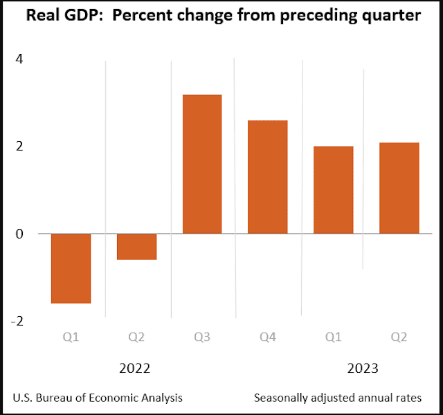

The global financial landscape is characterized by an intricate web of factors that significantly influence its dynamics. Among these, asset price inflation, economic growth, and the rise of algorithmic trading stand out as pivotal elements. Asset price inflation refers to the increase in the value of assets such as stocks, bonds, and real estate, often leading to financial bubbles and volatility within markets. Understanding how these inflated asset prices impact overall economic indicators and investor behavior is crucial for maintaining stability.

Economic growth, traditionally measured using metrics like Gross Domestic Product (GDP), provides an indication of the overall health of an economy. However, GDP does not inherently account for changes in asset prices, posing challenges in assessing the true growth trajectory. The relationship between rising asset values and economic prosperity often blurs the lines between nominal and real growth, necessitating a nuanced analysis.



Simultaneously, the financial markets have seen a surge in algorithmic trading, where complex algorithms execute high-speed trading operations. This development influences asset price dynamics and market liquidity, potentially exaggerating price movements and creating feedback loops that affect market stability. With the growing prevalence of algorithmic trading, understanding its role alongside asset price inflation becomes imperative for investors and policymakers.

This article delves into the impact of asset price inflation on financial markets, examines the connection between economic growth and asset prices, and explores the role of algorithmic trading in these dynamics. By dissecting these interconnected elements, stakeholders can better navigate the evolving financial terrain, ensuring informed decision-making and fostering economic stability.

## Table of Contents

## Understanding Asset Price Inflation

Asset price inflation refers to the increase in the prices of assets such as stocks, bonds, and real estate. It is distinct from consumer price inflation, which is typically measured using the Consumer Price Index (CPI). While CPI tracks the prices of consumer goods and services, asset price inflation focuses on the valuation changes of financial and physical assets over time. This discrepancy can lead to differing perceptions of inflation in the economy, as asset price inflation is not always reflected in standard inflation metrics like CPI.

One of the primary challenges associated with asset price inflation is that it may provide misleading indicators of economic health and progress. For instance, rising asset prices can give the impression of increased wealth and financial prosperity, potentially encouraging consumer and investor optimism. However, this may not accurately represent the underlying economic fundamentals. Unlike consumer price inflation, which directly affects purchasing power and cost of living, asset price inflation reflects changes in investment values that can be influenced by market speculation, monetary policy, and investor sentiment.

Additionally, asset price inflation can contribute to economic distortions by influencing resource allocation and investment decisions. For example, artificially inflated asset prices can lead to overinvestment in specific sectors, creating imbalances and potential bubbles. When these bubbles burst, they may result in sharp corrections, leading to financial instability and economic downturns.

Mathematically, asset price inflation can be expressed in terms of percentage changes in asset prices over time. If $P_t$ is the price of an asset at time $t$ and $P_{t-1}$ is the price at the previous time period, the rate of asset price inflation can be calculated as:

$$
\text{Asset Price Inflation Rate} = \left(\frac{P_t - P_{t-1}}{P_{t-1}}\right) \times 100\%
$$

This formula quantifies the extent to which asset prices have increased over a specified period. However, interpreting these rates requires caution, as they may not directly correlate with improvements in economic productivity or societal well-being.

Overall, understanding asset price inflation requires considering its implications for financial markets and economic policy. Investors should be aware of the potential pitfalls of relying solely on asset price trends as indicators of economic health. Similarly, policymakers must account for asset price fluctuations in their economic assessments and develop strategies to mitigate the risks associated with inflated asset values.

## The Effects of Asset Price Inflation on Financial Markets

Asset price inflation can significantly impact financial markets, primarily by creating an illusion of growth that often leads to the formation of asset bubbles. Such bubbles occur when the prices of assets rise sharply and unsustainably, largely driven by investor speculation rather than intrinsic value growth. In this context, the mispricing of assets becomes prevalent, tempting investors to enter overvalued markets, thereby setting the stage for potential financial instability. 

Investors chasing rising asset prices might contribute to a self-reinforcing cycle where price increases beget further price increases, disconnected from fundamental economic indicators. This dynamic lays the groundwork for a bubble, which inevitably bursts, leading to wide-ranging financial losses. Historical examples, such as the dot-com bubble of the late 1990s and the housing bubble of the mid-2000s, highlight the risks associated with unchecked asset price inflation. These events were characterized by speculative excesses and were followed by significant market corrections that resulted in widespread economic repercussions.

The [volatility](/wiki/volatility-trading-strategies) associated with asset bubbles exacerbates the instability of financial markets. As prices deviate from their intrinsic values, markets become more susceptible to sudden shifts in investor sentiment. Such volatility can induce sharp price fluctuations, rattling investor confidence and potentially triggering market-wide sell-offs. This volatility is often measured by indices such as the VIX, which gauges market expectations of near-term volatility. High volatility environments can erode market [liquidity](/wiki/liquidity-risk-premium), as the cost of trading increases and market participants hesitate to engage in transactions amid uncertainty.

Moreover, the interconnectedness of global financial markets means that the bursting of an asset bubble in one region can have cascading effects worldwide. A profound example is the 2008 global financial crisis originating from the U.S. housing market collapse, which underscores how asset price inflation in one sector can destabilize broader financial systems. Consequently, financial institutions face heightened counterparty risks, and the overall credit availability in the economy may constrict.

To quantify asset price inflation’s impacts, consider that market stability is often assessed via econometric models incorporating variables such as asset return variances and correlation matrices. For instance, employing a simple moving average or exponentially weighted moving average (EWMA) could help estimate volatility accurately over time. These models assist in highlighting the discrepancies between asset prices and their underlying values, thereby identifying potential bubble formations.

```python
import numpy as np

def ewma(data, window):
    alpha = 2 /(window + 1.0)
    yi = np.zeros(len(data))
    yi[0] = data[0]
    for i in range(1, len(data)):
        yi[i] = alpha * data[i] + (1 - alpha) * yi[i - 1]
    return yi

# Example use case
asset_prices = [100, 102, 105, 109, 108, 107]
volatility = ewma(asset_prices, window=3)
print(volatility)
```

This code snippet demonstrates using an exponentially weighted moving average to gauge volatility, helping investors measure possible fluctuations indicative of asset price inflation. Understanding these constructs arms investors and policymakers with better tools to foresee and mitigate financial risks associated with asset price bubbles, thus maintaining market stability.

## Asset Price Inflation and Economic Growth

Economic growth is most commonly measured using Gross Domestic Product (GDP), a metric that encompasses the total value of all goods and services produced within a country over a specified period. However, GDP doesn't account for changes in asset prices, such as those found in stocks, bonds, and real estate. This creates a discrepancy as rising asset values can provide a misleading picture of actual economic progress.

Increased asset values sometimes lead to higher consumer spending, a phenomenon known as the wealth effect. When people perceive themselves to be wealthier due to rising asset prices, they might be inclined to spend more. However, this perceived wealth doesn't always translate into substantive gains in real economic output. For example, if a person's home appreciates in value, they might feel enriched and spend more, despite their income remaining unchanged.

Real economic growth occurs when there is an expansion in a country's production capacity, not merely an increase in asset values. An example of this is when advancements in technology or infrastructure investment lead to higher productivity. Thus, the distinction between asset price-driven growth and growth driven by increased production capabilities is critical. Economic growth based on genuine production expansion generally results in sustainable development, whereas asset price inflation, without corresponding growth in production, can be symptomatic of economic distortions.

Moreover, when considering the relationship between economic growth and asset prices, it's vital to observe potential bubbles. Asset price inflation can result in bubbles that eventually burst, leading to economic downturns. When asset prices are artificially inflated without real economic growth, they create unstable markets susceptible to sharp corrections. Thus, policymakers and investors should exercise caution, understanding that asset price inflation, while momentarily beneficial due to perceived wealth, does not inherently equate to long-term economic stability or growth.

## The Role of Algorithmic Trading

Algorithmic trading employs sophisticated algorithms and high-frequency trading strategies to facilitate rapid transactions in financial markets. This approach leverages computational power and advanced techniques to analyze large datasets, allowing traders to make decisions at speeds unattainable by human traders. These algorithms can assess market conditions, execute orders, and manage portfolios in milliseconds, enhancing the overall efficiency of financial markets by contributing to better price discovery and liquidity.

Despite its efficiency, [algorithmic trading](/wiki/algorithmic-trading) has potential downsides. One significant concern is its capacity to magnify asset price movements, contributing to volatility. The speed and [volume](/wiki/volume-trading-strategy) at which transactions take place can result in rapid price swings if algorithms misinterpret market signals or if multiple algorithms simultaneously react to the same event. This volatility can perturb asset prices and generate conditions where market fundamentals are temporarily obscured by algorithmically-driven trading activities.

The linkage between algorithmic trading and asset price inflation introduces complexities in forecasting market trends. Algorithms may exacerbate price inflation by contributing to speculative trading, where assets are traded based on price [momentum](/wiki/momentum) rather than intrinsic value. Consequently, asset prices may become decoupled from underlying economic indicators, complicating predictions about market behavior and informing investment strategies. Furthermore, algorithmic models often rely on historical data for their strategies, which may not always account for unprecedented market events, potentially leading to destabilizing effects.

For these reasons, both investors and financial institutions must be aware of the algorithmic trading systems in place and their influence on asset prices. Ensuring a balanced approach that maximizes efficiency while mitigating negative impacts on market stability is essential. This includes implementing regulatory frameworks that monitor the deployment of algorithmic trading protocols to preserve orderly market conditions and safeguard against systemic risks that could arise from unchecked algorithmic activity.

## Impact on Investors and Policymakers

Investors must account for asset price inflation when making decisions to mitigate potential risks. This involves recognizing that elevated asset prices may not always reflect true market value or economic conditions. Instead, investors should conduct thorough analyses, considering both intrinsic asset values and broader economic indicators to avoid being swayed by inflated prices. A prudent approach may involve diversifying portfolios to include assets that are not prone to speculative bubbles.

For policymakers, differentiating between real economic growth and inflated asset prices is crucial. While rising asset prices might suggest economic prosperity, they do not necessarily equate to genuine economic expansion. Policymakers should therefore incorporate asset price assessments into their evaluations of economic health, beyond traditional measures such as GDP, which may overlook these fluctuations.

To address the potential instability introduced by asset price inflation and algorithmic trading, regulatory measures might be necessary. Such measures could include tighter regulations on high-frequency trading, transparency requirements, and stress tests for financial institutions to ensure sustained market stability. By implementing these controls, policymakers can help mitigate the risks posed by asset price volatility and protect the broader economic environment.

## Conclusion

Asset price inflation presents significant challenges to both financial markets and economic indicators, particularly due to its potential to distort the perceived health of an economy. Unlike consumer price inflation, asset price inflation affects the value of assets, potentially leading to the formation of asset bubbles. This can create a deceptive appearance of economic growth, as inflated asset values may not necessarily reflect an increase in real economic output or productivity. 

The distinction between real economic growth and artificially inflated asset prices is crucial for stakeholders, including investors and policymakers. For investors, understanding the nuances of asset price inflation is vital to making informed investment decisions and managing risks effectively. They must be cautious in distinguishing between genuine growth prospects and speculative bubbles that could lead to substantial losses. 

Policymakers, on the other hand, face the challenge of implementing measures that can differentiate between actual economic growth and inflation-driven asset boost. This may involve refining economic indicators to account for asset price variations or developing regulatory frameworks that moderate the impact of asset price inflation. Additionally, the rise of algorithmic trading adds another layer of complexity to this scenario. While it has the potential to enhance market efficiency, algorithmic trading can also amplify the movements in asset prices, thus complicating market predictions and potentially exacerbating the effects of asset inflation.

A nuanced understanding of asset price inflation and its impact is essential. All stakeholders must remain vigilant and adaptive, ensuring they employ well-informed strategies to safeguard economic stability and foster sustainable growth. By doing so, they can mitigate the risks associated with asset price inflation and harness economic opportunities in a balanced and sustainable manner.

## References & Further Reading

[1]: Shiller, R. J. (2015). ["Irrational Exuberance."](https://press.princeton.edu/books/paperback/9780691173122/irrational-exuberance) Princeton University Press.

[2]: Kindleberger, C. P., & Aliber, R. Z. (2005). ["Manias, Panics, and Crashes: A History of Financial Crises."](https://link.springer.com/book/10.1057/9780230628045) Palgrave Macmillan.

[3]: MacKenzie, D. (2019). ["Trading at the Speed of Light: How Ultrafast Algorithms are Transforming Financial Markets."](https://www.jstor.org/stable/j.ctv191kx1k) Princeton University Press.

[4]: Fama, E. F. (1970). ["Efficient Capital Markets: A Review of Theory and Empirical Work."](https://www.jstor.org/stable/2325486) The Journal of Finance, 25(2), 383-417.

[5]: Lo, A. W. (2004). ["The Adaptive Markets Hypothesis: Market Efficiency from an Evolutionary Perspective."](https://papers.ssrn.com/sol3/papers.cfm?abstract_id=602222) The Journal of Portfolio Management, 30(5), 15-29.

[6]: Black, F., & Scholes, M. (1973). ["The Pricing of Options and Corporate Liabilities."](https://www.cs.princeton.edu/courses/archive/fall09/cos323/papers/black_scholes73.pdf) Journal of Political Economy, 81(3), 637-654.

[7]: Barberis, N., & Thaler, R. (2003). ["A Survey of Behavioral Finance."](https://www.semanticscholar.org/paper/A-Survey-of-Behavioral-Finance-Barberis-Thaler/a4ab7d7161deac0f532d121b1614cf7b97d90e78) Handbook of the Economics of Finance.

[8]: Hull, J. C. (2018). ["Options, Futures, and Other Derivatives."](https://www.semanticscholar.org/paper/Options%2C-Futures%2C-and-Other-Derivatives-Hull/89bdee500c8623864fc9eb7a471546aa713acc44) Pearson Education.

[9]: Malkiel, B. G. (2019). ["A Random Walk Down Wall Street: The Time-Tested Strategy for Successful Investing."](https://yourknowledgedigest.org/wp-content/uploads/2020/04/a-random-walk-down-wall-street.pdf) W.W. Norton & Company.