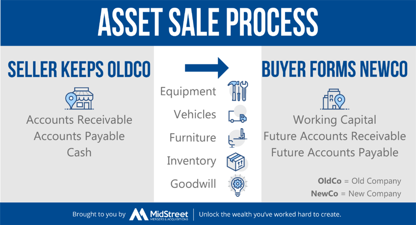

## Table of Contents

## What is an asset purchase offer?

An asset purchase offer is when a buyer wants to buy specific things from a company instead of buying the whole company. These things can be machines, buildings, or even the company's name. The buyer makes an offer to the company's owner, saying how much they are willing to pay for these items. This kind of offer is common when a buyer is interested in certain parts of a business but not the entire operation.

When someone makes an asset purchase offer, they usually list out each item they want to buy and how much they will pay for each. The company's owner then looks at the offer and decides if they want to accept it, reject it, or maybe ask for a higher price. This process helps both the buyer and the seller agree on a fair deal for the specific assets involved.

## What are the different types of asset purchase offers?

There are a few different types of asset purchase offers. One type is a cash offer, where the buyer pays for the assets with money right away. This is simple and quick, and the seller gets the money fast. Another type is a financed offer, where the buyer borrows money to buy the assets. This can take longer because the buyer needs to get a loan, but it lets them buy things they might not be able to afford with just cash.

Another type of asset purchase offer is a stock-for-assets offer. In this case, the buyer gives the seller shares of their own company instead of cash. This can be good for the seller if they believe the buyer's company will do well in the future. Lastly, there can be a combination offer, where the buyer uses a mix of cash, financing, and stock to buy the assets. This type of offer can be more complex but can also be tailored to meet the needs of both the buyer and the seller.

## Can you explain the difference between an asset purchase and a stock purchase?

An asset purchase is when a buyer wants to buy specific things from a company, like machines, buildings, or the company's name. The buyer makes an offer to the seller, saying how much they are willing to pay for these items. If the seller agrees, the buyer only gets the things listed in the offer and not the whole company. This can be good if the buyer only wants certain parts of the business and not everything that comes with it.

A stock purchase, on the other hand, is when a buyer buys the whole company by buying all of its shares. When someone buys all the shares, they own the entire business, including all its assets and all its debts. This means the buyer gets everything, the good and the bad. It's like buying the whole package, so it can be more complicated but also can be simpler because it's one big deal instead of [picking](/wiki/asset-class-picking) and choosing different parts.

## What are the key components of an asset purchase offer?

An asset purchase offer has several key parts that help both the buyer and the seller understand the deal. The first part is a clear list of the assets that the buyer wants to buy. This list should include things like machines, buildings, or the company's name, and it should be very specific so there's no confusion. The second part is the price. The offer should say how much the buyer is willing to pay for each asset. This helps the seller know if the offer is fair.

Another important part is the payment terms. This explains how the buyer will pay for the assets, whether it's with cash, a loan, or even stock. The payment terms can also include when the money will be paid, like all at once or over time. The last key part is any conditions or special agreements. These could be things like the buyer wanting to check the assets before buying them, or rules about how the assets can be used after the sale. These parts together make up a complete asset purchase offer that helps both sides agree on a fair deal.

## How does due diligence affect an asset purchase offer?

Due diligence is when the buyer checks everything about the assets they want to buy. This process can change the asset purchase offer because the buyer might find problems or surprises with the assets. For example, if the buyer finds out that a machine they wanted to buy is broken, they might lower their offer or decide not to buy that machine at all. Due diligence helps the buyer know what they are really getting, so they can make a better offer that matches the true value of the assets.

The seller also benefits from due diligence because it shows the buyer that the seller is being honest about the assets. If the buyer finds everything is as expected, they might be more willing to pay the full price or even more. But if the buyer finds issues, the seller might need to fix them or lower the price to keep the deal going. So, due diligence can lead to changes in the offer, making it more fair for both the buyer and the seller.

## What are some common reasons for making an asset purchase offer?

One common reason for making an asset purchase offer is that the buyer only wants certain parts of a business. They might be interested in the machines, buildings, or the brand name, but not the whole company. This way, they can get just what they need without taking on the entire business, including any debts or problems that come with it.

Another reason is that the buyer might see a good deal in buying specific assets. Maybe the seller is closing down and wants to sell off parts of their business quickly. The buyer can then get these assets at a lower price than if they were buying them new. This can be a smart way to grow a business without spending too much money.

## What are the tax implications of an asset purchase offer?

When a buyer makes an asset purchase offer, the tax implications can be different for both the buyer and the seller. For the buyer, they can usually write off the cost of the assets over time. This means they can reduce their taxable income by claiming depreciation on things like machines or buildings. This can help the buyer save money on taxes in the years after the purchase. But, the buyer might also have to pay sales tax on the assets they buy, depending on where the business is located.

For the seller, the tax situation can be a bit more complicated. When they sell assets, they might have to pay capital gains tax on the profit they make. This means if they sell something for more than they paid for it, they have to pay tax on the difference. The tax rate can be different depending on how long they owned the asset. If they owned it for a long time, the tax rate might be lower. Also, if the seller is a business, they might have to pay other taxes like income tax on the money they get from the sale. Both the buyer and the seller should talk to a tax expert to understand all the tax rules and plan the best way to handle the asset purchase offer.

## How can legal considerations impact an asset purchase offer?

Legal considerations can have a big impact on an asset purchase offer. One important thing is making sure the buyer has the right to use the assets after they buy them. For example, if the buyer wants to buy a building, they need to check if there are any rules or laws that say how the building can be used. They also need to make sure the seller really owns the assets and can legally sell them. If there are any problems, like the seller not having clear ownership, it can stop the deal or make the buyer change their offer.

Another legal issue is about contracts and agreements. The buyer needs to look at any contracts that come with the assets, like leases or service agreements. They need to see if these contracts can be moved to the buyer or if they need to start new ones. Also, the buyer and seller need to agree on who is responsible for any legal problems that might come up after the sale. All these legal things can change the asset purchase offer, making it more complicated but also helping to make sure the deal is fair and legal for both sides.

## What role does valuation play in asset purchase offers?

Valuation is really important when someone makes an asset purchase offer. It's all about figuring out how much the assets are worth. The buyer needs to know this so they can make a fair offer. They might hire experts to look at the assets and see what they're worth. The experts check things like how old the assets are, how much they cost new, and how much money they can make for the business. If the buyer thinks the assets are worth less than what the seller is asking, they might offer a lower price.

The seller also cares about valuation because they want to get a good price for their assets. They might have their own experts who say the assets are worth more. This can lead to some back-and-forth between the buyer and seller until they agree on a price. Valuation helps both sides understand what's fair, and it can make the whole process of making an asset purchase offer smoother and more successful.

## How do asset purchase offers vary across different industries?

Asset purchase offers can be very different depending on the industry. In the manufacturing industry, buyers might be interested in buying machines and equipment that can help them make things faster or better. They will look at how old the machines are and how much they can produce. In the real estate industry, buyers might want to buy buildings or land. They will check the location, the condition of the property, and any rules about what they can do with it. Each industry has its own special things to think about when making an offer.

In the technology industry, asset purchase offers often focus on buying software, patents, or even the company's name. Buyers need to make sure the technology works well and that they can use it without breaking any laws. In the retail industry, buyers might want to buy stores, inventory, or customer lists. They will look at how much the stores make and how popular the products are. No matter the industry, buyers need to think about what they want to buy and how much it's worth to them, but the details can be very different from one industry to another.

## What are some advanced negotiation strategies for asset purchase offers?

When negotiating an asset purchase offer, one advanced strategy is to use the information you get from due diligence to your advantage. During due diligence, you learn a lot about the assets and the seller's situation. If you find out that the seller needs to sell quickly, you can offer a lower price because you know they might accept it to get the deal done fast. Another strategy is to be flexible with the payment terms. Instead of just offering cash, you could offer a mix of cash, financing, and even stock. This can make your offer more attractive to the seller, especially if they are interested in your company's future growth.

Another important strategy is to build a good relationship with the seller. If the seller likes and trusts you, they might be more willing to accept your offer or negotiate better terms. You can do this by being honest and clear about what you want and by listening to what the seller needs. Also, sometimes it helps to be creative with your offer. For example, you could offer to help the seller with something else they need, like finding a new place to work or helping them start a new business. This can make your offer stand out and help you get a better deal.

## Can you provide case studies or examples of successful asset purchase offers?

One example of a successful asset purchase offer happened when a small bakery wanted to expand. The bakery owner found a larger bakery that was closing down. The larger bakery had a big oven and a well-known brand name that the small bakery owner wanted to buy. The small bakery owner made an offer to buy just the oven and the brand name. After some negotiation, they agreed on a price that was fair for both sides. The small bakery owner got the assets they needed to grow their business, and the larger bakery owner got some money to help them close down.

Another example is when a tech company wanted to buy a smaller company's software. The tech company was interested in the software because it could help them make their own products better. They made an offer to buy just the software and the patents that went with it. The smaller company agreed because they were struggling to make money and needed the cash. The tech company did a lot of due diligence to make sure the software worked well and that they could use it legally. In the end, the tech company got the software they needed, and the smaller company got the money they needed to move on to something new.

## What are some examples of algorithmic trading in asset purchase?

Algorithmic trading continues to reshape asset purchase strategies, offering innovative methods for acquiring assets effectively. This section outlines examples of [algorithmic trading](/wiki/algorithmic-trading) applied in asset purchase, highlighting trend-following strategies, [arbitrage](/wiki/arbitrage) strategies, and mean reversion algorithms.

### Trend-Following Strategy in Tech Stock Acquisition

Trend-following strategies are pivotal in algorithmic trading, especially in the acquisition of technology stocks. By analyzing historical and real-time data, algorithms identify assets exhibiting upward trends, enabling timely purchases. The moving average crossover is a frequently used technique, where the algorithm buys when a short-term moving average crosses above a long-term moving average, signaling a bullish trend.

For instance, a Python implementation of such a strategy might involve:

```python
import pandas as pd

def moving_average_crossover(stock_data, short_window=40, long_window=100):
    signals = pd.DataFrame(index=stock_data.index)
    signals['Signal'] = 0.0

    # Short moving average
    signals['Short_MA'] = stock_data['Close'].rolling(window=short_window, min_periods=1).mean()

    # Long moving average
    signals['Long_MA'] = stock_data['Close'].rolling(window=long_window, min_periods=1).mean()

    # Buy signal
    signals['Signal'][short_window:] = np.where(signals['Short_MA'][short_window:] > signals['Long_MA'][short_window:], 1.0, 0.0)

    # Generate trading orders
    signals['Position'] = signals['Signal'].diff()

    return signals
```

This code would help an investor determine when to buy tech stocks, optimizing the purchase decision based on algorithmic forecast of upward trends.

### Arbitrage Strategies in International Asset Purchases

Arbitrage strategies exploit price differences in various markets, crucial in purchasing international assets where currency exchange rates fluctuate. Algorithms quickly identify and execute profitable trades by comparing asset prices across different currencies and markets. This practice involves calculating the expected profit by considering the purchase and selling prices and factoring in currency exchange rates.

The formula used in a basic arbitrage strategy could be:

$$
\text{Profit} = \left(\frac{\text{Price in Market A}}{\text{Exchange Rate}}\right) - \text{Price in Market B} - \text{Transaction Costs}
$$

By executing trades swiftly through algorithmic systems, arbitrage opportunities present minimal risk and can greatly enhance the efficiency of international asset purchases.

### Mean Reversion Algorithms in Cyclical Industry Asset Purchases

Mean reversion is a qualitative strategy employed in markets with high [volatility](/wiki/volatility-trading-strategies) and cyclical trends. Algorithms predict the reversion of an asset's price towards its historical average and execute trades accordingly. This is particularly beneficial in industries where asset prices cyclically deviate from their intrinsic values, such as commodities or energy sectors. 

For mean reversion, the formula can be expressed as:

$$
\text{Target Price} = \mu + (\sigma \cdot \text{Z-score})
$$

where $\mu$ is the historical mean, $\sigma$ is the standard deviation, and the Z-score measures how far a current price deviates from the mean.

Employing such algorithms facilitates strategic asset purchases, allowing investors to profit from predicted price corrections in cyclical industries.

In summary, leveraging algorithmic trading strategies significantly enhances asset purchases, providing structured methods to analyze trends, exploit market inefficiencies, and capitalize on cyclical price movements. These examples illustrate the profound impact of algorithms on modern trading and investment decisions.

## References & Further Reading

[1]: Bergstra, J., Bardenet, R., Bengio, Y., & Kégl, B. (2011). ["Algorithms for Hyper-Parameter Optimization."](https://dl.acm.org/doi/10.5555/2986459.2986743) Advances in Neural Information Processing Systems 24.

[2]: ["Advances in Financial Machine Learning"](https://www.amazon.com/Advances-Financial-Machine-Learning-Marcos/dp/1119482089) by Marcos Lopez de Prado

[3]: ["Evidence-Based Technical Analysis: Applying the Scientific Method and Statistical Inference to Trading Signals"](https://www.amazon.com/Evidence-Based-Technical-Analysis-Scientific-Statistical/dp/0470008741) by David Aronson

[4]: ["Machine Learning for Algorithmic Trading"](https://github.com/stefan-jansen/machine-learning-for-trading) by Stefan Jansen

[5]: ["Quantitative Trading: How to Build Your Own Algorithmic Trading Business"](https://www.amazon.com/Quantitative-Trading-Build-Algorithmic-Business/dp/1119800064) by Ernest P. Chan