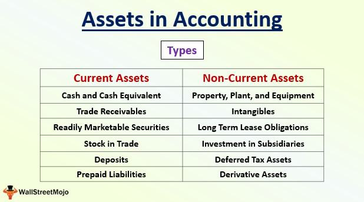

In the world of trading and investments, mastering the intricacies of various types of offers and understanding specific purchase examples are vital steps toward achieving financial success. Asset purchase, which involves the direct acquisition of assets instead of company shares, plays a pivotal role in this domain. This method encompasses crucial elements such as thorough due diligence, accurate valuation, and meticulous legal considerations. Among its forms are transactions involving real estate, machinery, and intellectual property.

The significance of asset purchase extends to its impact on algorithmic trading, a field that has revolutionized the efficiency and speed of financial transactions. Algorithmic trading employs sophisticated computer algorithms to execute trades at high speed based on defined market conditions and criteria. This technology has transformed traditional trading methods, ensuring that transactions execute with heightened precision and timing. By leveraging these algorithms, traders can identify optimal entry and exit points in the market, efficiently manage large volumes of transactions, and promptly adapt to dynamic market conditions.



This article investigates into the realm of asset purchase and explores various offer types and their significance in the context of algorithmic trading. By examining these components, traders and investors can enhance their decision-making processes, minimize risk, and maximize returns in today's fast-paced financial markets.

## Table of Contents

## Understanding Asset Purchase

Asset purchase refers to the process of acquiring individual assets rather than purchasing stock shares of a company. This method allows buyers to selectively acquire only the desired components of a business, while avoiding unwanted liabilities or obligations that may accompany a full company acquisition.

Key aspects of asset purchase include due diligence, valuation, and legal considerations. Due diligence involves conducting a thorough investigation to assess the quality and value of the assets being acquired. This step is crucial for identifying any potential risks or hidden issues that could affect the transaction's success. Valuation, on the other hand, entails determining the fair market value of the assets. This can be done using various approaches, including comparable sales, income-based methods, or cost-based methods.

Legal considerations play a significant role in asset purchases. These transactions often involve drafting and negotiating comprehensive agreements that clearly outline the terms and conditions of the purchase, including warranties, indemnities, and covenants. It is essential to ensure compliance with any regulatory requirements and to address the transfer of titles, licenses, and permits where necessary.

Examples of asset purchases are widespread across different industries. In real estate, asset purchase transactions may involve acquiring properties such as office buildings, residential complexes, or commercial spaces. Machinery acquisitions are common in manufacturing sectors, where businesses purchase equipment to enhance production capabilities. In the realm of intellectual property, companies may acquire patents, trademarks, or copyrights to secure competitive advantages and expand their portfolios.

An illustrative example highlights a technology firm acquiring a suite of patents through an asset purchase. This strategy allows the firm to strengthen its innovation pipeline without assuming the unrelated liabilities of the patent holder. Similarly, a manufacturing company might execute an asset purchase to acquire state-of-the-art machinery, ensuring improved operational efficiency and product quality.

In summary, asset purchase offers the flexibility to acquire specific assets that align with strategic goals while mitigating exposure to unnecessary liabilities. Understanding the intricacies of this process is crucial for successful negotiation and execution, ultimately aiding in optimizing investment outcomes.

## Types of Offers in Asset Purchase

Several offer types exist in asset purchase transactions, each with distinct characteristics that cater to different strategic needs and market conditions. Understanding these offer types is fundamental for parties involved in asset purchases to structure deals that align with their objectives and constraints effectively.

### Conditional Offers

Conditional offers are proposals that include specific criteria or conditions that must be satisfied before a transaction becomes binding. These conditions are often related to financial performance, regulatory approvals, or other material events. For example, a conditional offer in an asset purchase agreement may stipulate that the deal is contingent upon the approval of a regulatory body or the satisfactory completion of due diligence. This ensures that the buyer is not obligated to proceed with the purchase until all specified conditions are met, providing a layer of protection against unforeseen risks.

In a conditional offer, the conditions precedent are clearly outlined in the purchase agreement. The buyer typically retains the right to walk away from the deal if these conditions are not fulfilled by a predetermined deadline. This structure is particularly beneficial in complex transactions or when there is uncertainty regarding critical aspects of the asset being purchased.

### Open Offers

Open offers allow existing shareholders or asset holders to subscribe to new securities or participate in additional investments at a predetermined price. These offers are typically used in fundraising efforts to raise capital while giving preference to current stakeholders. In asset purchases, an open offer structure might be utilized when acquiring a portion of assets or increasing ownership stakes in an entity, allowing the current owners the first right of refusal to maintain their proportional holdings.

The open offer mechanism is advantageous in maintaining shareholder dilution to a minimum and providing current stakeholders with a benefit in potential asset appreciation. This approach is often used in capital-intensive industries where existing investors are given the opportunity to further their investment in line with asset acquisition strategies.

### Tender Offers

Tender offers involve an entity directly offering to purchase shares or assets from the shareholders at a premium over the current market price. This type of offer is commonly used in takeover situations or attempts to acquire significant control over a company's assets. The entity making the tender offer typically sets a minimum number of shares it aims to acquire and may reserve the right to withdraw the offer if this threshold is not met.

Tender offers provide flexibility for both the offeror and the shareholders, offering shareholders the opportunity to sell their holdings at a premium and allowing the offeror to swiftly gain control over the desired assets. The premium offered serves as an incentive for shareholders to part with their shares, facilitating quicker acquisition compared to other methods like open market purchases.

Understanding the nuances of these offer types enables parties to craft asset purchase deals that align with their strategic goals and risk tolerance, ensuring optimal outcomes in complex transactional environments.

## Examples of Asset Purchase

In the landscape of asset purchases, various strategies and structures can be employed, depending on the specifics of the transaction and the objectives of the buying entity. Here we examine three illustrative case studies that demonstrate different types of asset purchases: 

### Technology Company Buying Patents via a Conditional Offer

A technology company interested in bolstering its intellectual property portfolio may decide to purchase patents from another firm. Utilizing a conditional offer, the purchasing company stipulates specific criteria that must be met for the transaction to proceed. These conditions could include successful due diligence outcomes or the obtainment of regulatory approvals. For example, consider a tech firm that aims to acquire patents related to 5G technology. The buyer might condition the offer on the verification of the seller's ownership rights and pending patent litigation clearance. Such conditionality protects the buyer from unforeseen liabilities and ensures the intellectual property aligns with its strategic goals.

### Real Estate Acquisition with an Open Offer Structure

In the real estate sector, an open offer may be used where the purchase conditions are presented openly to multiple sellers or market participants. In this scenario, a real estate investment trust (REIT) might announce its intent to purchase specific types of properties in various geographic markets, setting a price range based on current market valuations and expected growth trends. Sellers are then free to accept the offer if they meet the predefined criteria. This structure provides flexibility and can result in competitive pricing, allowing the REIT to acquire high-quality assets without being bound to a single negotiation or seller, potentially enhancing portfolio diversification and return on investments.

### Business Buying Out a Competitor through a Tender Offer

When a business seeks to acquire a significant stake or complete ownership of a competitor, a tender offer can be a strategic tool. This approach involves the purchasing company offering to buy shares directly from the shareholders of the target company at a premium over the current market price. Suppose Company A wants to acquire a controlling interest in Company B, which operates in the same industry. Company A submits a tender offer to Company B's shareholders, offering 20% more than the current trading price for each of their shares. This premium incentivizes shareholders to sell, allowing Company A to achieve a rapid and efficient ownership transfer. The premium reflects the potential synergies and market position improvements anticipated from the acquisition.

These examples illustrate the versatility and strategic thinking involved in asset purchase transactions, highlighting how tailored offers can align closely with business objectives and market conditions.

## Role of Algorithmic Trading in Asset Purchase

Algorithmic trading, often referred to as algo-trading, leverages computer algorithms to execute trades rapidly by adhering to predetermined criteria. In the context of asset purchase, it offers significant advantages by optimizing price and timing strategies for acquiring various assets, such as stocks, real estate, or intellectual properties.

Algorithms can process vast amounts of market data in real-time, allowing them to identify trends and patterns that would be impossible for human traders to discern. Utilizing this capability, algorithms can predict the optimal entry and [exit](/wiki/exit-strategy) points in transactions, ensuring execution at the best possible price. This predictive power is particularly beneficial in volatile markets where prices can fluctuate rapidly.

A key feature of [algorithmic trading](/wiki/algorithmic-trading) is its ability to dynamically adjust strategies based on evolving market conditions. For instance, if a specific market indicator signals a potential increase in asset value, the algorithm can be programmed to increase buying activity. Conversely, it can reduce or halt purchases if market indicators signify a downturn. This adaptability is crucial for managing risk and maximizing returns.

Moreover, algorithmic trading can incorporate advanced techniques like [machine learning](/wiki/machine-learning) and [artificial intelligence](/wiki/ai-artificial-intelligence) to refine its decision-making process. These technologies enable algorithms to learn from past trading data, improving their predictive accuracy over time. For example, machine learning models can analyze historical price movements and trading volumes, adjusting their parameters to better forecast future asset prices.

Here is a simple example of how Python can be used to implement a basic algorithmic strategy for asset purchase:

```python
import pandas as pd
import numpy as np

# Load market data
data = pd.read_csv('market_data.csv')

# Calculate moving averages
short_window = 40
long_window = 100

data['short_mavg'] = data['Close'].rolling(window=short_window, min_periods=1).mean()
data['long_mavg'] = data['Close'].rolling(window=long_window, min_periods=1).mean()

# Define trading signals
data['signal'] = 0.0
data['signal'] = np.where(data['short_mavg'] > data['long_mavg'], 1.0, 0.0)
data['positions'] = data['signal'].diff()

# Print trading signals
print(data[['Date', 'Close', 'short_mavg', 'long_mavg', 'signal', 'positions']])
```

In this example, the algorithm identifies buy signals when the 40-day moving average of asset prices exceeds the 100-day moving average. This strategy illustrates a basic trend-following approach, which is one of several that can be applied within algorithmic trading.

By effectively integrating algorithmic strategies into asset purchase decisions, investors can take advantage of data-driven precision and adaptability. This not only streamlines the purchasing process but also enhances the potential for increased returns while mitigating risk exposure.

## Algorithmic Trading Strategies

Algorithmic trading strategies are employed to optimize trading decisions by leveraging computational models. Among the most prevalent strategies are [trend following](/wiki/trend-following), [arbitrage](/wiki/arbitrage), and mean reversion.

Trend following capitalizes on the [momentum](/wiki/momentum) of asset price movements. The fundamental concept is that assets experiencing an upward trend will continue to rise, while those on a downward trend will continue to fall. Algorithmic models identify these trends through historical data analysis and technical indicators. For instance, moving averages like the Simple Moving Average (SMA) or the Exponential Moving Average (EMA) are often utilized to determine potential entry and exit points. A Python snippet implementing a basic trend-following strategy using these indicators could look like this:

```python
import numpy as np
import pandas as pd

# Load asset price data
data = pd.read_csv('asset_prices.csv')
data['SMA'] = data['Close'].rolling(window=50).mean()
data['EMA'] = data['Close'].ewm(span=50, adjust=False).mean()

# Generate buy signals
data['Signal'] = np.where(data['Close'] > data['EMA'], 1, 0)
data['Position'] = data['Signal'].diff()

# Buy when crossing above EMA
buy_signals = data[data['Position'] == 1]
```

Arbitrage seeks to exploit temporary price discrepancies across different markets or instruments for profit. These can occur due to inefficiencies, such as discrepancies in currency exchange rates or price differences of the same asset on different exchanges. Arbitrage algorithms are designed to identify these opportunities and execute trades before the price differential is corrected, ensuring a risk-free profit. The execution speed is crucial in arbitrage, as these opportunities are often short-lived.

For example, in a simple triangular arbitrage scenario involving three currencies (USD, EUR, JPY), an algorithm might detect that converting USD to EUR, then EUR to JPY, and finally JPY back to USD could yield a profit due to slight differences in conversion rates. The simultaneous execution of these exchanges would capitalize on the arbitrage opportunity.

These strategies, underpinned by sophisticated algorithms, allow traders to execute decisions with precision and speed, outperforming traditional manual trading mechanisms. Through the application of trend following and arbitrage strategies, investors aim to achieve optimal outcomes by harnessing the power of computation and data analysis in their trading activities.

## Examples of Algorithmic Trading in Asset Purchase

Algorithmic trading continues to reshape asset purchase strategies, offering innovative methods for acquiring assets effectively. This section outlines examples of algorithmic trading applied in asset purchase, highlighting trend-following strategies, arbitrage strategies, and mean reversion algorithms.

### Trend-Following Strategy in Tech Stock Acquisition

Trend-following strategies are pivotal in algorithmic trading, especially in the acquisition of technology stocks. By analyzing historical and real-time data, algorithms identify assets exhibiting upward trends, enabling timely purchases. The moving average crossover is a frequently used technique, where the algorithm buys when a short-term moving average crosses above a long-term moving average, signaling a bullish trend.

For instance, a Python implementation of such a strategy might involve:

```python
import pandas as pd

def moving_average_crossover(stock_data, short_window=40, long_window=100):
    signals = pd.DataFrame(index=stock_data.index)
    signals['Signal'] = 0.0

    # Short moving average
    signals['Short_MA'] = stock_data['Close'].rolling(window=short_window, min_periods=1).mean()

    # Long moving average
    signals['Long_MA'] = stock_data['Close'].rolling(window=long_window, min_periods=1).mean()

    # Buy signal
    signals['Signal'][short_window:] = np.where(signals['Short_MA'][short_window:] > signals['Long_MA'][short_window:], 1.0, 0.0)

    # Generate trading orders
    signals['Position'] = signals['Signal'].diff()

    return signals
```

This code would help an investor determine when to buy tech stocks, optimizing the purchase decision based on algorithmic forecast of upward trends.

### Arbitrage Strategies in International Asset Purchases

Arbitrage strategies exploit price differences in various markets, crucial in purchasing international assets where currency exchange rates fluctuate. Algorithms quickly identify and execute profitable trades by comparing asset prices across different currencies and markets. This practice involves calculating the expected profit by considering the purchase and selling prices and factoring in currency exchange rates.

The formula used in a basic arbitrage strategy could be:

$$
\text{Profit} = \left(\frac{\text{Price in Market A}}{\text{Exchange Rate}}\right) - \text{Price in Market B} - \text{Transaction Costs}
$$

By executing trades swiftly through algorithmic systems, arbitrage opportunities present minimal risk and can greatly enhance the efficiency of international asset purchases.

### Mean Reversion Algorithms in Cyclical Industry Asset Purchases

Mean reversion is a qualitative strategy employed in markets with high [volatility](/wiki/volatility-trading-strategies) and cyclical trends. Algorithms predict the reversion of an asset's price towards its historical average and execute trades accordingly. This is particularly beneficial in industries where asset prices cyclically deviate from their intrinsic values, such as commodities or energy sectors. 

For mean reversion, the formula can be expressed as:

$$
\text{Target Price} = \mu + (\sigma \cdot \text{Z-score})
$$

where $\mu$ is the historical mean, $\sigma$ is the standard deviation, and the Z-score measures how far a current price deviates from the mean.

Employing such algorithms facilitates strategic asset purchases, allowing investors to profit from predicted price corrections in cyclical industries.

In summary, leveraging algorithmic trading strategies significantly enhances asset purchases, providing structured methods to analyze trends, exploit market inefficiencies, and capitalize on cyclical price movements. These examples illustrate the profound impact of algorithms on modern trading and investment decisions.

## Conclusion

In understanding the complexities of asset purchases, recognizing the types of offers and integrating algorithmic trading provides significant advantages. By utilizing these tools, investors can more effectively navigate the financial markets, thereby minimizing risk while striving to maximize returns. Both the strategic selection of offer types—such as conditional, open, and tender offers—and the implementation of algorithmic trading strategies—like trend following, arbitrage, and mean reversion—are essential for optimizing asset transactions.

Algorithmic trading enhances the capacity to execute trades with precision and speed, leveraging computational models to respond dynamically to market conditions. This not only aids in pinpointing ideal purchasing opportunities but also in adjusting strategies to accommodate fluctuations in the market. These algorithms can dissect large datasets, identifying optimal entry and exit points which human analysis might overlook due to complexity or sheer [volume](/wiki/volume-trading-strategy).

Moreover, staying informed about advancements in trading strategies and market behaviors is critical for investors. As the financial landscape evolves rapidly, continuously updating one's knowledge ensures that investment decisions remain robust and aligned with current trends. This adaptability is crucial for maintaining a competitive edge, allowing investors to capitalize on burgeoning opportunities and mitigate potential losses.

Thus, the convergence of informed asset purchase methodologies and algorithmic trading strategies represents a powerful synergy in financial decision-making. It ensures that investors are well-equipped to handle the intricacies of modern markets, ultimately steering their investments towards successful outcomes.

## References & Further Reading

[1]: Bergstra, J., Bardenet, R., Bengio, Y., & Kégl, B. (2011). ["Algorithms for Hyper-Parameter Optimization."](https://dl.acm.org/doi/10.5555/2986459.2986743) Advances in Neural Information Processing Systems 24.

[2]: ["Advances in Financial Machine Learning"](https://www.amazon.com/Advances-Financial-Machine-Learning-Marcos/dp/1119482089) by Marcos Lopez de Prado

[3]: ["Evidence-Based Technical Analysis: Applying the Scientific Method and Statistical Inference to Trading Signals"](https://www.amazon.com/Evidence-Based-Technical-Analysis-Scientific-Statistical/dp/0470008741) by David Aronson

[4]: ["Machine Learning for Algorithmic Trading"](https://github.com/stefan-jansen/machine-learning-for-trading) by Stefan Jansen

[5]: ["Quantitative Trading: How to Build Your Own Algorithmic Trading Business"](https://www.amazon.com/Quantitative-Trading-Build-Algorithmic-Business/dp/1119800064) by Ernest P. Chan