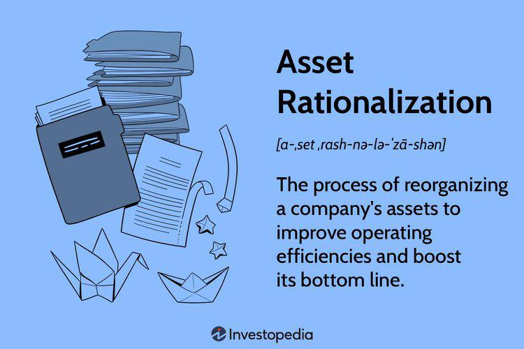

In an ever-evolving business landscape, companies are continuously seeking strategies to enhance operational efficiency and optimize resource management. Asset rationalization, often coupled with algorithmic trading, is emerging as a vital strategy for achieving these objectives. This approach involves systematic assessment and management of a company's assets to ensure they align with strategic goals, ultimately enhancing profitability and operational effectiveness.

Asset rationalization, when effectively integrated with resource management and business strategies, offers a pathway to streamline operations, eliminate redundancies, and significantly reduce costs. By conducting a strategic evaluation of assets, organizations can identify underutilized or non-core assets, enabling them to redirect resources toward areas with higher growth potential. This reallocation not only optimizes existing resources but also creates an agile environment capable of swiftly adapting to market changes.

Algorithmic trading, characterized by the use of algorithms to execute trades at optimal speeds and prices, stands to benefit significantly from asset rationalization. The incorporation of rationalized assets into trading strategies can lead to improved trading efficiencies and better use of technology and capital. By refining asset management processes, companies can support more accurate and faster data processing, allowing algorithmic systems to function with increased precision and reduced latency.

This comprehensive guide explores the integration of asset rationalization with algorithmic trading, providing insights into how businesses can maximize efficiency and drive success. The article will discuss the benefits and challenges of these practices, alongside successful examples that illustrate their impact. Focusing on maximizing efficiency, it aims to offer essential insights into creating a cohesive business strategy that leverages asset rationalization and resource management, particularly within the domain of algorithmic trading. By understanding and implementing these strategies, companies can position themselves to capitalize on innovation and maintain a competitive edge in fast-paced markets.

## Table of Contents

## Understanding Asset Rationalization

Asset rationalization is a strategic approach used by companies to reorganize their resources to enhance efficiency and profitability. This process is critical in aligning a company’s operations with its overarching business objectives. It involves a thorough evaluation of the current assets to determine their utilization. Companies assess whether each asset should be divested, expanded, or repurposed to align better with their strategic goals.

The process begins with a comprehensive inventory of existing assets, followed by a performance analysis of these assets in terms of utilization rates and their contribution to the company's objectives. Assets that are underperforming or redundant are often considered for divestiture. This enables companies to concentrate on their core competencies and allocate resources more strategically, leading to optimized returns. By reducing or eliminating loss-making ventures, firms can redirect focus and capital towards more profitable avenues.

Asset rationalization becomes particularly prevalent during economic downturns and post-merger or acquisition scenarios. During such times, realigning resources is crucial to achieving operational efficiencies and maintaining financial stability. Companies use asset rationalization as a tool to realign resources with newly formed strategic business objectives, ensuring that the newly combined entity operates cohesively and economically.

However, asset rationalization is not without its challenges. The transformation often faces risks like substantial restructuring charges, which can be financially taxing on companies, especially in the short term. Furthermore, there might be disruptions in operations as the firm transitions from the current state to the desired state of increased efficiency. Planning carefully and executing meticulously is essential to mitigate such risks, ensuring that the rationalization process leads to sustainable, long-lasting benefits for the organization.

## Key Benefits of Asset Rationalization in Business Strategy

Asset rationalization offers significant advantages for businesses aiming to enhance operational efficiencies and boost their financial performance. As companies strive to optimize resource allocation, this process proves essential in identifying and leveraging underutilized assets. By recognizing these assets, firms can redirect resources toward more strategic and productive areas, thereby achieving substantial cost savings.

Eliminating redundant processes and consolidating assets are key components of asset rationalization that directly contribute to reducing unnecessary expenditures. By streamlining operations, businesses can ensure that core functions remain efficient and effective, which leads to a leaner organizational structure and improved service delivery. This consolidation not only results in immediate cost reductions but also establishes a foundation for sustainable operational practices.

A critical benefit of asset rationalization lies in its support of more informed decision-making processes. By aligning resources more closely with the company's strategic goals, businesses can better evaluate potential investments and focus on projects with the highest likelihood of success. This alignment fosters sustainable growth by ensuring that efforts and capital are concentrated in areas with the greatest potential for return on investment (ROI).

Ultimately, asset rationalization sharpens an organization's focus on high-impact areas, leading to enhanced financial performance. By systematically managing resources to eliminate waste and optimize use, companies can improve their bottom lines while fostering a culture of continuous improvement and strategic agility. This disciplined approach to resource management is crucial for maintaining competitiveness in today's dynamic business environment.

## Challenges and Risks in Asset Rationalization

Despite the clear benefits of asset rationalization, there are significant challenges and risks that businesses must effectively navigate to ensure the success of such initiatives. One of the primary concerns is the risk of disrupting existing operations. Aggressive rationalization can create shortfalls in resources, which may be insufficient to meet current or anticipated demand. This disruption can affect the continuity of operations and may lead to delays or a decrease in product or service quality, ultimately impacting customer satisfaction and business reputation.

Another challenge lies in inadequate planning and execution. Without a comprehensive and well-structured plan, companies may face unintended consequences such as alienating their customer base. Customers who perceive a decline in service or product availability may seek alternatives, leading to a loss of market share. Additionally, rationalization initiatives can incur hefty restructuring costs which, if not managed properly, could offset any projected savings or benefits. The potential loss of valuable employees is another risk; workforce reductions or changes in job roles may lead to a loss of institutional knowledge and decrease morale, affecting productivity and innovation.

The financial implications of asset rationalization also require meticulous evaluation. Decisions need to be made with a focus on generating long-term benefits rather than providing temporary fiscal relief. This involves a detailed analysis of how the divestment or repurposing of assets will affect the company’s financial health. For example, the decision to divest an asset should consider not only the immediate financial gain but also the long-term impact on the company's operations and strategic objectives.

To mitigate these risks, businesses should adopt a carefully structured plan supported by thorough financial analysis. This includes conducting a comprehensive assessment of all assets and their alignment with business objectives. A phased approach to implementation can also help manage changes without overwhelming the organization. Furthermore, involving key stakeholders in the planning process ensures a more holistic view, facilitating smoother transitions and buy-in from those affected. Robust communication strategies are essential to maintain transparency with employees and customers to minimize the negative impact of these changes.

By addressing these challenges with a strategic and informed approach, companies can maximize the benefits of asset rationalization while minimizing its risks, thus promoting sustainable growth and profitability.

## Integrating Asset Rationalization with Algorithmic Trading

Algorithmic trading, also known as algo-trading, encompasses the use of computer algorithms to manage trading processes autonomously. It relies heavily on technology and the optimization of resources, which positions asset rationalization as a critical strategy in enhancing its efficacy. Effective asset management within this context involves the precise calibration of technology and data resources to guarantee that trading algorithms operate with maximum efficiency and minimal latency. This involves using scalable computing resources, streamlined software, and efficient algorithms to handle large volumes of data in real-time.

The importance of real-time data processing cannot be overstated in high-frequency trading ([HFT](/wiki/high-frequency-trading-strategies)). High-frequency trading strategies necessitate the rapid acquisition, processing, and analysis of data to execute trades in fractions of a second. This immediacy aids in capturing even the smallest market fluctuations for profits, requiring a robust and reliable infrastructure. Asset rationalization plays a pivotal role here, ensuring that companies allocate resources effectively to maintain the requisite high-speed networks, reduce system downtime, and support a seamless flow of data.

By integrating asset rationalization with sophisticated trading algorithms, organizations achieve enhanced performance metrics including increased trading speed, improved strategy effectiveness, and heightened profitability. An optimized infrastructure allows algorithms to evaluate a vast range of statistical models and scenarios rapidly, adjusting strategies in real-time based on market conditions.

From an empirical standpoint, businesses embracing these strategies have reported significant advancements in trading profits and operational efficiency. For instance, companies employing such integrated approaches often see their trading volumes and execution speeds increase substantially while benefiting from reduced operational costs. The ability to sustain operations at high speeds while minimizing latency directly correlates with superior trading outcomes.

To illustrate this further, suppose a trading algorithm's performance $P$ depends on factors such as execution speed $S$, strategy efficiency $E$, and infrastructure reliability $R$. We could model this relationship as:

$$
P = f(S, E, R)
$$

where $f$ represents a function combining these elements. Asset rationalization contributes to enhancing all three parameters—by ensuring resources are used effectively to optimize $S$, streamline $E$, and bolster $R$.

In conclusion, integrating asset rationalization with [algorithmic trading](/wiki/algorithmic-trading) not only enhances operational metrics but also equips businesses to maintain competitive advantages in fast-paced financial markets. The synergy created from this integration is integral for scalability, profitability, and sustainability in trading operations.

## Conclusion

Incorporating asset rationalization into business strategy is essential for firms looking to maintain a competitive advantage in fast-paced markets. By aligning assets strategically with core business goals, companies can achieve substantial reductions in operational costs while enhancing efficiency, resulting in improved overall business performance. This alignment not only streamlines operations but also ensures that resources are utilized in a manner that maximizes value generation.

When asset rationalization is integrated with algorithmic trading, it empowers businesses to optimize their utilization of technological and capital resources. This synergy allows for the achievement of superior market outcomes due to enhanced trading efficiencies. The effective management of assets, combined with advanced trading algorithms, can significantly boost trading performance by reducing latency and increasing the speed and accuracy of trades.

Looking to the future, the continuous improvement of asset management strategies will be essential for sustaining growth and profitability. Firms must adopt adaptive strategies that respond to market dynamics and technological advancements to stay ahead. This approach ensures that businesses remain agile and capable of navigating the complexities of modern markets.

Ultimately, businesses that master asset rationalization alongside sophisticated algorithmic trading methodologies will position themselves as leaders in industry innovation and success. By leveraging these strategies, they can not only drive short-term gains but also secure long-term competitive advantages, ensuring their sustained relevance and profitability in an ever-evolving economic landscape.

## References & Further Reading

[1]: Bergstra, J., Bardenet, R., Bengio, Y., & Kégl, B. (2011). ["Algorithms for Hyper-Parameter Optimization."](https://dl.acm.org/doi/10.5555/2986459.2986743) Advances in Neural Information Processing Systems 24.

[2]: ["Advances in Financial Machine Learning"](https://www.amazon.com/Advances-Financial-Machine-Learning-Marcos/dp/1119482089) by Marcos Lopez de Prado

[3]: ["Evidence-Based Technical Analysis: Applying the Scientific Method and Statistical Inference to Trading Signals"](https://www.amazon.com/Evidence-Based-Technical-Analysis-Scientific-Statistical/dp/0470008741) by David Aronson

[4]: ["Machine Learning for Algorithmic Trading"](https://github.com/stefan-jansen/machine-learning-for-trading) by Stefan Jansen

[5]: ["Quantitative Trading: How to Build Your Own Algorithmic Trading Business"](https://www.amazon.com/Quantitative-Trading-Build-Algorithmic-Business/dp/1119800064) by Ernest P. Chan