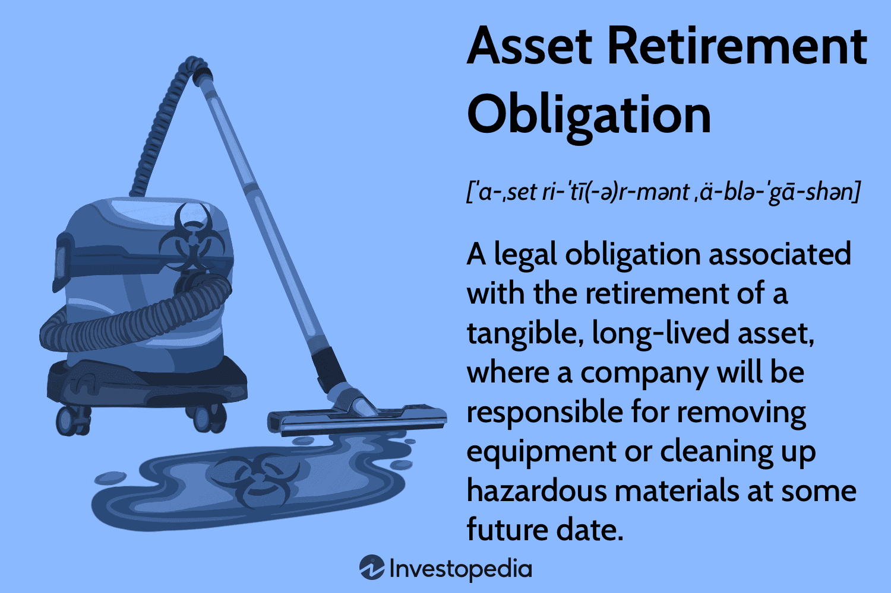

## Table of Contents

## What is an Asset Retirement Obligation (ARO)?

An Asset Retirement Obligation (ARO) is a legal obligation that a company has to take care of when it decides to retire or get rid of a long-term asset. This often happens with things like oil wells, nuclear power plants, or big factories. When a company knows it will have to pay to clean up or take apart these assets in the future, it has to set aside money for that purpose right from the start.

The company estimates how much it will cost to retire the asset and records this amount as a liability on its balance sheet. This helps everyone know that the company is planning to handle its responsibilities properly. Over time, the company might adjust this amount if the estimated costs change. This way, the company makes sure it has enough money saved up to cover the costs when the time comes to retire the asset.

## Why is it important for companies to account for AROs?

It's important for companies to account for Asset Retirement Obligations (AROs) because it helps them plan for the future. When a company knows it will have to spend money to get rid of an asset, like cleaning up an old factory or closing an oil well, it needs to save money for that. By putting aside money now, the company makes sure it can pay for these costs later without any surprises. This planning helps the company stay financially healthy and avoid big problems down the road.

Also, accounting for AROs is important for being honest with investors and the public. When a company shows these future costs on its financial statements, everyone can see that the company is taking its responsibilities seriously. This transparency builds trust and shows that the company is managing its money well. It also helps regulators and the community know that the company will take care of any environmental or safety issues when it retires its assets.

## How does an ARO affect a company's financial statements?

When a company has an Asset Retirement Obligation (ARO), it affects its financial statements by adding a liability and an asset to the balance sheet. The liability is the estimated cost of retiring the asset, like cleaning up an old factory. This shows that the company knows it will have to spend money in the future and is setting money aside for it. At the same time, the company adds an asset called an "asset retirement cost," which is the same amount as the liability. This asset is then spread out over the life of the asset through depreciation, showing how the company plans to use that money over time.

On the income statement, the ARO affects the company's expenses. As the asset retirement cost is depreciated over time, it becomes an expense on the income statement. This means the company's profits might be a bit lower each year because it's setting aside money for the future. Also, if the estimated cost of the ARO changes, the company might have to adjust the liability on the balance sheet, which could affect the income statement too. By showing these costs and adjustments, the financial statements give a clear picture of how the company is planning for its future responsibilities.

## What are the key components of an ARO?

An Asset Retirement Obligation (ARO) has a few key parts that companies need to think about. The first part is the legal obligation to take care of the asset when it's no longer used. This means the company has to clean up or take apart things like old factories or oil wells. The second part is the estimated cost of doing this work. Companies have to guess how much it will cost to retire the asset and set aside that amount of money.

The third part is the timing of when the company will have to pay for the retirement. This can be many years in the future, so the company needs to plan ahead. The fourth part is how the ARO affects the company's financial statements. The company adds a liability for the estimated cost and an asset for the same amount, which is then spread out over time. This shows everyone that the company is ready to handle its future responsibilities.

## How is the initial measurement of an ARO calculated?

The initial measurement of an Asset Retirement Obligation (ARO) is calculated by estimating how much it will cost to retire the asset in the future. This means the company has to guess the expenses for things like cleaning up or taking apart an old factory or oil well. They consider what it might cost at the time they'll actually do the work, not what it costs now. The company also thinks about how long it will be until they have to retire the asset. This helps them figure out how much money they need to set aside now to cover those future costs.

To make this estimate, the company uses the present value of the expected future costs. This means they take the future cost and adjust it for the time value of money. They use a discount rate to bring the future cost back to today's dollars. This way, the amount they record as a liability on their balance sheet reflects what the future costs are worth right now. This initial measurement is important because it helps the company plan and show everyone that they are ready to handle their future responsibilities.

## What are the common methods used to estimate the fair value of an ARO?

To estimate the fair value of an Asset Retirement Obligation (ARO), companies often use a method called the expected present value technique. This means they figure out how much it will cost to retire the asset in the future and then adjust that amount to today's dollars using a discount rate. The discount rate helps account for the time value of money, which means money now is worth more than the same amount of money in the future. Companies also consider different possible outcomes and their chances of happening, like different costs for cleaning up an old factory or oil well. By looking at all these possibilities, they can come up with a fair estimate of what the ARO will cost.

Another common method is using market-based data, where companies look at what similar AROs have cost in the past. For example, if another company had to clean up a similar type of asset, they might use that cost as a guide. This method helps make sure the estimate is realistic because it's based on real-world examples. Sometimes, companies might also hire experts to help them figure out the fair value of an ARO. These experts can give a more accurate estimate because they know a lot about the costs involved in retiring different types of assets.

## How should changes in the estimated ARO be handled?

When the estimated cost of an ARO changes, a company needs to update its financial statements. If the new estimate is higher, the company increases the ARO liability on the balance sheet. This means they have to set aside more money for the future. If the new estimate is lower, the company decreases the ARO liability. They do this by adjusting the liability to match the new estimate, which might mean they have to set aside less money than before.

These changes can also affect the income statement. If the ARO liability goes up, the company might have to record a loss. This happens because the increased cost means they need to spend more money in the future. If the ARO liability goes down, the company might record a gain. This is because the lower cost means they need to spend less money. By making these adjustments, the company keeps its financial statements accurate and shows everyone that it's still planning to handle its future responsibilities properly.

## What are the disclosure requirements for AROs under different accounting standards?

Under U.S. Generally Accepted Accounting Principles (GAAP), companies have to tell people about their AROs in their financial statements. They need to say how they figured out the ARO's value, what the total amount is, and any changes to that amount. They also have to explain when they think they'll have to pay for the ARO and how they're planning to handle it. This helps everyone understand the company's future costs and how they're preparing for them.

Under International Financial Reporting Standards (IFRS), the rules are a bit different but still focus on being clear about AROs. Companies have to share the same kind of information as under GAAP, like how they calculated the ARO and any changes to it. They also need to talk about the timing of when they'll have to pay and any risks that might affect the ARO. By doing this, they make sure everyone knows about their future responsibilities and how they're managing them.

## How does the timing of asset retirement impact the ARO?

The timing of when a company has to retire an asset really matters for its Asset Retirement Obligation (ARO). If a company knows it will have to clean up or take apart an old factory or oil well in the far future, it needs to guess how much that will cost way down the line. They then use a discount rate to figure out how much money they need to set aside right now to cover those future costs. The longer the time until they have to retire the asset, the more they have to think about inflation and changes in technology or regulations that might affect the cost.

When the time to retire the asset gets closer, the company might need to update its ARO estimate. If it turns out the costs will be higher than they thought, they'll have to increase the amount of money they're setting aside. This means their financial statements will show a bigger liability. On the other hand, if the costs are lower than expected, they can decrease the amount of money they need to save. By keeping their ARO estimate up to date as the timing changes, the company makes sure it's ready to handle its future responsibilities without any surprises.

## What are the tax implications of AROs?

When a company has an Asset Retirement Obligation (ARO), it can affect their taxes. The company can usually deduct the costs of retiring the asset from their taxes when they actually spend the money. This means they can lower their taxable income by the amount they spend on cleaning up or taking apart the asset. But, they can't deduct the money they set aside for the ARO until they actually use it. This is because tax rules usually only let companies deduct expenses when they happen, not when they're just planned for the future.

The way a company accounts for an ARO can also affect their taxes. When they add the ARO liability to their balance sheet, it doesn't change their taxes right away. But, as they spread out the asset retirement cost over time through depreciation, it can lower their taxable income a little bit each year. This is because depreciation is a tax-deductible expense. So, even though the company can't deduct the full ARO amount until they spend it, the yearly depreciation can help them save on taxes a bit at a time.

## How do companies manage the funding of AROs?

Companies manage the funding of AROs by setting aside money over time to cover the future costs of retiring their assets. They do this by estimating how much it will cost to clean up or take apart things like old factories or oil wells and then recording that amount as a liability on their balance sheet. This helps them plan ahead and make sure they have enough money saved up when the time comes to retire the asset. They might also use a special account or fund to keep this money separate, so it's ready to use when needed.

Sometimes, companies might use insurance or other financial tools to help manage the funding of AROs. They can buy insurance policies that will cover some of the costs of retiring the asset, which means they don't have to set aside as much money themselves. Another way is to work with other companies or investors to share the costs of the ARO. By using these different methods, companies can make sure they have the money they need to handle their future responsibilities without putting too much strain on their finances.

## What are the best practices for auditing AROs?

When auditors check a company's Asset Retirement Obligation (ARO), they need to make sure the company's estimates are fair and accurate. They do this by looking at how the company figured out the cost of retiring the asset. They check if the company used the right methods to guess the future costs and if they used a good discount rate to bring those costs back to today's dollars. Auditors also look at any changes the company made to the ARO estimate over time to see if they make sense. They might talk to experts or look at what similar AROs have cost in the past to see if the company's numbers seem right.

Auditors also need to make sure the company is following the rules for recording AROs in their financial statements. They check if the company added the right amount to their balance sheet as a liability and if they spread out the asset retirement cost over time correctly. They also look at the company's notes in the financial statements to see if they explained the ARO clearly. By doing all these checks, auditors help make sure the company is ready to handle its future responsibilities and that everyone can trust the company's financial statements.

## What are the financial responsibilities in ARO and Algo trading?

Handling Asset Retirement Obligations (AROs) requires companies to engage in meticulous financial planning and meticulous forecasting of retirement costs. This process involves estimating the future expenditure associated with dismantling or restoring physical assets at the end of their operational life. AROs must be recognized and reported in accordance with applicable regulations, which mandate companies to ensure compliance by maintaining accurate accounting records. Understanding the present value of future costs is crucial, where formulas such as the present value of a single sum can be applied:

$$
\text{PV} = \frac{\text{FV}}{(1 + r)^n}
$$

where $\text{PV}$ is the present value, $\text{FV}$ is the future value of the retirement obligation, $r$ is the discount rate, and $n$ is the number of years until the obligation is settled.

In the context of [algorithmic trading](/wiki/algorithmic-trading), financial responsibility focuses on developing algorithms that optimize returns while managing associated risks. This requires a deep understanding of financial markets, coupled with the ability to adapt algorithms in response to market dynamics and [volatility](/wiki/volatility-trading-strategies). Effective algorithm development incorporates statistical models and [machine learning](/wiki/machine-learning) techniques to forecast market trends and execute trades efficiently.

The integration of Artificial Intelligence (AI) and machine learning into algorithmic trading introduces additional complexity, requiring advanced technological infrastructure and skilled personnel proficient in data science and quantitative analysis. The ability to process vast amounts of data in real time and apply sophisticated algorithms enables traders to enhance decision-making processes and improve market predictions.

Both ARO management and algorithmic trading necessitate a thorough comprehension of financial principles and regulatory frameworks. While AROs demand an understanding of legal responsibilities and cost estimation, algorithmic trading requires knowledge of market regulations and financial instrument nuances. As such, leveraging technology and data analytics plays a pivotal role in fulfilling financial responsibilities in both areas, ensuring long-term sustainability and efficiency.

Ultimately, effective management of both AROs and algorithmic trading strategies is critical for achieving operational efficiency and financial sustainability. Companies that adeptly navigate these responsibilities are better positioned to capitalize on opportunities and withstand financial pressures, paving the way for sustained growth and stability in a constantly evolving market landscape.

## References & Further Reading

[1]: "Accounting for Asset Retirement Obligations" by FASB Accounting Standards Codification 410-20, [Financial Accounting Standards Board](https://fasb.org/page/PageContent?pageId=/reference-library/superseded-standards/summary-of-statement-no-143.html&bcpath=tff).

[2]: ["Advances in Financial Machine Learning"](https://www.amazon.com/Advances-Financial-Machine-Learning-Marcos/dp/1119482089) by Marcos Lopez de Prado.

[3]: "Environmental and Asset Retirement Obligations: Principles and Guidelines" by Deloitte [Deloitte Insights](https://toxigon.com/2025-Renewable-Energy-Industry-Outlook-Deloitte).

[4]: ["Quantitative Trading: How to Build Your Own Algorithmic Trading Business"](https://www.amazon.com/Quantitative-Trading-Build-Algorithmic-Business/dp/1119800064) by Ernest P. Chan.

[5]: ["Machine Learning for Algorithmic Trading"](https://github.com/stefan-jansen/machine-learning-for-trading) by Stefan Jansen.

[6]: "The Law and Finance of Asset Retirement Obligations" by BlackRock [BlackRock Investment Institute](https://www.blackrock.com/uk/solutions/investment-trusts/our-range/blackrock-frontiers-investment-trust/trust-information?gad_source=1&userType=intermediaries).