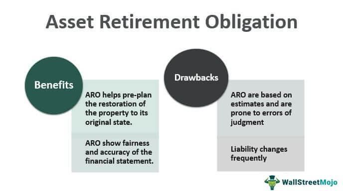

The dynamic world of finance frequently presents complex terms such as Asset Retirement Obligation (ARO) and algorithmic trading. Mastering these concepts is of paramount importance for businesses, investors, and financial professionals, as they play a critical role in effective financial management and strategic decision-making.

Asset Retirement Obligation is a legal and financial requirement compelling companies to safely dismantle and restore physical assets at the end of their useful life. This obligation is particularly pertinent in sectors like oil, gas, mining, and utilities, where infrastructure can pose environmental and safety risks upon decommissioning. Understanding ARO's accounting intricacies, including cost estimation and its impact on financial statements, is vital for compliance and risk management.

In contrast, algorithmic trading utilizes computer algorithms to execute trades at speeds unattainable by human traders. This modern trading approach has revolutionized the financial markets by augmenting transaction speed and liquidity, offering strategies like arbitrage and market making. However, it also introduces challenges such as increased market volatility, necessitating careful regulation.

This article aims to elucidate the financial responsibilities involved with both AROs and algorithmic trading. It will offer insights into ARO's legal and accounting dimensions and explore how algorithmic trading continues to transform financial markets. We will also assess any correlations between these two financial concepts, focusing on shared principles such as financial forecasting and risk management, which are integral to their implementation.

## Table of Contents

## Understanding Asset Retirement Obligation (ARO)

An Asset Retirement Obligation (ARO) is a key accounting and financial concept that mandates companies to responsibly manage the retirement of physical assets. This involves the dismantlement, restoration, or disposal of assets when they reach the end of their useful life. Such obligations are especially important in asset-intensive industries like oil and gas, mining, and utilities, where the environmental and regulatory impacts of asset retirement can be significant.

Recognizing an ARO starts with accurately estimating the future costs associated with retiring an asset. These costs could include dismantling structures, restoring land to its original condition, and adhering to environmental regulations. The estimated costs directly influence a company's financial statements as they are capitalized and depreciated over the asset’s useful life. This can have substantial effects on a company's valuation and financial health.

Accounting for AROs requires companies to record a liability and an associated asset retirement cost. Under the Generally Accepted Accounting Principles (GAAP), the initial recognition of the obligation is measured at fair value. Over time, companies must adjust these estimates to reflect changes in expected costs, technological advances, or shifts in regulatory requirements. As a result, companies need to continually update their financial assessments and projections to ensure compliance and minimize financial risk.

Proper management of AROs also includes a strong grasp of relevant legal and regulatory frameworks. For example, compliance with environmental laws may necessitate specific procedures or technologies for asset disposal, impacting cost estimations and strategic planning. Thus, financial professionals must stay informed about any changes in regulations that may affect their ARO estimates and accounting practices.

Effective handling of AROs is crucial for maintaining a company’s financial integrity and ensuring it meets its environmental responsibilities. It not only safeguards the company from potential legal liabilities but also supports sustainable business practices by promoting thoughtful and compliant asset retirement strategies.

## Algorithmic Trading and Its Financial Implications

Algorithmic trading, commonly referred to as algo trading, utilizes computer algorithms to automate the process of buying and selling securities in financial markets. By harnessing advanced mathematical models and leveraging vast datasets, these algorithms execute trades at speeds and prices unattainable through manual trading.

The impact of [algorithmic trading](/wiki/algorithmic-trading) on financial markets has been profound, primarily through its contribution to increased transaction speeds and [liquidity](/wiki/liquidity-risk-premium). The ability to execute large volumes of trades in a fraction of a second has transformed the landscape of trading activities. This enhancement in liquidity often leads to narrower bid-ask spreads, facilitating more efficient pricing mechanisms and reducing overall transaction costs for market participants.

Investment banks, hedge funds, and retail traders have widely adopted algorithmic trading to implement various trading strategies. These strategies encompass [arbitrage](/wiki/arbitrage), which exploits pricing inefficiencies across different markets, [trend following](/wiki/trend-following), which capitalizes on sustained price movements, and [market making](/wiki/market-making), which involves providing liquidity by simultaneously offering to buy and sell securities.

Despite its advantages, algorithmic trading introduces several challenges. One significant concern is the potential for increased market [volatility](/wiki/volatility-trading-strategies). The speed at which trades are executed can exacerbate price swings, especially during periods of market stress or when algorithms interact in unpredictable ways. Additionally, the prevalence of algo trading demands robust regulatory oversight to prevent issues such as market manipulation and to ensure transparency and fairness in the trading process.

Nevertheless, the benefits of algorithmic trading are considerable. The efficiency it brings to the execution of trades translates into lower operational costs and enables market participants to access market data and transact with greater ease. This accessibility democratizes trading opportunities, allowing a broader array of participants, from large institutional investors to individual traders, to engage in the markets.

In sum, algorithmic trading stands as a pivotal innovation in modern finance, balancing its transformative advantages against the challenges it introduces. Its continued evolution will depend on the industry's ability to enhance algorithmic strategies while managing associated risks, thereby sustaining market integrity and promoting long-term growth.

## Financial Responsibilities in ARO and Algo Trading

Handling Asset Retirement Obligations (AROs) requires companies to engage in meticulous financial planning and meticulous forecasting of retirement costs. This process involves estimating the future expenditure associated with dismantling or restoring physical assets at the end of their operational life. AROs must be recognized and reported in accordance with applicable regulations, which mandate companies to ensure compliance by maintaining accurate accounting records. Understanding the present value of future costs is crucial, where formulas such as the present value of a single sum can be applied:

$$
\text{PV} = \frac{\text{FV}}{(1 + r)^n}
$$

where $\text{PV}$ is the present value, $\text{FV}$ is the future value of the retirement obligation, $r$ is the discount rate, and $n$ is the number of years until the obligation is settled.

In the context of algorithmic trading, financial responsibility focuses on developing algorithms that optimize returns while managing associated risks. This requires a deep understanding of financial markets, coupled with the ability to adapt algorithms in response to market dynamics and volatility. Effective algorithm development incorporates statistical models and [machine learning](/wiki/machine-learning) techniques to forecast market trends and execute trades efficiently.

The integration of Artificial Intelligence (AI) and machine learning into algorithmic trading introduces additional complexity, requiring advanced technological infrastructure and skilled personnel proficient in data science and quantitative analysis. The ability to process vast amounts of data in real time and apply sophisticated algorithms enables traders to enhance decision-making processes and improve market predictions.

Both ARO management and algorithmic trading necessitate a thorough comprehension of financial principles and regulatory frameworks. While AROs demand an understanding of legal responsibilities and cost estimation, algorithmic trading requires knowledge of market regulations and financial instrument nuances. As such, leveraging technology and data analytics plays a pivotal role in fulfilling financial responsibilities in both areas, ensuring long-term sustainability and efficiency.

Ultimately, effective management of both AROs and algorithmic trading strategies is critical for achieving operational efficiency and financial sustainability. Companies that adeptly navigate these responsibilities are better positioned to capitalize on opportunities and withstand financial pressures, paving the way for sustained growth and stability in a constantly evolving market landscape.

## Interconnections Between ARO and Algorithmic Trading

Asset Retirement Obligations (AROs) and algorithmic trading, at first glance, operate in distinct areas of finance. However, they converge on essential principles such as financial forecasting and risk management. Both disciplines demand a high level of accuracy in predicting future financial conditions and devising strategies to manage associated risks.

Industries with significant capital investments, such as oil, gas, and utilities, where AROs are prevalent, can harness the power of algorithmic trading to enhance operational and investment efficiencies. Algorithmic models provide sophisticated tools for optimizing asset utilization, allowing companies to balance operational costs and financial returns. By analyzing market trends and forecasting asset depreciation, firms can make informed decisions about asset management, resulting in more strategic utilization of resources.

Furthermore, the implementation of algorithmic models can significantly improve the accuracy of predicting asset retirement costs. Predictive algorithms, utilizing vast datasets, can model potential future scenarios more comprehensively than traditional methods. For instance, machine learning models can identify patterns in historical data to forecast retirement timelines and associated costs, enabling better financial planning.

For financial professionals managing AROs, the integration of data analytics techniques derived from algorithmic trading offers substantial benefits in enhancing financial projections. By leveraging insights gained from complex algorithms, they can refine investment decisions, focusing on achieving a balanced risk-reward ratio. Improved data analytics allows for more precise budgeting of retirement costs, thereby reducing financial uncertainty.

Understanding the intersections between ARO management and algorithmic trading enhances strategic planning efforts across various financial activities. It enables organizations to allocate resources more efficiently, aligning financial strategies with long-term business objectives. As both areas increasingly incorporate advanced technologies, their synergy becomes even more apparent, offering opportunities for innovation and competitive advantage in dynamic markets.

## Challenges and Future Prospects

Asset Retirement Obligations (AROs) and algorithmic trading both encounter distinct challenges that impact their effective management and implementation. For AROs, one significant challenge is the accuracy of cost estimations. Predicting future expenses for asset dismantling, restoration, or disposal involves various uncertainties, including fluctuating material costs, technological changes, and unforeseen decommissioning complexities. Furthermore, evolving environmental regulations impose additional compliance requirements, compelling companies to revise their ARO forecasts and accounting practices frequently. Failure to adhere to these regulations can result in financial penalties and reputational damage.

Algorithmic trading, on the other hand, grapples with issues such as market manipulation. High-frequency trading strategies can sometimes distort market prices or create unfair advantages, leading to calls for increased regulatory oversight. Technological dependency is another challenge, as trading algorithms rely heavily on robust IT infrastructure and real-time data feeds. Any system failures or network disruptions can result in significant financial losses and operational disruptions. Moreover, the anonymity of algo trades poses the risk of market manipulation by rogue traders or entities, necessitating stringent monitoring and regulations.

The future of ARO management will likely pivot towards integrating sustainable practices and leveraging advanced modeling techniques. Companies may adopt environmentally friendly decommissioning processes to minimize ecological impact and comply with stringent regulations. Additionally, employing sophisticated financial models can enhance the accuracy of cost estimations, using historical data and predictive analytics to anticipate future liabilities more effectively.

Technological advancements will similarly refine algorithmic trading. Machine learning and [artificial intelligence](/wiki/ai-artificial-intelligence) (AI) are poised to offer improved decision-making capabilities, allowing algorithms to adapt dynamically to market conditions. As these technologies evolve, they are expected to contribute to more efficient markets, reducing transaction costs and increasing liquidity.

In navigating these complex challenges, the role of skilled financial professionals is paramount. These experts must ensure that both AROs and algo trading strategies align with regulatory frameworks, technological innovations, and ethical standards. Their expertise is crucial for developing innovative solutions that balance financial objectives with compliance and sustainability, ultimately driving organizations towards greater stability and growth in the continuously evolving financial landscape.

## Conclusion

Asset Retirement Obligations (ARO) and algorithmic trading are pivotal components of contemporary finance, each playing a crucial role in shaping business and investment landscapes. Grasping the intricacies and interrelationships of these financial responsibilities facilitates improved decision-making and enhances strategic financial management. A comprehensive understanding aids not only in managing current financial obligations but also in anticipating future challenges.

For businesses and investors, staying informed about regulatory changes, technological advancements, and evolving market dynamics is a necessity. AROs require vigilance regarding environmental regulations and cost estimation, while algorithmic trading demands awareness of technological dependencies and market volatility. Keeping abreast of these factors ensures that organizations can leverage opportunities while mitigating potential risks.

Effectively navigating the responsibilities associated with AROs and algo trading necessitates skill and foresight. Financial professionals must employ forward-thinking strategies to ensure their organizations achieve long-term success and sustainability. They must anticipate changes, employ innovative solutions, and ensure compliance with various standards.

By mastering the domains of AROs and algorithmic trading, financial professionals can drive their organizations toward greater stability and growth. This mastery supports more robust strategic planning and resource allocation, fostering resilience in an ever-evolving financial landscape. As these practices integrated into organizational frameworks, they will pave the way for enhanced operational efficiency and financial robustness, ensuring businesses can thrive amidst continuous market changes.

## References & Further Reading

[1]: "Accounting for Asset Retirement Obligations" by FASB Accounting Standards Codification 410-20, [Financial Accounting Standards Board](https://fasb.org/page/PageContent?pageId=/reference-library/superseded-standards/summary-of-statement-no-143.html&bcpath=tff).

[2]: ["Advances in Financial Machine Learning"](https://www.amazon.com/Advances-Financial-Machine-Learning-Marcos/dp/1119482089) by Marcos Lopez de Prado.

[3]: "Environmental and Asset Retirement Obligations: Principles and Guidelines" by Deloitte [Deloitte Insights](https://toxigon.com/2025-Renewable-Energy-Industry-Outlook-Deloitte).

[4]: ["Quantitative Trading: How to Build Your Own Algorithmic Trading Business"](https://www.amazon.com/Quantitative-Trading-Build-Algorithmic-Business/dp/1119800064) by Ernest P. Chan.

[5]: ["Machine Learning for Algorithmic Trading"](https://github.com/stefan-jansen/machine-learning-for-trading) by Stefan Jansen.

[6]: "The Law and Finance of Asset Retirement Obligations" by BlackRock [BlackRock Investment Institute](https://www.blackrock.com/uk/solutions/investment-trusts/our-range/blackrock-frontiers-investment-trust/trust-information?gad_source=1&userType=intermediaries).