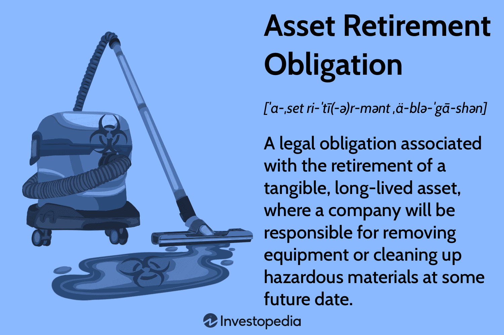

## Table of Contents

## What is an Asset Retirement Obligation (ARO)?

An Asset Retirement Obligation (ARO) is a legal obligation that a company must follow to properly dispose of or retire certain assets at the end of their useful life. These assets could be things like oil wells, nuclear power plants, or even buildings. The obligation means that the company has to take care of any environmental cleanup, dismantling, or other steps needed to safely get rid of the asset.

Companies have to account for AROs in their financial statements. This means they need to estimate the cost of retiring the asset and include that cost in their financial planning from the moment they acquire the asset. By doing this, the company makes sure they have enough money set aside to cover these future costs, which helps keep their financial reports accurate and transparent.

## How does an ARO arise in a company's financial statements?

An ARO arises in a company's financial statements when a company knows it will have to spend money to get rid of an asset in the future. This happens when a company buys something like an oil well or a factory, and the law says they have to clean it up or take it apart when they're done using it. The company has to guess how much this will cost and start saving that money right away. They do this by putting the estimated cost on their balance sheet as a liability, which is like a bill they know they'll have to pay later.

To make sure they're ready for this future cost, the company also adds a bit of this cost to their expenses each year. This is called depreciation or accretion expense, and it helps spread out the cost over the time they use the asset. By doing this, the company makes sure their financial statements show a true picture of their money situation, including the money they'll need for cleaning up or taking apart the asset when the time comes.

## What are the key components of an ARO?

An ARO has a few main parts that companies need to think about. The first part is the legal obligation to get rid of an asset properly. This means the company has to follow the law and clean up or take apart things like oil wells or factories when they're done using them. The second part is the cost of doing this. Companies have to guess how much it will cost to retire the asset and make sure they have enough money saved up for it.

The third part is how the ARO shows up in the company's financial statements. When a company knows it will have to spend money to retire an asset, it puts the estimated cost on its balance sheet as a liability. This is like a bill they know they'll have to pay later. The fourth part is how the company spreads out this cost over time. They do this by adding a bit of the cost to their expenses each year, which is called depreciation or accretion expense. This helps make sure their financial statements show a true picture of their money situation.

## How is the initial measurement of an ARO calculated?

The initial measurement of an ARO is calculated by figuring out how much it will cost to get rid of the asset properly. This means the company has to think about things like cleaning up the site, taking apart the asset, and any other steps needed to follow the law. They might use experts or look at similar projects to help them guess the cost.

Once they have an idea of the cost, the company needs to think about when they will have to pay this money. They use a thing called the present value to figure out how much the future cost is worth today. This means they take the future cost and adjust it for things like inflation and interest rates. The result is the amount they put on their balance sheet as a liability right when they get the asset.

## What accounting standards govern the treatment of AROs?

The main accounting standards that govern how companies handle AROs are the International Financial Reporting Standards (IFRS) and the Generally Accepted Accounting Principles (GAAP) used in the United States. Under IFRS, the key standard is IAS 37, which deals with provisions, contingent liabilities, and contingent assets. This standard requires companies to recognize an ARO when they have a present obligation that can be reliably estimated, and it's likely they will have to pay to retire the asset.

In the U.S., GAAP follows the guidelines set by the Financial Accounting Standards Board (FASB), specifically ASC 410-20, which deals with asset retirement obligations. This standard requires companies to recognize the fair value of an ARO as a liability when they acquire the asset, and to adjust this liability over time as more information becomes available or as the estimated cost changes. Both standards aim to make sure that companies show a true picture of their financial situation by accounting for these future costs right from the start.

## How should changes in the estimated amount of an ARO be handled?

When the estimated amount of an ARO changes, companies need to update their financial statements to reflect the new cost. This can happen if the company learns more about how much it will cost to retire the asset, or if the laws change, or if there are new ways to clean up or take apart the asset. If the new estimate is higher, the company will increase the liability on its balance sheet and might also increase the expenses it reports each year. If the new estimate is lower, the company will decrease the liability and might also decrease the expenses.

Under both IFRS and GAAP, these changes are handled in a way that keeps the financial statements accurate. For IFRS, companies adjust the liability and any related asset for changes in the estimated cash flows. For GAAP, companies adjust the liability to its new fair value, and any change in the liability's value goes through the income statement. This makes sure that the company's financial reports always show the best guess of what it will cost to retire the asset.

## What is the process for recognizing and measuring subsequent changes to an ARO?

When a company finds out that the cost to retire an asset has changed, they need to update their financial statements. This can happen if they learn more about the costs, if laws change, or if there are new ways to clean up or take apart the asset. If the new cost is higher, the company will increase the amount they have set aside for the ARO on their balance sheet. They might also increase the amount they report as an expense each year. If the new cost is lower, they will decrease the amount set aside and might also decrease the yearly expense.

Under both IFRS and GAAP, these changes are handled carefully to keep the financial statements accurate. For IFRS, companies adjust the amount they have set aside for the ARO and any related asset based on the new estimated costs. For GAAP, companies adjust the ARO to its new fair value, and any change in this value goes through the income statement. This way, the company's financial reports always show the best guess of what it will cost to retire the asset, keeping everything transparent and up-to-date.

## How does the timing of asset retirement affect the ARO?

The timing of when a company has to retire an asset can change how much they need to set aside for an ARO. If the company thinks they will have to retire the asset sooner, they might need to save more money now because the cost will come up faster. On the other hand, if they think they can wait longer to retire the asset, they might not need to save as much right away because the money they set aside can grow over time.

When the timing changes, the company has to update their financial statements. If they find out they need to retire the asset earlier than they thought, they will increase the amount they have set aside for the ARO on their balance sheet. This might also mean they have to report higher expenses each year. If they can wait longer, they might decrease the amount set aside and report lower yearly expenses. This helps make sure their financial reports always show the best guess of what it will cost to retire the asset.

## What are the tax implications of an ARO?

When a company has an ARO, it can affect their taxes. The money they set aside for the ARO is called a liability, and they can sometimes take a tax deduction for this. This means they might pay less tax each year because they are saving up for the cost of retiring the asset. But, the rules can be different depending on where the company is and what kind of asset they have. They need to follow the tax laws in their country to make sure they are doing it right.

When the time comes to actually retire the asset, the company might have to pay taxes on the money they spend. For example, if they get any money back from selling parts of the asset or from any government help with the cleanup, that money could be taxable. So, it's important for the company to plan carefully and maybe talk to a tax expert to understand all the tax effects of their ARO.

## How do companies disclose AROs in their financial statements?

Companies show AROs in their financial statements by putting the estimated cost of retiring the asset on their balance sheet as a liability. This means they write down how much money they think they will need to spend later to clean up or take apart the asset. They also explain this in the notes to their financial statements, where they give more details about the ARO, like how they figured out the cost and when they expect to retire the asset.

In their income statement, companies add a bit of the ARO cost to their expenses each year. This is called depreciation or accretion expense, and it helps spread out the cost over the time they use the asset. By doing this, they make sure their financial reports show a true picture of their money situation, including the money they will need for the ARO. This way, everyone who looks at their financial statements can see how the company is planning for the future costs of retiring their assets.

## What are the challenges in estimating and managing AROs?

Estimating and managing AROs can be tough for companies. One big challenge is guessing how much it will cost to retire an asset. This can be hard because the company has to think about things like future laws, new technology, and how much prices might change. They might need to use experts or look at similar projects to help them guess the cost, but it's still just a guess. If their guess is wrong, they might have to change their financial statements later, which can be confusing and might make people trust them less.

Another challenge is keeping track of the ARO over time. As the company learns more about the costs or if the laws change, they have to update the amount they have set aside for the ARO. This means they might need to increase or decrease the liability on their balance sheet and change the expenses they report each year. It can be a lot of work to keep everything up-to-date and make sure their financial statements are always showing the best guess of what it will cost to retire the asset.

## How can advanced modeling techniques improve the accuracy of ARO calculations?

Advanced modeling techniques can help companies guess the cost of retiring an asset more accurately. These techniques use computers and math to look at a lot of different things that can change the cost, like future laws, new technology, and how much prices might go up. By using these models, companies can make better guesses about what it will cost to clean up or take apart the asset. This helps them set aside the right amount of money and makes their financial statements more accurate.

These models also help companies keep track of the ARO over time. As new information comes in or if the laws change, the models can be updated to show the new costs. This means the company can quickly change the amount they have set aside for the ARO on their balance sheet and adjust the expenses they report each year. By using advanced modeling, companies can make sure their financial reports always show the best guess of what it will cost to retire the asset, which helps keep everything transparent and up-to-date.

## What are Asset Retirement Obligations: Definitions and Examples?

Asset Retirement Obligations (ARO) represent the financial responsibilities for entities to decommission, dismantle, and restore tangible, long-lived assets at the end of their useful lives. AROs are significant in sectors such as oil, mining, and utilities, where the extraction and processing of natural resources necessitate extensive environmental commitments. These obligations arise primarily from regulatory requirements, contractual agreements, or established industry practices that mandate restoration activities to maintain environmental and operational standards.

### Importance in Key Industries

Industries that exploit natural resources, such as oil and gas, mining, and utilities, often face onerous AROs due to the need to manage the environmental impact of their operations. For example, the oil and gas industry must decommission platforms, plug wells, and restore the seabed and landscape. Similarly, mining operations need to rehabilitate mine sites to mitigate ecological damage, while utilities may have to dismantle and dispose of obsolete transmission lines and power plants responsibly.

### Accounting for AROs

The accurate accounting of Asset Retirement Obligations is vital for transparent financial reporting and regulatory compliance. According to the Financial Accounting Standards Board (FASB) under ASC 410-20, entities must recognize an ARO in the financial statements when there is a legal obligation to retire an asset. The following steps outline the typical process of accounting for AROs:

1. **Identification**: Recognize the existence of an ARO due to a legal or regulatory requirement.
2. **Measurement**: Estimate the fair value of the ARO using expected cash flow approach, discounting future cash flows to present value.

   The core formula used in estimating the liability is:
$$
   \text{ARO liability} = \sum \left( \frac{\text{Expected Future Cost}_n}{(1 + r)^n} \right)

$$
   where $r$ is the discount rate, and $n$ is the number of years until the obligation is settled.

3. **Recognition**: Recognize the ARO as a liability on the balance sheet with a corresponding asset retirement cost that is capitalized as part of the carrying amount of the related long-lived asset.
4. **Accretion Expense**: Record an accretion expense over time, which increases the ARO liability due to the passage of time as the settlement date approaches.
5. **Adjustments**: Periodically reassess the ARO for any changes in estimated cash flows or the timing of retirement.

### Impact on Financial Statements

The recognition and measurement of AROs can substantially affect a company's financial statements:

- **Balance Sheet**: AROs appear as liabilities, impacting both the total liabilities and the net asset value of a company. The corresponding asset retirement costs will also increase the carrying value of related long-lived assets.
- **Income Statement**: Accretion expense related to AROs is recognized as an operating expense, reducing net income. Furthermore, depreciation expense on the capitalized asset retirement cost is part of financial reporting, affecting profitability.
- **Cash Flow Statement**: Although recognition of AROs does not immediately affect cash flows, it will eventually impact cash flows from operating activities when the liabilities are settled.

Overall, understanding and properly accounting for Asset Retirement Obligations are critical for companies in resource-intensive industries to ensure accurate financial reporting, maintain compliance with environmental laws, and uphold corporate responsibility in asset management.

## References & Further Reading

[1]: Bergstra, J., Bardenet, R., Bengio, Y., & Kégl, B. (2011). ["Algorithms for Hyper-Parameter Optimization."](https://dl.acm.org/doi/10.5555/2986459.2986743) Advances in Neural Information Processing Systems 24.

[2]: ["Advances in Financial Machine Learning"](https://www.amazon.com/Advances-Financial-Machine-Learning-Marcos/dp/1119482089) by Marcos Lopez de Prado

[3]: ["Evidence-Based Technical Analysis: Applying the Scientific Method and Statistical Inference to Trading Signals"](https://www.amazon.com/Evidence-Based-Technical-Analysis-Scientific-Statistical/dp/0470008741) by David Aronson

[4]: ["Machine Learning for Algorithmic Trading"](https://github.com/stefan-jansen/machine-learning-for-trading) by Stefan Jansen

[5]: ["Quantitative Trading: How to Build Your Own Algorithmic Trading Business"](https://www.amazon.com/Quantitative-Trading-Build-Algorithmic-Business/dp/1119800064) by Ernest P. Chan