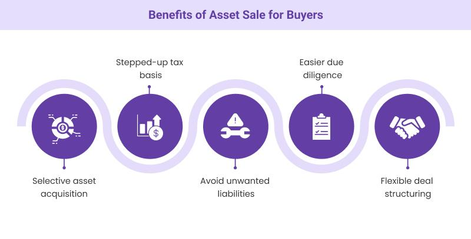

## Table of Contents

## What is an asset sale?

An asset sale is when a company sells its individual parts, like equipment or property, instead of selling the whole company. This can happen when a company is going out of business or wants to focus on different parts of its business. The buyer gets to pick and choose which parts they want to buy.

In an asset sale, the buyer usually does not take on the company's debts or legal issues. This can be good for the buyer because it reduces the risks they have to deal with. However, the process can be complicated because each asset needs to be valued and transferred separately.

## What types of assets can be sold?

Assets that can be sold include tangible things like machinery, vehicles, and buildings. These are physical items that a company owns and uses to run its business. For example, if a factory is closing down, it might sell its machines and the building where it operates. These tangible assets are often easier to value and sell because they can be seen and touched.

There are also intangible assets that can be sold, like patents, trademarks, and customer lists. These are not physical items but still have value. A company might sell a patent for a new technology or a trademark for a well-known brand. Intangible assets can be harder to value because their worth depends on things like how much money they can make in the future or how well-known the brand is.

Sometimes, a company might sell its inventory, which is the products it has made but not yet sold. This can include raw materials, work-in-progress, and finished goods. Selling inventory can help a company get cash quickly, especially if it is going out of business or needs money for other reasons.

## Why might a company decide to sell its assets?

A company might decide to sell its assets for many reasons. One big reason is if the company is going out of business. When a company closes down, it needs to turn its stuff into cash to pay off debts or give money back to its owners. Selling assets helps the company get money quickly. Another reason is if the company wants to focus on a different part of its business. For example, if a company makes cars and decides to stop making trucks, it might sell the machines and buildings used for making trucks to focus on making cars better.

Another reason a company might sell its assets is to raise money. Sometimes, a company needs cash to grow or to pay for new projects. Selling assets that are not needed anymore can give the company the money it needs without having to borrow or find new investors. Also, a company might sell assets if they are not making money or if they cost too much to keep. By selling these assets, the company can stop losing money and use the cash for something more useful.

## How does the process of an asset sale work?

When a company decides to sell its assets, it starts by figuring out which assets it wants to sell. This could be machines, buildings, or even things like patents and trademarks. The company then hires people called appraisers to figure out how much each asset is worth. This is important because the company wants to get a fair price for what it's selling. Once the assets are valued, the company might hire a broker or use an auction to find buyers. The broker or auction helps connect the company with people or other companies that might want to buy the assets.

After finding interested buyers, the company starts negotiating the price and terms of the sale. This can take some time because both the seller and buyer want to make sure they are happy with the deal. Once they agree on everything, they sign a contract. The buyer then pays the agreed amount, and the company transfers ownership of the assets to the buyer. This can involve a lot of paperwork, especially if the assets are things like buildings or patents. After the sale is complete, the company gets the money it needs, and the buyer gets the assets they wanted.

## What are the key steps involved in preparing for an asset sale?

When a company decides to sell its assets, the first thing it does is figure out which assets it wants to sell. These could be things like machines, buildings, or even patents and trademarks. The company then hires appraisers, who are experts at figuring out how much each asset is worth. This is important because the company wants to get a fair price for what it's selling. Once the assets are valued, the company might hire a broker or use an auction to find buyers. The broker or auction helps connect the company with people or other companies that might want to buy the assets.

After finding interested buyers, the company starts talking with them about the price and other details of the sale. This can take some time because both the seller and buyer want to make sure they are happy with the deal. Once they agree on everything, they sign a contract. The buyer then pays the agreed amount, and the company transfers ownership of the assets to the buyer. This can involve a lot of paperwork, especially if the assets are things like buildings or patents. After the sale is complete, the company gets the money it needs, and the buyer gets the assets they wanted.

## What are the legal considerations when selling assets?

When a company sells its assets, it has to think about the law. One big thing is making sure the company has the right to sell the assets. This means checking that there are no other claims or liens on the assets. A lien is when someone else says they own part of the asset because the company owes them money. The company also needs to follow rules about telling people about the sale. This can include letting employees, customers, and creditors know what's happening. If the company doesn't do this right, it could get into legal trouble.

Another important thing is making sure the sale contract is clear and fair. The contract should say exactly what is being sold, how much it costs, and when the buyer will get the assets. It should also talk about what happens if something goes wrong. For example, what if the buyer finds out the asset is broken? The contract needs to cover these things to protect both the buyer and the seller. If the company doesn't get the contract right, it could end up in court, which can be expensive and take a long time.

## How do asset sales impact a company's financial statements?

When a company sells its assets, it changes the numbers on its financial statements. The money the company gets from selling the assets goes into the cash part of the balance sheet. This makes the cash number go up. But, the company also has to take away the value of the assets it sold from the assets part of the balance sheet. This makes the total assets number go down. If the company sells the assets for more money than they are worth on the [books](/wiki/algo-trading-books), it makes a profit. This profit goes on the income statement and makes the company's net income go up. If the company sells the assets for less money than they are worth, it makes a loss. This loss goes on the income statement and makes the net income go down.

The sale of assets can also change the company's cash flow statement. The money from selling the assets goes into the cash flow from investing activities section. This shows how the company is using its money to buy or sell long-term assets. If the company is selling a lot of assets, it might mean it is trying to get cash quickly. This can be a sign that the company is in trouble or changing its business focus. The changes in the financial statements from selling assets can tell people a lot about what is happening with the company and what it might do next.

## What are the tax implications of selling assets for the seller?

When a company sells its assets, it has to think about taxes. If the company sells an asset for more money than it cost, it makes a profit. This profit is called a capital gain, and the company has to pay taxes on it. The tax rate depends on how long the company owned the asset. If it owned the asset for a long time, the tax rate might be lower. If it owned the asset for a short time, the tax rate might be higher. The company needs to figure out the tax it owes and pay it to the government.

Sometimes, selling assets can also create losses. If the company sells an asset for less money than it cost, it makes a capital loss. The company can use this loss to lower its taxes. It can take the loss off its income for the year, which means it pays less tax. If the loss is bigger than the income, the company can [carry](/wiki/carry-trading) the loss over to future years and use it to lower its taxes then. This can help the company save money on taxes over time.

## How can buyers benefit from purchasing assets in an asset sale?

When a buyer buys assets in an asset sale, they can pick and choose the parts they want. This means they can get exactly what they need without buying the whole company. For example, if a buyer only wants the machines from a factory, they can buy just those machines. This can save them money because they don't have to pay for things they don't need. Also, buying assets can be cheaper than buying a whole company because the buyer doesn't have to take on the company's debts or legal problems.

Another benefit for buyers is that they can get assets at a lower price. When a company is selling its assets, it might be in a hurry to get cash. This can make the company willing to sell the assets for less money than they are worth. This is good for the buyer because they can get a good deal. Plus, buying assets can help a buyer grow their business quickly. They can start using the new machines or buildings right away to make more products or offer new services.

## What are the differences between an asset sale and a stock sale?

In an asset sale, a company sells its individual parts like machines, buildings, or patents. The buyer can choose which parts they want to buy. This means the buyer doesn't have to take on the company's debts or legal problems. The process can be more complicated because each asset needs to be valued and transferred separately. An asset sale is often used when a company is going out of business or wants to focus on different parts of its business.

In a stock sale, a company sells its shares to a buyer. When the buyer buys the shares, they own the whole company, including all its assets and debts. This can be simpler because the buyer gets everything at once. But it also means the buyer has to deal with any problems the company has, like debts or legal issues. A stock sale is often used when someone wants to buy the whole company and keep running it the same way.

Both types of sales have their own benefits and challenges. An asset sale gives the buyer more control over what they are buying, but it can be more work to set up. A stock sale is easier to do but comes with more risk because the buyer gets everything, good and bad.

## How do valuation methods affect the price in an asset sale?

Valuation methods play a big role in deciding the price of assets in an asset sale. When a company wants to sell its assets, it hires appraisers to figure out how much each asset is worth. These appraisers use different methods to come up with a value. One common method is the market approach, where they look at what similar assets have sold for recently. Another method is the cost approach, where they figure out how much it would cost to replace the asset. The income approach looks at how much money the asset can make in the future. Each method can give a different price, so the method used can really change how much the buyer has to pay.

The choice of valuation method can also depend on the type of asset being sold. For example, tangible assets like machines or buildings might be valued using the cost or market approach because they are easier to compare with other similar items. On the other hand, intangible assets like patents or trademarks might be valued using the income approach because their worth depends on how much money they can make. If the appraiser uses a method that shows the asset is worth more, the seller can ask for a higher price. But if the method shows the asset is worth less, the buyer might be able to get a better deal. So, the valuation method can make a big difference in the final price of an asset sale.

## What are some common pitfalls to avoid during an asset sale transaction?

During an asset sale, one big pitfall to avoid is not valuing the assets right. If the company doesn't hire good appraisers or uses the wrong valuation method, it might end up selling the assets for less money than they are worth. This can be a big problem because the company needs to get as much money as it can from the sale. Another pitfall is not checking if the company has the legal right to sell the assets. If there are liens or other claims on the assets, the sale might not be valid, and the company could get into legal trouble.

Another common pitfall is not being clear in the sale contract. If the contract doesn't say exactly what is being sold, how much it costs, and what happens if something goes wrong, it can lead to disagreements and even lawsuits. The company also needs to make sure it tells everyone who needs to know about the sale, like employees, customers, and creditors. If it doesn't do this, it could face legal issues later on. By avoiding these pitfalls, a company can make sure the asset sale goes smoothly and gets the best price for its assets.

## How can strategic planning be used for tax efficiency?

Proper tax planning is a fundamental component in structuring asset sales to minimize tax burdens and enhance after-tax returns. Effective tax planning can significantly alter the economic outcomes of an asset sale transaction. Key strategic elements include the allocation of the purchase price, understanding the roles of depreciation and amortization, and identifying potential exemptions.

One of the primary considerations in asset sales is the allocation of the purchase price across the different assets being sold. This allocation directly impacts tax liabilities, as different types of assets are subject to varying tax treatments. For example, tangible assets like equipment and real estate may be depreciated or amortized over time, allowing buyers to benefit from tax deductions. Intangible assets, such as patents and goodwill, are treated differently for tax purposes, often subjecting them to longer amortization periods.

Depreciation and amortization play critical roles in tax planning by allowing businesses to spread the cost of an asset over its useful life. This is advantageous as it provides annual tax deductions, reducing taxable income. The Internal Revenue Code (IRC) allows for accelerated depreciation methods in certain circumstances, enabling businesses to front-load their depreciation expenses. This can be computed using methods such as the double-declining balance method, calculated as:

$$
\text{Depreciation Expense} = 2 \times \left(\frac{\text{Cost of Asset} - \text{Accumulated Depreciation}}{\text{Useful Life of Asset}}\right)
$$

Strategic tax planning also involves identifying potential exemptions that can alleviate tax liabilities. Certain asset sales may qualify for exemptions or reduced tax rates under specific regulations. For instance, Section 1202 of the IRC provides exclusions for gains from the sale of Qualified Small Business Stock, subject to various conditions.

Post-sale strategies are equally important for managing tax liabilities effectively. These strategies may involve the reinvestment of proceeds in tax-advantaged accounts or assets to defer tax obligations. Additionally, implementing installment sales can spread the recognition of income over several years, potentially lowering the overall tax impact.

By carefully considering these factors and strategies, businesses can optimize their asset sales for tax efficiency, ultimately enhancing their after-tax returns. Frequent consultation with tax professionals is advisable to tailor tax strategies to specific business contexts and to remain compliant with current tax laws.

## References & Further Reading

[1]: Howard, J. L., & Brownlee, J. (2020). ["Machine Learning for Asset Managers."](https://papers.ssrn.com/sol3/papers.cfm?abstract_id=3558728) Cambridge University Press.

[2]: Frankel, M. E. S., & Forman, A. N. (1999). ["Mergers and Acquisitions Basics: All You Need To Know."](https://onlinelibrary.wiley.com/doi/book/10.1002/9781119380726) John Wiley & Sons.

[3]: Damodaran, A. (2001). ["Corporate Finance: Theory and Practice."](https://archive.org/details/corporatefinance0000damo_v8d8) John Wiley & Sons.

[4]: Varian, H. R. (2003). ["Intermediate Microeconomics: A Modern Approach."](https://archive.org/details/intermediatemicr0006vari_b7o4) W.W. Norton & Company.

[5]: Hull, J. C. (2018). ["Options, Futures, and Other Derivatives."](https://www.semanticscholar.org/paper/Options%2C-Futures%2C-and-Other-Derivatives-Hull/89bdee500c8623864fc9eb7a471546aa713acc44) Pearson.