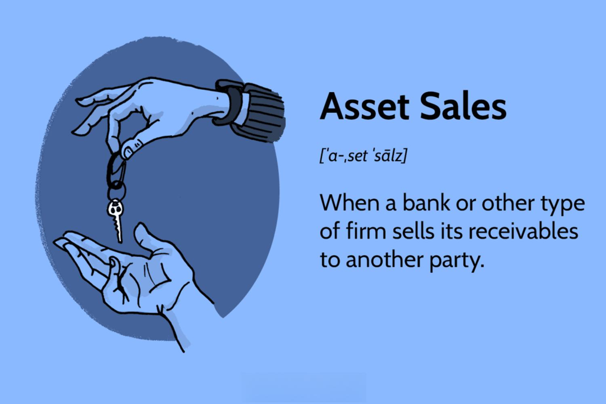

In an era where financial transactions underpin business operations, understanding how asset sales work and their tax implications is crucial for both buyers and sellers. Asset sales are a fundamental component of many business strategies, serving purposes such as raising capital, restructuring, or divesting non-core components. These transactions involve the transfer of ownership of various assets, and are distinct from stock sales, where entire business entities are transferred.

Tax implications are a critical aspect of asset sales. Both buyers and sellers need to navigate complex tax regulations to optimize their financial outcomes. For buyers, asset acquisitions can present opportunities to increase the tax basis of the purchased assets, potentially leading to significant tax savings through depreciation. Conversely, sellers must carefully consider the tax treatment of any gains realized, as these could be categorized as either ordinary income or capital gains—each subject to different tax rates. The potential for double taxation in C corporation structures further complicates these transactions, requiring strategic planning to mitigate excessive tax liabilities.



In parallel, the rise of algorithmic (algo) trading has revolutionized the financial markets, leveraging technology to enhance the precision and efficiency of trade execution. Algo trading uses computer programs to execute trades based on predetermined criteria, reducing the human element and potentially increasing profitability. In the context of asset sales, algo trading can be instrumental in optimizing the timing and execution of transactions, thereby minimizing tax liabilities and maximizing returns.

This article explores the mechanics of asset sales, with a focus on their tax implications and the role of algorithmic trading. By merging insights on asset sales and algo trading, readers can gain a comprehensive understanding of these critical financial processes, ultimately aiding in the development of informed strategies that enhance the efficiency and cost-effectiveness of business operations.

## Table of Contents

## Understanding Asset Sales: Key Concepts

Asset sales involve transactions where a company divests specific assets rather than its entire stock. This approach allows companies to focus on offloading particular components of their business without transferring the entire corporate entity. Asset sales play a pivotal role in corporate strategies, enabling restructuring, [liquidity](/wiki/liquidity-risk-premium) generation, or focus on core business aspects.

In asset sales, buyers and sellers negotiate the specific assets that will be part of the transaction. These assets can be categorized into tangible and intangible assets. Tangible assets include physical items such as equipment, machinery, buildings, and real estate. These are often straightforward in valuation due to their physical nature and market comparisons. In contrast, intangible assets are non-physical and encompass patents, trademarks, copyrights, customer lists, and proprietary technology. Valuing intangible assets can be more complex because it often involves forecasting future revenue streams and market positioning.

Unlike stock sales, wherein the entire company is transferred to the new owner, asset sales result in the seller retaining the original business entity. This distinction has significant implications for liability and operational continuity. The buyer acquires only the assets deemed necessary for their objectives, and any existing liabilities or legal obligations typically remain with the seller unless explicitly transferred through negotiations.

The strategic selection of assets in a transaction allows both parties to tailor the deal to their needs. Buyers may focus on acquiring assets that enhance their operational capabilities or market reach, while sellers might aim to divest underperforming or non-core components of their business to streamline operations or raise capital.

The process of asset sales is often complex, requiring careful due diligence, valuation, and negotiation to ensure a fair exchange. It involves legal documentation detailing the specific assets included in the sale, their respective purchase prices, and any conditions or warranties tied to the transaction.

In summary, asset sales provide a flexible framework for companies to realign their operational focus and financial strategies by selling specific assets. This process allows for tailored transactions that reflect the individual goals and circumstances of the buyer and seller. Through careful negotiation and thorough understanding of the assets involved, both parties can achieve mutually beneficial outcomes.

## Tax Implications of Asset Sales

Asset sales trigger a range of tax consequences that affect both buyers and sellers. One primary benefit for buyers is the ability to "step up" the tax basis of acquired assets. Stepping up the tax basis refers to the adjustment of the asset's value for tax purposes. By increasing the tax basis, buyers can obtain greater depreciation deductions over time. This process reduces taxable income and enhances cash flow, making the purchase financially advantageous. The Internal Revenue Service (IRS) allows this as a method to reflect an asset's market value at the time of purchase, instead of its original cost.

Sellers, on the other hand, may encounter substantial income taxes depending on how the gains from sold assets are classified. Asset gains are commonly categorized as either ordinary income or capital gains, each with different tax rates. Ordinary income, typically taxed at higher rates, results from the sale of assets held for a short duration or those that qualify as inventory. In contrast, capital gains apply to the sale of long-term assets and generally enjoy lower tax rates. The distinction between ordinary income and capital gains has direct financial implications for sellers, affecting the net proceeds from the transaction.

For C corporations, asset sales can lead to double taxation. This occurs when the corporation first pays corporate tax on the gain realized from the sale. Following this, when the proceeds are distributed to shareholders as dividends, they are taxed again at the individual level. Double taxation reduces the amount of profit retained after taxes and is a critical consideration in structuring asset sales. This motivates C corporations to develop strategies that minimize tax liabilities, such as leveraging tax credits or deferring income.

Overall, understanding the tax ramifications of asset sales is essential for structuring transactions that maximize financial benefits and ensure compliance with tax laws. Sound fiscal planning can mitigate potential tax liabilities, optimizing the sale's outcome for both parties involved.

## Algo Trading and Asset Sales

Algorithmic trading uses computer algorithms to execute trades based on predefined criteria, allowing traders to optimize the timing and execution of transactions with speed and precision. In asset sales, [algorithmic trading](/wiki/algorithmic-trading) can be instrumental in optimizing the timing and efficiency of selling assets, thereby minimizing tax liabilities and maximizing returns.

The application of algo trading to asset sales leverages data analytics and advanced algorithms to predict optimal market conditions and asset pricing. By timing the sale of assets when market conditions are favorable, businesses can achieve superior returns on their dispositions. This approach mitigates the risk of market [volatility](/wiki/volatility-trading-strategies) affecting asset sale prices adversely.

Algo trading systems can incorporate tax optimization strategies specific to asset sales. For example, algorithms can be programmed to identify periods of low tax impact, considering factors such as capital gains tax rates and fiscal year-end strategies. The system can schedule sales to exploit advantageous tax periods, ensuring that transactions are executed when the tax implications are minimized.

Python, known for its robust libraries like NumPy, pandas, and SciPy, can be effectively used to create algorithms aimed at optimizing asset sales. An example Python snippet for scheduling asset sales might look like this:

```python
import numpy as np
import pandas as pd

# Hypothetical asset price data
asset_prices = pd.DataFrame({
    'date': pd.date_range(start='1/1/2023', periods=200),
    'price': np.random.normal(loc=100, scale=10, size=200)
})

# Function to decide sale times based on price peaks
def determine_sale_dates(prices, threshold=105):
    # Identify prices above threshold
    sale_dates = prices[prices['price'] > threshold]['date']
    return sale_dates.tolist()

# Execute function
optimal_sale_dates = determine_sale_dates(asset_prices)
print("Optimal sale dates:", optimal_sale_dates)
```

This example identifies optimal selling periods based on predetermined price thresholds. By analyzing historical price data, algorithms can predict future price movements and determine when asset sales should be triggered to achieve optimal results.

In conclusion, integrating algorithmic trading into the process of asset sales offers notable benefits in enhancing financial outcomes. Through precise execution and timing aligned with market conditions and tax strategies, businesses can significantly optimize their asset sales, reducing tax burdens and maximizing capital gains.

## Strategic Planning for Tax Efficiency

Proper tax planning is a fundamental component in structuring asset sales to minimize tax burdens and enhance after-tax returns. Effective tax planning can significantly alter the economic outcomes of an asset sale transaction. Key strategic elements include the allocation of the purchase price, understanding the roles of depreciation and amortization, and identifying potential exemptions.

One of the primary considerations in asset sales is the allocation of the purchase price across the different assets being sold. This allocation directly impacts tax liabilities, as different types of assets are subject to varying tax treatments. For example, tangible assets like equipment and real estate may be depreciated or amortized over time, allowing buyers to benefit from tax deductions. Intangible assets, such as patents and goodwill, are treated differently for tax purposes, often subjecting them to longer amortization periods.

Depreciation and amortization play critical roles in tax planning by allowing businesses to spread the cost of an asset over its useful life. This is advantageous as it provides annual tax deductions, reducing taxable income. The Internal Revenue Code (IRC) allows for accelerated depreciation methods in certain circumstances, enabling businesses to front-load their depreciation expenses. This can be computed using methods such as the double-declining balance method, calculated as:

$$
\text{Depreciation Expense} = 2 \times \left(\frac{\text{Cost of Asset} - \text{Accumulated Depreciation}}{\text{Useful Life of Asset}}\right)
$$

Strategic tax planning also involves identifying potential exemptions that can alleviate tax liabilities. Certain asset sales may qualify for exemptions or reduced tax rates under specific regulations. For instance, Section 1202 of the IRC provides exclusions for gains from the sale of Qualified Small Business Stock, subject to various conditions.

Post-sale strategies are equally important for managing tax liabilities effectively. These strategies may involve the reinvestment of proceeds in tax-advantaged accounts or assets to defer tax obligations. Additionally, implementing installment sales can spread the recognition of income over several years, potentially lowering the overall tax impact.

By carefully considering these factors and strategies, businesses can optimize their asset sales for tax efficiency, ultimately enhancing their after-tax returns. Frequent consultation with tax professionals is advisable to tailor tax strategies to specific business contexts and to remain compliant with current tax laws.

## Real-World Implications and Examples

Real-world implications of asset sales and algorithmic trading can significantly influence businesses, particularly concerning tax regulations. This section will present case studies to illustrate best practices and potential pitfalls associated with structuring asset sales.

### Case Study 1: TechCorp Asset Divestiture

TechCorp, a multinational technology company, decided to sell several non-core subsidiaries to focus on its main product lines. The transaction involved both tangible assets, such as office equipment and real estate, and intangible assets, including patents and software licenses.

**Tax Implications:**  
To maximize fiscal advantage, TechCorp allocated the purchase price strategically across different asset classes. By assigning higher values to tangible assets, TechCorp benefited from increased depreciation, which in turn reduced taxable income. TechCorp also leveraged Section 197 of the Internal Revenue Code, allowing amortization of goodwill over 15 years, thereby distributing tax liability over time.

**Outcome:**  
This strategic allocation reduced the immediate tax burden and optimized cash flow. The transaction also highlighted the importance of understanding depreciation schedules and asset class distinctions in structuring tax-efficient asset sales.

### Case Study 2: FinTrade Algo Trading Optimization

FinTrade, a fintech company specializing in algorithmic trading, implemented advanced algorithms to time the sale of financial securities. Their objective was to mitigate tax liabilities and boost returns during the asset liquidation process.

**Tax Implications:**  
FinTrade utilized algorithms that analyzed market data to determine optimal transaction timing—minimizing capital gains tax by offsetting gains with losses, known as tax-loss harvesting. The algorithm identified less volatile periods to execute trades, thus avoiding the sale of assets during high-tax periods which could elevate taxable income.

```python
def calculate_tax_liability(sale_price, purchase_price, losses):
    capital_gains = sale_price - purchase_price
    net_gain = max(0, capital_gains - losses)
    tax_rate = 0.20  # assumed capital gains tax rate
    return net_gain * tax_rate

sale_price = 150000
purchase_price = 100000
losses = 30000

tax_liability = calculate_tax_liability(sale_price, purchase_price, losses)
print("Estimated Tax Liability:", tax_liability)
```

**Outcome:**  
By incorporating algorithmic strategies, FinTrade achieved a balanced tax liability, resulting in fewer taxes owed and improved post-sale profitability.

### Common Pitfalls

While these case studies demonstrate successful strategies, there are common pitfalls businesses must avoid, such as incomplete asset valuation and improper allocation of the purchase price, leading to missed tax opportunities. Overlooking post-sale tax liabilities, like recaptured depreciation, can also unexpectedly increase tax bills.

Through strategic planning and leveraging technology such as algorithmic trading, businesses can navigate asset sales' complexities effectively. These examples underscore the essential role of thorough preparation and expert consultation in achieving tax-efficient asset sales.

## Conclusion

Asset sales, along with their associated tax implications, constitute a multifaceted element of business transactions. Navigating these complexities successfully necessitates a thorough understanding of the variables at play. Recognizing the intricacies of how tax regulations influence asset sales is critical for accruing financial benefits while avoiding potential pitfalls. 

By incorporating algorithmic trading strategies, businesses can significantly increase the efficiency and cost-effectiveness of their asset sales. Algorithmic trading offers the ability to execute sales with precise timing, ensuring optimal returns and effective tax management, minimizing liabilities. The use of algorithms can also aid in analyzing market trends and business cycles, which assists in strategically planning asset dispositions. These strategies can result in more tailored transaction processes that are aligned with the specific fiscal goals of the business.

Despite these advantages, the specialized nature of both asset sales and algorithmic trading necessitates professional consultation. Engaging with tax advisors and trading specialists can provide invaluable insights, making it possible to fully leverage the benefits available while navigating the complexities involved. These professionals can offer advice on everything from the allocation of purchase prices to potential tax exemptions, contributing to a strategic approach that maximizes fiscal outcomes.

Ultimately, the intersection of asset sales and algorithmic trading presents opportunities for strategic gains when executed with a comprehensive understanding and expert guidance. This approach allows businesses to not only achieve compliance with tax obligations but also optimize financial returns.

## References & Further Reading

[1]: Howard, J. L., & Brownlee, J. (2020). ["Machine Learning for Asset Managers."](https://papers.ssrn.com/sol3/papers.cfm?abstract_id=3558728) Cambridge University Press.

[2]: Frankel, M. E. S., & Forman, A. N. (1999). ["Mergers and Acquisitions Basics: All You Need To Know."](https://onlinelibrary.wiley.com/doi/book/10.1002/9781119380726) John Wiley & Sons.

[3]: Damodaran, A. (2001). ["Corporate Finance: Theory and Practice."](https://archive.org/details/corporatefinance0000damo_v8d8) John Wiley & Sons.

[4]: Varian, H. R. (2003). ["Intermediate Microeconomics: A Modern Approach."](https://archive.org/details/intermediatemicr0006vari_b7o4) W.W. Norton & Company.

[5]: Hull, J. C. (2018). ["Options, Futures, and Other Derivatives."](https://www.semanticscholar.org/paper/Options%2C-Futures%2C-and-Other-Derivatives-Hull/89bdee500c8623864fc9eb7a471546aa713acc44) Pearson.