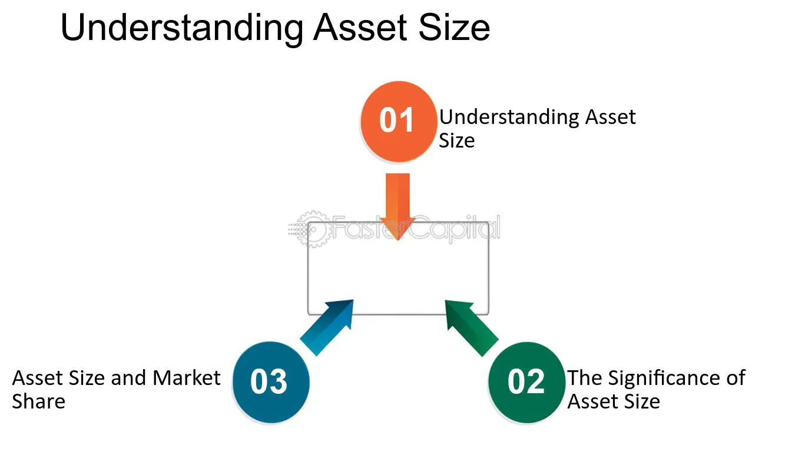

## Table of Contents

## What is asset size?

Asset size refers to the total value of all the assets owned by a person, company, or organization. Assets can include things like money, property, investments, and other valuable items. For a company, asset size is important because it shows how big and financially strong the company is. People often use asset size to compare different companies and see which ones are bigger or more successful.

When talking about banks or financial institutions, asset size is especially important. It helps people understand how much money the bank manages and how safe it might be to keep money there. A bank with a large asset size might be seen as more stable and trustworthy. For individuals, knowing their own asset size can help them plan for the future, like saving for retirement or buying a house.

## Why is asset size important in finance?

Asset size is important in finance because it shows how big and strong a company or a bank is. When a company has a lot of assets, it means they have a lot of valuable things like money, buildings, or investments. This can make people feel more confident about working with or investing in that company. For example, if a bank has a large asset size, people might think it's safer to keep their money there because the bank can handle more financial risks.

In the world of finance, people often use asset size to compare different companies. A bigger asset size can mean a company is doing well and is more successful than others. This information helps investors decide where to put their money. For individuals, knowing their own asset size can help them plan for big things like buying a house or saving for retirement. It's like knowing how much money and valuable stuff you have, which helps you make smart choices about your future.

## How is asset size calculated for a company?

Asset size for a company is calculated by adding up the value of everything the company owns. This includes things like cash, buildings, equipment, and investments. The company looks at each of these items and figures out how much they are worth. For example, if a company owns a building, they might use the current market value of that building to add to their total assets.

Once all the values are added together, the company gets the total asset size. This number is important because it shows how much the company is worth in terms of what it owns. It's like adding up all the money and valuable stuff a person has to see their total wealth. Companies often list their total asset size on their financial statements, which helps people like investors and bankers understand the company's financial health.

## What are the different types of assets included in asset size?

When figuring out a company's asset size, they look at different kinds of things they own. There are two main types of assets: current assets and non-current assets. Current assets are things that can be turned into cash quickly, like money in the bank, money people owe the company, and things they have in stock to sell. These are important because they help the company pay for things it needs right away.

Non-current assets are things that the company plans to keep for a long time. These include buildings, machines, and land. They also include long-term investments, like stocks or bonds that the company doesn't plan to sell right away. Both current and non-current assets are added up to get the total asset size, which shows how much the company is worth in terms of what it owns.

## How does asset size affect a company's valuation?

Asset size is really important when people want to figure out how much a company is worth. When a company has a lot of assets, it means they have a lot of valuable things like money, buildings, or machines. This makes the company look bigger and stronger. People who want to buy or invest in the company might think it's a good choice because it has a lot of valuable stuff. It's like if you were buying a house - you'd want to know how much the house and everything in it is worth.

But, asset size is just one part of the story. It's not the only thing that decides how much a company is worth. People also look at how much money the company makes, how much it owes, and how well it's doing compared to other companies. So, while a big asset size can make a company look good, it's important to look at everything together to really understand its value. It's like checking all parts of a car before you buy it, not just how shiny it looks.

## Can asset size influence a company's borrowing capacity?

Yes, asset size can influence how much money a company can borrow. When a company has a lot of valuable things, like money, buildings, or machines, banks and lenders feel more comfortable lending them money. They see the company's big asset size as a sign that the company can pay back the loan. It's like if you had a lot of valuable stuff at home, a bank might be more willing to give you a loan because they know you have things to sell if you can't pay them back.

However, asset size is not the only thing that matters when a company wants to borrow money. Lenders also look at how much money the company makes and how much it already owes. If a company has a big asset size but is losing money or has a lot of debt, lenders might be less willing to lend. So, while a big asset size can help a company borrow more, it's important to look at the whole picture to see how much a company can really borrow.

## How do regulatory bodies use asset size in their assessments?

Regulatory bodies use asset size to keep an eye on how big and important a company is in the economy. They look at how much money and valuable stuff a company has to make sure it's not too big to fail. If a big company gets into trouble, it could hurt a lot of people and the whole economy. So, regulators use asset size to decide how closely they need to watch a company and what rules they need to follow. For example, banks with a big asset size might have to follow stricter rules to make sure they stay safe and sound.

Asset size also helps regulators figure out if a company is strong enough to handle risks. They look at how much money a company has compared to what it owes. If a company has a lot of assets, it might be able to handle more risks without getting into trouble. This helps regulators decide if they need to step in and help the company or if the company can take care of itself. By keeping an eye on asset size, regulators can protect the economy and make sure companies are playing by the rules.

## What are the limitations of using asset size as a performance metric?

Using asset size to measure how well a company is doing has some problems. Just because a company has a lot of valuable things doesn't mean it's making a lot of money. A company could have big buildings and machines, but if it's not selling anything or making a profit, it's not doing well. So, looking only at asset size can make a company look good on paper, but it might not be doing well in real life.

Also, asset size doesn't tell the whole story about a company's health. It doesn't show how much money the company owes or how it's spending its money. A company with a lot of assets might also have a lot of debt, which can be a big problem. So, while asset size is important, it's just one part of understanding a company's performance. People need to look at other things, like how much money the company is making and how it's managing its money, to really know how well it's doing.

## How does asset size vary across different industries?

Asset size can be very different from one industry to another. In industries like real estate or manufacturing, companies often have big asset sizes because they own a lot of buildings, land, and machines. These things are worth a lot of money and make up a big part of what the company owns. On the other hand, in industries like tech or consulting, companies might not have as many physical things. They might have more money in the bank or valuable ideas and technology, but their asset size might look smaller because they don't own as many buildings or machines.

Even within the same industry, asset size can vary a lot. For example, in banking, big banks like JPMorgan Chase have huge asset sizes because they manage a lot of money and own a lot of branches and ATMs. Smaller banks or credit unions might have much smaller asset sizes because they don't have as many branches or manage as much money. So, when looking at asset size, it's important to think about what kind of industry the company is in and how big or small it is compared to others in that industry.

## What strategies can companies use to manage their asset size effectively?

Companies can manage their asset size by carefully choosing what they buy and sell. If a company has too many things that aren't making money, like old machines or buildings they don't use, they can sell them to make their asset size smaller. This can help them focus on what's important and make more money. They can also invest in new things that will help them grow, like new technology or better equipment. By making smart choices about what to keep and what to let go, companies can keep their asset size healthy and useful.

Another way companies can manage their asset size is by looking at how they use their money. If a company has a lot of money sitting in the bank, they might want to use it to buy things that will help them make more money, like new products or businesses. They can also borrow money to buy things they need, but they have to be careful not to borrow too much. By keeping an eye on how they spend and invest their money, companies can make sure their asset size is working for them and helping them grow.

## How does asset size impact investment decisions?

Asset size is really important when people are deciding where to invest their money. When a company has a lot of valuable things, like buildings or money, it makes people feel more confident about investing in it. They think the company is strong and can handle problems that might come up. So, a big asset size can make a company look like a safer and better choice for investors. It's like choosing a big, strong tree to climb instead of a small, weak one - you feel safer and more sure about your choice.

But, asset size is just one thing to look at when making investment decisions. It doesn't tell the whole story about a company. A company could have a lot of valuable stuff but still be losing money or have a lot of debt. So, while a big asset size can be a good sign, investors need to look at other things too, like how much money the company is making and how it's spending its money. It's like looking at all sides of a puzzle piece, not just one, to see where it fits best.

## What advanced metrics should be considered alongside asset size for a comprehensive analysis?

When looking at a company, asset size is important, but there are other things to think about too. One of these is the company's revenue, which is how much money they make from selling things. If a company has a lot of valuable stuff but isn't making much money, it might not be doing well. Another thing to look at is the company's profit, which is what's left after they pay for everything. A company can have a big asset size but still lose money if they spend too much or don't sell enough.

Another important thing is the company's debt. This is how much money they owe to other people or banks. If a company has a lot of assets but also a lot of debt, it might be in trouble if it can't pay back what it owes. People also look at the company's return on assets, which shows how well they're using their stuff to make money. If a company has a big asset size but a low return on assets, it might not be using its things very well. By looking at all these things together, you can get a better idea of how healthy and successful a company really is.

## What are the key financial metrics in banking?

In evaluating the health and efficiency of a banking institution, financial metrics such as Return on Investment (ROI), Return on Assets (ROA), and [liquidity](/wiki/liquidity-risk-premium) ratios play a crucial role. These metrics provide insights into a bank's capability to utilize its assets effectively in generating profits, hence becoming indispensable tools for investors and risk managers alike.

Return on Investment (ROI) is a performance measure used to evaluate the efficiency of an investment or to compare the efficiency of several different investments. It is calculated using the formula:

$$
ROI = \left(\frac{Net \ Profit}{Cost \ of \ Investment}\right) \times 100
$$

In the context of banking, ROI helps determine the profitability relative to any capital employed. It assists stakeholders in understanding how well a bank uses its invested funds to generate returns.

Return on Assets (ROA) is another significant metric that measures the profitability of a bank relative to its total assets. It is expressed as:

$$
ROA = \frac{Net \ Income}{Total \ Assets}
$$

ROA provides insights into how efficiently a bank is at using its assets to produce earnings. A higher ROA indicates that the bank is more efficient in converting its investment into profits.

Liquidity ratios, such as the current ratio and quick ratio, assess a bank's ability to cover its short-term obligations with its short-term assets. The current ratio is calculated as:

$$
Current \ Ratio = \frac{Current \ Assets}{Current \ Liabilities}
$$

Similarly, the quick ratio, which excludes inventory from current assets, is:

$$
Quick \ Ratio = \frac{Current \ Assets - Inventory}{Current \ Liabilities}
$$

These liquidity measures are crucial in understanding a bank's capability to maintain cash flow and meet its financial obligations.

By comprehending these key metrics, banks and other financial institutions can improve decision-making processes. A solid grasp of ROI, ROA, and liquidity ratios aids in making informed investment choices, enforcing effective risk management strategies, and enhancing overall financial performance. These financial indicators not only contribute to a comprehensive evaluation of banking operations but also guide future strategic planning, ensuring sustainable growth and stability in the financial marketplace.

## References & Further Reading

For readers seeking to expand their understanding of the concepts covered in this article, the following resources offer in-depth exploration and analysis of financial metrics, banking strategies, and [algorithmic trading](/wiki/algorithmic-trading):

1. **"Principles of Banking" by Moorad Choudhry** – This book provides a comprehensive overview of the principles underlying modern banking operations, with a focus on risk management, asset-liability management, and the use of financial instruments.

2. **"Algorithmic Trading: Winning Strategies and Their Rationale" by Ernie Chan** – This work delivers insights into algorithmic trading strategies, exploring the mechanics behind algorithmic systems and offering practical advice for implementing these strategies effectively.

3. **"The Handbook of Fixed Income Securities" by Frank J. Fabozzi** – Known as a definitive guide to fixed-income securities, this reference is essential for understanding bond markets, interest rate dynamics, and the role of fixed-income assets in a diversified portfolio.

4. **Research Paper: "Augmenting Investment Performance via Algorithmic Trading" ** – Available through the Journal of Finance, this paper assesses the impact of algorithmic trading on investment performance and financial metrics in institutional settings. 

5. **"Investment Valuation: Tools and Techniques for Determining the Value of Any Asset" by Aswath Damodaran** – An authoritative resource in financial valuation models, this book covers the methodologies for assessing asset value, crucial for evaluating investment opportunities and risk.

6. **"Market Risk Analysis" by Carol Alexander** – This series offers a detailed examination of market risk measurement and management techniques, crucial for anyone interested in quantitative finance and the strategies underpinning market risk assessment.

7. **"High-Frequency Trading: A Practical Guide to Algorithmic Strategies and Trading Systems" by Irene Aldridge** – This guide investigates into the world of high-frequency trading, examining the intricacies of designing effective trading systems and the computational techniques that support them.

8. **Online Course: "Introduction to Finance and Banking" on Coursera** – Offered by the University of Illinois, this course introduces fundamental concepts in banking and finance, providing a learning pathway for those new to the field or seeking to refresh their knowledge.

9. **Website: Investopedia's Banking Sector Resource Page** – A comprehensive online resource offering articles, definitions, and tutorials on a variety of banking and financial topics, including financial metrics and trading strategies.

10. **"Python for Finance: Analyze Big Financial Data" by Yves Hilpisch** – This book is invaluable for programmers and data analysts looking to harness Python for financial data analysis, algorithm development, and quantitative trading.

These resources are intended to supplement the knowledge provided in this article and support readers in mastering the essential elements of modern banking and finance.

