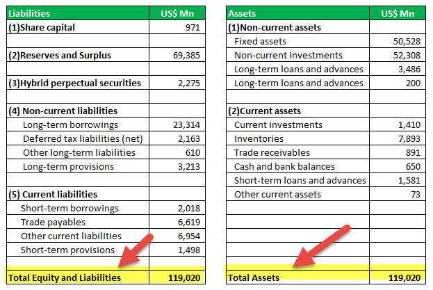

In the dynamic world of finance, mastery of key financial metrics is crucial for every participant in banking and trading. Asset size, banking financial metrics, and algorithmic trading form a trifecta that significantly influences financial strategies and outcomes in modern banks. Asset size, which represents the total market value of a bank’s securities, often serves as an indicator of the institution's financial strength and its influence in the market. Large asset bases enable banks to better manage risks and secure stable income streams, thus shaping their investment strategies and performance.

Simultaneously, financial metrics such as Return on Investment (ROI), Return on Assets (ROA), and liquidity ratios provide insights into a bank's operational efficiency and profitability. These metrics allow stakeholders to assess how effectively a bank uses its assets to generate profits, guiding investment decisions and risk management strategies.



Algorithmic trading, another essential component, utilizes computer programs to execute trades based on specific criteria. This technology enhances trading efficiency by ensuring speed, accuracy, and the capacity to process large trade volumes, thereby reducing human errors and improving market efficiency.

Together, these elements are integral to formulating and executing financial strategies in banking institutions. This article aims to provide insights into how banks can leverage these tools for improved financial decision-making and investment performance, driving them towards successful adaptation in the rapidly digitizing financial landscape.

## Table of Contents

## Understanding Asset Size in Banking

Asset size is a critical parameter in assessing the financial strength and market influence of banks and investment funds. It represents the total market value of a bank's or fund's securities, encompassing all the assets it holds. In banking, asset size serves as a measure of a financial institution's capability to manage risks, offer loans, and generate steady income. Larger asset sizes facilitate risk diversification since a bank with more assets can spread out potential losses across various securities. This capacity for diversification allows banks to withstand economic fluctuations better and maintain stable income streams.

From a strategic perspective, banks with substantial asset sizes possess a competitive edge. They are typically regarded as more credible in the market, which can lead to improved access to capital and favorable terms in financial transactions. This enhanced market perception often translates into a broader customer base and more diverse revenue sources, crucial for long-term growth and sustainability. Moreover, banks with significant asset sizes can invest in more sophisticated financial technologies and human resources, augmenting their operational efficiencies and customer service capabilities.

The implications of asset size extend to investment strategies, where larger banks can adopt a more aggressive approach due to their ability to absorb shocks and capitalize on emerging opportunities swiftly. They may also engage in more dynamic asset allocation strategies, adjusting their portfolios in response to market conditions with greater agility.

In summary, asset size is a multifaceted metric that influences a bank's risk management, market positioning, and strategic planning. Institutions that manage their asset size effectively can enhance their financial performance and resilience, thus reinforcing their standing in the competitive banking landscape.

## Key Financial Metrics in Banking

In evaluating the health and efficiency of a banking institution, financial metrics such as Return on Investment (ROI), Return on Assets (ROA), and [liquidity](/wiki/liquidity-risk-premium) ratios play a crucial role. These metrics provide insights into a bank's capability to utilize its assets effectively in generating profits, hence becoming indispensable tools for investors and risk managers alike.

Return on Investment (ROI) is a performance measure used to evaluate the efficiency of an investment or to compare the efficiency of several different investments. It is calculated using the formula:

$$
ROI = \left(\frac{Net \ Profit}{Cost \ of \ Investment}\right) \times 100
$$

In the context of banking, ROI helps determine the profitability relative to any capital employed. It assists stakeholders in understanding how well a bank uses its invested funds to generate returns.

Return on Assets (ROA) is another significant metric that measures the profitability of a bank relative to its total assets. It is expressed as:

$$
ROA = \frac{Net \ Income}{Total \ Assets}
$$

ROA provides insights into how efficiently a bank is at using its assets to produce earnings. A higher ROA indicates that the bank is more efficient in converting its investment into profits.

Liquidity ratios, such as the current ratio and quick ratio, assess a bank's ability to cover its short-term obligations with its short-term assets. The current ratio is calculated as:

$$
Current \ Ratio = \frac{Current \ Assets}{Current \ Liabilities}
$$

Similarly, the quick ratio, which excludes inventory from current assets, is:

$$
Quick \ Ratio = \frac{Current \ Assets - Inventory}{Current \ Liabilities}
$$

These liquidity measures are crucial in understanding a bank's capability to maintain cash flow and meet its financial obligations.

By comprehending these key metrics, banks and other financial institutions can improve decision-making processes. A solid grasp of ROI, ROA, and liquidity ratios aids in making informed investment choices, enforcing effective risk management strategies, and enhancing overall financial performance. These financial indicators not only contribute to a comprehensive evaluation of banking operations but also guide future strategic planning, ensuring sustainable growth and stability in the financial marketplace.

## Algorithmic Trading: A Game Changer

Algorithmic trading, a pivotal innovation in modern finance, leverages advanced computer systems to automate the buying and selling of financial instruments based on predetermined criteria. This approach offers several advantages, notably in terms of speed, accuracy, and the ability to manage significant trading volumes with minimal human intervention. The use of algorithms mitigates human error and enhances market efficiency, leading to more robust financial environments.

At its core, [algorithmic trading](/wiki/algorithmic-trading) is driven by a series of complex mathematical models and formulas. These algorithms are capable of analyzing vast amounts of market data to identify trading opportunities much faster than human traders. For example, they can process data related to price, [volume](/wiki/volume-trading-strategy), and timing, and execute trades at optimal prices. The precise execution of these trades helps in capturing favorable market conditions that are often transitory, thereby maximizing potential profits.

The implementation of algorithmic trading can be illustrated through high-frequency trading ([HFT](/wiki/high-frequency-trading-strategies)), a subset of algorithmic trading characterized by a high turnover rate of positions. Algorithms in HFT systems utilize strategies such as [market making](/wiki/market-making), statistical [arbitrage](/wiki/arbitrage), or exploiting market inefficiencies. These strategies rely on low-latency systems to perform a multitude of trades within microseconds, capitalizing on minute price discrepancies that would be inconsequential to slower, more conventional trading methods.

Additionally, algorithmic trading encompasses various strategies designed to achieve different financial objectives. For instance, trend-following algorithms evaluate historical data to predict the direction of the market and make trades accordingly. Mean-reversion strategies assume that asset prices will revert to their historical mean, thus allowing traders to buy low and sell high based on statistical indications. 

Risk management is a crucial element of algorithmic trading. Algorithms can be programmed to include stop-loss orders and other risk mitigation tools to minimize potential losses. This automated risk assessment and management ensure that trading decisions are made logically and consistently, without the influence of human emotions.

The significance of algorithmic trading extends beyond individual trades to improve overall market efficiency. By facilitating faster and more reliable trades, it contributes to increased liquidity and tighter bid-ask spreads, ultimately benefiting all market participants.

In summary, algorithmic trading represents a seismic shift in how financial markets operate, credited with increasing the speed and accuracy of trading processes while lowering transaction costs. Its impact is evident in the heightened market efficiency and reduced human error, signifying its critical role in contemporary finance. As technology continues to evolve, the algorithms guiding these trades are expected to become even more sophisticated, offering financial institutions a powerful tool to navigate complex market landscapes.

## Impact of Algorithmic Trading on Banking and Financial Metrics

Algorithmic trading has transformed the landscape of banking and financial metrics, primarily through enhanced trade execution efficiency and refined risk management strategies. The implementation of algorithms in trading has led to a more systematic and data-driven approach, allowing banks to optimize their asset management processes. 

One of the key ways algorithmic trading impacts financial metrics is by improving the execution speed of trades. This rapid execution minimizes the time lag between a financial decision and its market implementation, thereby reducing the costs associated with market fluctuations. For example, with the use of algorithms, trades can be triggered automatically when specific market conditions are met, eliminating the delay caused by manual interventions. This instantaneous action can capture more favorable pricing and contributes to improving the return on investment (ROI). 

Furthermore, algorithmic trading enhances trade accuracy by reducing human error. By employing complex mathematical models and leveraging historical data, algorithms can evaluate large datasets to make precise trading decisions. This level of precision is particularly advantageous for managing large volumes of trades and complex orders, resulting in better trade outcomes and performance metrics for banks.

Risk management is another domain where algorithmic trading exerts significant influence. Algorithms are capable of monitoring market conditions in real-time, allowing banks to identify potential risks and adjust their strategies swiftly. This proactive risk management contributes to a more stable financial performance and can improve key metrics such as the risk-adjusted return on assets (ROA). For instance, algorithms can be used to develop Value at Risk (VaR) models that predict the potential loss in value of a portfolio, enabling banks to set appropriate capital reserves and risk limits.

Moreover, banks employing algorithmic trading often report enhanced profitability and operational efficiency. The automation of trading processes reduces operational costs, as there is less need for human intervention and the associated administrative overhead. This cost reduction, coupled with improved trading outcomes, leads to greater overall efficiency and profitability for banking institutions.

In summary, algorithmic trading has a profound impact on banking financial metrics by optimizing trade execution, enhancing risk management, and improving profitability. These advancements allow banks to better leverage their asset sizes and financial resources, thereby achieving superior financial performance and strategic market positioning.

## Leveraging Algorithmic Trading for Optimized Performance

Integrating algorithmic trading into banking operations can significantly enhance performance and provide a robust competitive advantage. This approach leverages advanced data analysis, risk prediction, and predictive modeling to optimize trading strategies and improve financial outcomes.

### Enhanced Data Analysis
Algorithmic trading relies heavily on data-driven insights to make informed decisions. By employing sophisticated algorithms, banks can analyze large volumes of market data in real-time. This capability allows for the identification of profitable trading opportunities that may be imperceptible to human traders. For instance, [machine learning](/wiki/machine-learning) models can be utilized to uncover patterns in historical trading data, enabling more accurate predictions of future market movements.

Python is a commonly used language for developing these algorithms due to its rich ecosystem of libraries such as NumPy, pandas, and scikit-learn. A sample snippet for calculating moving averages, a fundamental indicator in technical analysis, might look like:

```python
import pandas as pd

# Assuming 'data' is a pandas DataFrame with a 'price' column
data['moving_average'] = data['price'].rolling(window=30).mean()
```

### Risk Prediction and Management
Beyond identifying trading opportunities, algorithmic trading also enhances risk management. Algorithms can be designed to assess risk factors continuously and adjust trading strategies accordingly. Simulation models and stress testing can predict potential losses under various market conditions, allowing banks to mitigate adverse outcomes effectively.

One advanced technique employed in risk prediction is Value at Risk (VaR), which estimates the potential loss in value of a portfolio over a defined period for a given confidence interval. Integrating VaR calculations into trading algorithms helps manage financial risks proactively.

### Predictive Modeling
Predictive modeling forms the backbone of algorithmic trading strategies. By applying statistical and machine learning techniques, banks can forecast market trends and adjust their portfolios to maximize returns. For example, regression analysis, neural networks, and time-series forecasting are prevalent methods utilized in building predictive models.

A simple linear regression model in Python could look like:

```python
from sklearn.linear_model import LinearRegression
import numpy as np

# Input data
X = np.array([[1], [2], [3], [4], [5]])
y = np.array([2, 4, 5, 4, 5])

# Create and fit the model
model = LinearRegression().fit(X, y)

# Predict values
predictions = model.predict(np.array([[6]]))
```

### Best Practices for Implementation
For banks to maximize the benefits of algorithmic trading, adherence to best practices is crucial. Firstly, it's essential to maintain a robust infrastructure capable of processing vast amounts of data with minimal latency. Secondly, constant monitoring and refinement of algorithms are necessary to keep pace with ever-evolving market dynamics. Finally, ensuring compliance with regulatory requirements and maintaining transparency in algorithm operations underpin sustainable algorithmic trading practices.

Algorithmic trading can significantly bolster the performance of financial institutions. By employing rigorous data analysis, precise risk management, and innovative predictive modeling, banks can enhance their trading strategies, ultimately leading to optimized financial outcomes.

## Challenges and Opportunities in Algo Trading for Banks

Algorithmic trading, despite its transformative potential, presents several challenges and opportunities for banks. One of the primary challenges is regulatory compliance. Financial markets worldwide are subject to stringent regulations that continually evolve to keep pace with technological advancements. Algorithmic trading systems must be designed to comply with existing regulations, such as the Markets in Financial Instruments Directive (MiFID II) in the European Union and the Dodd-Frank Act in the United States. These regulations are aimed at increasing transparency, reducing systemic risk, and protecting investors, but they also impose compliance costs and operational constraints on banks.

Technological demands pose another significant challenge. Developing and maintaining sophisticated algorithmic trading systems requires substantial investment in technology infrastructure and skilled personnel. Banks must adopt cutting-edge technologies such as high-frequency trading devices, low-latency networks, and real-time data analytics. Furthermore, the rapidly advancing nature of technology means systems must be continually updated to remain competitive and secure.

Cybersecurity threats are a critical consideration in algorithmic trading. The reliance on digital systems makes banks vulnerable to cyber-attacks, including data breaches and system failures that could lead to significant financial losses or market disruption. Ensuring the security of these algorithms and the infrastructure supporting them is paramount. Banks must implement robust cybersecurity protocols and invest in ongoing monitoring and threat detection systems to mitigate these risks.

Ethical considerations also play a crucial role. Algorithmic trading algorithms can sometimes lead to unintended market consequences, such as flash crashes, raising concerns about fairness, market manipulation, and transparency. Banks need to address these ethical concerns by establishing clear governance frameworks and ensuring that their trading algorithms operate in an ethical and transparent manner.

Despite these challenges, algorithmic trading offers substantial opportunities for banks. By leveraging sophisticated algorithms, banks can enhance their trading efficiency, reduce transaction costs, and improve the accuracy of trade execution. Algorithmic trading can also enable banks to analyze large datasets to derive actionable insights for better decision-making and risk management.

Furthermore, banks can exploit algorithmic trading to enter new markets and expand their trading strategies. Advanced algorithms allow banks to react swiftly to market changes, capitalize on arbitrage opportunities, and optimize their investment portfolios through quantitative strategies.

As banks navigate the challenges of algorithmic trading, understanding these aspects can prepare them for successful implementation. By balancing regulatory compliance, technology infrastructure, cybersecurity preparedness, and ethical governance, banks can harness the full potential of algorithmic trading to achieve a competitive edge in the financial sector.

## Conclusion

In the dynamic landscape of modern banking, the interplay among asset size, financial metrics, and algorithmic trading is pivotal to defining a bank's strategic positioning and operational success. A bank's asset size not only reflects its financial strength but also significantly impacts its market influence and capabilities in risk management and income stabilization. Larger asset sizes enable banks to employ comprehensive strategies that mitigate risk and enhance profitability.

Financial metrics such as Return on Investment (ROI), Return on Assets (ROA), and liquidity ratios encapsulate the effectiveness of a bank in utilizing its assets to generate income. Mastery of these metrics is crucial for driving strategic decision-making and optimizing investment performance.

Algorithmic trading has emerged as a transformative force in banking, offering unprecedented speed and precision in trade execution. By minimizing human error and enhancing market efficiency, algorithmic trading optimizes both asset management and alignment with key financial metrics. Its profound impact on banks' profitability and operational efficiency underscores the necessity for modern financial institutions to integrate these advanced trading systems.

Successful amalgamation of these components—substantial asset size, insightful financial metrics, and sophisticated algorithmic trading—can significantly enhance a financial institution's market standing. Banks that adeptly adapt to and leverage these elements are poised to thrive in an increasingly digital financial ecosystem. The understanding and application of these crucial elements equip banks with the strategic insight needed for competitive advantage and long-term success in the financial sector.

## References & Further Reading

For readers seeking to expand their understanding of the concepts covered in this article, the following resources offer in-depth exploration and analysis of financial metrics, banking strategies, and algorithmic trading:

1. **"Principles of Banking" by Moorad Choudhry** – This book provides a comprehensive overview of the principles underlying modern banking operations, with a focus on risk management, asset-liability management, and the use of financial instruments.

2. **"Algorithmic Trading: Winning Strategies and Their Rationale" by Ernie Chan** – This work delivers insights into algorithmic trading strategies, exploring the mechanics behind algorithmic systems and offering practical advice for implementing these strategies effectively.

3. **"The Handbook of Fixed Income Securities" by Frank J. Fabozzi** – Known as a definitive guide to fixed-income securities, this reference is essential for understanding bond markets, interest rate dynamics, and the role of fixed-income assets in a diversified portfolio.

4. **Research Paper: "Augmenting Investment Performance via Algorithmic Trading" ** – Available through the Journal of Finance, this paper assesses the impact of algorithmic trading on investment performance and financial metrics in institutional settings. 

5. **"Investment Valuation: Tools and Techniques for Determining the Value of Any Asset" by Aswath Damodaran** – An authoritative resource in financial valuation models, this book covers the methodologies for assessing asset value, crucial for evaluating investment opportunities and risk.

6. **"Market Risk Analysis" by Carol Alexander** – This series offers a detailed examination of market risk measurement and management techniques, crucial for anyone interested in quantitative finance and the strategies underpinning market risk assessment.

7. **"High-Frequency Trading: A Practical Guide to Algorithmic Strategies and Trading Systems" by Irene Aldridge** – This guide delves into the world of high-frequency trading, examining the intricacies of designing effective trading systems and the computational techniques that support them.

8. **Online Course: "Introduction to Finance and Banking" on Coursera** – Offered by the University of Illinois, this course introduces fundamental concepts in banking and finance, providing a learning pathway for those new to the field or seeking to refresh their knowledge.

9. **Website: Investopedia's Banking Sector Resource Page** – A comprehensive online resource offering articles, definitions, and tutorials on a variety of banking and financial topics, including financial metrics and trading strategies.

10. **"Python for Finance: Analyze Big Financial Data" by Yves Hilpisch** – This book is invaluable for programmers and data analysts looking to harness Python for financial data analysis, algorithm development, and quantitative trading.

These resources are intended to supplement the knowledge provided in this article and support readers in mastering the essential elements of modern banking and finance.

