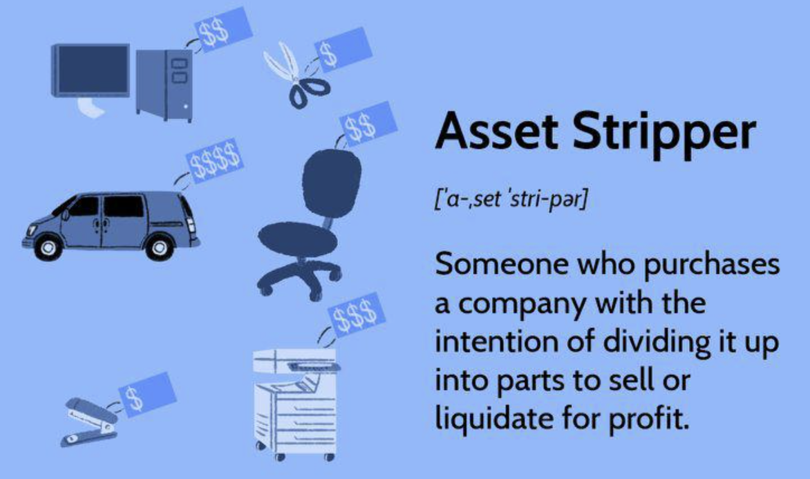

## Table of Contents

## What is an asset stripper?

An asset stripper is a person or company that buys a struggling business and then sells off its parts to make money. They look for companies that are not doing well but still have valuable things like buildings, machines, or brand names. Once they buy the company, they break it down and sell these valuable parts separately, often making more money than they paid for the whole company.

This practice can be controversial because it often leads to the original company being destroyed. Workers might lose their jobs, and the community around the company can suffer. While asset stripping can be a quick way to make money, it is criticized for focusing on short-term gains instead of trying to help the company recover and grow in the long run.

## How does asset stripping work?

Asset stripping starts when someone, usually an investor or a company, finds a business that is not doing well but still has things that are worth money. These things could be buildings, machines, or even the company's name. The investor buys the struggling business for a low price because it's not doing well. Once they own it, they start to take apart the business and sell off these valuable parts one by one. They might sell the buildings to another company, the machines to someone else, and even the brand name to another business that wants to use it.

The money made from selling these parts is usually more than what the investor paid to buy the whole business. This is how they make a profit. But, this can be bad for the people who worked at the business because they might lose their jobs. It can also hurt the town where the business was, because the business is no longer there to help the community. Some people think asset stripping is wrong because it focuses on making quick money instead of trying to fix the business and help it grow again.

## What are the main reasons companies engage in asset stripping?

Companies engage in asset stripping mainly to make money quickly. When they find a business that is struggling but has valuable parts like buildings, machines, or a well-known brand, they buy it for a low price. Then, they sell these parts separately for more money than they paid for the whole business. This way, they can make a profit in a short amount of time without having to wait for the business to improve.

Another reason is to reduce risk. By buying a struggling company and selling its parts, the asset stripper does not have to deal with the challenges of turning the business around. It's easier and less risky to break it down and sell the pieces. However, this practice can hurt the workers and the community around the business, as it often leads to job losses and the company's closure.

## What are the potential benefits of asset stripping for a company?

Asset stripping can help a company make money fast. When a company buys a struggling business that has valuable things like buildings or machines, they can sell these parts for more money than they paid for the whole business. This quick profit can be good for the company because they don't have to wait a long time to see money coming in. It's like buying something cheap and then selling the pieces for a higher price.

Another benefit is that it's less risky for the company. Instead of trying to fix the struggling business, which can be hard and take a lot of time, the company can just sell the parts. This way, they don't have to worry about whether the business will get better or not. It's a simpler and safer way to make money, even if it means the original business will close down.

## What are the potential negative impacts of asset stripping on a company?

Asset stripping can hurt the company a lot. When a company is broken down and its parts are sold, it often means the end of the business. This can make workers lose their jobs, which is really bad for them and their families. The workers might have a hard time finding new jobs, especially if the business was in a small town where there aren't many other places to work.

The community around the business can also suffer. When a business closes, it stops helping the local economy. Shops and other businesses that relied on the workers spending money might lose customers. The town could become less lively and people might even move away to find work somewhere else. So, while asset stripping might help the company that does it make money fast, it can cause a lot of problems for the people and the place where the business was.

## Can you provide examples of companies that have undergone asset stripping?

One famous example of asset stripping is what happened to the British company, British Leyland. In the 1980s, British Leyland was struggling and not making much money. A company called Hanson Trust bought it and started selling off its parts. They sold the truck division to DAF, the bus division to a different company, and even sold off some of the factories. By breaking up British Leyland and selling its parts, Hanson Trust made a lot of money, but it also meant the end of British Leyland as a whole company.

Another example is the American company, Bethlehem Steel. Bethlehem Steel was once a big and important company, but by the 2000s, it was losing money. A company called ISG bought Bethlehem Steel and started to sell off its parts. They sold the steel mills, the land, and even the company's name. ISG made money by selling these parts, but it also meant that Bethlehem Steel stopped existing, and many workers lost their jobs.

## What legal and ethical considerations should be taken into account with asset stripping?

When it comes to asset stripping, there are important legal and ethical things to think about. Legally, companies need to follow rules about how they buy and sell businesses. They have to make sure they are not breaking any laws about how they treat workers or the environment when they close down parts of the business. There might also be rules about how they report what they are doing to the government or to people who own shares in the company. If they don't follow these rules, they could get in big trouble.

Ethically, asset stripping can be a big problem. It might be seen as wrong to buy a struggling company just to break it apart and sell its pieces, especially if it means people lose their jobs and the community suffers. Some people think it's not fair to focus on making quick money instead of trying to help the company get better. This can lead to a lot of debate about whether asset stripping is a good or bad thing to do, and companies need to think about how their actions will affect others, not just how much money they can make.

## How does asset stripping affect employees and stakeholders?

Asset stripping can really hurt employees. When a company is broken down and its parts are sold, it often means the company will close. This makes workers lose their jobs, which is bad for them and their families. They might have a hard time finding new work, especially if the company was in a small town where there aren't many other places to work. Losing a job can make people feel sad and worried about how they will pay their bills.

Stakeholders, like people who own shares in the company, can also be affected. If the company is sold off in pieces, the value of their shares might go down a lot. This means they lose money. Sometimes, stakeholders feel upset because they wanted the company to keep going and grow, not be broken apart. Asset stripping can make them feel like the company they cared about is being destroyed just so someone else can make quick money.

## What are the financial strategies typically used in asset stripping?

When someone wants to do asset stripping, they start by finding a company that is not doing well but has things that are still worth money, like buildings or machines. They buy this company for a low price because it's struggling. Then, they start selling off these valuable parts one by one. They might sell the buildings to one buyer, the machines to another, and even the company's name to someone else. By selling these parts for more money than they paid for the whole company, they make a profit. This is a quick way to make money without having to spend time and effort fixing the company.

This strategy also involves managing money carefully. The people doing the asset stripping need to know how much money they can get for each part of the company. They might need to borrow money to buy the struggling company in the first place, so they have to make sure they can pay back this money after they sell the parts. They also have to think about any costs they will have, like paying workers until they can close down the company. It's all about buying low, selling high, and keeping costs down to make as much money as possible.

## How can asset stripping be identified in financial statements?

To spot asset stripping in financial statements, you need to look for signs that a company is selling off its valuable parts. You might see a sudden drop in the company's assets because they are selling things like buildings or machines. At the same time, you could see a rise in cash or other short-term investments because the company is getting money from these sales. If the company used to make things or provide services but now it's not doing that anymore, this could be another clue that asset stripping is happening.

Another thing to watch for is if the company's income statements show a lot of money coming in from selling assets, but not from their usual business activities. This means they are making money by breaking the company apart, not by selling products or services. If you see that the company is paying off debts quickly or giving money back to shareholders, it might be using the money from selling its parts to do this. These signs together can help you figure out if a company is going through asset stripping.

## What are the long-term effects of asset stripping on the economy?

Asset stripping can hurt the economy in the long run. When a company is broken down and its parts are sold, it often means the company will close. This leads to workers losing their jobs, which can make it hard for them to spend money on things they need. When people have less money to spend, it can slow down the whole economy because businesses make less money too. Also, if a lot of companies are being stripped of their assets, it can make people feel less confident about investing in businesses. This can make it harder for new businesses to start and grow, which is bad for the economy over time.

On the other hand, asset stripping can also have some good effects on the economy. When valuable parts of a company are sold to other businesses, it can help those businesses grow and do better. This can lead to more jobs and more money being spent in the economy. But, these good effects are usually short-term and might not make up for the long-term harm that comes from losing whole companies and the jobs they provided. So, while asset stripping might help some parts of the economy in the short run, it can make things worse for the economy in the long run.

## What measures can be implemented to regulate or prevent harmful asset stripping practices?

To stop harmful asset stripping, governments can make rules that companies have to follow. They can pass laws that make it harder for companies to just buy other companies and sell them off in pieces. These laws might say that companies have to think about how their actions will affect workers and the community. They might also have to show that they tried to save the company before breaking it apart. Governments can also check financial statements more closely to see if asset stripping is happening and stop it if it is hurting people.

Another way to prevent harmful asset stripping is by having strong unions and community groups. These groups can speak up for workers and the community when a company is in trouble. They can work with the company to find ways to save it instead of letting it be stripped. They can also tell the government if they think a company is being broken down in a harmful way. By working together, unions, community groups, and the government can make it harder for companies to do asset stripping that hurts people and the economy.

## References & Further Reading

[1]: Bergstra, J., Bardenet, R., Bengio, Y., & Kégl, B. (2011). ["Algorithms for Hyper-Parameter Optimization."](https://dl.acm.org/doi/10.5555/2986459.2986743) Advances in Neural Information Processing Systems 24.

[2]: ["Advances in Financial Machine Learning"](https://www.amazon.com/Advances-Financial-Machine-Learning-Marcos/dp/1119482089) by Marcos Lopez de Prado

[3]: ["Evidence-Based Technical Analysis: Applying the Scientific Method and Statistical Inference to Trading Signals"](https://www.amazon.com/Evidence-Based-Technical-Analysis-Scientific-Statistical/dp/0470008741) by David Aronson

[4]: ["Machine Learning for Algorithmic Trading"](https://github.com/stefan-jansen/machine-learning-for-trading) by Stefan Jansen

[5]: ["Quantitative Trading: How to Build Your Own Algorithmic Trading Business"](https://github.com/LucindaYa/quant-resources/blob/master/Quantitative%20Trading%20How%20to%20Build%20Your%20Own%20Algorithmic%20Trading%20Business.pdf) by Ernest P. Chan