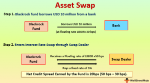

## Table of Contents

## What is an asset swap?

An asset swap is a financial deal where two parties exchange the cash flows from different assets. Imagine you own a bond that pays you interest every year, but you want to get payments in a different way. You can swap the payments from your bond with someone else who has a different type of asset, like a loan that pays interest differently. This way, you both get the kind of payments you want without selling your original assets.

Asset swaps are often used by investors to change the risk or return of their investments. For example, if you have a bond that pays a fixed interest rate but you think interest rates will go up, you might swap it for an asset that pays a floating rate. This can help protect your investment from changes in interest rates. Asset swaps can also help investors manage currency risk if they are dealing with assets in different countries.

## How does an asset swap work?

An asset swap is like trading the money you get from one thing for the money you get from another thing. Let's say you have a bond that gives you a fixed amount of money every year. But you want money that changes with the interest rates. You can find someone who has a loan that pays them money based on the current interest rates. You both agree to swap the payments you get from your bond and their loan. So now, you get the changing payments from their loan, and they get the fixed payments from your bond.

This swap helps both of you get the kind of money you want without selling your original assets. It's useful because it lets you change how risky or safe your money is. For example, if you think interest rates will go up, getting payments that change with the rates can be better for you. Asset swaps can also help if you're dealing with money from different countries. You might swap payments in one currency for payments in another to manage the risk of currency changes.

## What are the main components of an asset swap?

An asset swap involves two main parts: the underlying asset and the swap agreement. The underlying asset is what you start with, like a bond that pays you a fixed amount of money each year. The swap agreement is the deal you make with someone else to trade the payments from your asset for the payments from their asset. For example, if you have a bond, you might swap its fixed payments for the floating payments from someone else's loan.

The swap agreement also includes details like how long the swap will last and what happens if one of you can't make the payments. This agreement helps both of you get the kind of payments you want without selling your original assets. It's useful for changing the risk or return of your investments. For instance, if you think interest rates will rise, swapping to get payments that change with the rates can protect your investment.

## What are the benefits of engaging in an asset swap?

Engaging in an asset swap can help you manage the risk of your investments. If you have a bond that pays a fixed amount of money but you think interest rates will go up, you can swap it for something that pays based on the current rates. This way, your payments can go up if interest rates do, which can protect your investment from losing value. Asset swaps also let you change the kind of payments you get without selling your original asset, which can be useful if you want to keep it for other reasons.

Another benefit of asset swaps is that they can help you deal with currency risks. If you have an asset that pays you in one country's money but you want payments in another country's money, you can swap the payments. This can protect you from changes in the value of different currencies. By using asset swaps, you can make your investments safer and more flexible, helping you get the kind of returns you want.

## What are the risks associated with asset swaps?

Asset swaps can be risky because they depend on the other person in the swap keeping their promises. If they can't make the payments they agreed to, you might not get the money you were expecting. This is called counterparty risk. It's like lending money to someone and hoping they pay you back. If they don't, you could lose out.

Another risk is that interest rates or currency values might change in ways you didn't expect. If you swap to get payments that change with interest rates, and those rates go down instead of up, your payments will be less than you hoped. The same goes for currency swaps. If the value of the currency you swapped into goes down, the payments you get will be worth less. These risks can make asset swaps tricky, so it's important to think carefully before you decide to do one.

## Who typically uses asset swaps and why?

Banks and big investors like pension funds and insurance companies often use asset swaps. They do this to change the risk or return of their investments without selling their original assets. For example, a bank might have a bond that pays a fixed [interest rate](/wiki/interest-rate-trading-strategies), but they think interest rates will go up. By swapping the bond's payments for payments that change with interest rates, they can protect their investment from losing value if rates do rise.

Asset swaps are also used by companies that deal with money in different countries. If a company has an asset that pays in one currency but they need payments in another, they can swap the payments to manage the risk of currency changes. This helps them keep their investments stable even when currency values go up and down. By using asset swaps, these big players can make their investments safer and more flexible, helping them get the kind of returns they want.

## How do asset swaps differ from other types of swaps?

Asset swaps are different from other swaps because they focus on swapping the cash flows from specific assets, like bonds or loans, without selling those assets. For example, if you have a bond that pays a fixed interest rate, you can swap its payments for the payments from someone else's loan that pays a floating interest rate. This helps you change the kind of payments you get without getting rid of your original asset. Other types of swaps, like interest rate swaps or currency swaps, don't involve specific assets. They are more about swapping one type of payment for another, like swapping fixed interest payments for floating ones, or payments in one currency for payments in another.

Interest rate swaps are used to manage the risk of interest rate changes. In an interest rate swap, you might agree to swap fixed interest payments for floating ones, or vice versa, without any specific assets involved. Currency swaps, on the other hand, are used to manage the risk of currency changes. In a currency swap, you might agree to swap payments in one currency for payments in another, again without involving specific assets. Asset swaps combine elements of both, allowing you to manage both interest rate and currency risks while still holding onto your original assets.

## What are the key considerations when structuring an asset swap?

When you're setting up an asset swap, it's important to think about the risks involved. One big risk is counterparty risk, which means the other person in the swap might not be able to make the payments they promised. You need to check if they are reliable and have a good track record. Another thing to consider is how interest rates or currency values might change. If you're swapping to get payments that change with interest rates, you need to think about what will happen if those rates go down instead of up. The same goes for currency swaps; if the currency you're swapping into loses value, your payments will be worth less.

You also need to decide how long the swap will last and what the terms of the agreement will be. The length of the swap should match your investment goals. If you're trying to protect against short-term changes in interest rates, a shorter swap might be better. But if you're looking at long-term trends, a longer swap could be more useful. The terms of the agreement should be clear about what happens if one of you can't make the payments. This can help protect you if things don't go as planned. By carefully considering these factors, you can structure an asset swap that meets your needs and helps you manage your investment risks.

## How is the pricing of an asset swap determined?

The pricing of an asset swap is figured out by looking at a few important things. One big part is the difference between the payments you're getting now and the payments you'll get after the swap. If you're swapping a bond that pays a fixed interest rate for payments that change with interest rates, the price will depend on what people think interest rates will do in the future. If lots of people think rates will go up, the price might be higher because the new payments will be worth more. Another thing to think about is how risky the other person in the swap is. If they might not be able to make the payments, you might need to pay less or get a better deal to make up for that risk.

The value of the currencies involved also matters if you're swapping payments in different countries. If the currency you're swapping into is expected to get stronger, the price might be higher because those payments will be worth more. On the other hand, if the currency is expected to get weaker, the price might be lower. All these things together help decide the price of an asset swap. It's like trying to guess what will happen in the future and making a deal based on those guesses.

## What role do credit ratings play in asset swaps?

Credit ratings are important in asset swaps because they tell you how likely the other person in the swap is to make their payments. If someone has a high credit rating, it means they are seen as reliable and less likely to miss payments. This makes the swap safer for you. On the other hand, if someone has a low credit rating, it means they are seen as riskier. You might need to get a better deal or a lower price to make up for the chance that they might not pay you back.

When you're thinking about doing an asset swap, you should always check the credit ratings of the other person involved. A good credit rating can make the swap more attractive because it reduces the risk of the other person not keeping their promises. If the credit rating is low, you might need to think carefully about whether the swap is worth the risk. Credit ratings help you understand and manage the risks in asset swaps, making them an important part of deciding whether to go ahead with a swap.

## How can asset swaps be used for hedging purposes?

Asset swaps can be used for hedging to protect your investments from risks like changes in interest rates or currency values. Imagine you have a bond that pays you a fixed amount of money every year. If you think interest rates will go up, you might swap the fixed payments from your bond for payments that change with the interest rates. This way, if rates do go up, your payments will go up too, helping to protect your investment from losing value. It's like putting on a raincoat to stay dry if it starts to rain.

Asset swaps can also help with currency risks. If you have an asset that pays you in one country's money but you need payments in another country's money, you can swap the payments. This can protect you if the value of the first country's money goes down. By swapping, you get payments in the currency you need, which can help keep your investment stable even when currency values change. It's like changing your money to the local currency when you travel to another country, so you don't lose out if your home currency's value drops.

## What are some advanced strategies involving asset swaps?

Advanced strategies with asset swaps can help you do more than just protect your investments. One strategy is called basis trading. This is when you use an asset swap to take advantage of small differences in how two similar things are priced. For example, you might swap the payments from a bond for payments from a loan that are very similar but have a tiny difference in price. By doing this, you can make a small profit from the difference, kind of like buying something on sale and selling it for a bit more.

Another advanced strategy is using asset swaps to change the risk of your whole investment portfolio. If you have a lot of investments that pay fixed amounts of money, you might be worried about what will happen if interest rates change. By swapping some of those fixed payments for payments that change with interest rates, you can make your portfolio less risky. It's like mixing different types of food to make a balanced meal, so you're not too dependent on just one thing.

## What is Understanding Asset Swaps?

Asset swaps are a sophisticated financial instrument that enable investors to manage and tailor their cash flow and risk exposures. Fundamentally, an asset swap involves two entities agreeing to exchange cash flows derived from different interest structures — typically one being fixed and the other floating. This arrangement affords investors the flexibility to adjust their portfolios' cash flow dynamics to align with specific financial objectives or risk appetites.

**Hedging Applications**

Investors primarily utilize asset swaps as a hedging mechanism to mitigate exposure to interest rate, currency, or credit risks. By engaging in an asset swap, an investor holding a fixed-rate bond can, for instance, convert the fixed interest payment into a floating rate. This strategy is particularly advantageous in a rising interest rate environment, as it allows the investor to potentially benefit from increasing floating rates. Conversely, it can also be applied to convert a floating rate into a fixed one, which might be preferable when interest rates are expected to decline.

**Technical Aspects**

The execution of asset swaps involves several technical elements. A pivotal component is the spread calculation, which determines the relative value between the fixed and the floating rates. The spread reflects the credit quality of the parties involved, market conditions, and the tenor of the swap. The spread is calculated using the formula:

$$
\text{Spread} = \text{Fixed Rate} - \text{Floating Rate} + \text{Risk Adjustment}
$$

These calculations ensure that the swap remains fair and balanced from a pricing perspective, considering the risk profile of the underlying assets.

**Implementation Process**

The implementation of asset swaps requires a structured process. Initially, thorough due diligence is performed to assess the creditworthiness of the counterparty, since counterparty risk is a crucial consideration. The agreement is then meticulously structured to specify the terms of the cash flow exchanges, including payment intervals and maturity dates.

**Strategic Advantages**

Asset swaps provide strategic advantages in specific scenarios. For instance, they can be used by corporations to stabilize cash flows, improving predictability in financial planning. Financial institutions often employ asset swaps to create synthetic assets, thereby customizing their exposure without altering their balance sheet composition.

In conclusion, asset swaps are a versatile tool in the financial derivatives market, offering nuanced control over cash flow structures and risk exposures. Their use in hedging, credit enhancement, and portfolio optimization highlights their critical role in modern financial strategies.

## References & Further Reading

[1]: ["Asset Swaps: Applications in Portfolio and Risk Management"](https://corporatefinanceinstitute.com/resources/derivatives/asset-swap/) by Janet M. Tavakoli

[2]: Joshi, M. S. (2008). ["The Concepts and Practice of Mathematical Finance"](https://archive.org/download/quant_books/Concepts%20_%20Practice%20of%20Mathematical%20Finance%20-%20M.%20S.%20Joshi.pdf) Cambridge University Press.

[3]: ["Algorithmic Trading: Winning Strategies and Their Rationale"](https://www.amazon.com/Algorithmic-Trading-Winning-Strategies-Rationale-ebook/dp/B00CY5HC0U) by Ernie Chan

[4]: Cartea, Á., Jaimungal, S., & Penalva, J. (2015). ["Algorithmic and High-Frequency Trading"](https://assets.cambridge.org/97811070/91146/frontmatter/9781107091146_frontmatter.pdf) Cambridge University Press.

[5]: ["Swaps and Other Derivatives"](https://onlinelibrary.wiley.com/doi/book/10.1002/9781119206224) by Richard Flavell