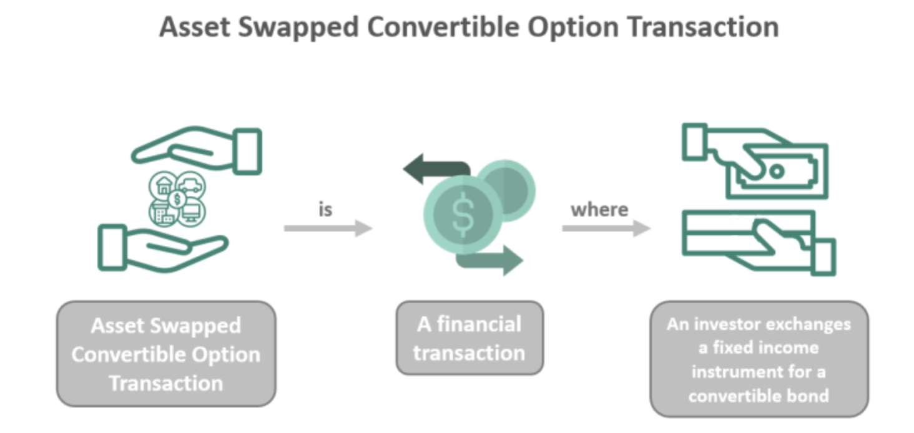

## Table of Contents

## What is an Asset Swapped Convertible Option Transaction?

An Asset Swapped Convertible Option Transaction is a type of financial deal that combines two main parts: an asset swap and a convertible option. In simple terms, an asset swap involves exchanging the cash flows from one asset for another, usually to manage risk or improve returns. The convertible option part of the transaction gives the holder the right, but not the obligation, to convert the asset into a different type of security, usually shares of stock. This combination allows investors to potentially benefit from the upside of the stock while still receiving regular income from the asset swap.

These transactions are often used by investors who want to gain exposure to a company's stock without directly buying the shares. By using an asset swap, they can receive a steady stream of income, which can be particularly appealing in uncertain markets. The convertible option adds flexibility, as it allows the investor to convert to stock if the company's share price increases significantly. This strategy can be complex and involves understanding both the risks and rewards of the underlying assets and the convertible option, but it can be a powerful tool for managing investments.

## How does an Asset Swapped Convertible Option Transaction differ from a traditional convertible bond?

An Asset Swapped Convertible Option Transaction and a traditional convertible bond both give investors the chance to benefit from a company's stock price going up, but they work in different ways. A traditional convertible bond is a bond that can be turned into a set number of the company's shares. The bond pays interest regularly and, if the stock price goes up a lot, the investor can choose to convert the bond into stock instead of getting their money back when the bond matures.

On the other hand, an Asset Swapped Convertible Option Transaction involves swapping the cash flows of an asset for another, which could be the interest from a bond, and then adding a convertible option on top. This option allows the investor to convert the asset into the company's stock if they want to. Unlike a traditional convertible bond, this transaction gives the investor more flexibility in managing their income and exposure to the stock, as they can choose to keep receiving the swapped cash flows or convert to stock based on market conditions.

## What are the key components involved in an Asset Swapped Convertible Option Transaction?

An Asset Swapped Convertible Option Transaction has two main parts: an asset swap and a convertible option. The asset swap part means you exchange the money you get from one thing for the money from another thing. This could be swapping the interest from a bond for something else that pays you differently. It's like trading one type of income for another, which can help manage risk or get better returns. The other part, the convertible option, gives you the right to turn what you have into shares of a company's stock if you want to. This is useful if the stock price goes up a lot because you can choose to switch and make more money.

The difference between this and a regular convertible bond is that with an Asset Swapped Convertible Option Transaction, you have more choices. You can keep getting the swapped income or decide to convert it into stock, depending on what's happening in the market. This flexibility can be really helpful, especially when things are uncertain. But, it's important to understand that this kind of transaction can be complicated and involves knowing a lot about the risks and rewards of the assets and the option you're dealing with.

## What are the benefits of engaging in an Asset Swapped Convertible Option Transaction for investors?

Engaging in an Asset Swapped Convertible Option Transaction can offer investors the chance to enjoy steady income while still having the potential to benefit from a company's stock price going up. In this type of deal, investors swap the income from one asset, like a bond, for another type of income. This swap can help them manage risk or get better returns. At the same time, they hold an option that lets them convert their asset into the company's stock if they want to. This means they can keep getting regular income from the swap, which can be especially useful in uncertain markets.

The flexibility of an Asset Swapped Convertible Option Transaction is another big benefit. Unlike traditional investments, this transaction allows investors to choose whether to stick with the income from the swapped asset or switch to the company's stock if it performs well. This choice can be valuable because it lets investors adapt to changing market conditions. However, it's important for investors to understand that these transactions can be complex and come with their own set of risks, so they should carefully consider both the potential rewards and the challenges before getting involved.

## What are the risks associated with Asset Swapped Convertible Option Transactions?

Engaging in an Asset Swapped Convertible Option Transaction comes with several risks that investors should be aware of. One major risk is the complexity of these transactions. They involve understanding both the asset swap and the convertible option, which can be tricky and might lead to mistakes if not managed properly. Another risk is the potential for loss if the underlying asset or the stock doesn't perform as expected. If the stock price doesn't go up, the investor might not see the benefits they hoped for from converting their asset into stock.

Another important risk is related to the [interest rate](/wiki/interest-rate-trading-strategies) and credit risk from the asset swap part of the transaction. If the interest rates change or if the credit quality of the swapped asset goes down, it could affect the income the investor receives. Additionally, there's the risk of market [volatility](/wiki/volatility-trading-strategies). Since these transactions often involve exposure to stock prices, sudden changes in the market could lead to losses. It's crucial for investors to carefully consider these risks and possibly seek advice from financial experts before deciding to engage in such transactions.

## How is the pricing of an Asset Swapped Convertible Option Transaction determined?

The pricing of an Asset Swapped Convertible Option Transaction involves looking at both the asset swap and the convertible option parts. For the asset swap, the price depends on the interest rates of the assets being swapped. If the interest rates change, it can affect how much income the investor gets from the swap. The credit quality of the swapped asset is also important because if it goes down, the price might go down too. So, when figuring out the price, you need to think about these things and how they might change over time.

The convertible option part of the transaction adds another layer to the pricing. This option lets the investor turn their asset into the company's stock. The price of this option depends on the current stock price, how much the stock price might go up or down, and how long the investor has to decide whether to convert. If the stock is expected to go up a lot, the option might be more valuable, which would affect the overall price of the transaction. So, the final price of an Asset Swapped Convertible Option Transaction is a mix of these factors, making it important to keep an eye on both the swapped asset and the stock market.

## Can you explain the process of setting up an Asset Swapped Convertible Option Transaction?

Setting up an Asset Swapped Convertible Option Transaction involves a few key steps. First, you need to find an asset that you want to swap, like a bond that pays interest. You'll work with a financial institution to trade the income from this bond for another type of income that might be better for your needs. This part of the setup is about figuring out what assets to swap and agreeing on the terms of the swap, like the interest rates and how long the swap will last.

Next, you add the convertible option to the transaction. This option gives you the right to turn the swapped asset into shares of a company's stock if you want to. To set this up, you need to decide on things like how many shares you can get for your asset and how long you have to make the decision to convert. You'll need to work with the financial institution to agree on these terms, and they'll help you understand how the stock's price might affect the value of your option. Once everything is agreed upon, the transaction is set up, and you can start receiving the income from the swapped asset while keeping the option to convert to stock if the market conditions are right.

## What role do financial institutions play in facilitating Asset Swapped Convertible Option Transactions?

Financial institutions are key players in setting up Asset Swapped Convertible Option Transactions. They help investors find the right assets to swap, like bonds, and make sure the swap terms are good. They also handle all the paperwork and legal stuff to make the swap happen. This includes figuring out the interest rates and how long the swap will last. They use their expertise to make sure everything is set up correctly so the investor can start getting the new income from the swapped asset.

On top of that, financial institutions help with the convertible option part of the transaction. They work with the investor to decide how many shares they can get if they choose to convert their asset into stock. They also explain how the stock's price might affect the value of the option and help set the terms for when and how the conversion can happen. By doing all this, financial institutions make sure the whole transaction is smooth and that investors understand what they're getting into.

## How do regulatory environments affect Asset Swapped Convertible Option Transactions?

Regulatory environments can have a big impact on Asset Swapped Convertible Option Transactions. Different countries have their own rules about financial transactions, and these rules can change how easy or hard it is to set up these deals. For example, some places might have strict rules about what kinds of assets can be swapped or how the convertible options can work. This means that investors and financial institutions need to make sure they follow all the rules in the areas they're working in, or they could get into trouble.

Also, regulations can affect the costs and risks of these transactions. If the rules are very strict, it might cost more to set everything up because you need to do extra work to make sure you're following the law. Sometimes, the rules can change, and this can make things even trickier. Investors need to keep an eye on these changes and might need help from experts to understand how the rules affect their transactions. This is important because it can change whether or not the transaction is a good idea for them.

## What are some real-world examples of Asset Swapped Convertible Option Transactions?

One real-world example of an Asset Swapped Convertible Option Transaction happened when a big investment firm wanted to get more money from a company without buying its stock directly. They swapped the interest they were getting from a bond for a different kind of income that was more steady. On top of that, they got an option to turn this new income into the company's stock if the stock price went up a lot. This way, they could keep getting regular money and also have the chance to make more if the stock did well.

Another example involved a company that wanted to raise money but didn't want to issue more stock right away. They worked with a bank to set up an Asset Swapped Convertible Option Transaction. The company swapped the income from one of its assets for a new type of income that was more appealing to investors. Investors who took part in this deal got regular payments and also had the option to convert their investment into the company's stock if they thought it was a good time to do so. This helped the company get the money it needed while giving investors flexibility and potential for bigger gains.

## How can advanced hedging strategies be applied to manage risks in Asset Swapped Convertible Option Transactions?

Advanced hedging strategies can help manage the risks in Asset Swapped Convertible Option Transactions by balancing out potential losses. One way to do this is by using options to protect against big drops in the stock price that the convertible option is tied to. For example, an investor might buy a put option, which gives them the right to sell the stock at a set price. If the stock price falls a lot, the put option can help cover the losses from the convertible option. Another way is to use interest rate swaps to manage the risk from changes in interest rates that affect the asset swap part of the transaction. By swapping a variable interest rate for a fixed one, investors can make their income more predictable and less affected by rate changes.

These strategies can also involve using other financial tools like futures contracts or credit default swaps. Futures contracts can help lock in prices for the underlying assets, reducing the risk of price swings. Credit default swaps can protect against the risk that the swapped asset's credit quality might go down. By carefully choosing and combining these tools, investors can create a safety net that helps them manage the complex risks of Asset Swapped Convertible Option Transactions. This way, they can enjoy the potential benefits while keeping the risks under control.

## What future trends might impact the use and structure of Asset Swapped Convertible Option Transactions?

In the future, changes in technology and rules might affect how Asset Swapped Convertible Option Transactions are used and set up. As technology gets better, it could make these transactions easier to do and cheaper to set up. For example, using blockchain could make the process faster and more clear, helping investors and financial institutions work together more easily. Also, if more people start using these transactions, the market might grow, making them more common and easier to understand. But, if rules get stricter, it might be harder to set up these deals, and it could cost more to make sure everything follows the law.

Another thing that could change is how investors think about risk and reward. If the economy goes through big changes, like interest rates going up or down a lot, investors might want different ways to manage their money. This could mean they use Asset Swapped Convertible Option Transactions more often to get steady income and the chance to make more money if stock prices go up. Also, if there are new ways to predict how stock prices will move, like using more data and computers, investors might be able to use these transactions in smarter ways. This could lead to new kinds of deals that are even better at helping investors manage their risks and rewards.

## References & Further Reading

[1]: Choudhry, M. (2010). ["The Handbook of Convertible Bonds: Pricing, Strategies and Risk Management."](https://www.amazon.com/Handbook-Convertible-Bonds-Strategies-Management-ebook/dp/B005D7EPEC) John Wiley & Sons.

[2]: Calamos, N. (2003). ["Convertible Arbitrage: Insights and Techniques for Successful Hedging."](https://archive.org/details/convertiblearbit00nick) John Wiley & Sons.

[3]: Abenante, R. (2009). ["Convertible Bonds: Pricing and Analysis."](https://www.diva-portal.org/smash/get/diva2:729641/FULLTEXT01.pdf) VDM Verlag Dr. Müller.

[4]: Dhar, V. (2013). ["Data Science and Prediction."](https://dl.acm.org/doi/10.1145/2500499) Communications of the ACM.

[5]: Lopez de Prado, M. (2018). ["Advances in Financial Machine Learning."](https://www.amazon.com/Advances-Financial-Machine-Learning-Marcos/dp/1119482089) Wiley.

[6]: Hull, J. C. (2018). ["Options, Futures, and Other Derivatives."](https://www.semanticscholar.org/paper/Options%2C-Futures%2C-and-Other-Derivatives-Hull/89bdee500c8623864fc9eb7a471546aa713acc44) Pearson.