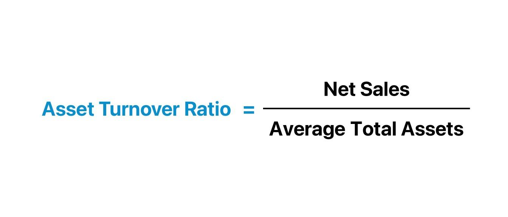

## Table of Contents

## What is the Asset Turnover Ratio?

The Asset Turnover Ratio is a financial metric that shows how efficiently a company uses its assets to generate sales. It is calculated by dividing the company's total sales or revenue by its average total assets. This ratio helps investors and analysts understand how well a company is using its assets to produce income.

A higher Asset Turnover Ratio means the company is using its assets more effectively to generate sales. For example, if a company has a ratio of 2, it means that for every dollar invested in assets, the company generates two dollars in sales. On the other hand, a lower ratio might suggest that the company's assets are not being used efficiently, which could be a sign that the company needs to improve its operations or reduce its asset base.

## How is the Asset Turnover Ratio calculated?

The Asset Turnover Ratio is calculated by dividing a company's total sales or revenue by its average total assets. To find the average total assets, you add the value of the assets at the start of the year to the value at the end of the year, then divide by two. This gives you a good idea of the assets the company had during the year.

For example, if a company had total sales of $500,000 and its average total assets were $250,000, the Asset Turnover Ratio would be $500,000 divided by $250,000, which equals 2. This means the company generated $2 in sales for every $1 of assets it owned. This simple calculation helps show how well a company is using its assets to make money.

## Why is the Asset Turnover Ratio important for businesses?

The Asset Turnover Ratio is important for businesses because it shows how well they are using their stuff to make money. If a company has a high ratio, it means they are doing a good job turning their assets into sales. This can make the company look more attractive to investors because it shows they are using their resources efficiently. For example, a high ratio might mean a company is good at selling its products or services, which can lead to more profits.

On the other hand, a low Asset Turnover Ratio can be a warning sign. It might mean the company is not using its assets as well as it could. This could be because they have too much stuff they don't need, or maybe they are not selling enough. Businesses can use this ratio to figure out if they need to change how they work or if they should sell off some assets. By keeping an eye on this ratio, a company can make better decisions to improve its overall performance.

## What does a high Asset Turnover Ratio indicate?

A high Asset Turnover Ratio means a company is good at using its stuff to make sales. If a company has a high ratio, it shows they are turning their assets into money quickly and efficiently. This is a good sign for investors because it means the company is doing a great job with what they have. For example, if a store has a lot of inventory but sells it fast, their Asset Turnover Ratio will be high, showing they are using their stuff well.

Having a high Asset Turnover Ratio can also mean the company is managing its resources well. It might mean they are not wasting money on things they don't need, or they are really good at getting people to buy their products or services. This can lead to more profits because the company is making the most out of what they own. So, a high ratio is something businesses aim for because it shows they are efficient and successful.

## What does a low Asset Turnover Ratio indicate?

A low Asset Turnover Ratio means a company is not using its stuff to make sales as well as it could. When a company has a low ratio, it shows they might be holding onto assets that aren't helping them make money. For example, if a store has a lot of inventory that isn't selling, their Asset Turnover Ratio will be low, indicating they aren't using their resources efficiently.

This can be a warning sign for investors because it might mean the company is not managing its resources well. A low ratio could mean the company has too much stuff they don't need, or maybe they are not good at selling their products or services. By looking at this ratio, a company can figure out if they need to change how they work or if they should get rid of some assets to improve their performance.

## How does the Asset Turnover Ratio vary across different industries?

The Asset Turnover Ratio can be very different across different industries because each industry uses its assets in its own way. For example, in the retail industry, companies often have a high Asset Turnover Ratio. This is because they need to sell a lot of goods quickly to make money. Stores like supermarkets and clothing shops have to keep their inventory moving fast, so their ratio is usually higher. On the other hand, industries like heavy machinery or manufacturing might have a lower ratio. These businesses often have big, expensive machines that don't turn into sales as quickly as a pair of jeans or a box of cereal.

In the service industry, like restaurants or consulting firms, the Asset Turnover Ratio can also be different. Restaurants need to use their tables and kitchen equipment to serve as many customers as possible, so their ratio might be higher than a consulting firm that mainly uses computers and office space. The consulting firm might have a lower ratio because their assets don't turn into money as fast. Understanding these differences helps businesses and investors know what to expect from different types of companies and how well they are doing compared to others in their industry.

## What are the limitations of using the Asset Turnover Ratio?

The Asset Turnover Ratio can be helpful, but it has some limitations. One big problem is that it doesn't tell the whole story about a company's performance. For example, a high ratio might look good, but it doesn't say anything about how much profit the company is making. A company could be selling a lot of stuff but not making much money from it. Also, the ratio can be affected by how a company decides to value its assets. If they use different methods to figure out what their stuff is worth, the ratio can look different even if the company is doing the same thing.

Another limitation is that the Asset Turnover Ratio can be hard to compare across different industries. What's a good ratio in one industry might not be good in another. For example, a grocery store might have a high ratio because they sell a lot of stuff quickly, but a company that makes big machines might have a lower ratio because their stuff doesn't sell as fast. This makes it tricky to use the ratio to compare companies that do different things. So, while the Asset Turnover Ratio can give you some useful information, it's important to look at other numbers and details to get a full picture of how a company is doing.

## How can a company improve its Asset Turnover Ratio?

A company can improve its Asset Turnover Ratio by making better use of what it owns. One way to do this is by selling more stuff. If the company can get its products or services out the door faster, it will make more sales without needing more assets. For example, a store might run sales or promotions to move inventory quicker. Another way is by getting rid of things they don't need. If a company has a lot of stuff sitting around that isn't helping them make money, they should sell it or get rid of it. This way, they can focus on using their important assets better.

Another way to boost the Asset Turnover Ratio is by being smarter about buying new stuff. Instead of buying a lot of new things, a company should think about whether they really need it. If they can make do with what they have, they should. Also, they can look for ways to use their current assets more efficiently. For example, a factory might find ways to run its machines more often or a restaurant might use its tables more times a day. By doing these things, a company can make more sales with the same amount of assets, which will improve their Asset Turnover Ratio.

## How does the Asset Turnover Ratio relate to other financial ratios?

The Asset Turnover Ratio is closely linked to other financial ratios and helps give a fuller picture of a company's performance. For example, it works hand-in-hand with the Return on Assets (ROA) ratio. ROA shows how much profit a company makes from its assets. If a company has a high Asset Turnover Ratio but a low ROA, it means they are good at selling stuff but not making much profit from it. On the other hand, if both ratios are high, it's a good sign that the company is using its assets well to make both sales and profits.

The Asset Turnover Ratio also relates to the Inventory Turnover Ratio, which shows how quickly a company sells its inventory. A high Inventory Turnover Ratio can help improve the Asset Turnover Ratio because it means the company is selling its products faster. This can lead to more sales without needing more assets. Additionally, the Asset Turnover Ratio can be compared to the Fixed Asset Turnover Ratio, which looks at how well a company uses its fixed assets like buildings and machines to generate sales. By looking at these ratios together, a company can see if they need to focus on selling more, using their inventory better, or making their big equipment work harder to improve their overall efficiency.

## What are common benchmarks for the Asset Turnover Ratio?

Common benchmarks for the Asset Turnover Ratio can vary a lot depending on the industry. For example, in the retail industry, a good Asset Turnover Ratio might be around 2 to 3. This means that for every dollar they have in assets, they make 2 to 3 dollars in sales. Retail companies need to sell a lot of goods quickly, so their ratio is usually higher than in other industries. On the other hand, industries like heavy machinery or manufacturing might have a lower benchmark, around 0.5 to 1. These businesses have big, expensive machines that don't turn into sales as fast as retail products.

In the service industry, like restaurants or consulting firms, the benchmarks can also be different. A restaurant might aim for an Asset Turnover Ratio of around 1 to 2 because they need to use their tables and kitchen equipment to serve many customers. A consulting firm might have a lower benchmark, around 0.5 to 1, because their main assets are computers and office space, which don't generate sales as quickly. Knowing these benchmarks helps businesses and investors see how well a company is doing compared to others in its industry.

## How can seasonal fluctuations affect the Asset Turnover Ratio?

Seasonal fluctuations can make the Asset Turnover Ratio go up and down. For example, if a company sells more stuff during certain times of the year, like a toy store during the holidays, their ratio might be higher during those times. This is because they are making more sales with the same amount of assets. But when the busy season is over, their sales might drop, and their Asset Turnover Ratio could go down because they aren't selling as much.

To get a better idea of how well a company is doing, it's important to look at the Asset Turnover Ratio over the whole year, not just during busy or slow times. If a company only looks at the ratio during their peak season, they might think they are doing better than they really are. By looking at the whole year, they can see if they need to make changes to keep their assets working well all the time, not just during certain months.

## What advanced analytical techniques can be used to interpret the Asset Turnover Ratio more deeply?

To understand the Asset Turnover Ratio better, companies can use something called trend analysis. This means looking at how the ratio changes over time. By doing this, a company can see if their ratio is getting better or worse. If it's going up, it means they are getting better at using their stuff to make sales. If it's going down, it might be time to figure out what's going wrong. Trend analysis helps see the big picture and can show if changes the company made are working or not.

Another way to dive deeper into the Asset Turnover Ratio is by using something called segmentation analysis. This means breaking down the ratio into different parts of the business. For example, a company might look at the ratio for different stores or different products. This can help them see which parts of the business are doing well and which ones need help. By doing this, a company can make better decisions about where to focus their efforts to improve their overall performance.

## What is the understanding of business efficiency and financial ratios?

Business efficiency is a cornerstone of financial success, and financial ratios serve as critical tools for gauging this efficiency. Financial ratios provide a quantitative analysis of a company's performance, which is vital for both investors and managers. These metrics deliver insights into various dimensions of a business, encompassing profitability, liquidity, and asset management.

### Financial Ratios

Financial ratios are calculated by comparing two relevant values from a company's financial statements. Each ratio is designed to measure a specific aspect of a company's performance. Some of the main categories of financial ratios include:

1. **Profitability Ratios**: These ratios measure a company’s ability to generate profit relative to its revenue, assets, equity, and other financial metrics.
   - **Gross Profit Margin**: This indicates the percentage of revenue that exceeds the cost of goods sold (COGS):
$$
     \text{Gross Profit Margin} = \left( \frac{\text{Revenue} - \text{COGS}}{\text{Revenue}} \right) \times 100

$$
   - **Net Profit Margin**: This measures the percentage of profit remaining after all expenses are deducted from revenue:
$$
     \text{Net Profit Margin} = \left( \frac{\text{Net Income}}{\text{Revenue}} \right) \times 100

$$

2. **Liquidity Ratios**: These ratios assess a company's ability to meet its short-term obligations.
   - **Current Ratio**: This indicates the ratio of current assets to current liabilities and helps evaluate a company's short-term financial health:
$$
     \text{Current Ratio} = \frac{\text{Current Assets}}{\text{Current Liabilities}}

$$
   - **Quick Ratio**: Also known as the acid-test ratio, it measures a company’s ability to cover its current liabilities with its most liquid assets:
$$
     \text{Quick Ratio} = \frac{\text{Current Assets} - \text{Inventory}}{\text{Current Liabilities}}

$$

3. **Asset Management Ratios**: These ratios reveal how effectively a company utilizes its assets.
   - **Inventory Turnover Ratio**: This evaluates how often a company's inventory is sold and replaced over a period:
$$
     \text{Inventory Turnover Ratio} = \frac{\text{Cost of Goods Sold}}{\text{Average Inventory}}

$$
   - **Total Asset Turnover**: It measures how efficiently a company uses all its assets to generate sales:
$$
     \text{Total Asset Turnover} = \frac{\text{Sales}}{\text{Average Total Assets}}

$$

Understanding these financial ratios is key to evaluating a company's financial health. Profitability ratios give a snapshot of how effectively a company is generating profit, [liquidity](/wiki/liquidity-risk-premium) ratios assess the ability to manage current obligations, and asset management ratios indicate how well a company is utilizing its resources. By leveraging these metrics, investors and managers can make informed decisions that enhance business efficiency, leading to improved operational effectiveness and financial success.

## What is the importance of asset turnover?

The asset turnover ratio is an important metric used to evaluate a company's ability to utilize its assets effectively to generate revenue. Calculated by dividing total sales by average total assets over a specific period, this ratio offers valuable insights into a company's operational efficiency.

$$
\text{Asset Turnover Ratio} = \frac{\text{Total Sales}}{\text{Average Total Assets}}
$$

A higher asset turnover ratio signifies that a company is efficiently using its assets to produce sales. This can be particularly appealing to investors who are assessing the operational efficiency of a business. Such efficiency is crucial for businesses, as it typically leads to increased profitability and better resource allocation.

For companies operating within similar industries, asset turnover ratios can be compared to evaluate competitive standings. For instance, if Company A has a higher asset turnover ratio compared to Company B, it suggests that Company A is utilizing its assets more effectively to produce revenue. Investors often leverage these comparisons to discern how well a company is performing relative to its industry peers.

Understanding variations in the asset turnover ratio across different sectors is essential. Certain industries, such as retail, often have higher turnover ratios due to the nature of their operations, characterized by rapid inventory turnover and significant sales volumes. Conversely, industries with heavy asset investments, like utilities, may typically exhibit lower turnover ratios.

Overall, the asset turnover ratio serves as a key indicator of a company's efficiency in leveraging its assets to drive sales, making it a critical metric for investment analysis and strategic decision-making within businesses.

## What is the Calculation and Analysis of Asset Turnover Ratio?

Calculating the asset turnover ratio is a fundamental process for evaluating how effectively a business utilizes its assets to generate revenue. The formula for asset turnover is:

$$
\text{Asset Turnover Ratio} = \frac{\text{Total Sales}}{\text{Average Total Assets}}
$$

In this formula, "Total Sales" refers to the company's net sales for a given period, while "Average Total Assets" is calculated by averaging the company's assets at the beginning and end of that period. This ratio highlights the efficiency of asset use in generating sales revenue.

Understanding the implications of the asset turnover ratio is essential for informed business analysis. However, the ratio does not hold universal standards across all industries; industry context plays a critical role. For instance, companies in asset-heavy industries, such as manufacturing, might exhibit lower asset turnover ratios compared to those in industries like retail, where asset bases are generally smaller relative to sales. Therefore, comparing this ratio to historical data and industry benchmarks is crucial to gain meaningful insights.

Analysis of asset turnover ratios can expose areas requiring strategic adjustments. For example, a declining asset turnover ratio may suggest inefficiencies in asset utilization, prompting a company to review its asset management practices and resource allocation strategies. Conversely, a high and improving asset turnover ratio typically indicates that a company is effectively managing its assets relative to its sales [volume](/wiki/volume-trading-strategy), thus enhancing operational efficiency.

In summary, calculating and analyzing the asset turnover ratio within an industry-specific context aids businesses in strategic decision-making, leading to improved resource allocation and operational improvements. Evaluating past performance and aligning it with industry standards can guide companies in optimizing their asset management practices for better financial outcomes.

## What is the relationship between Algorithmic Trading and Turnover Ratios?

Algorithmic trading utilizes sophisticated computer algorithms to conduct trades at phenomenal speeds, often assessed through turnover ratios. These ratios offer critical insights into the trading frequency and efficiency of algorithmic strategies. Essentially, they measure how often assets or portfolios are traded within a specific time frame, functioning as a vital metric for traders and analysts.

Turnover ratios in [algorithmic trading](/wiki/algorithmic-trading) serve a dual purpose. First, they reflect the execution frequency of trades, emblematic of the strategy's pace. High turnover ratios typically indicate aggressive trading strategies, which aim to capitalize on short-term market opportunities by executing numerous trades. Conversely, lower turnover ratios suggest more conservative approaches, where trades occur less frequently, potentially focusing on longer-term gains.

To further illustrate, consider the formula for calculating turnover ratio:

$$
\text{Turnover Ratio} = \frac{\text{Total Value of Transactions}}{\text{Average Value of Portfolio}}
$$

This ratio quantifies the transactional volume relative to the portfolio size, offering insights into the strategy's aggressiveness.

Understanding these ratios is pivotal for optimizing trading strategies. High turnover can enhance financial performance by exploiting minute price discrepancies and maximizing trade opportunities within short intervals. However, it also increases transaction costs and market impact, which can negatively affect net returns. Conversely, lower turnover strategies may incur fewer costs and exert less market stress, but may miss quick profit opportunities.

Effective risk management is also intertwined with trading turnover. By aligning turnover ratios with risk tolerance and market conditions, traders can optimize their strategies. For instance, during volatile market periods, a high turnover strategy may benefit from quick market adjustments, while, in stable conditions, a lower turnover might prove more profitable.

Ultimately, the strategic use of turnover ratios allows traders to enhance their algorithmic trading outcomes, ensuring a balance between transaction frequency, financial performance, and risk exposure.

## References & Further Reading

[1]: Lo, A. W. (2016). ["Adaptive Markets: Financial Evolution at the Speed of Thought."](https://www.jstor.org/stable/j.ctvc77k3n) Princeton University Press.

[2]: Hull, J. C. (2020). ["Options, Futures, and Other Derivatives."](https://www-2.rotman.utoronto.ca/~hull/ofod/index.html) Pearson.

[3]: Damodaran, A. (2012). ["Investment Valuation: Tools and Techniques for Determining the Value of Any Asset."](https://books.google.com/books/about/Investment_Valuation.html?id=5SRHAAAAQBAJ) Wiley Finance.

[4]: Fabozzi, F. J., Focardi, S. M., & Jonas, C. (2016). ["Quantitative Equity Investing: Techniques and Strategies."](https://www.semanticscholar.org/paper/Quantitative-Equity-Investing%3A-Techniques-and-Fabozzi-Focardi/1c49a2a53919f7e65cb96f16691b8ff726fd3cd7) Wiley.

[5]: Chan, E. (2009). ["Quantitative Trading: How to Build Your Own Algorithmic Trading Business."](https://github.com/ftvision/quant_trading_echan_book) John Wiley & Sons.